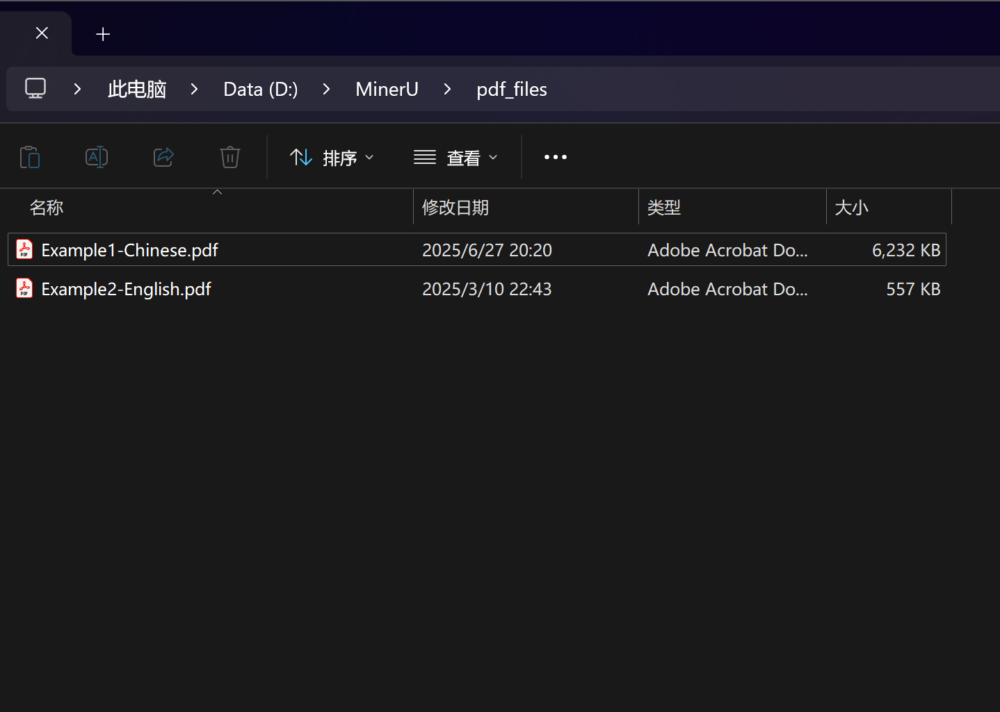
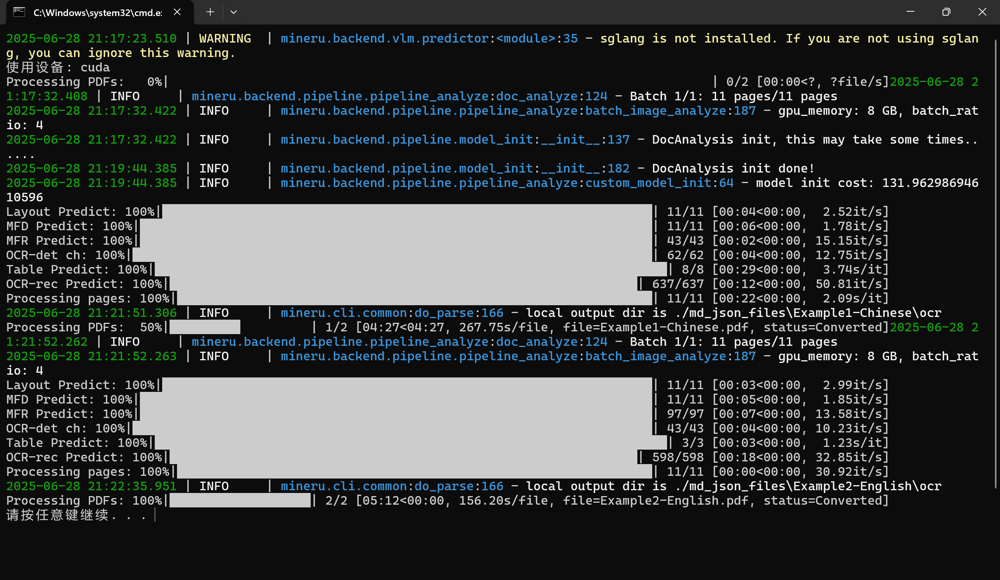
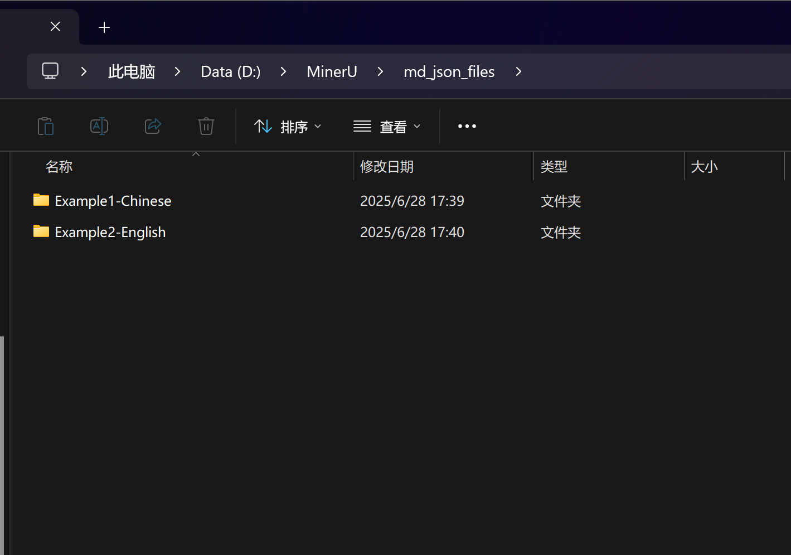
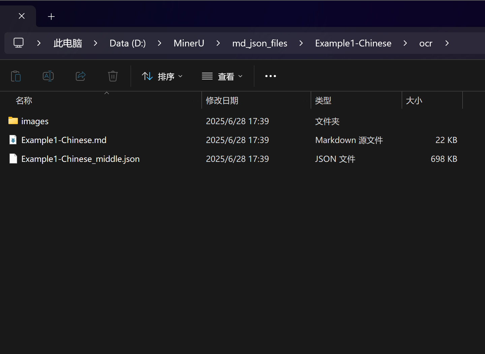
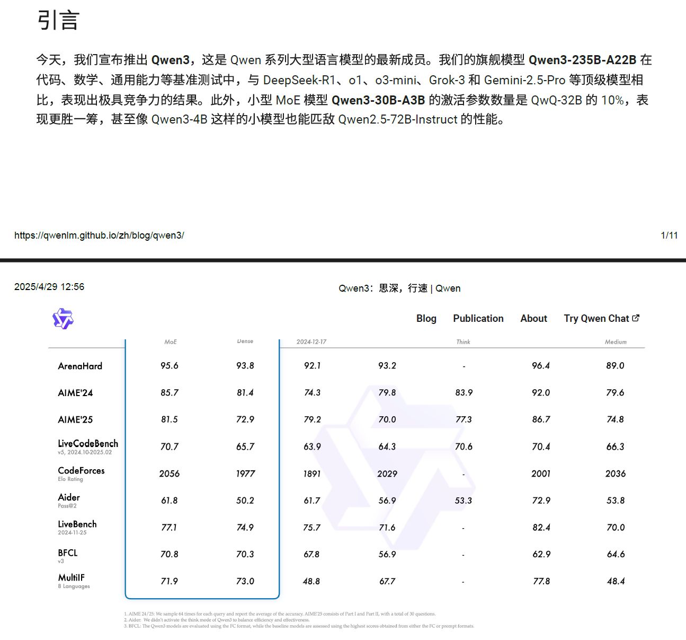
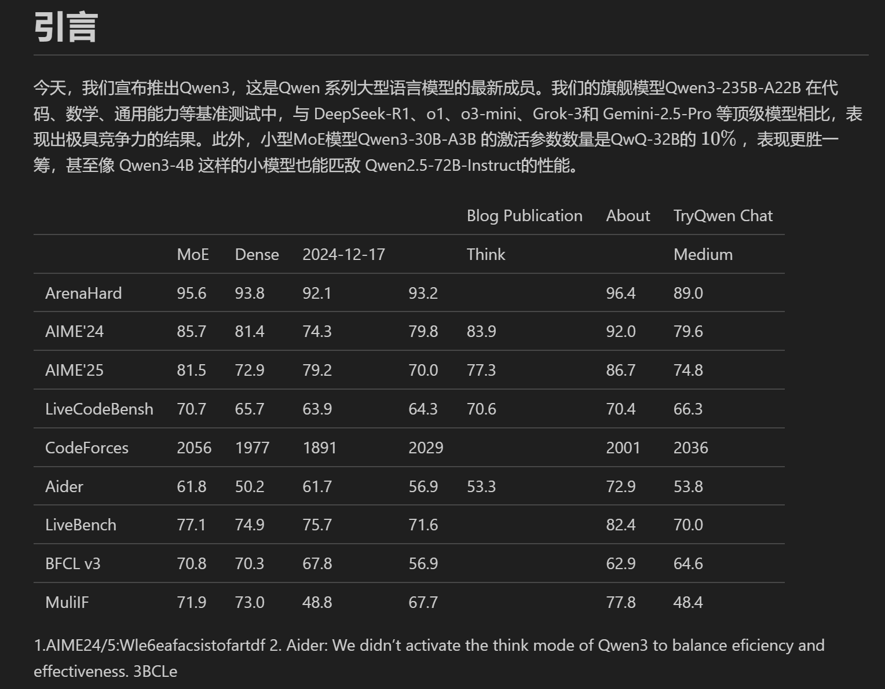
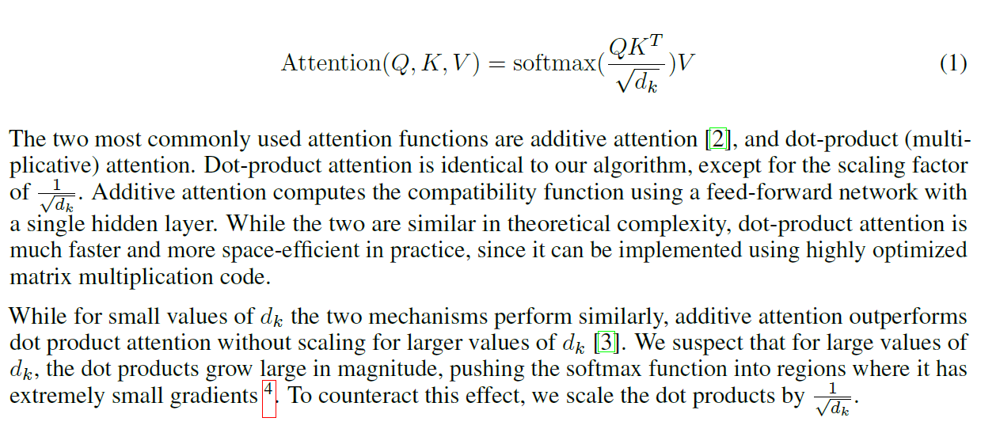
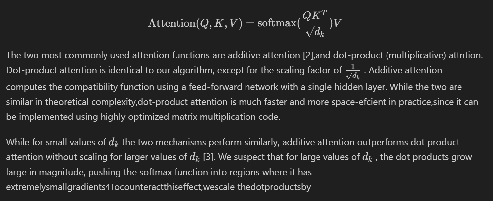

# 批量处理pdf文件格式转换

## 1. 功能简介
该python脚本是位于根目录下的`multi_process_mineru.py`，功能是基于mineru项目实现对指定文件夹中的所有.pdf文件一键批量转换为.md格式和.json格式。

本程序默认将根目录下`pdf_files`文件中所有为.pdf格式的文件进行批量转换，并将转换完成的.md和.json文件输出到根目录下`md_json_files`中。当然，用户完全可以自己修改读取文件或保存文件的位置。

## 2. 测试案例

在`pdf_files`文件夹中上传了两个.pdf文件作为使用示例。Example1为中文内容，Example2为英文内容。测试文件中还包含图片、表格、公式等内容，以观察文件批量转换的实际效果。

**Step1** 将两个文件`Example1-Chinese.pdf`和`Example2-English.pdf`放入到`pdf_files`文件夹中。

**Step2** 运行`multi_process_mineru.py`脚本，等待程序运行结束。

**Step3** 运行结束后，查看`md_json_files`文件夹，可以看到两个文件夹`Example1-Chinese`和`Example2-English`。一个文件夹对应一个.pdf文件，即该.pdf文件转换后生成的.md和.json文件。

**效果展示**

Example1-Chinese.pdf内容片段：

Example1-Chinese.md内容片段：

Example2-English.pdf内容片段：

Example2-English.md内容片段：

**测试结果**
该脚本能够在充分发挥mineru强大识别能力的前提下，实现对指定文件夹中的所有.pdf文件一键批量转换为.md格式和.json格式。

## 3. 注意事项

- `multi_process_mineru.py`脚本的编写、测试与运行均在根目录下完成，未测试其在其他目录下的运行情况。
- 首次运行脚本前，请按照MinerU项目中的说明配置环境，方可正常运行该脚本。
- 首次运行脚本时，会先下载模型，等待时间可能较长。
