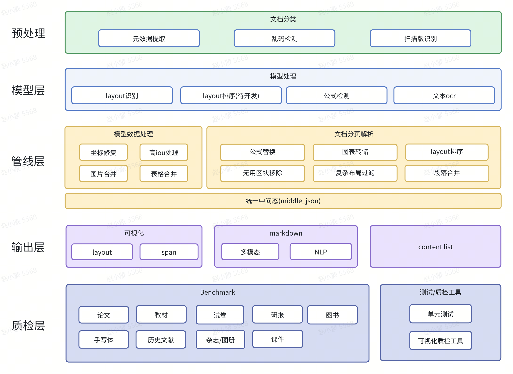
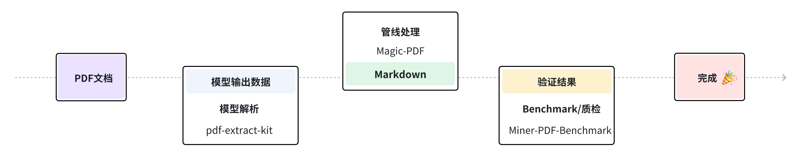

<div id="top">
<p align="center">
  
</p>
</div>
<div align="center">

[](https://github.com/opendatalab/MinerU)
[](https://github.com/opendatalab/MinerU)
[](https://github.com/opendatalab/MinerU/issues)
[](https://github.com/opendatalab/MinerU/issues)
[](https://badge.fury.io/py/magic-pdf)
[](https://pepy.tech/project/magic-pdf)
[](https://pepy.tech/project/magic-pdf)
<a href="https://trendshift.io/repositories/11174" target="_blank"></a>

[English](README.md) | [简体中文](README_zh-CN.md) | [日本語](README_ja-JP.md)

</div>

<div align="center">
<p align="center">
<a href="https://github.com/opendatalab/MinerU">MinerU: 端到端的PDF解析工具（基于PDF-Extract-Kit）支持PDF转Markdown</a>🚀🚀🚀<br>
<a href="https://github.com/opendatalab/PDF-Extract-Kit">PDF-Extract-Kit: 高质量PDF解析工具箱</a>🔥🔥🔥
</p>

<p align="center">
    👋 join us on <a href="https://discord.gg/gPxmVeGC" target="_blank">Discord</a> and <a href="https://cdn.vansin.top/internlm/mineru.jpg" target="_blank">WeChat</a>
</p>
</div>

# MinerU 


## 简介

MinerU 是一款一站式、开源、高质量的数据提取工具，主要包含以下功能:

- [Magic-PDF](#Magic-PDF)  PDF文档提取
- [Magic-Doc](#Magic-Doc)  网页与电子书提取  

# Magic-PDF


## 简介

Magic-PDF 是一款将 PDF 转化为 markdown 格式的工具。支持转换本地文档或者位于支持S3协议对象存储上的文件。

主要功能包含

- 支持多种前端模型输入
- 删除页眉、页脚、脚注、页码等元素
- 符合人类阅读顺序的排版格式
- 保留原文档的结构和格式，包括标题、段落、列表等
- 提取图像和表格并在markdown中展示
- 将公式转换成latex
- 乱码PDF自动识别并转换
- 支持cpu和gpu环境
- 支持windows/linux/mac平台


https://github.com/user-attachments/assets/4bea02c9-6d54-4cd6-97ed-dff14340982c


## 项目全景



## 流程图



### 子模块仓库

- [PDF-Extract-Kit](https://github.com/opendatalab/PDF-Extract-Kit) 
  - 高质量的PDF内容提取工具包

## 上手指南

### 配置要求

python >= 3.9

推荐使用虚拟环境，以避免可能发生的依赖冲突，venv和conda均可使用。  
例如：
```bash
conda create -n MinerU python=3.10
conda activate MinerU
```
开发基于python 3.10，如果在其他版本python出现问题请切换至3.10。

### 安装配置

#### 1. 安装Magic-PDF

**1.安装依赖**

完整功能包依赖detectron2，该库需要编译安装，如需自行编译，请参考 https://github.com/facebookresearch/detectron2/issues/5114  
或是直接使用我们预编译的whl包：
> ❗️预编译版本仅支持64位系统(windows/linux/macOS)+pyton 3.10平台；不支持任何32位系统和非mac的arm平台，如系统不支持请自行编译安装。
```bash
pip install detectron2 --extra-index-url https://wheels.myhloli.com -i https://pypi.tuna.tsinghua.edu.cn/simple 
```

**2.使用pip安装完整功能包**
> 受pypi限制，pip安装的完整功能包仅支持cpu推理，建议只用于快速测试解析能力。
>
> 如需在生产环境使用CUDA/MPS加速请参考[使用CUDA或MPS加速推理](#4-使用CUDA或MPS加速推理)
```bash
pip install magic-pdf[full]==0.6.2b1 -i https://pypi.tuna.tsinghua.edu.cn/simple
```
> ❗️❗️❗️
> 我们预发布了0.6.2beta版本，该版本解决了很多issue中提出的问题，同时提高了安装成功率。但是该版本未经过完整的QA测试，不代表最终正式发布的质量水平。如果你遇到任何问题，请通过提交issue的方式及时向我们反馈，或者回退到使用0.6.1版本。
> ```bash
> pip install magic-pdf[full-cpu]==0.6.1
> ```


#### 2. 下载模型权重文件

详细参考 [如何下载模型文件](docs/how_to_download_models_zh_cn.md)  
> ❗️模型下载后请务必检查模型文件是否下载完整
> 
> 请检查目录下的模型文件大小与网页上描述是否一致，如果可以的话，最好通过sha256校验模型是否下载完整

#### 3. 拷贝配置文件并进行配置
在仓库根目录可以获得 [magic-pdf.template.json](magic-pdf.template.json) 配置模版文件
> ❗️务必执行以下命令将配置文件拷贝到【用户目录】下，否则程序将无法运行
> 
>  windows的用户目录为 "C:\Users\用户名", linux用户目录为 "/home/用户名", macOS用户目录为 "/Users/用户名"
```bash
cp magic-pdf.template.json ~/magic-pdf.json
```

在用户目录中找到magic-pdf.json文件并配置"models-dir"为[2. 下载模型权重文件](#2-下载模型权重文件)中下载的模型权重文件所在目录
> ❗️务必正确配置模型权重文件所在目录的【绝对路径】，否则会因为找不到模型文件而导致程序无法运行
> 
> windows系统中此路径应包含盘符，且需把路径中所有的"\"替换为"/",否则会因为转义原因导致json文件语法错误。
> 
> 例如：模型放在D盘根目录的models目录，则model-dir的值应为"D:/models"
```json
{
  "models-dir": "/tmp/models"
}
```

#### 4. 使用CUDA或MPS加速推理
如您有可用的Nvidia显卡或在使用Apple Silicon的Mac，可以使用CUDA或MPS进行加速
##### CUDA

需要根据自己的CUDA版本安装对应的pytorch版本  
以下是对应CUDA 11.8版本的安装命令，更多信息请参考 https://pytorch.org/get-started/locally/  
```bash
pip install --force-reinstall torch==2.3.1 torchvision==0.18.1 --index-url https://download.pytorch.org/whl/cu118
```
> ❗️务必在命令中指定以下版本
> ```bash
> torch==2.3.1 torchvision==0.18.1 
> ```
> 这是我们支持的最高版本，如果不指定版本会自动安装更高版本导致程序无法运行
 

同时需要修改【用户目录】中配置文件magic-pdf.json中"device-mode"的值
```json
{
  "device-mode":"cuda"
}
```

##### MPS
使用macOS(M系列芯片设备)可以使用MPS进行推理加速  
需要修改配置文件magic-pdf.json中"device-mode"的值  
```json
{
  "device-mode":"mps"
}
```


### 使用说明

#### 1. 通过命令行使用

###### 直接使用

```bash
magic-pdf pdf-command --pdf "pdf_path" --inside_model true
```
程序运行完成后，你可以在"/tmp/magic-pdf"目录下看到生成的markdown文件，markdown目录中可以找到对应的xxx_model.json文件  
如果您有意对后处理pipeline进行二次开发，可以使用命令  
```bash
magic-pdf pdf-command --pdf "pdf_path" --model "model_json_path"
```
这样就不需要重跑模型数据，调试起来更方便

###### 更多用法

```bash
magic-pdf --help
```


#### 2. 通过接口调用

###### 本地使用
```python
image_writer = DiskReaderWriter(local_image_dir)
image_dir = str(os.path.basename(local_image_dir))
jso_useful_key = {"_pdf_type": "", "model_list": model_json}
pipe = UNIPipe(pdf_bytes, jso_useful_key, image_writer)
pipe.pipe_classify()
pipe.pipe_parse()
md_content = pipe.pipe_mk_markdown(image_dir, drop_mode="none")
```

###### 在对象存储上使用
```python
s3pdf_cli = S3ReaderWriter(pdf_ak, pdf_sk, pdf_endpoint)
image_dir = "s3://img_bucket/"
s3image_cli = S3ReaderWriter(img_ak, img_sk, img_endpoint, parent_path=image_dir)
pdf_bytes = s3pdf_cli.read(s3_pdf_path, mode=s3pdf_cli.MODE_BIN)
jso_useful_key = {"_pdf_type": "", "model_list": model_json}
pipe = UNIPipe(pdf_bytes, jso_useful_key, s3image_cli)
pipe.pipe_classify()
pipe.pipe_parse()
md_content = pipe.pipe_mk_markdown(image_dir, drop_mode="none")
```

详细实现可参考 [demo.py](demo/demo.py)


### 常见问题处理解答

参考 [FAQ](docs/FAQ_zh_cn.md) 


# Magic-Doc


## 简介

Magic-Doc 是一款支持将网页或多格式电子书转换为 markdown 格式的工具。

主要功能包含
 
- Web网页提取
  - 跨模态精准解析图文、表格、公式信息

- 电子书文献提取
  - 支持 epub，mobi等多格式文献，文本图片全适配

- 语言类型鉴定
  - 支持176种语言的准确识别

https://github.com/opendatalab/MinerU/assets/11393164/a5a650e9-f4c0-463e-acc3-960967f1a1ca


https://github.com/opendatalab/MinerU/assets/11393164/0f4a6fe9-6cca-4113-9fdc-a537749d764d


https://github.com/opendatalab/MinerU/assets/11393164/20438a02-ce6c-4af8-9dde-d722a4e825b2


## 项目仓库

- [Magic-Doc](https://github.com/InternLM/magic-doc)
  优秀的网页与电子书提取工具


## 感谢我们的贡献者

<a href="https://github.com/opendatalab/MinerU/graphs/contributors">
  
</a>


## 版权说明

[LICENSE.md](LICENSE.md)

本项目目前采用PyMuPDF以实现高级功能，但因其遵循AGPL协议，可能对某些使用场景构成限制。未来版本迭代中，我们计划探索并替换为许可条款更为宽松的PDF处理库，以提升用户友好度及灵活性。


## 致谢
- [PaddleOCR](https://github.com/PaddlePaddle/PaddleOCR)
- [PyMuPDF](https://github.com/pymupdf/PyMuPDF)
- [fast-langdetect](https://github.com/LlmKira/fast-langdetect)
- [pdfminer.six](https://github.com/pdfminer/pdfminer.six)


# 引用

```bibtex
@misc{2024mineru,
    title={MinerU: A One-stop, Open-source, High-quality Data Extraction Tool},
    author={MinerU Contributors},
    howpublished = {\url{https://github.com/opendatalab/MinerU}},
    year={2024}
}
```

  
# Star History

<a>
 <picture>
   <source media="(prefers-color-scheme: dark)" srcset="https://api.star-history.com/svg?repos=opendatalab/MinerU&type=Date&theme=dark" />
   <source media="(prefers-color-scheme: light)" srcset="https://api.star-history.com/svg?repos=opendatalab/MinerU&type=Date" />
   
 </picture>
</a>

## 友情链接
- [LabelU (轻量级多模态标注工具)](https://github.com/opendatalab/labelU)
- [LabelLLM (开源LLM对话标注平台)](https://github.com/opendatalab/LabelLLM)
- [PDF-Extract-Kit (用于高质量PDF内容提取的综合工具包)](https://github.com/opendatalab/PDF-Extract-Kit))
