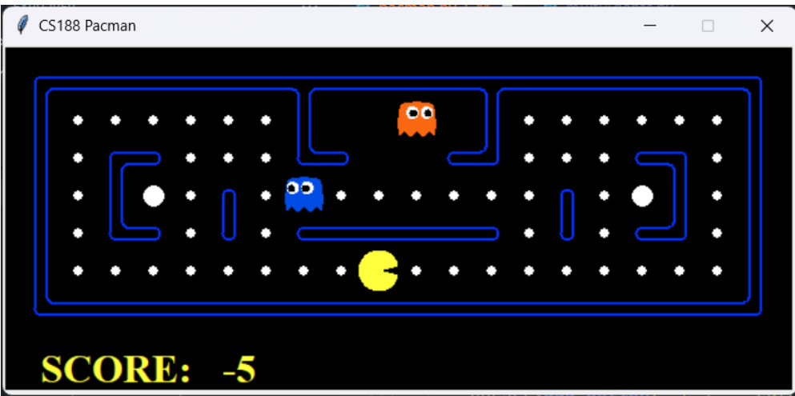  
Hình 1: Game Pacman  

Trong Pacman, người chơi điều khiển một nhân vật hình tròn có tên là Pac-Man (agent), đi qua một mê cung đểăn các viên thức ăn và tránh né các con ma (ghost agents).  

Trò chơi sẽkết thúc nếu rơi vào một trong hai trường hợp sau:  

•  Chiến thắng: nếu như agent Pacman ăn hết viên thức ăn. •  Thua: nếu agent Pacman bịbắt bởi agent Ghost.  

Ngoài ra, bản đồcòn xuất hiện các viên capsule có vai trò tăng sức mạnh Pacman trong một khoảng thời gian nhất định. Khi ăn được viên capsule, Pacman có khảnăng tiêu diệt ghost agent và thu về điểm thưởng.  

Mục tiêu của trò chơi là điều khiển Pacman ăn hết tất cảcác viên thức ăn trong mê cung trong khi tránh né các con ma, và cốgắng đạt được điểm sốcao nhất có thể.  

Yêu cầu của bài tập 4 là vận dụng các thuật toán multiAgents search và thiết kếhàm lượng giá để đánh giá các giá trịtrung gian, trạng thái hành động của Pacman.  

# 2 Các thuật toán Multi - Agent search  

# 2.1 Minimax  

Class MinimaxAgent có 3 hàm chính:  

•  def minimax: hàm duyệt qua tất cảcác hành động hợp lệcủa Pacman, sau đó gọi hàm minValue đểđánh giá giá trịcủa từng hành động, cuối cùng là chọn hành động có giá trịcao nhất và trả vềhành động đó.  

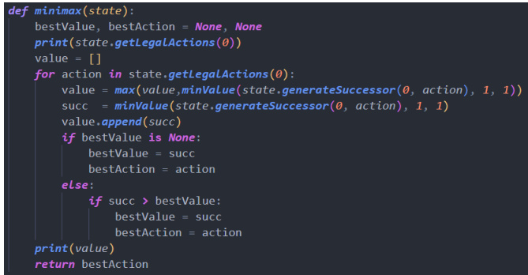  
Hình 2: hàm minimax  

# 2.3 Expectimax  

Thuật toán Expectimax cũng tương tựvới Minimax, thay đổi ởhàm minValue thành expValue, tức thay vì các agent ghost luôn chọn giá trịthấp nhất đối với agent Pacman, thì bây giờcác agent ghost lựa chọn hành động có yếu tốngẫu nhiên (do agent Pacman không biết được hành động của agent ghost).  

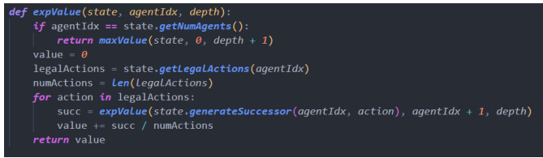  
Hình 5: expValue  

# 3 Hàm lượng giá  

3.1 Evaluation Function  

Hàm lượng giá default trong file  multiAgents.p y chỉđơn giảm là trảvềgiá trịscore của trạng thái.  

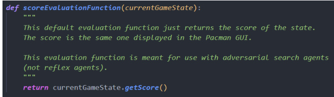  
Hình 6: score Evaluation Function  

# 3.2 better Evaluation Function  

Dựa trên những ý tưởng có sẵn của better Evaluation Function 1 có sẵn trong file  multiAgents.py , hàm better Evaluation Function 2 sẽđánh giá trạng thái dựa trên các yếu tốsau:  

•  Khoảng cách Mahattan giữa agent ghost gần nhất và agent Pacman  (1) Đểchắc chắn vềkhảnăng sống sót của Pacman, khoảng cách  (1)  phải càng xa càng tốt. •  Khoảng cách Mahattan giữa agent Pacman và viên thức ăn gần nhất  (2) Đểthỏa mãn điều kiện chiến thắng (ăn hết thức ăn), khoảng cách  (2)  phải càng gần càng tốt. •  Khoảng cách Mahattan giữa agent Pacman và viên capsule gần nhất  (3) Khoảng cách này chiếm trọng sốkhông cao vì việc ăn được viên capsule không thực sựcần thiết (không nằm trong điều kiện chiến thắng). Tuy nhiên, vì ăn capsule và tiêu diệt được ghost sẽ cộng khá nhiều điểm, nên better Evaluation Function 2 có thêm thuộc tính scaredTime  (4)  (thời gian ghost đang trong trạng thái  sợhãi  sau khi Pacman ăn được viên Capsule). •  Sau khi Pacman ăn được viên capsule, khoảng cách  (1)  sẽđổi dấu, tức khoảng cách giữa Pacman và Ghost càng gần càng tốt, Pacman sẽcó xu hướng  rượt  ghost đểtiêu diệt chúng. Trọng sốcủa thuộc tính này sẽphụthuộc vào thời gian scaredTime của agent ghost, tức nếu thời gian scaredTime còn càng nhiều, trọng sốcàng lớn. Tuy nhiên, trọng sốcủa thuộc tính scaredTime vẫn không nên cao hơn  (2)  vì  (2)  mới là điều kiện chiến thắng, nếu trọng sốcủa  (4)  quá cao, sẽcó thểkhiến Pacman chỉchăm lo rượt đuổi các agent ghost và  quên mất  điều kiện chiến thắng, mà điểm lại giảm dần theo thời gian của màn chơi, vì thếcó khảnăng sốđiểm không những không cải thiện mà còn bịgiảm.  

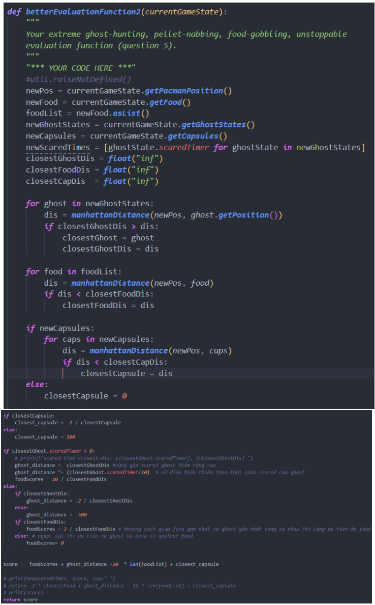  
Hình 7: better Evaluation Function 2  

# 4 Thực nghiệm  

Thực hiện chơi Pacman trên 5 map khác nhau, mỗi map chơi 5 lần với 5 random seed (mssv + [0, 4]), mỗi lần chơi với 3 thuật toán multi - agent search và 2 hàm lượng giá. Kết quảthu được thểhiện bảng dưới:  

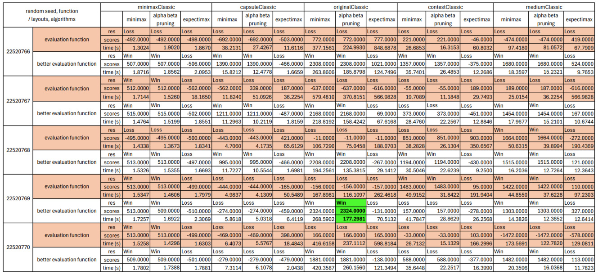  

4.1 Nhận xét các thuật toán Multi-Agent Search  

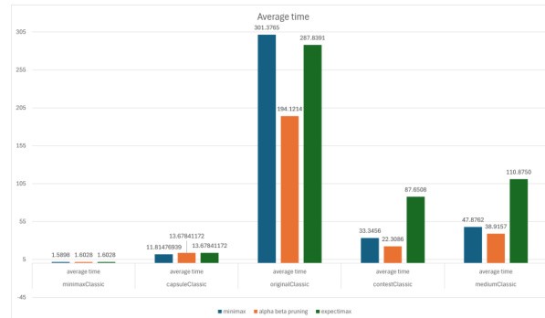  
(a) Thời gian trung bình qua các map của 3 thuật toán  

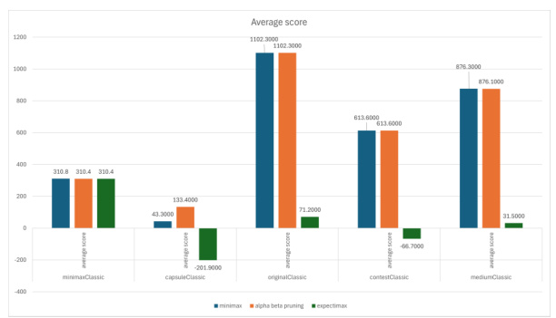  
(b) Điểm trung bình qua các map của 3 thuật toán  

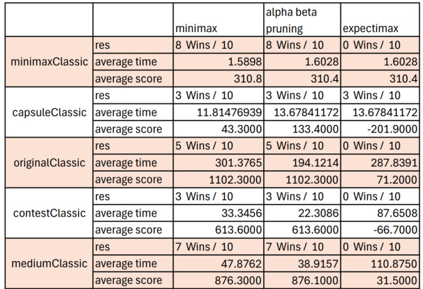  
Hình 9: So sánh 3 thuật toán Multi-Agent Search  

Qua các biểu đồtrong  9 , ta thấy rằng trong hầu hết các trường hợp, thuật toán alpha-beta pruning thường có thời gian chạy nhanh nhất nhờvào khảnăng cắt tỉa nhánh thừa của nó.  

Tuy nhiên, trên map capsuleClassic, thời gian chạy của alpha-beta pruning lại cao hơn so với hai thuật toán còn lại một chút. Điều này có th  $\hat{\mathrm{e}}$  do kết quảcủa cây trò chơi thường rơi vào node cuối cùng, khiến cho alpha-beta pruning không thểcắt tỉa nhánh nào, đồng thời phải mất thêm thời gian tính toán logic của các tham sốalpha, beta. Điều này dẫn đến việc thời gian chạy của nó trởnên lâu hơn so với hai thuật toán còn lại.  

Vềđiểm số, chúng ta biết rằng thuật toán minimax luôn đưa ra lời giải tối ưu (nếu chạy đủlâu). Do đó, trong hầu hết các trường hợp, điểm sốcủa minimax thường cao hơn so với alpha-beta pruning. Tuy nhiên, trên map capsuleClassic, điểm sốcủa alpha-beta pruning lại cao hơn. Điều này có thểđược giải thích bởi sựđa dạng của map này, với nhiều viên capsules, từđó dẫn đến việc thuật toán alpha-beta pruning có thểtận dụng hàm better Evaluation 2 đểlấy được nhiều điểm hơn.  

Vềthời gian và điểm số, thuật toán expectimax thường thểhiện kém hơn do ảnh hưởng của yếu tố ngẫu nhiên, khiến cho Pacman gặp khó khăn trong việc dựđoán trạng thái tiếp theo.  

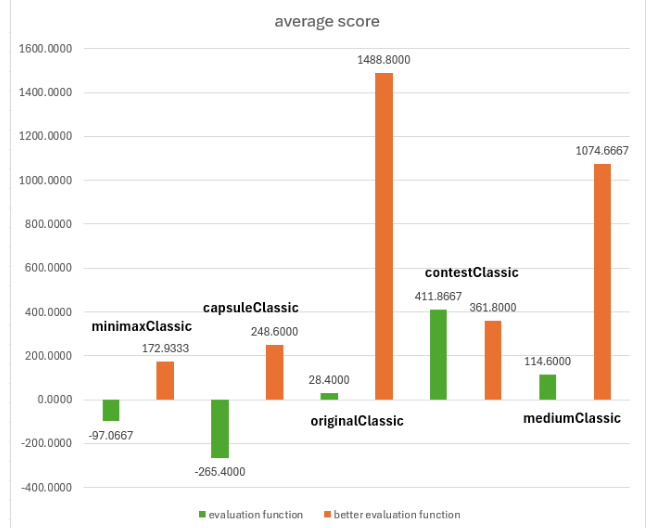  
(a) Thời gian trung bình qua các map của 2 hàm lượng giá  

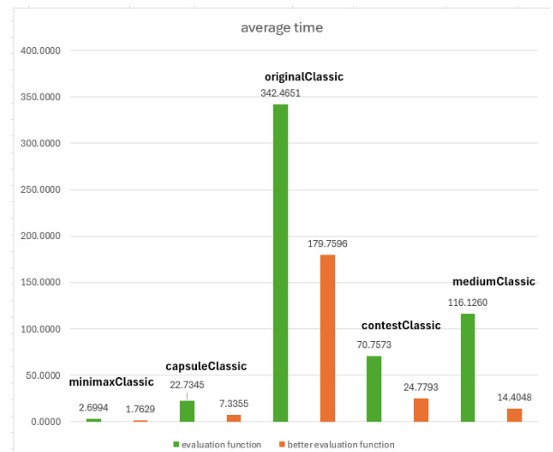  
(b) Điểm trung bình qua các map của 2 hàm lượng giá  

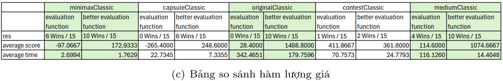  
Hình 10: So sánh 2 hàm lượng giá  

Dựa vào các biểu đồvà bảng sốliệu từ 10 , có thểthấy rằng trong phần lớn các trường hợp, hàm better Evaluation Function 2 cho kết quảtốt hơn rất rõ rệt so với score Evaluation Function. Trong 15 trận đấu, trung bình sốtrận thắng của better Evaluation Function 2 là 7.6, trong khi đó của scoreE- valuation Function chỉlà 2.2. Không chỉvậy, thời gian chạy trung bình và điểm trung bình của bet- te rEvaluation Function 2 cũng có hiệu năng cao hơn nhiều so với score Evaluation Function, đặc biệt là trên bản original Classic. Trên bản đồnày, điểm trung bình của better Evaluation Function 2 là 1488.8 so với chỉ28.4 của score Evaluation Function. Trong khi đó, ởbản đồmediumClassic, thời gian chạy trung bình của better Evaluation Function 2 chỉlà 14.4 giây, trong khi score Evaluation Function lại cần tới 116.126 giây đểhoàn thành.  

# 4.3 Những điểm chưa khắc phục được  

Với ý tưởng ban đầu là việc Pacman có khảnăng  rượt đuổi  Pacman khi ghost agents đang trong thời gian scaredTime, và trọng sốcủa thuộc tính này sẽphụthuộc vào scaredTime còn lại của ghost agents. Tuy nhiên, khi thực nghiệm thì Pacman agent ởhàm better Evaluation Function 2 chỉcó khả năng "không né tránh scared ghost"chứchưa thểrượt đuổi tiêu diệt scared ghost. Điểm chỉcó thểcao  