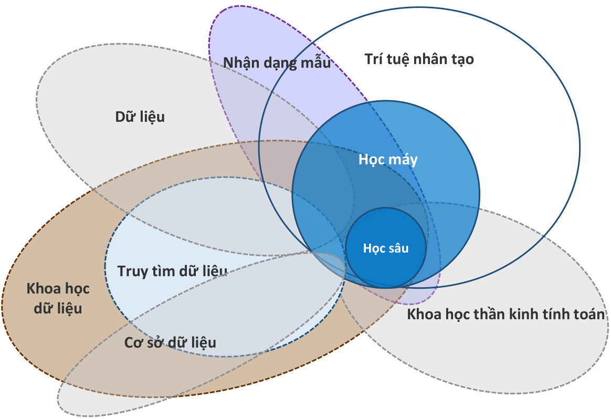

# I Xay dung mot he thong thong minh chuyen doi du lieu thanh tri thurc  

> C6 rat nhieu du lieu co cau truc va phi cau truc trong thoi dai cong nghe hien dai  

Hoc may xuat hien vao cuoi the ky 20 nhu mot linh vyc phu cua Tri tue nhan tao (Al) lien quan dén cac thuat toan tu hoc trich xuat va du doan kien thurc tur dur liéu.  

Con nguoi phan tich thu cong mot lurong lon dur lieu de tao ra cac quy täc va tao mo hinh.  

Hoc may c6 the dän dan cai thien cac mo hinh du doan va hieu suat ra quyet dinh dua tren dur lieu bang cach trich xuat kien thurchieu qua hontur dur lieu.  

  

# Phan loai Tri tue nhan tao  

Tri tue nhan tao  

# Tri tue nhan tao hep (ANI)  

Tri tue nhan tao yeu  

Thuc hien cac churc nang cu the cua con nguoi (Vi du: loa thong minh, xe tu lai)  

· Tri tue nhan tao thuc hien durgc cac chuc nang cu the cua con nguoi

 · Phan lon cac tien bo cong nghe gan day déu den tu linh vuc nay  

# Tri tue nhan tao rong (AGI)  

Tri tue nhan tao manh Thuc hien moi thao tac nhu con nguoi  

·Tri tue nhan tao co the thu'c hien tat ca hoat dong cua con nguoi voiANI  

Trong tam cua bai hoc nay va toan bo khoa hoc I "Mot linh vyc nghien curu phat trien cac thuat toan cho phép may hoc tur du lieu va thuc hien cac hanh dong khong dugc chi dinh ro rang bang ma"- Arthur Samuel, 1959  

I "Mot chuong trinh may tinh duqc cho la hoc hoitur trai nghiem E d?i voi mot s6 loai nhiem vu T va thuoc do hieu suat P neu hiéu suat cua n6 & cac nhiem vu trong T, dugc do bang P, dugc cai thien nho trai nghiem E." - Tom Mitchell, 1977  

  

I Nhiem vu T la phan loai cho va meo, va hieu suat P the hien thuoc do phan loai ch6 va meo. E c6 the noi la "dang hoc" neu hieu suat phan loai cho, meo nang cao dan qua kinh nghiem, hoac du lieu (1o.ooo anh).  

# Cac nganh lien quan den hoc may  

I Cac nghien curu lien quan den hoc may  

Hoc may la mot linh vuc lien nganh ket hop nen tang hoc thuat va thanh turu trong cac linh vuc khac nhau nhu xac suat va th6ng ke, khoa hoc may tinh, ly thuyet co s? du lieu, khoa hoc nhan thurc, khoa hoc thän kinh va nhan dang mäu, thay vi chi gioi han ? cong nghe phuong phap luan trong bat ky linh vu'c nao.  

  

Moi quan he gitra hoc may va cac nganh khac nhau  

# I Hoc may va Thong ke so lieu  

Theo truyén thong, thong ke duoc coi la nen tang ly thuyet cung cap mot phuong phap khoa hoc va c6 he thong de chuyen doi du lieu thanh thong tin. Cac linh vuc durgc nhan manh däc biet trong thong ke la suy luan va xac minh, va cac phuong phap va ly thuyet khac nhau dä duoc thiet lap dé giai thich muc do phu hop cua dur lieu dä cho voi gia thuyet va ly thuyet cua nha nghien curu (hoäc murc do chinh xac cua cac gia tri thu duqc tu cac quan sat uoc tinh cac tham s6 dan so thu'c te).  

Trong khi d6, hoc may chu yeu dugc sur dung dé giai quyet cac nhiem vu kho thiet ke hoäc kh6 lap trinh cac thuat toan ro rang. Hau het cac thuat toan hoc may truoc tien dugc su dung de dinh lugng cac moi quan he phu'c tap bang cach xac dinh tinh nang cua cac co che tiem nang do dur lieu tao ra, sau d6 dua ra dy doan ve dur lieu moi bang cach sur dung mau dä xac dinh nay.  

Thoat nhin, cac cach tiép can cua thong ke va hoc may co vé doi lap nhau, nhung ben canh sy nhan manh vao mot s6 khác biet vè khia canh ho?c quan diem, cac phuong phap hinh thanh nen tang cua moi nganh hoc la rat giong nhau. Tren thuc te, c6 the noi rang nhièu phuong phap hoc may dua trén viec hoc thong ke dua trén s6 lieu thong ke.  

  