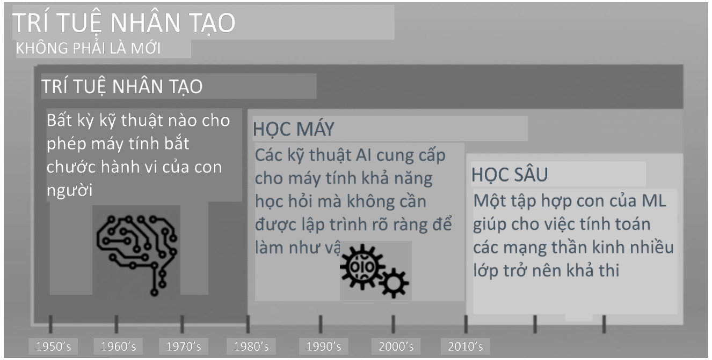

# I Xây dựng một hệ thống thông minh chuyển đổi dữ liệu thành tri thức  

- Có rất nhiều dữ liệu có cấu trúc và phi cấu trúc trong thời đại công nghệ hiện đại.  

Thuật thuật thế thấp Học máy xuất hiện vào cuối thế kỷ 20 như một lĩnh vực phụ của Trí tuệ nhân tạo (Al) liên quan đến các thuật  trích xuất và dự đoán kiến thức từ dữ liệu.  

Thuật thuật - Con người phân tích thủ công một lượng lớn dữ liệu để tạo ra các quy tắc và tạo mô hình  

Thuật thiến thay Học máy có thể dần dần cải thiện các mô hình dự đoán và hiệu suất ra quyết định dựa trên dữ liệu bằng cách trích thiến thức hiệu quả hơn từ dữ liệu.  

  