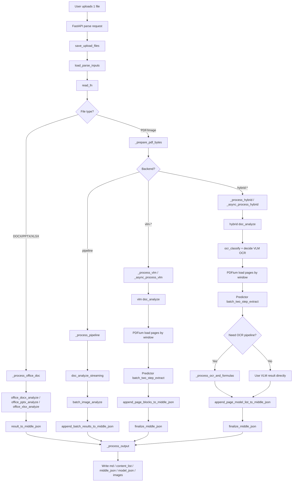
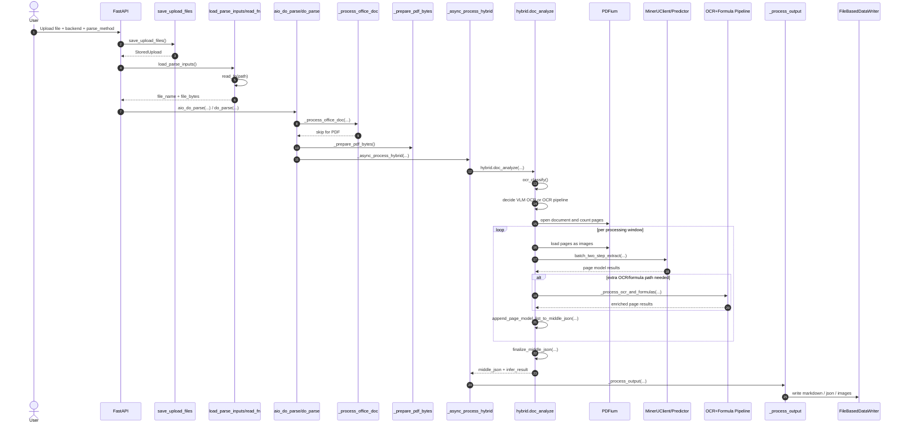

# MinerU Processing Flow

## Overview

This document explains how MinerU processes a single input file from request entry to output generation.

The description below is based on the current code path around:

- `mineru/cli/fast_api.py`
- `mineru/cli/common.py`
- `mineru/backend/pipeline/pipeline_analyze.py`
- `mineru/backend/vlm/vlm_analyze.py`
- `mineru/backend/hybrid/hybrid_analyze.py`
- `mineru/backend/office/*.py`

## High-Level Steps

1. The client uploads one file and parsing parameters such as `backend`, `parse_method`, and `lang_list`.
2. FastAPI stores the upload on disk and normalizes the file name.
3. MinerU reads file bytes and detects the input type.
4. Office files are handled immediately by the office parser path.
5. PDF and image inputs are normalized into PDF bytes and optionally trimmed by page range.
6. MinerU dispatches the file to one backend:
   - `pipeline`
   - `vlm-*`
   - `hybrid-*`
7. The backend produces structured page results in `middle_json` plus model output.
8. MinerU renders output artifacts such as Markdown, content lists, images, and JSON files.

## Input Dispatch Rules

### Office Files

If the input is `docx`, `pptx`, or `xlsx`, MinerU routes it through `_process_office_doc()` and selects one of:

- `office_docx_analyze()`
- `office_pptx_analyze()`
- `office_xlsx_analyze()`

Those functions convert the binary file into parser results and then transform the result into `middle_json`.

### PDF and Image Files

If the input is a PDF, MinerU keeps the original bytes.

If the input is an image such as `png`, `jpg`, or `webp`, MinerU first converts the image bytes into PDF bytes so the downstream PDF-based pipeline can reuse the same processing flow.

## Main Flow Diagram

## Request Entry and Input Staging

The request enters through the FastAPI layer, which:

- validates request parameters
- writes uploaded files into a task-local directory
- normalizes duplicate file stems
- loads file bytes through `read_fn()`

At this stage:

- office files remain office bytes
- PDF files remain PDF bytes
- image files are converted into PDF bytes

## Backend Processing Paths

### Pipeline Backend

The `pipeline` backend is the classic OCR and layout pipeline.

Core flow:

1. Open each PDF with PDFium.
2. Classify whether OCR is needed based on `parse_method`.
3. Split all pages into processing windows.
4. Convert pages to images.
5. Run `batch_image_analyze()`.
6. Append batch results into `middle_json`.
7. Finalize the document and trigger output generation.

This backend is optimized for broader compatibility and multi-language OCR.

### VLM Backend

The `vlm-*` backend uses a visual-language model predictor.

Core flow:

1. Initialize or reuse a `MinerUClient` predictor.
2. Open the PDF with PDFium.
3. Read pages window by window.
4. Convert each page into PIL images.
5. Run `predictor.batch_two_step_extract(...)`.
6. Append page blocks into `middle_json`.
7. Finalize the document.

This path stays fully in the VLM extraction route.

### Hybrid Backend

The `hybrid-*` backend combines VLM layout understanding with OCR and formula refinement when needed.

Core flow:

1. Decide whether OCR is required from `parse_method`.
2. Decide whether VLM OCR is sufficient or whether the local OCR pipeline is needed.
3. Open the PDF with PDFium.
4. Read pages by processing window.
5. Run `predictor.batch_two_step_extract(...)`.
6. If VLM OCR is not enough, run `_process_ocr_and_formulas(...)`.
7. Append enriched page results into `middle_json`.
8. Finalize the document.

This is the most representative path for PDF parsing in current MinerU usage.

## Sequence Diagram for the Common PDF Path

The diagram below focuses on the common case: one PDF file parsed by `hybrid-auto-engine`.

## Output Generation

After backend analysis finishes, MinerU calls `_process_output()` to generate final artifacts.

Depending on request flags, it can write:

- `{name}.md`
- `{name}_content_list.json`
- `{name}_content_list_v2.json`
- `{name}_middle.json`
- `{name}_model.json`
- `{name}_origin.pdf` or original office file
- extracted images
- optional visual debug PDFs such as layout/span output

## Important Implementation Notes

- `read_fn()` converts image inputs into PDF bytes before PDF processing starts.
- `_process_office_doc()` runs before PDF backend dispatch and removes office files from the PDF list.
- `_prepare_pdf_bytes()` uses PDFium rewriting for page-range trimming and byte normalization.
- `pipeline` currently uses its own synchronous processing path.
- `vlm` and `hybrid` both support async processing variants.
- Final rendering is backend-aware:
  - pipeline uses `pipeline_union_make`
  - vlm and hybrid output rendering use the VLM content builder
  - office uses `office_union_make`

## Source Pointers

- `mineru/cli/fast_api.py`
- `mineru/cli/common.py`
- `mineru/backend/pipeline/pipeline_analyze.py`
- `mineru/backend/vlm/vlm_analyze.py`
- `mineru/backend/hybrid/hybrid_analyze.py`
- `mineru/backend/office/docx_analyze.py`
- `mineru/backend/office/pptx_analyze.py`
- `mineru/backend/office/xlsx_analyze.py`
