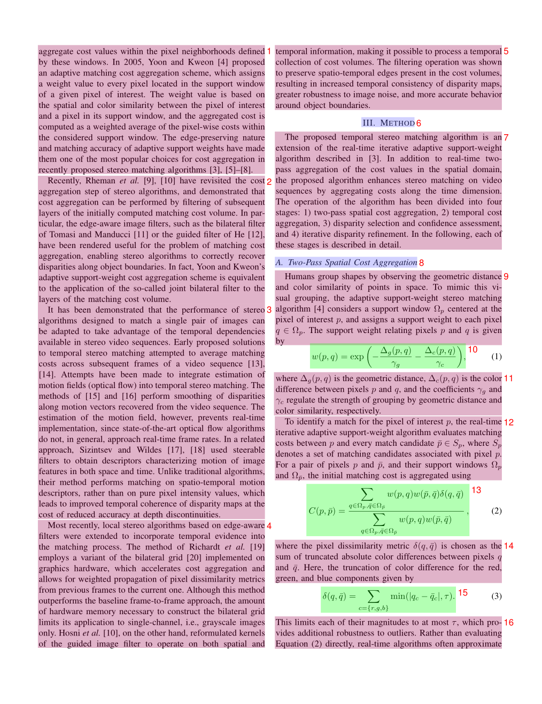

## 概览
`magic-pdf` 命令执行后除了输出和 markdown 有关的文件以外，还会生成若干个和 markdown 无关的文件。现在将一一介绍这些文件


### layout.pdf 
每一页的 layout 均由一个或多个框组成。 每个框左上脚的数字表明它们的序号。此外 layout.pdf 框内用不同的背景色块圈定不同的内容块。




### spans.pdf 
根据 span 类型的不同，采用不同颜色线框绘制页面上所有 span。该文件可以用于质检，可以快速排查出文本丢失、行间公式未识别等问题。


### model.json

#### 结构定义
```python
from pydantic import BaseModel, Field
from enum import IntEnum

class CategoryType(IntEnum):
     title = 0               # 标题
     plain_text = 1          # 文本
     abandon = 2             # 包括页眉页脚页码和页面注释
     figure = 3              # 图片
     figure_caption = 4      # 图片描述
     table = 5               # 表格
     table_caption = 6       # 表格描述
     table_footnote = 7      # 表格注释
     isolate_formula = 8     # 行间公式
     formula_caption = 9     # 行间公式的标号 
     
     embedding = 13          # 行内公式
     isolated = 14           # 行间公式
     text = 15               # ocr 识别结果
   
     
class PageInfo(BaseModel):
    page_no: int = Field(description="页码序号，第一页的序号是 0", ge=0)
    height: int = Field(description="页面高度", gt=0)
    width: int = Field(description="页面宽度", ge=0)

class ObjectInferenceResult(BaseModel):
    category_id: CategoryType = Field(description="类别", ge=0)
    poly: list[float] = Field(description="四边形坐标, 分别是 左上，右上，右下，左下 四点的坐标")
    score: float = Field(description="推理结果的置信度")
    latex: str | None = Field(description="latex 解析结果", default=None)
    html: str | None = Field(description="html 解析结果", default=None)
  
class PageInferenceResults(BaseModel):
     layout_dets: list[ObjectInferenceResult] = Field(description="页面识别结果", ge=0)
     page_info: PageInfo = Field(description="页面元信息")
    
    
# 所有页面的推理结果按照页码顺序依次放到列表中即为 minerU 推理结果
inference_result: list[PageInferenceResults] = []

```

poly 坐标的格式 [x0, y0, x1, y1, x2, y2, x3, y3], 分别表示左上、右上、右下、左下四点的坐标


#### 示例数据

```json
[
    {
        "layout_dets": [
            {
                "category_id": 2,
                "poly": [
                    99.1906967163086,
                    100.3119125366211,
                    730.3707885742188,
                    100.3119125366211,
                    730.3707885742188,
                    245.81326293945312,
                    99.1906967163086,
                    245.81326293945312
                ],
                "score": 0.9999997615814209
            }
        ],
        "page_info": {
            "page_no": 0,
            "height": 2339,
            "width": 1654
        }
    },
    {
        "layout_dets": [
            {
                "category_id": 5,
                "poly": [
                    99.13092803955078,
                    2210.680419921875,
                    497.3183898925781,
                    2210.680419921875,
                    497.3183898925781,
                    2264.78076171875,
                    99.13092803955078,
                    2264.78076171875
                ],
                "score": 0.9999997019767761
            }
        ],
        "page_info": {
            "page_no": 1,
            "height": 2339,
            "width": 1654
        }
    }
]
```


### middle.json

| 字段名 | 解释                                        | 
| :-----|:------------------------------------------|
|pdf_info | list，每个元素都是一个dict,这个dict是每一页pdf的解析结果，详见下表 |
|_parse_type | ocr \| txt，用来标识本次解析的中间态使用的模式              |
|_version_name | string, 表示本次解析使用的 magic-pdf 的版本号          |

<br>

**pdf_info**
字段结构说明

| 字段名 | 解释 | 
| :-----| :---- |
| preproc_blocks | pdf预处理后，未分段的中间结果 |
| layout_bboxes | 布局分割的结果，含有布局的方向（垂直、水平），和bbox，按阅读顺序排序 |
| page_idx | 页码，从0开始 |
| page_size | 页面的宽度和高度 | 
| _layout_tree | 布局树状结构 |
| images | list，每个元素是一个dict，每个dict表示一个img_block |
| tables | list，每个元素是一个dict，每个dict表示一个table_block |
| interline_equations | list，每个元素是一个dict，每个dict表示一个interline_equation_block |
| discarded_blocks | List, 模型返回的需要drop的block信息 |
| para_blocks | 将preproc_blocks进行分段之后的结果 |

上表中 `para_blocks` 是个dict的数组，每个dict是一个block结构，block最多支持一次嵌套

<br>

**block**

外层block被称为一级block，一级block中的字段包括

| 字段名 | 解释 |
| :-----| :---- |
| type | block类型（table\|image）|
|bbox | block矩形框坐标 |
|blocks |list，里面的每个元素都是一个dict格式的二级block |

<br>
一级block只有"table"和"image"两种类型，其余block均为二级block

二级block中的字段包括

| 字段名 | 解释 |
| :-----| :---- |
| type | block类型 |
| bbox | block矩形框坐标 |
| lines | list，每个元素都是一个dict表示的line，用来描述一行信息的构成| 

二级block的类型详解

| type               | desc | 
|:-------------------| :---- |
| image_body         | 图像的本体 |
| image_caption      | 图像的描述文本 |
| table_body         | 表格本体 |
| table_caption      | 表格的描述文本 |
| table_footnote     | 表格的脚注 |
| text               | 文本块 |
| title              | 标题块 |
| interline_equation | 行间公式块| 

<br>

**line**

line 的 字段格式如下

| 字段名 | 解释 | 
| :-----| :---- |
| bbox | line的矩形框坐标 |
| spans | list，每个元素都是一个dict表示的span，用来描述一个最小组成单元的构成 |


<br>

**span**

| 字段名 | 解释 | 
| :-----| :---- |
| bbox | span的矩形框坐标 |
| type | span的类型 |
| content \| img_path | 文本类型的span使用content，图表类使用img_path 用来存储实际的文本或者截图路径信息 |

span 的类型有如下几种

| type | desc | 
| :-----| :---- |
| image | 图片 | 
| table | 表格 |
| text | 文本 |
| inline_equation | 行内公式 |
| interline_equation | 行间公式 |


**总结**

span是所有元素的最小存储单元

para_blocks内存储的元素为区块信息

区块结构为

一级block(如有)->二级block->line->span


#### 示例数据

```json
{
    "pdf_info": [
        {
            "preproc_blocks": [
                {
                    "type": "text",
                    "bbox": [
                        52,
                        61.956024169921875,
                        294,
                        82.99800872802734
                    ],
                    "lines": [
                        {
                            "bbox": [
                                52,
                                61.956024169921875,
                                294,
                                72.0000228881836
                            ],
                            "spans": [
                                {
                                    "bbox": [
                                        54.0,
                                        61.956024169921875,
                                        296.2261657714844,
                                        72.0000228881836
                                    ],
                                    "content": "dependent on the service headway and the reliability of the departure ",
                                    "type": "text",
                                    "score": 1.0
                                }
                            ]
                        }
                    ]
                }
            ],
            "layout_bboxes": [
                {
                    "layout_bbox": [
                        52,
                        61,
                        294,
                        731
                    ],
                    "layout_label": "V",
                    "sub_layout": []
                }
            ],
            "page_idx": 0,
            "page_size": [
                612.0,
                792.0
            ],
            "_layout_tree": [],
            "images": [],
            "tables": [],
            "interline_equations": [],
            "discarded_blocks": [],
            "para_blocks": [
                {
                    "type": "text",
                    "bbox": [
                        52,
                        61.956024169921875,
                        294,
                        82.99800872802734
                    ],
                    "lines": [
                        {
                            "bbox": [
                                52,
                                61.956024169921875,
                                294,
                                72.0000228881836
                            ],
                            "spans": [
                                {
                                    "bbox": [
                                        54.0,
                                        61.956024169921875,
                                        296.2261657714844,
                                        72.0000228881836
                                    ],
                                    "content": "dependent on the service headway and the reliability of the departure ",
                                    "type": "text",
                                    "score": 1.0
                                }
                            ]
                        }
                    ]
                }
            ]
        }
    ],
    "_parse_type": "txt",
    "_version_name": "0.6.1"
}
```