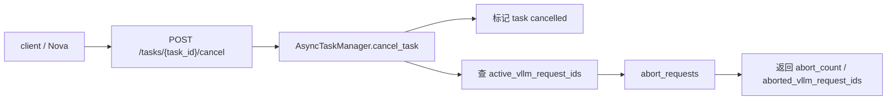
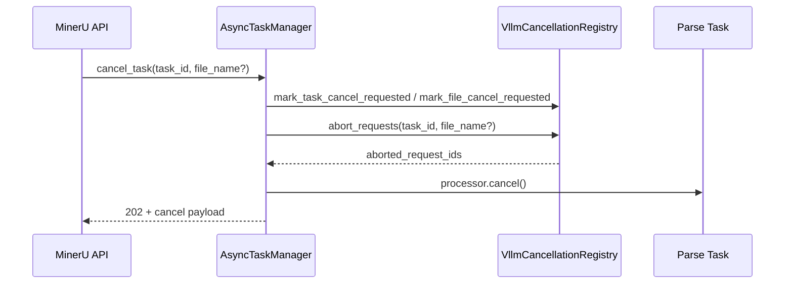
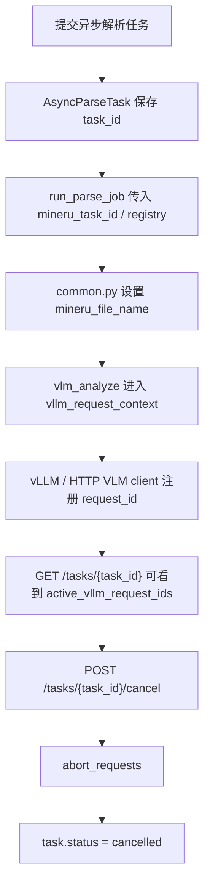
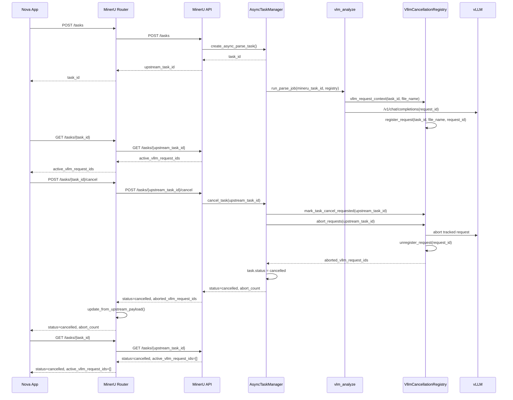
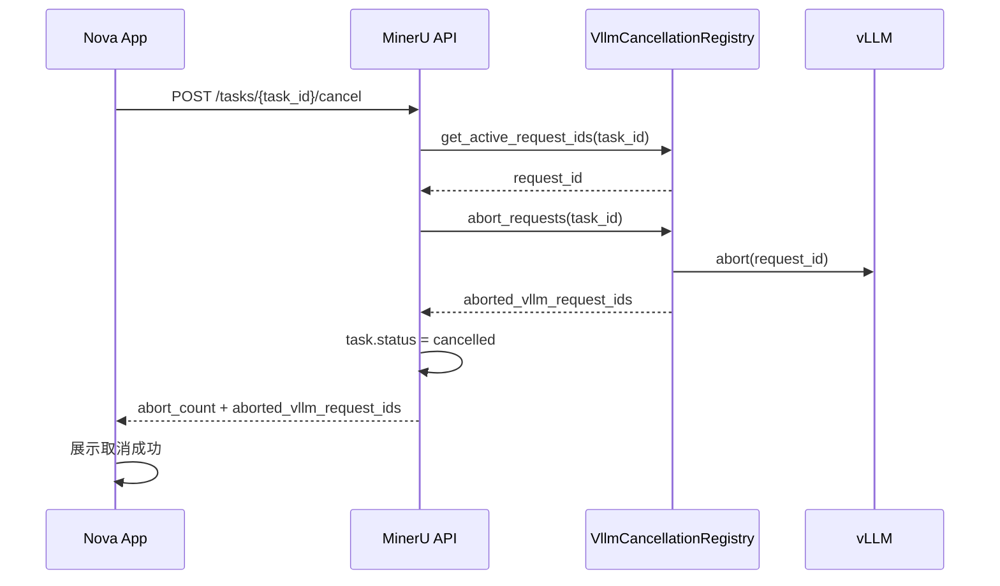

# MinerU 请求级取消实现说明

## 1. 已实现内容

当前代码已经实现 MinerU 解析任务的 HTTP 取消能力：



已实现接口：

| 接口 | 作用 |
| --- | --- |
| `POST /tasks/{task_id}/cancel` | 取消整个解析任务 |
| `POST /tasks/{task_id}/files/{file_name}/cancel` | 按文件名筛选当前 active vLLM request 后取消 |
| `GET /tasks/{task_id}` | 返回 task 状态、取消状态、active vLLM request_id |

取消响应会返回：

```json
{
  "task_id": "xxx",
  "status": "cancelled",
  "message": "Task cancellation requested",
  "abort_count": 1,
  "aborted_vllm_request_ids": ["mineru-taskxxx-abc123"],
  "active_vllm_request_ids": []
}
```

状态查询会返回：

```json
{
  "cancel_requested": true,
  "cancel_requested_at": "2026-06-26T09:00:00+00:00",
  "cancelled_at": "2026-06-26T09:00:01+00:00",
  "cancel_reason": "Task cancellation requested",
  "files": {
    "sample": {
      "cancel_requested": true,
      "active_vllm_request_ids": []
    }
  },
  "active_vllm_request_ids": []
}
```

## 2. 取消执行流程



`AsyncTaskManager.cancel_task()` 做了这些事：

1. 检查 task 是否存在。
2. 如果传了 `file_name`，检查文件是否属于该 task。
3. 标记 task 级或 file 级 cancel requested。
4. 查询并取消 active vLLM request。
5. 将 task 状态改成 `cancelled`。
6. 取消当前 task processor。
7. 返回 `abort_count` 和 `aborted_vllm_request_ids`。

## 3. 源码改动点

### 3.1 `mineru/cli/vllm_cancellation.py`

新增请求级取消注册表和日志工具。

主要实现：

| 对象 | 作用 |
| --- | --- |
| `VllmCancellationRegistry` | 保存 task/file/request_id 映射，提供取消和状态查询 |
| `vllm_request_context()` | 在解析某个 PDF 时设置当前 `task_id` 和 `file_name` |
| `patch_vllm_async_llm_for_cancellation()` | patch 内置 `AsyncLLM.generate()`，记录 vLLM request_id |
| `patch_http_vlm_client_for_cancellation()` | patch HTTP VLM client，注入 request_id 并记录本地请求 task |
| `HttpVllmRequestAbortHandle` | 取消 HTTP VLM client 本地等待中的 `asyncio.Task` |
| `print_cancel_event()` | 输出 `[MINERU_CANCEL]` 结构化日志 |

核心数据结构：

```python
self._requests: dict[str, RegisteredVllmRequest]
self._requests_by_task_file: dict[tuple[str, str], set[str]]
self._cancelled_files: set[tuple[str, str]]
self._cancelled_tasks: set[str]
```

核心取消方法：

```python
async def abort_requests(self, task_id: str, file_name: str | None = None) -> list[str]:
    request_ids = self.get_active_request_ids(task_id, file_name)
    ...
```

### 3.2 `mineru/cli/fast_api.py`

给异步解析任务增加取消状态、取消接口和取消执行逻辑。

主要改动：

| 位置 | 改动 |
| --- | --- |
| `AsyncParseTask` | 新增 `cancel_requested`、`cancel_requested_at`、`cancelled_at`、`cancel_reason` |
| `AsyncParseTask.to_status_payload()` | 状态响应返回取消字段 |
| `AsyncTaskManager.__init__()` | 初始化 `VllmCancellationRegistry` |
| `AsyncTaskManager.build_status_payload()` | 返回 `files[*].active_vllm_request_ids` 和 task 级 `active_vllm_request_ids` |
| `AsyncTaskManager.cancel_task()` | 实现 task/file 取消、abort vLLM request、取消 processor |
| `AsyncTaskManager._process_task()` | 已取消任务不再继续解析；取消后异常仍保持 `cancelled` |
| `AsyncTaskManager._run_task()` | 给 task 注入 `mineru_cancellation_registry` |
| `run_parse_job()` | 把 `mineru_task_id` 和 `mineru_cancellation_registry` 传入解析参数 |
| `build_cancel_response()` | 统一构造取消响应 |
| `cancel_async_task()` | 新增 `POST /tasks/{task_id}/cancel` |
| `cancel_async_task_file()` | 新增 `POST /tasks/{task_id}/files/{file_name}/cancel` |

取消状态写入：

```python
task.cancel_requested = True
task.cancel_requested_at = task.cancel_requested_at or now
task.cancel_reason = reason
task.status = TASK_CANCELLED
task.cancelled_at = now
task.completed_at = now
task.error = reason
```

### 3.3 `mineru/backend/vlm/vlm_analyze.py`

给 VLM 解析路径接入 request_id 跟踪。

主要改动：

| 位置 | 改动 |
| --- | --- |
| import | 引入 `patch_http_vlm_client_for_cancellation`、`patch_vllm_async_llm_for_cancellation`、`vllm_request_context` |
| `_get_model_async()` | 创建 `AsyncLLM` 后调用 `patch_vllm_async_llm_for_cancellation()` |
| `_get_model_async()` | `backend == "http-client"` 时 patch HTTP VLM client |
| `aio_doc_analyze()` | 从 `kwargs` 取 `mineru_task_id`、`mineru_file_name`、`mineru_cancellation_registry` |
| `aio_doc_analyze()` | 每个 processing window 调模型前进入 `vllm_request_context()` |

VLM window 内部的接入点：

```python
with vllm_request_context(
    mineru_cancellation_registry,
    mineru_task_id,
    mineru_file_name,
):
    async with aio_predictor_execution_guard(predictor):
        window_results = await predictor.aio_batch_two_step_extract(...)
```

### 3.4 `mineru/cli/common.py`

把当前 PDF 文件名传给 VLM 解析函数。

主要改动：

| 位置 | 改动 |
| --- | --- |
| `_process_vlm()` | 如果存在 `mineru_task_id`，设置 `doc_kwargs["mineru_file_name"] = pdf_file_name` |
| `_process_hybrid()` | 如果存在 `mineru_task_id`，设置 `doc_kwargs["mineru_file_name"] = pdf_file_name` |

这个改动让注册表可以建立：

```text
task_id -> file_name -> vllm_request_id
```

### 3.5 `mineru/cli/router.py`

给 router 层增加取消转发。

主要改动：

| 位置 | 改动 |
| --- | --- |
| `RouterTaskRecord` | 新增取消状态字段 |
| `RouterTaskRecord.to_status_payload()` | 返回取消字段 |
| `RouterTaskRegistry.update_from_upstream_payload()` | 从上游状态同步取消字段 |
| `cancel_router_task()` | 转发 task/file 取消请求到上游 MinerU API |
| `POST /tasks/{task_id}/cancel` | router task 取消入口 |
| `POST /tasks/{task_id}/files/{file_name}/cancel` | router file 取消入口 |

router 转发关系：

```text
router /tasks/{task_id}/cancel
  -> upstream /tasks/{upstream_task_id}/cancel
```

### 3.6 `mineru/cli/api_client.py`

给 client 侧增加取消调用。

主要改动：

| 对象 | 作用 |
| --- | --- |
| `CancelResponse` | 解析取消响应 |
| `parse_cancel_response_payload()` | 从 JSON 响应中提取取消字段 |
| `cancel_parse_task()` | async 取消接口 |
| `cancel_parse_task_sync()` | sync 取消接口 |

请求地址构造：

```python
if file_name is None:
    cancel_url = f"{base_url}{TASKS_ENDPOINT}/{task_id}/cancel"
else:
    cancel_url = f"{base_url}{TASKS_ENDPOINT}/{task_id}/files/{file_name}/cancel"
```

### 3.7 `tests/unittest/test_parse_cancel.py`

新增取消相关单测。

覆盖内容：

| 测试 | 覆盖点 |
| --- | --- |
| `test_cancel_pending_task_marks_cancelled_and_terminal` | pending task 取消后进入终态 |
| `test_cancel_processing_task_aborts_active_vllm_requests` | processing task 取消 active vLLM request |
| `test_cancelled_task_is_not_processed` | 已取消 task 不再解析 |
| `test_worker_error_after_cancel_stays_cancelled` | 取消后 worker 报错不覆盖 `cancelled` 状态 |
| `test_run_task_keeps_old_run_parse_job_wrapper_signature_compatible` | 兼容旧 `run_parse_job` wrapper |
| `test_http_vlm_client_patch_injects_and_tracks_request_id` | HTTP VLM client 注入和跟踪 request_id |
| `test_http_vlm_client_abort_cancels_local_request_task` | HTTP VLM client 取消本地请求 task |
| `test_status_payload_includes_cancellation_and_vllm_request_ids` | 状态响应包含 active request_id |
| `test_api_client_parses_cancel_response_payload` | client 正确解析取消响应 |

## 4. 当前实现链路



从 Nova App 到 MinerU 再到 vLLM 的时序：



取消闭环时序：



## 5. 当前日志

取消相关日志统一使用 `[MINERU_CANCEL]` 前缀。

```text
[MINERU_CANCEL] event=cancel_requested task_id=xxx file=*
[MINERU_CANCEL] event=cancel_summary task_id=xxx file=* status=cancelled abort_count=1 active_after=0
[MINERU_CANCEL] event=task_cancelled task_id=xxx status=cancelled error=Task cancellation requested
```

vLLM request 注册和取消日志：

```text
Registered VLLM request: mineru_task_id=xxx, file=sample, vllm_request_id=mineru-xxx
Aborted VLLM request: mineru_task_id=xxx, file=sample, vllm_request_id=mineru-xxx
Unregistered VLLM request: mineru_task_id=xxx, file=sample, vllm_request_id=mineru-xxx
```

## 6. 当前实现边界

| 项 | 当前代码行为 |
| --- | --- |
| `vllm-engine` | patch `AsyncLLM.generate()`，通过 registry 跟踪和 abort request |
| `http-client` | 注入 `request_id`，取消 MinerU 本地等待中的 HTTP task |
| `/v1/chat/completions` | request body 里会带 `request_id` |
| `/v1/responses/{id}/cancel` | 当前代码没有调用 |
| `pipeline` backend | task 状态可被标记为 `cancelled`，但不走 vLLM request_id |
| file 级取消 | 按 file_name 筛 active request_id，但 task 仍进入 `cancelled` 终态 |
