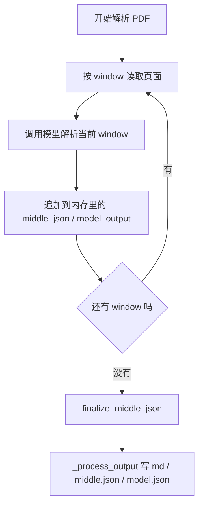
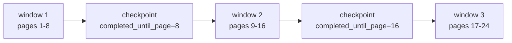
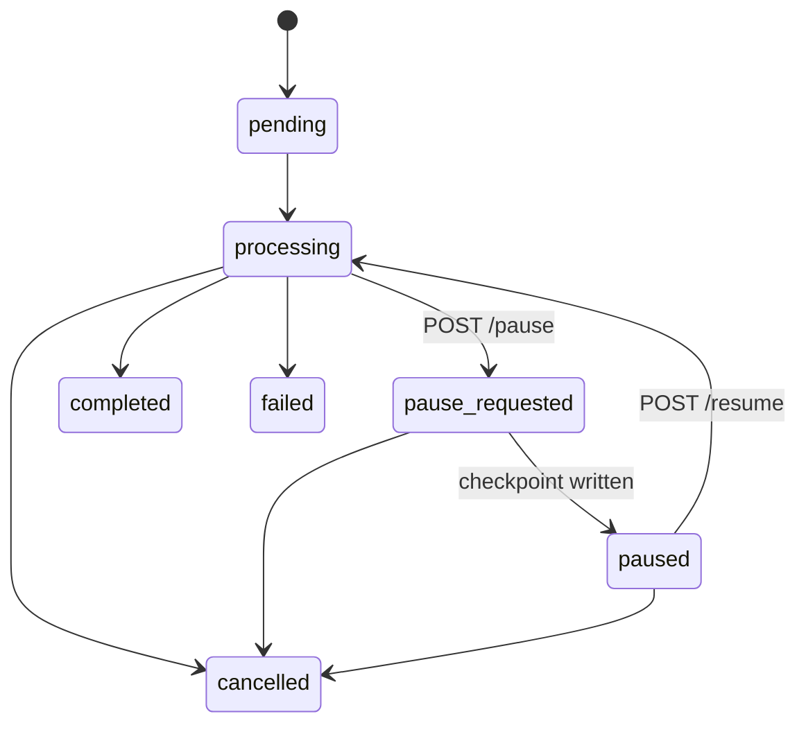
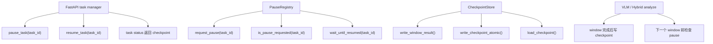
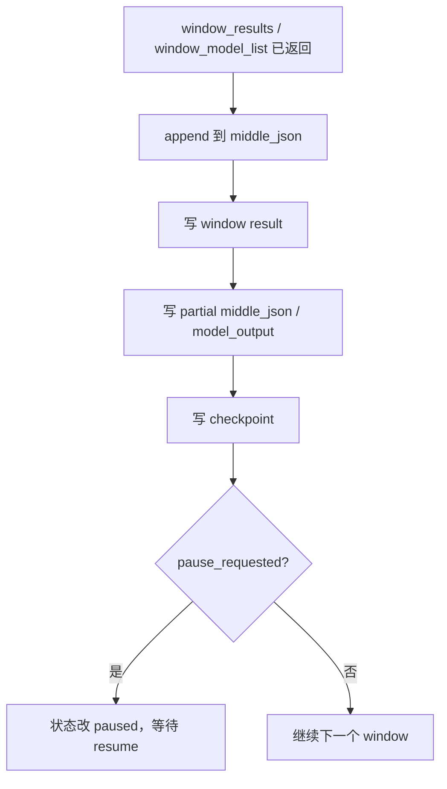
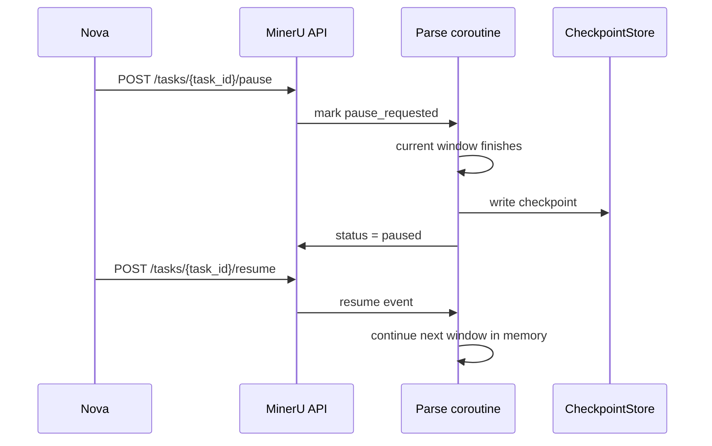
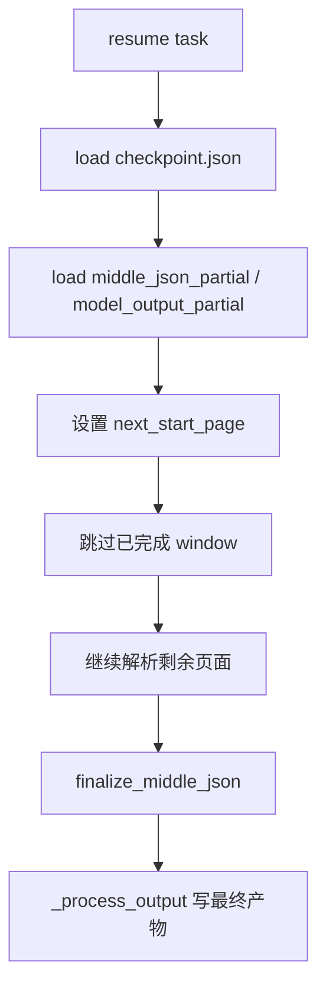
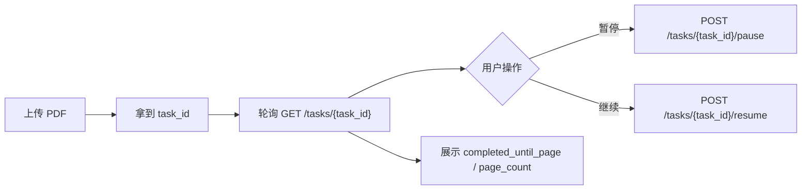
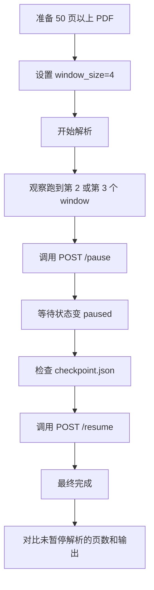
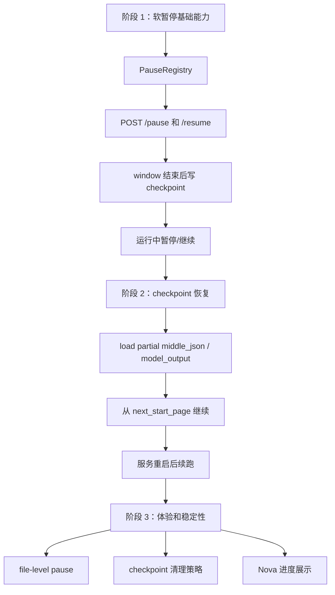

# MinerU 软暂停与继续解析检查点方案

> 目标：支持用户对一个正在解析的 PDF 做「暂停」和「继续」。  
> 当前判断：现有代码更适合先做软暂停。也就是等当前 processing window 跑完后保存检查点，然后停止提交后续页面；继续时从下一个 window 往后跑。

## 1. 先把边界说清楚

这次讨论的是软暂停，不是硬中断。


软暂停能做到：

- 不再继续解析后面的页面。
- 不再继续提交新的 vLLM 请求。
- Nova 可以看到任务停在第几页。
- 后续可以从检查点继续解析。

软暂停第一版不承诺：

- 不会立刻打断正在跑的 vLLM request。
- 不会立刻释放当前 request 已占用的 GPU 显存。
- 不保证服务重启后马上能续跑，除非补齐「从磁盘 checkpoint 恢复」。

如果目标是「立刻释放 GPU」，还是要走取消解析或 worker/process 级隔离。软暂停解决的是「当前小批次跑完后，别继续耗后面的 GPU/队列」。

## 2. 现状：现在为什么不能直接继续

当前 MinerU 的主要输出还是最终阶段落地。



代码上能看到几个稳定点：

| 模块 | 当前行为 | 对暂停/继续的影响 |
| --- | --- | --- |
| `mineru/backend/vlm/vlm_analyze.py` | `aio_doc_analyze()` 按 processing window 循环，window 完成后追加到 `middle_json` | 适合在 window 完成后写检查点 |
| `mineru/backend/hybrid/hybrid_analyze.py` | `aio_doc_analyze()` 也是按 processing window 循环，完成后追加到 `middle_json` / `model_list` | Hybrid 也能复用同一种检查点边界 |
| `mineru/cli/common.py` | `_process_output()` 在完整解析结束后写最终 `md` / `middle.json` / `model.json` | 不能只依赖最终输出做继续 |
| `mineru/cli/fast_api.py` | `create_task_output_dir(task_id)` 已有任务输出目录 | 检查点可以放在这个任务目录下 |

也就是说，现在真正缺的是「中间态落盘」。

## 3. 检查点应该按什么粒度保存

推荐第一版按 processing window 保存。



原因比较直接：

1. 现有 VLM / Hybrid 代码已经有 window 循环。
2. window 结束后已经拿到了本批页面的模型结果。
3. 这时 `middle_json` 已经追加过当前页面，状态比较完整。
4. 如果暂停，只需要在下一个 window 开始前停住。

默认可以继续沿用 `MINERU_PROCESSING_WINDOW_SIZE`。如果想让暂停更灵敏，可以把 window size 调小，例如 `4 / 8 / 16` 页。粒度越小，暂停响应越快；代价是 checkpoint 写入更频繁，整体调度开销也会多一点。

## 4. 检查点保存什么

检查点不要只保存一个页码。后续继续解析时，需要知道任务参数、已经完成的页面、下一次从哪里开始、以及中间产物在哪里。

建议结构：

```json
{
  "version": 1,
  "task_id": "task-xxx",
  "file_name": "example.pdf",
  "backend": "vlm-http-client",
  "parse_method": "auto",
  "status": "paused",
  "phase": "after_window_completed",
  "page_count": 128,
  "window_size": 8,
  "completed_windows": 3,
  "completed_until_page": 24,
  "next_start_page": 25,
  "updated_at": "2026-06-26T10:30:00+08:00",
  "artifacts": {
    "middle_json_partial": "pause_resume/middle_json_partial.json",
    "model_output_partial": "pause_resume/model_output_partial.json",
    "latest_window": "pause_resume/windows/window-0002.json"
  }
}
```

页面编号建议对外用 1-based，对内可以继续用现有代码里的 0-based。checkpoint 字段里要写清楚，例如：

- `completed_until_page=24` 表示前 24 页已经完成。
- `next_start_page=25` 表示继续时从第 25 页开始。

## 5. 文件放在哪里

复用 FastAPI 已有的任务输出目录。

```text
{output_root}/{task_id}/
  pause_resume/
    checkpoint.json
    middle_json_partial.json
    model_output_partial.json
    windows/
      window-0000.json
      window-0001.json
      window-0002.json
```

落盘规则：

1. 每个 window 完成后，先写 `windows/window-xxxx.json`。
2. 再写 `middle_json_partial.json` 和 `model_output_partial.json`。
3. 最后原子替换 `checkpoint.json`。

`checkpoint.json` 要最后写。这样即使写文件过程中进程退出，读取方也不会拿到一个指向不存在窗口文件的新 checkpoint。

## 6. API 设计

建议补三个接口：

```http
POST /tasks/{task_id}/pause
POST /tasks/{task_id}/resume
GET  /tasks/{task_id}
```

暂停响应：

```json
{
  "task_id": "task-xxx",
  "status": "pause_requested",
  "message": "pause requested, task will pause after current processing window"
}
```

真正暂停后的任务状态：

```json
{
  "task_id": "task-xxx",
  "status": "paused",
  "checkpoint": {
    "completed_until_page": 24,
    "next_start_page": 25,
    "page_count": 128
  }
}
```

继续响应：

```json
{
  "task_id": "task-xxx",
  "status": "processing",
  "resume_from_page": 25
}
```

## 7. 状态机



几个规则：

- `completed / failed / cancelled` 是终态，不能继续。
- `processing` 收到 pause 后先变成 `pause_requested`。
- 只有 window 完成、checkpoint 写完后，才变成 `paused`。
- `paused` 收到 resume 后继续跑后面的 window。

## 8. 代码改动点

第一版可以把改动控制在四类模块里。



### 8.1 PauseRegistry

职责是保存运行时暂停状态。

```python
class PauseRegistry:
    def request_pause(self, task_id: str) -> None: ...
    def is_pause_requested(self, task_id: str) -> bool: ...
    async def wait_until_resumed(self, task_id: str) -> None: ...
    def resume(self, task_id: str) -> None: ...
```

第一版可以只做内存态。服务不重启时，任务协程可以在 `paused` 状态挂起等待。

### 8.2 CheckpointStore

职责是把可继续解析的信息写到任务目录。

```python
class CheckpointStore:
    def write_window_result(self, task_id: str, window_index: int, data: dict) -> str: ...
    def write_partial_state(self, task_id: str, middle_json: dict, model_output: list) -> None: ...
    def write_checkpoint_atomic(self, task_id: str, checkpoint: dict) -> None: ...
    def load_checkpoint(self, task_id: str) -> dict | None: ...
```

写文件建议使用临时文件加 `os.replace()`，避免 checkpoint 写一半被读取。

### 8.3 VLM / Hybrid window hook

在每个 window 完成后加 hook：



这里有一个实现注意点：不要在每个 window 后都调用最终的 `finalize_middle_json()`。  
当前 finalize 更适合作为完整解析结束后的收尾动作。检查点里保存的是「未 finalize 的 partial middle_json」和「已完成 window 的 model output」。

## 9. 继续解析怎么做

建议分两版。

### V1：运行中暂停，运行中继续

这是最小可落地版本。



这个版本的特点：

- 改动小。
- 不需要反向重建 `middle_json`。
- 继续解析速度快，因为内存里的 `middle_json` / `model_output` 还在。
- checkpoint 已经落盘，但主要用于状态展示、问题排查和为 V2 铺路。

限制：

- MinerU 服务进程重启后，原协程没了，不能只靠 V1 继续。

### V2：从磁盘 checkpoint 恢复后继续

V2 才是完整的「通过检查点继续解析」。



V2 需要补的能力更多：

1. `aio_doc_analyze()` 支持传入 `resume_from_page`。
2. `aio_doc_analyze()` 支持传入已有的 `middle_json` 和 `model_output`。
3. window 循环从 `next_start_page - 1` 开始。
4. 最终解析结束后，把 partial 状态 finalize 成最终输出。
5. 如果 PDF 内容、解析参数、backend 变了，要拒绝复用旧 checkpoint。

第一版如果时间紧，可以先做 V1；但文档和数据结构要按 V2 预留字段。

## 10. Nova 接入方式

Nova 侧需要保存 MinerU 返回的 `task_id`。



UI 文案建议按状态显示：

| 状态 | 展示含义 |
| --- | --- |
| `processing` | 正在解析 |
| `pause_requested` | 等当前批次完成后暂停 |
| `paused` | 已暂停，可继续 |
| `completed` | 解析完成 |
| `cancelled` | 已取消 |
| `failed` | 解析失败 |

## 11. 日志建议

为了方便真实环境观测，关键位置都要打印结构化日志。

```text
[MINERU_PAUSE] request_pause task_id=xxx
[MINERU_PAUSE] checkpoint_written task_id=xxx file=example.pdf window=3 completed_until_page=24 next_start_page=25
[MINERU_PAUSE] paused task_id=xxx file=example.pdf
[MINERU_PAUSE] resume task_id=xxx resume_from_page=25
[MINERU_PAUSE] completed task_id=xxx checkpoint_windows=16
```

要重点看三件事：

1. 用户点暂停后，是否还有新的 window 被提交。
2. `checkpoint.json` 里的 `next_start_page` 是否正确。
3. 用户点继续后，是否从 `next_start_page` 往后跑，而不是从第一页重跑。

## 12. 验证方案

第一轮用长 PDF，把 window size 调小，例如 4 页。



验收点：

- `POST /pause` 后任务先进入 `pause_requested`。
- 当前 window 结束后进入 `paused`。
- `pause_resume/checkpoint.json` 存在。
- 暂停期间不再出现后续 window 的模型请求日志。
- `POST /resume` 后从 `next_start_page` 继续。
- 最终产物页数和正常完整解析一致。

V2 额外验收：

- 暂停后重启 MinerU 服务。
- 调用 resume 能从 checkpoint 恢复。
- 不重复解析已经完成的页面。
- PDF 或参数变化时拒绝恢复，并给出明确错误。

## 13. 风险和取舍

| 风险 | 说明 | 处理建议 |
| --- | --- | --- |
| 当前 window 不能立刻停 | 软暂停等 window 结束才停 | 调小 window size |
| partial middle_json 可能比较大 | 每个 window 都写全量 partial 会增加 IO | V1 可先接受，V2 再优化为 window 增量合并 |
| finalize 只适合最终阶段 | partial 状态不能随便 finalize | checkpoint 保存 raw partial |
| 多文件任务状态复杂 | 一个 task 里可能有多个 PDF | 第一版先 task-level pause；后续再做 file-level pause |
| Pipeline 路径差异 | pipeline 有自己的 streaming / batch 流程 | 第一版优先覆盖 VLM / Hybrid，再单独补 pipeline hook |

## 14. 推荐落地顺序



第一版最小改动建议：

1. 加 `PauseRegistry`。
2. 加 `CheckpointStore`。
3. FastAPI 加 `/tasks/{task_id}/pause` 和 `/tasks/{task_id}/resume`。
4. VLM / Hybrid 的 window 循环里加 checkpoint hook。
5. `GET /tasks/{task_id}` 返回 pause 状态和 checkpoint 摘要。
6. 日志统一打 `[MINERU_PAUSE]`。

## 15. 结论

软暂停可以做，比较稳的切入点是 processing window。

第一版先做到：

- 用户点暂停后，当前 window 跑完就停。
- 停下时写 checkpoint。
- 用户点继续后，从内存里的下一个 window 继续。
- Nova 能看到停在第几页。

第二版再做到：

- 服务重启后读取 checkpoint。
- 加载 partial `middle_json` / `model_output`。
- 从 `next_start_page` 跳过已完成页面继续。

这样分两步做，第一版能较快验证「暂停后不再继续耗后续 GPU/队列」，第二版再补齐「真正通过检查点跨进程继续解析」。
