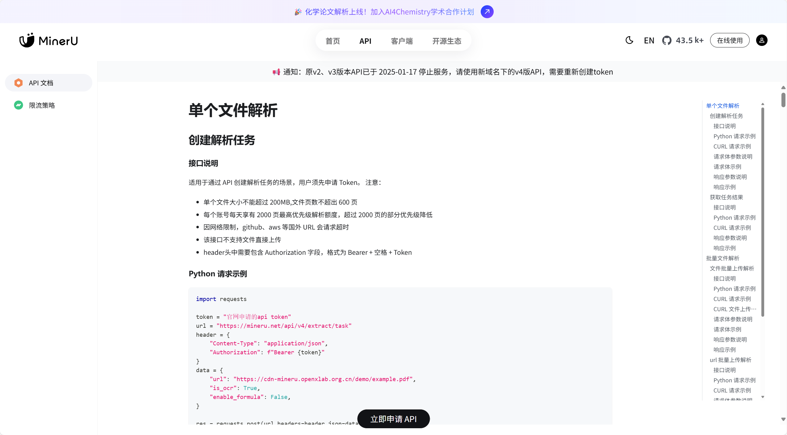

# **MinerU** **在线API** **快速开始指南**

## **申请调用权限** 

MinerU在线API目前处于试运行阶段，用户需提交申请并通过审批后方可使用。审批过程预计约 5 分钟，您可在申请页面刷新查看进度，或等待申请邮箱通知结果。

#### **填写申请表单**

- 请点击此处跳转 [MinerU 在线API使用申请页面](https://mineru.net/apiManage/docs)，点击页面下方「立即申请API」按钮并填写后，以便我们进行审核。

## **创建与管理** **API** **Token**

审批通过后，您即可在个人账户中创建用于调用接口的凭证。

#### **创建Token**

登录 MinerU 官网，进入 **`API`** 页面、点击 **`创建 API Token`** 按钮、为您的新Token输入一个易于识别的名称

#### **查看与管理Token**

- 创建成功后，Token密钥（一串加密字符）将会显示一次，请务必立即妥善复制保存。
- 您可以在API页面查看所有已创建的Token列表，包括其名称、权限、创建时间和过期时间。

#### **重要安全提示**

- ⏳ 为保证用户账号安全，目前所有在线 API Tokens 默认有效期为 14 天，请在过期前创建新的Token并更新您的应用程序配置。
- ℹ️ API当前处于试运行测试阶段，如有任何问题或疑问，欢迎通过运营渠道反馈。

## **调用API**

获得 Token 后，您就可以使用它来调用 MinerU API了。

- **API** 端点 (Endpoint): `https://api.mineru.com/v4/parse` (请注意：原v2、v3版本API已停用，请务必使用新域名下的v4版API)

- **认证方式**: 在HTTP请求头（Header）中携带您的Token。

  ```
  curl -X POST "https://api.mineru.com/v4/parse" \
  -H "Authorization: Bearer YOUR_API_TOKEN_HERE" \
  -F "file=@/path/to/your/document.pdf"
  ```

- 更详细的API参数说明、请求示例和返回格式，请参阅完整的 API接口文档。




## **内测阶段限流策略**

当前 MinerU API 处于内测运行阶段，为确保稳定服务体验，对用户执行以下限流策略：

* **上传限制**：单个文件大小不超过 **200 MB**，单个上传文件页数不超过 **600** 页。
* **解析页数限制**：每个账号每天不限解析页数，但需要遵守我们的优先级策略。每个用户享有 **2000 页最高优先级**解析额度，超过 2000 页的部分优先级将会降低（此额度在自然日内统计）。

---

!!! tip "温馨提示"

    * 内测期间，我们将根据系统负载情况动态调整限流规则，您可能会遇到限流的临时变更。
    * 请确保上传的文件符合规范，超出限制的请求将被系统自动拒绝。
    * 如果您的使用需求超出当前限额，欢迎联系我们的运营团队 [opendatalab@pjlab.org.cn](mailto:opendatalab@pjlab.org.cn)，协商适合的解决方案。