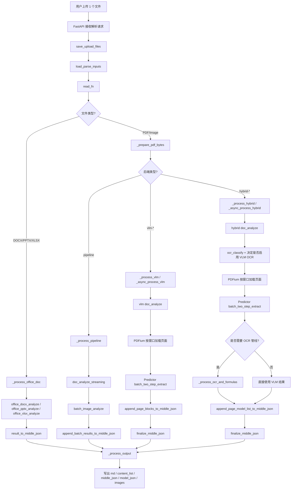
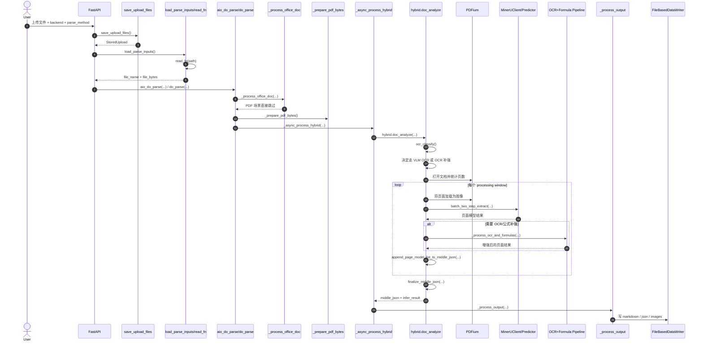

# MinerU 文件处理流程

## 概览

本文档说明 MinerU 处理单个输入文件时的完整流程，从请求入口到最终输出文件生成。

以下说明基于当前代码主链路：

- `mineru/cli/fast_api.py`
- `mineru/cli/common.py`
- `mineru/backend/pipeline/pipeline_analyze.py`
- `mineru/backend/vlm/vlm_analyze.py`
- `mineru/backend/hybrid/hybrid_analyze.py`
- `mineru/backend/office/*.py`

## 总体步骤

1. 客户端上传一个文件，并传入 `backend`、`parse_method`、`lang_list` 等参数。
2. FastAPI 将上传文件保存到任务目录，并规范化文件名。
3. MinerU 读取文件字节并识别输入类型。
4. 如果是 Office 文件，直接进入 office 解析链路。
5. 如果是 PDF 或图片，则统一规范为 PDF 字节流，并按页码范围做预处理。
6. MinerU 根据 `backend` 分发到对应后端：
   - `pipeline`
   - `vlm-*`
   - `hybrid-*`
7. 后端输出 `middle_json` 和模型结果。
8. MinerU 将中间结果渲染成 Markdown、content list、图片和 JSON 文件。

## 输入分流规则

### Office 文件

当输入是 `docx`、`pptx` 或 `xlsx` 时，MinerU 会先进入 `_process_office_doc()`，再根据后缀选择：

- `office_docx_analyze()`
- `office_pptx_analyze()`
- `office_xlsx_analyze()`

这些函数会先把二进制文件转换为解析结果，再将结果整理为 `middle_json`。

### PDF 与图片文件

如果输入本身就是 PDF，则直接保留原始 PDF 字节。

如果输入是 `png`、`jpg`、`webp` 等图片，MinerU 会先把图片包装成 PDF 字节，再复用后续统一的 PDF 解析流程。

## 主流程图

## 请求入口与文件落盘

请求进入 FastAPI 后，会完成以下工作：

- 校验请求参数
- 将上传文件保存到任务目录
- 规范化重复文件名 stem
- 通过 `read_fn()` 读取文件字节

在这个阶段：

- office 文件仍然保持 office 原始字节
- PDF 文件保持 PDF 字节
- 图片文件会先转换为 PDF 字节

## 各后端处理路径

### Pipeline 后端

`pipeline` 是传统的 OCR + layout 解析链路。

核心步骤：

1. 使用 PDFium 打开 PDF。
2. 根据 `parse_method` 判断是否需要 OCR。
3. 将页面按 processing window 分批。
4. 把页面渲染成图像。
5. 执行 `batch_image_analyze()`。
6. 将批处理结果追加到 `middle_json`。
7. 文档结束后执行 finalize，并触发输出生成。

这个后端更偏向通用兼容性和多语言 OCR。

### VLM 后端

`vlm-*` 后端使用视觉语言模型进行抽取。

核心步骤：

1. 初始化或复用 `MinerUClient` predictor。
2. 使用 PDFium 打开 PDF。
3. 按窗口读取页面。
4. 将页面转成 PIL 图像。
5. 执行 `predictor.batch_two_step_extract(...)`。
6. 将页面块写入 `middle_json`。
7. 执行 `finalize_middle_json()`。

这条链路完全走 VLM 结果。

### Hybrid 后端

`hybrid-*` 后端结合了 VLM 的版面理解能力，以及 OCR / 公式补强逻辑。

核心步骤：

1. 根据 `parse_method` 判断是否需要 OCR。
2. 判断当前场景下是否只用 VLM OCR 即可，还是还要走本地 OCR 管线。
3. 使用 PDFium 打开 PDF。
4. 按 processing window 逐批读取页面。
5. 执行 `predictor.batch_two_step_extract(...)`。
6. 如果 VLM OCR 不足，则补跑 `_process_ocr_and_formulas(...)`。
7. 将增强后的页面结果写入 `middle_json`。
8. 执行最终收尾。

这也是当前 MinerU 里最有代表性的 PDF 解析路径。

## 常见 PDF 路径的时序图

下面的时序图聚焦最常见场景：单个 PDF 文件走 `hybrid-auto-engine`。

## 输出阶段

后端分析结束后，MinerU 会调用 `_process_output()` 统一生成结果文件。

根据请求参数，可能输出：

- `{name}.md`
- `{name}_content_list.json`
- `{name}_content_list_v2.json`
- `{name}_middle.json`
- `{name}_model.json`
- `{name}_origin.pdf` 或原始 office 文件
- 提取出的图片
- 可选的布局调试 PDF，如 `layout.pdf`、`span.pdf`

## 实现细节说明

- `read_fn()` 会先把图片输入转换成 PDF 字节，再进入 PDF 处理链路。
- `_process_office_doc()` 会在 PDF 后端分发之前执行，并把 office 文件从 PDF 列表中移除。
- `_prepare_pdf_bytes()` 会借助 PDFium 完成页范围截取和 PDF 字节重写。
- `pipeline` 当前仍走自己的同步处理链路。
- `vlm` 和 `hybrid` 都支持异步处理版本。
- 最终渲染逻辑按后端区分：
  - pipeline 使用 `pipeline_union_make`
  - vlm 与 hybrid 使用 VLM 对应的内容渲染器
  - office 使用 `office_union_make`

## 相关源码入口

- `mineru/cli/fast_api.py`
- `mineru/cli/common.py`
- `mineru/backend/pipeline/pipeline_analyze.py`
- `mineru/backend/vlm/vlm_analyze.py`
- `mineru/backend/hybrid/hybrid_analyze.py`
- `mineru/backend/office/docx_analyze.py`
- `mineru/backend/office/pptx_analyze.py`
- `mineru/backend/office/xlsx_analyze.py`
