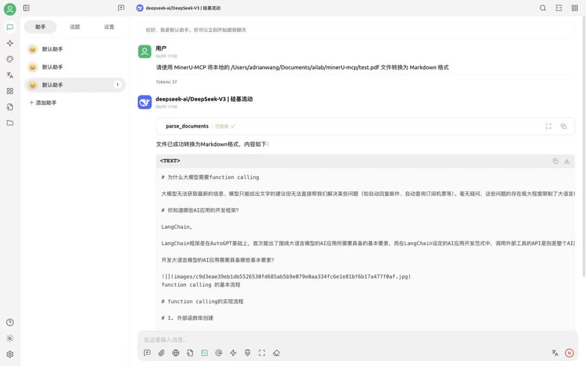

# Cherry Studio 简介

Cherry Studio 是一款功能强大的多模型 AI 客户端软件，支持 Windows、macOS 和 Linux 等多平台运行，集成了 OpenAI、DeepSeek、Gemini、Anthropic 等主流 AI 云服务，同时支持本地模型运行，用户可以灵活切换不同的AI模型。

目前，MinerU 强大的文档解析能力已深度集成到 Cherry Studio 的知识库与对话交互中，为用户带来更便捷的文档处理与信息获取体验。


- Cherry Studio 官网地址：https://www.cherry-ai.com/


# MinerU 在 Cherry Studio 中的使用方法

## 进入 Cherry Studio 设置

a. 打开 Cherry Studio 应用程序

b. 点击左下角的"设置"按钮，进入设置页面

c. 在左侧菜单中，选择"MCP 服务器"

在右侧的 MCP 服务器配置界面中，您可以看到已有的 MCP 服务器列表。点击右上角的"添加服务器"按钮来创建新的 MCP 服务，或者点击现有服务来编辑配置。

## 添加 MinerU-MCP 配置

点击"添加服务器"后，您将看到一个配置表单。请按以下步骤填写：

**a. 名称**：输入"MinerU-MCP"或您喜欢的其他名称

**b. 描述**：可选，如"文档转换为Markdown工具"

**c. 类型**：选择"标准输入/输出（stdio）"

**d. 命令**：输入 uvx

**e. 参数**：输入 mineru-mcp

**f. 环境变量**：添加以下环境变量

```Plain
MINERU_API_BASE=https://mineru.net
MINERU_API_KEY=您的API密钥
OUTPUT_DIR=./downloads
USE_LOCAL_API=false
LOCAL_MINERU_API_BASE=http://localhost:8888
```

使用 *`uvx`* 命令可以自动处理 mineru-mcp 的安装和运行，**无需预先手动安装 mineru-mcp 包**。这是最简单的配置方式。

## 保存配置

确认无误后，点击界面右上角的"保存"按钮完成配置。保存后，MCP 服务器列表中会显示您刚刚添加的 MinerU-MCP 服务。


## 使用 Cherry Studio 中的 MinerU MCP

一旦配置完成，您可以在 Cherry Studio 中的对话中使用 MinerU MCP 工具。在 Cherry Studio 中，您可以使用如下提示让模型调用 MinerU MCP 工具。模型会自动识别任务并调用相应的工具。

## 示例 1: 使用 URL 转换文档

**用户输入:**

```Plain
请使用 MinerU MCP 将以下 URL 的 PDF 文档转换为 Markdown 格式：https://example.com/sample.pdf
```

**模型将执行的步骤：**

模型识别这是文档转换任务，并调用 *`parse_documents`* 工具，参数为:

```Plain
{"file_sources": "https://example.com/sample.pdf"}
```

工具处理完成后，模型会告知您转换结果。


## 示例 2: 转换本地文档

**用户输入:**

```Plain
请使用 MinerU-MCP 将本地的 D://sample.pdf 文件转换为 Markdown 格式
```

**模型将执行的步骤：**

模型识别这是本地文档转换任务，调用 `parse_documents` 工具，参数为:

```Plain
{"file_sources": "D://sample.pdf"}
```



## 示例 3: 启用 OCR 处理扫描文档

**用户输入:**

```Plain
请使用 MinerU-MCP 将以下 URL 的扫描版 PDF 文档转换为 Markdown 格式，并启用 OCR 功能：
https://example.com/scanned.pdf
```

**模型将执行的步骤：** 

模型识别这是需要 OCR 处理的文档转换任务，调用 `parse_documents` 工具，并启用 OCR 参数:

```Plain
{"file_sources": "https://example.com/scanned.pdf","enable_ocr": true}
```


## 示例 4: 完整对话流程

以下是一个完整的对话流程示例：

**用户:**

```Plain
我有一份学术论文的 PDF，网址是 https://arxiv.org/pdf/2303.08774.pdf，能帮我转换成 Markdown 格式吗？
```

**模型:**

```Plain
我可以帮您将这份学术论文转换为 Markdown 格式。我将使用 MinerU-MCP 工具来处理这个任务。
[模型调用 parse_documents 工具，处理过程中...]
论文已成功转换为 Markdown 格式。转换结果如下：
# The Capacity of Diffusion Models to Memorize and Generate Training Data
## Abstract
Recent diffusion models can generate high-quality images that are nearly indistinguishable from real ones...
[显示论文内容...]
```


## 工具参数详解

在使用过程中，模型会根据您的指令自动选择合适的工具和参数。以下是主要工具的参数说明：

### ● *parse_documents* 工具参数


### ● *get_ocr_languages* 工具参数

无需参数，用于获取OCR支持的语言列表。

## 高级用法

###  指定语言和页码范围

**用户输入:**

```Plain
请使用 MinerU MCP 将以下 URL 的文档转换为 Markdown 格式，只处理第 5-10 页，并指定语言为中文：https://example.com/document.pdf
```

模型会使用 *`parse_documents`* 工具，并设置 *`language`* 参数为 "ch"，*`page_ranges`* 参数为 "5-10"。

### 批量处理多个文档

**用户输入:**

```Plain
请使用 MinerU-MCP 将以下多个 URL 的文档转换为 Markdown 格式：
https://example.com/doc1.pdf
https://example.com/doc2.pdf
https://example.com/doc3.pdf
```

模型会调用 *`parse_documents`* 工具，并将多个 URL 以逗号分隔传入 *`file_sources`* 参数。

## 注意事项

● 当设置 *`USE_LOCAL_API=true`* 时，使用本地配置的API进行解析

● 当设置 *`USE_LOCAL_API=false`* 时，会使用 MinerU 官网的API进行解析

● 处理大型文档可能需要较长时间，请耐心等待

● 如果遇到超时问题，请考虑分批处理文档或使用本地API模式

## 常见问题与解决方案

### 无法启动 MCP 服务

**问题**：运行 *`uv run -m mineru.cli`*` `时报错。

**解决方案**：

● 确保已激活虚拟环境

● 检查是否已安装所有依赖

● 尝试使用 *`python -m mineru.cli`*` `命令替代

### 文件转换失败

**问题**：文件上传成功但转换失败。

**解决方案**：

● 检查文件格式是否受支持

● 确认API密钥是否正确

● 查看MCP服务日志获取详细错误信息

### 文件路径问题

**问题**：使用 `parse_documents` 工具处理本地文件时报找不到文件错误。

**解决方案**：请确保使用绝对路径，或者相对于服务器运行目录的正确相对路径。

### MCP 服务调用超时问题

**问题**：调用 *`parse_documents`* 工具时出现 *`Error calling tool 'parse_documents': MCP error -32001: Request timed out`* 错误。

**解决方案**：这个问题常见于处理大型文档或网络不稳定的情况。在某些 MCP 客户端（如 Cursor）中，超时后可能导致无法再次调用 MCP 服务，需要重启客户端。最新版本的 Cursor 中可能会显示正在调用 MCP，但实际上没有真正调用成功。建议：

**● 等待官方修复**：这是Cursor客户端的已知问题，建议等待Cursor官方修复

**● 处理小文件**：尽量只处理少量小文件，避免处理大型文档导致超时

**● 分批处理**：将多个文件分成多次请求处理，每次只处理一两个文件

● 增加超时时间设置（如果客户端支持）

● 对于超时后无法再次调用的问题，需要重启 MCP 客户端

● 如果反复出现超时，请检查网络连接或考虑使用本地 API 模式