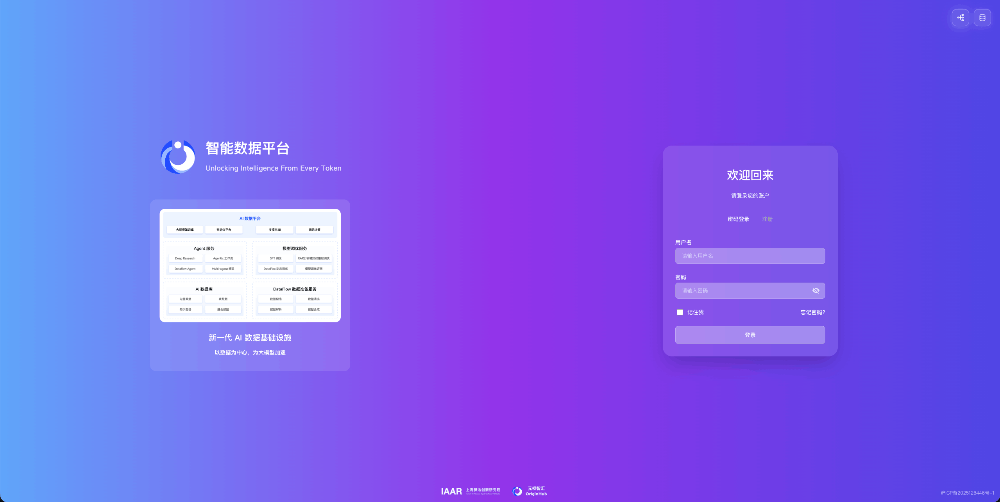

# 元枢智汇 ADP 智能数据平台 简介

元枢智汇 ADP 智能数据平台基于自研 AI 数据库和 DataFlow数据准备框架打造，旨在帮助企业高效管理、检索、处理海量数据，并通过体系化、自动化数据治理降低模型/智能体训练的专业门槛，帮助企业结合业务场景发挥私有数据的价值，真正落地AI应用。

目前，MinerU 已深度集成于元枢智汇 ADP 智能数据平台的 DataFlow 模块中，其数据解析服务由文档语料提取引擎 MinerU 提供支持。

- 官网地址：https://adp.originhub.tech/agent
- Miner fastGPT 插件下载地址：https://cloud.fastgpt.io/dashboard/systemPlugin?type=productivity