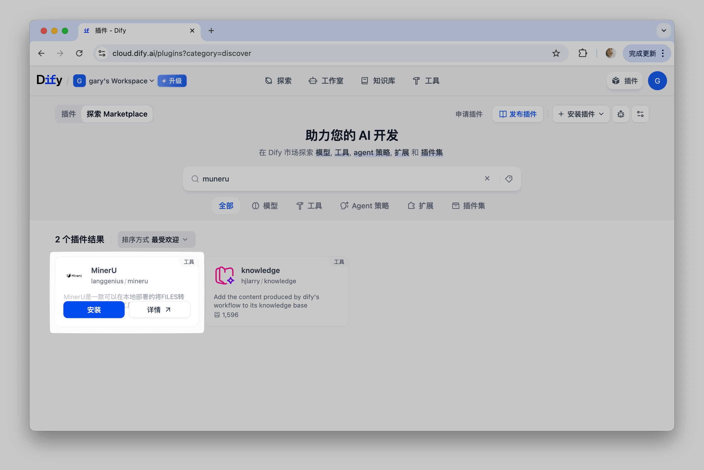
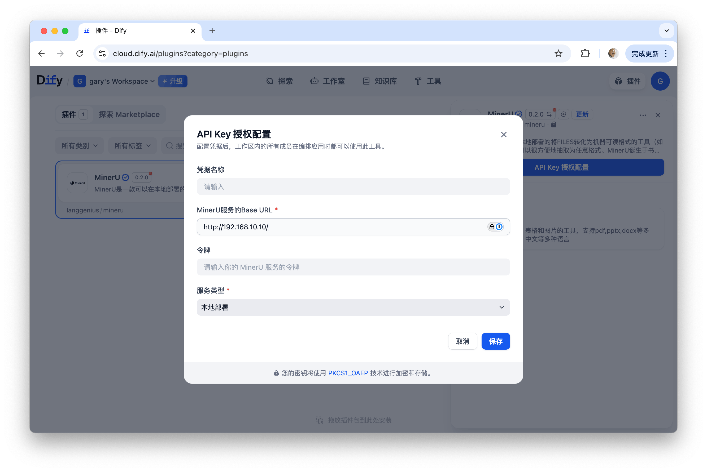
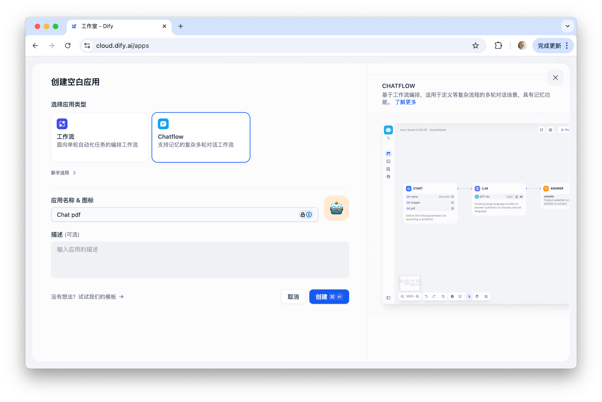
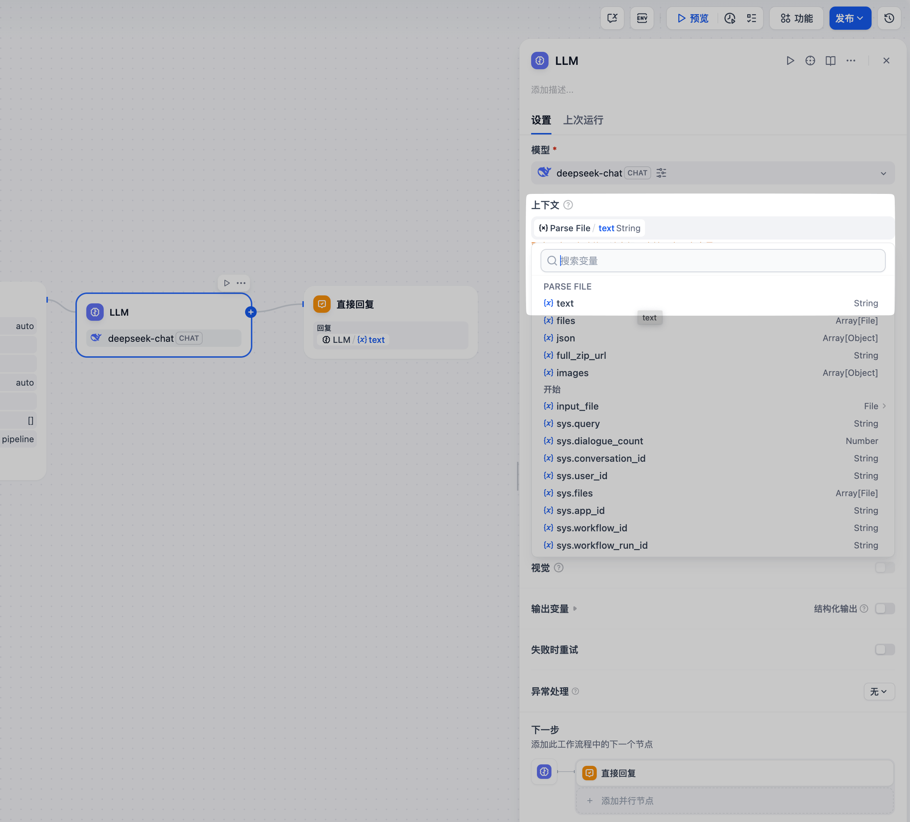
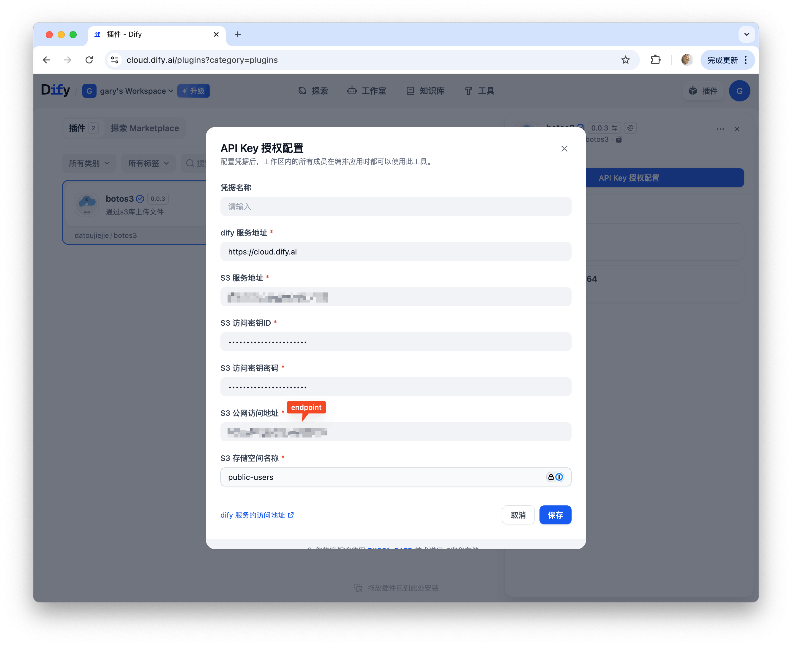
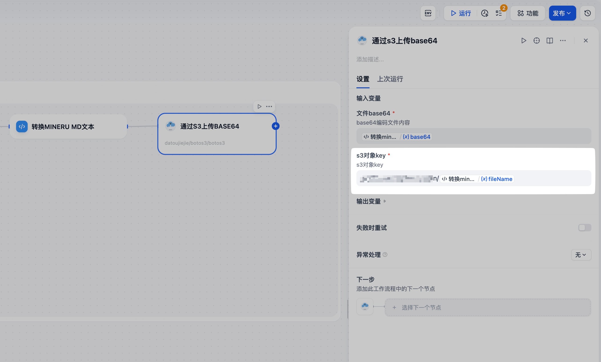
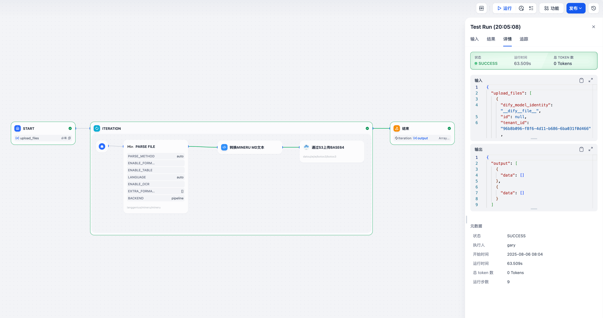

# Dify 简介

**Dify** 是一个开源的大语言模型（LLM）应用开发平台，旨在简化和加速生成式 AI 应用的创建和部署。它结合了后端即服务（BaaS）和 LLMOps 的理念，为开发者提供了用户友好的界面和强大的工具，有效降低了 AI 应用开发的门槛。

目前 MinerU 与 Dify 联合研发的 MinerU 插件已在 Dify 市场上架，帮助用户搭建工作流，提供文档解析的工作。

- Dify 官网地址：https://dify.ai/zh
- MinerU Dify 插件下载地址：https://marketplace.dify.ai/plugins/langgenius/mineru

# MinerU 在 Dify 中的使用方法

## 一、**新版MinerU Dify插件亮点 (v0.4.0)**

- **完美适配MinerU2**：全面兼容MinerU2的最新功能，释放顶尖的文档解析能力。
- **超高灵活性**：同时支持官方在线API和本地化部署的API（并向下兼容 1.x 版本）。
- **赋能工作流**：让Dify的Agent拥有强大的文档“读写”能力，轻松处理复杂任务。

## **二、实战演练：两个案例带你快速上手**

空谈不如实战。下面我们通过两个典型场景，向你展示新版插件的强大之处。

### 准备

1. 在Dify插件页面安装MinerU插件（私有化部署的Dify同理）

2. 填写API URL等信息

使用官方API时令牌（Token）必须提供👆，使用本地部署API时令牌可不填写👇

### **案例一：解析单文件，搭建Chat PDF应用**

想借助AI与你的文档对话吗？跟着下面几步，轻松实现

#### 第一步：创建空白应用，选择“Chatflow”

输入应用名称与描述

#### 第二步：创建的初始模板中，选择“开始”节点

字段类型选为单文件，填写变量名称（此处填为input_file）,支持文档类型选为文档与图片

#### 第三步：添加工具节点——MinerU插件来解析上一步开始节点上传的文件

#### 第四步：设置MinerU的输入变量，选择上一步开始节点添加的 `input_file`

#### 第五步：配置LLM模型

选择“LLM”节点后，如果没有模型可用，需要单独在插件市场安装（这里使用 Deepseek作为示例）

“上下文”选择MinerU的输出变量 `text`（MinerU解析文档后的markdown格式）

在“SYSTEM”区域根据实际需求填写提示词，可如图填写“在Parse File `text`中提取用户的问题答案”

#### 第六步：预览，上传文件并提问机器人关于文档的内容

至此一个简单的文档问答应用Chat PDF搭建完成，点击“预览”，查看效果如何👇

结果如下：

#### **第七步：发布与测试**

保存并发布你的应用。现在，上传一份PDF或图片，你就可以和它自由对话了！

### **案例二：自动化批量处理文档，并上传至云端S3**

需要处理大量文档并归档？MinerU 插件同样能胜任

#### 第一步：安装 botos3 插件

#### 第二步：配置 S3 bucket

#### 第三步：创建工作流

选择字段类型为“文件列表”，填写变量名称（此处填为input_files）,支持的文档类型选为文档与图片

#### 第四步：添加“迭代”

在“开始”节点后添加“迭代”，并配置迭代内的MinerU节点,设置迭代的输入为上一步开始节点的`upload_files`，输出节点暂时不填写，再整个迭代配置完成后选择MinerU节点Parse File的`full_zip_url`

将MinerU的输入参数file选择为迭代器的 `item`

#### 第五步：增加中间节点“代码执行”来转换MinerU的解析结果

**输入变量(变量名称需与代码定义一致)**

- **text：**选择MinerU Parse File的输出变量`text`
- **uploadFiles：**选择“开始”节点的文件列表`upload_files`，用来根据迭代的index索引下标找到对应的原始文件名
- **index：**迭代的下标索引，选择迭代器的`index`

**输出变量(变量名称需与代码定义一致)**

- **fileName：**String
- **base64：**String

代码选择JavaScript，编写转换代码：

暂时无法在飞书文档外展示此内容

以下为Python版本：

暂时无法在飞书文档外展示此内容

#### 第六步：配置 Botos3 插件来上传内容

添加工具节点Botos3，选择“通过s3上传base64”

文件base64选择代码执行（图中为**转换MINERU MD文本**）输出的base64字段

S3对象key，S3 对象key填写文件存储的路径，在 botos3 插件配置界面已经填写了 bucket 名称，这里只需要填写在bucket下存储的目录即可。选择代码执行**（图中为转换MINERU MD文本）**的`fileName`

#### 第七步：预览效果

连接结束节点，至此，一个简单的上传到s3的工作流配置完成，点击“运行”看看效果👇：

#### 第八步：Vis3查看文档

运行结束，可通过[vis3](https://github.com/opendatalab/Vis3?tab=readme-ov-file#features)来查看S3桶内是否已上传解析后的md文件，Vis3使用可参考

[新工具开源！Vis3大模型数据可视化利器：填 AK/SK 直接预览 S3 数据，JSON/视频/图片秒开！本地文件也可用](https://mp.weixin.qq.com/s/p3rH4EaoJB-AK7RWeDvOhg)

