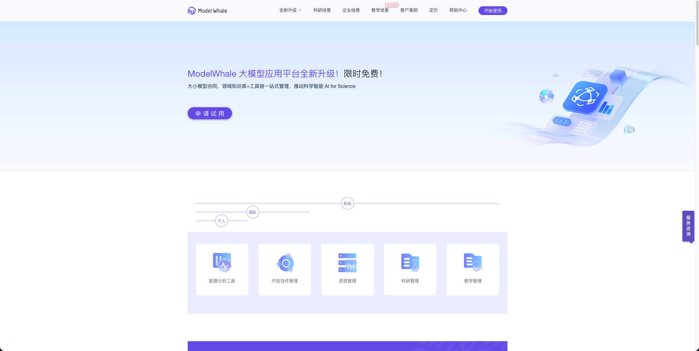

# ModelWhale 简介

ModelWhale是一款高效率的数据科学云端协作工具，为数据工作者提供了即开即用的云端分析环境，Jupyter Notebook 交互式和Canvas 拖拽式两种分析界面，帮助科研者、教育工作者解决底层工程繁复、数据难以安全应用、成果流转复现困难等问题。基于不同使用场景，ModelWhale 为用户提供三个产品版本，分别是基础版、专业版、团队版。

目前，MinerU 插件已在 ModelWhale 工作中，通过其强大的文档解析能力，为用户搭建智能体与工作流提供文档解析能力，加快用户 AI 应用的开发。

images/DingTalk_01.png

- ModelWhale 官网：Mohttps://www.modelwhale.com/pricing?scroll=1
- MinerU 在ModelWhale 的使用地址：https://www.heywhale.com/org/7b38d/workspace/iframe?url=https://www.heywhale.com/api/model/services/68089d360b1519a862ccb9b4/app/
