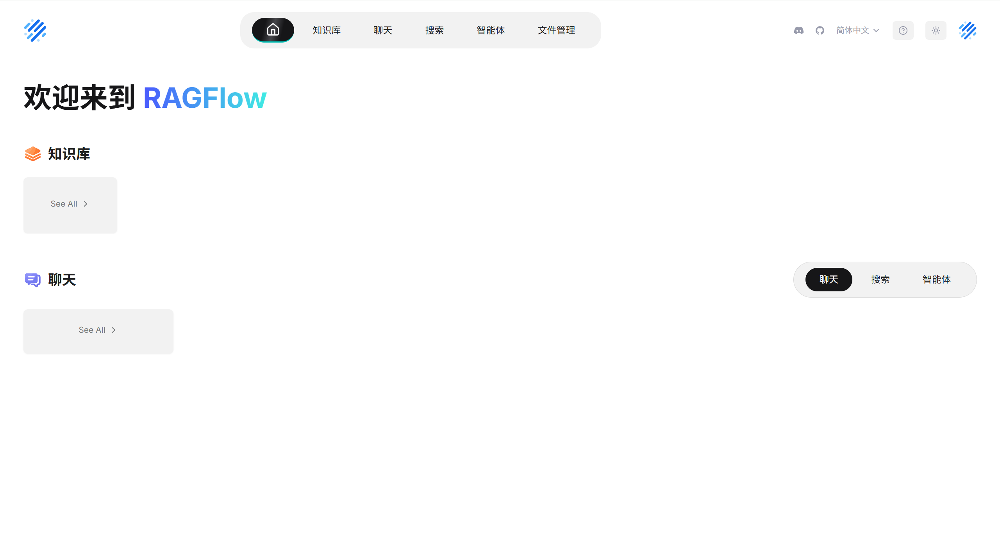
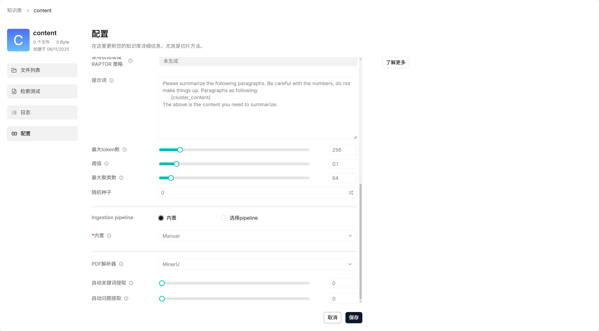

## RAGFlow

RAGFlow 是一款开源 RAG（Retrieval-Augmented Generation）引擎与应用平台，深度融合了深度文档理解、自动化 RAG 工作流与大模型调用，打通了复杂数据处理、知识检索、增强生成的全流程，旨在为企业及开发者提供一站式智能问答开发服务，并支持各类复杂场景下大模型的构建与应用落地。

目前，MinerU 已深度集成至 RAGFlow 知识库在线版本，作为内置 PDF 文档解析器，为用户知识库搭建提供专业、可靠的文档解析支持。本地部署版本部署使用方式详见下方使用教程。

使用可访问：https://demo.ragflow.io/



## 使用教程：如何在 RAGFlow 中使用 MinerU

### 一、安装配置

首先，我们建议您通过 docker 的形式在本地部署 RagFlow 以方便使用 MinerU 插件作为解析工具。在安装完 RagFlow 后执行：

1. **版本检查：**

   确保你的RAGFlow版本 >= `v0.21.1`。

2. **更新 .env 文件：**

   为了确保服务能被平稳修改，建议先在 `cmd` 运行 `docker compose down` 停掉服务。

   打开 `.env` 文件，在文件的末尾，添加这两行代码，保存文件。

   ```Python
   HF_ENDPOINT=https://hf-mirror.com
   MINERU_EXECUTABLE=/ragflow/uv_tools/.venv/bin/mineru
   ```

3. **启动并进入容器：**

   在 `cmd` 中，重新启动服务：`docker compose up -d`

   等待服务全部 `Running` 或 `Healthy` 后，运行以下命令进入RAGFlow的核心容器：

   ```Bash
   docker compose exec ragflow-cpu bash
   ```

   （你的命令行提示符会从 `C:\...>` 变为 `root@...`）

4. **在容器内下载 MinerU 模型：**

    在容器内部，依次运行以下 5 条命令

   ```Bash
   mkdir uv_tools
   cd uv_tools
   uv venv .venv
   source .venv/bin/activate
   uv pip install -U "mineru[core]" -i https://mirrors.aliyun.com/pypi/simple
   ```

5. **退出并重启：**

   安装完成后，输入 `exit` 并按回车。

   运行重启命令，让 RAGFlow 加载刚装好的 MinerU

   ```Bash
   docker compose restart ragflow-cpu
   ```

### 二、使用入口

在本地部署完毕后，要启用 MinerU，您需要在进入 RagFlow 特定知识库的配置页面并选择 MinerU 作为默认的 PDF 解析器。（注：RagFlow 在线版中已经内置了 MinerU 插件为您提供了高级的 PDF 文件解析能力，使用方式与此一致。）

**入口和配置步骤：**

1. **进入知识库配置：**
   1. 首先，在您的知识库管理界面，选择您需要配置的特定知识库（例如图示中的 "content" 知识库）。
   2. 在知识库详情页面的左侧导航栏中，点击【**配置**】选项卡。
2. **定位 PDF 解析器设置：**
   1. 向下滚动页面，找到“**Ingestion pipeline**”（摄取管道）设置部分。
   2. 在此部分中，您会看到一个名为【**PDF解析器**】（PDF Parser）的选项。
3. **选择 MinerU：**
   1. 点击【PDF解析器】旁边的下拉菜单。
   2. 从可用选项中，选择【**MinerU**】。
4. **保存修改：**
   1. 完成选择后，请务必点击页面底部的【**保存**】按钮，以使更改生效。

