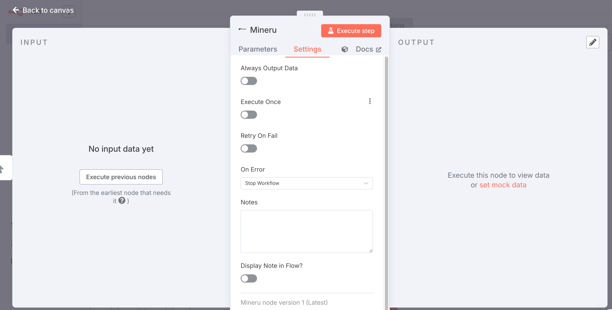
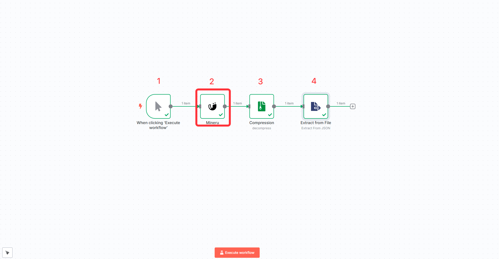

# n8n 简介

**n8n** 是一款以低代码（Low-code）、工作流自动化为核心的应用开发平台，许多企业都借助于其灵活的节点（Node）配置，实现业务流程的自动化执行。它通过可视化界面和代码扩展能力，帮助用户连接各种应用程序和服务，构建复杂的自动化流程,降低用户使用门槛。

目前，MinerU 已将其强大的文档解析能力封装为 n8n 节点，用户在搭建工作流时，可以更加便捷地处理复杂的文档解析任务。

- n8n 官网地址：https://n8n.io/
- MinerU n8n 插件下载地址：https://www.npmjs.com/package/n8n-nodes-mineru

# MinerU 在 n8n 中的使用方法

## step1 进入社区node安装界面

## step2 安装 n8n-nodes-mineru 节点

≈assets/images/n8n_2.png)

## step3 新建工作流，添加 n8n-nodes-mineru 节点，并设置 api key

### n8n使用节点文档

https://www.npmjs.com/package/n8n-nodes-mineru

### **在工作流内集成解压功能**

#### 导入 json 模板

暂时无法在飞书文档外展示此内容

### 配置 凭证和文档url

### 根据各自的需求配置所需的输出

### 调试

