# 网页端/桌面客户端

## 启动与访问

### 网页端 (Web)
   - 访问 MinerU 官方网站。
   - 无需安装，使用邮箱或第三方账号登录即可开始使用。
### 桌面客户端 (Desktop App)
   - 从官网下载并安装适用于您操作系统（Windows/macOS/Linux）的客户端。
   - 启动桌面客户端无需登录，可获得更稳定的上传/解析体验和文件管理功能，截图上传等功能

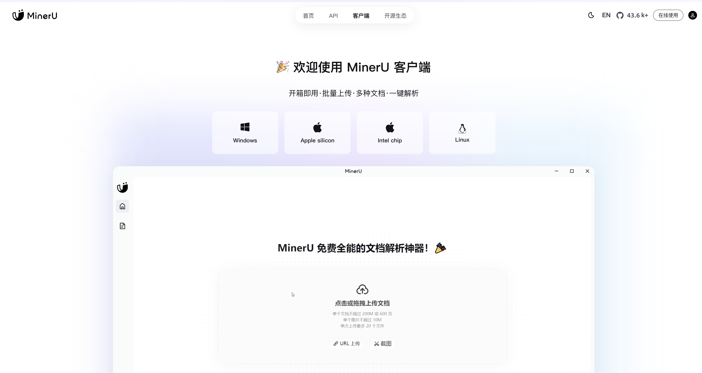

## 新建解析任务

### 上传文件
   - 方式一：本地上传
      - 点击界面上的 `本地上传` 或 `点击或拖拽上传` 区域。
      - 从电脑中选择文件或将文件直接拖拽至该区域即可。
   - 方式二：URL上传
      - 点击 `URL上传` 标签。
      - 输入包含文档的网页链接，系统将自动抓取并解析内容。
   - 方式三：截图上传 (客户端专属)
      - 在桌面客户端使用截图功能。
      - 截取包含文字、公式或表格的区域，系统将自动识别并创建解析任务

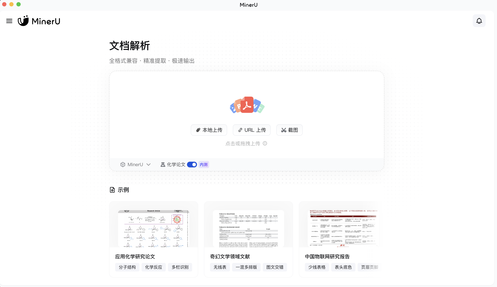

### 支持格式与限制
   -  支持格式：PDF, Word (.docx), PowerPoint (.pptx), 图片 (.jpg, .png 等)。
   -  数量限制：单次最多可上传 20个 文件。
   -  大小限制：
      - 单个文档：不超过 200MB 或 600页。
      - 单个图片：不超过 20MB。
      - 化学论文专项限额：针对化学论文的分子结构与反应式提取功能，享有50页免费额度。如需更多，可通过页面提示申请额外额度

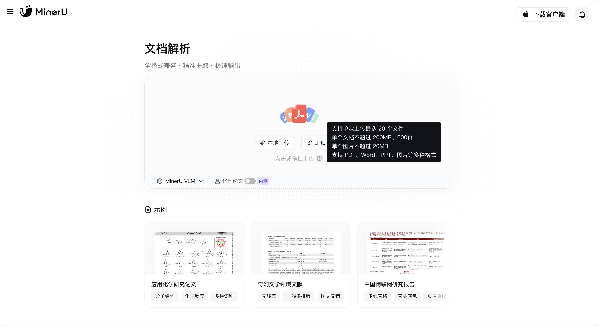

### 模型选择 (根据您的任务需求)
   -  `MinerU` (多模型Pipeline解析)：通用场景首选，端到端无幻觉输出，综合性能均衡。
   -  `MinerU VLM` (多模态高精度解析)：针对复杂公式、表格等场景优化，解析精度更高。
   -  `化学论文` (专项功能开启)：若上传文档为化学论文，请务必勾选此选项，以精准提取分子结构和化学反应式。

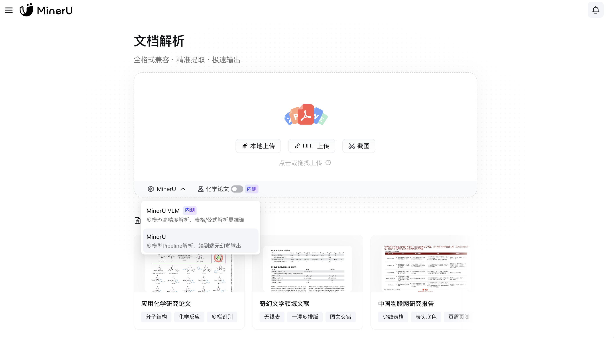

## 预览与导出

解析完成后，您可以在线预览结果，并进行以下操作：

### 核心操作
   -  `复制`：快速复制选中内容或整个解析结果。
   -  `下载`：将解析结果导出到本地。
   -  `收藏`：一键收藏整篇文档或选中的文本、图表、公式，支持无限空间，便于后续秒速溯源和查找。
   -  `解析反馈`：如果对结果不满意，可以提交反馈，帮助模型优化。

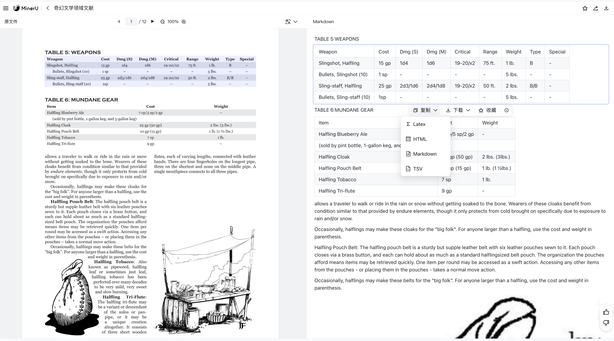

### 智能翻译 (免费 + 支持自配API)
   -  全文翻译：一键翻译文档。(需配置商用API)
   -  模块翻译：针对特定的图表、段落等模块进行翻译。(免费使用)

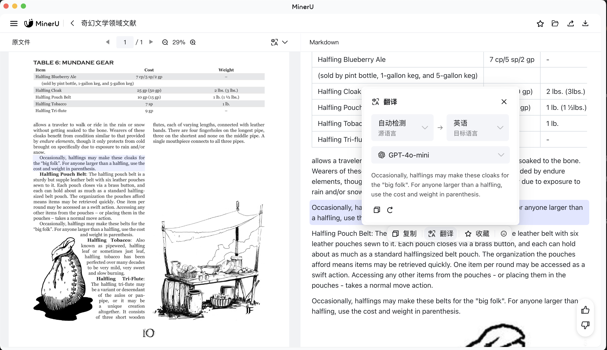

### 导出结果 解析结果可精准还原并导出为多种格式，适配不同场景：
   -  整篇文档导出：支持导出为 Markdown，JSON，HTML，LaTeX，Word 等标准格式，完美适配机器学习、大模型语料生产、RAG等场景。
   -  单个元素导出：
      - 公式：识别后支持复制或下载为 LaTeX、MathML 格式代码。
      - 表格：高精度支持旋转、跨页、合并单元格和嵌套表格，可复制或导出为 CSV、TSV、HTML、Markdown、LaTeX 格式。
      - 化学元素：精准识别分子式、反应式与化学结构式，支持复制或导出为 SMILES、MOLfile、PNG图片 等专业格式

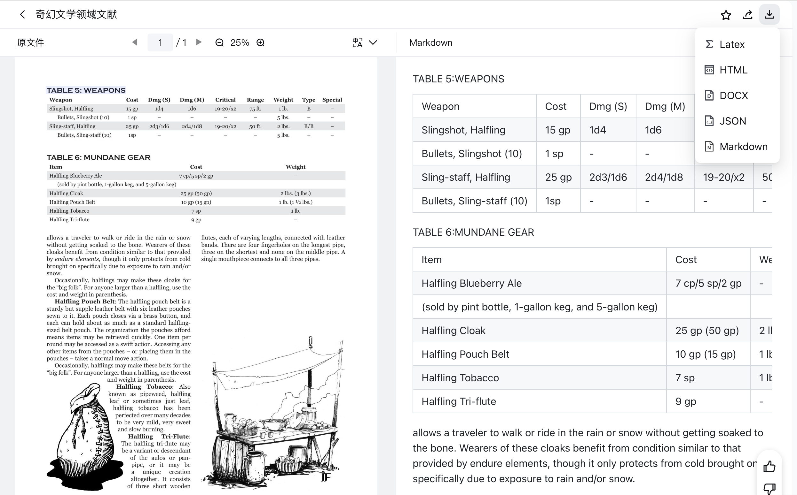

### 无缝同步与集成
    支持将解析结果直接同步到 Notion、Dify 等平台，快速对接您现有的工作流。
   
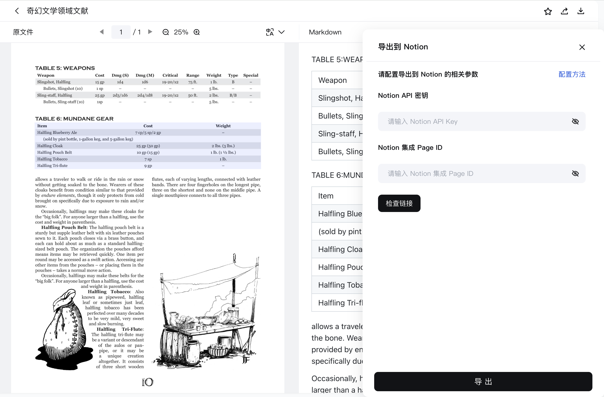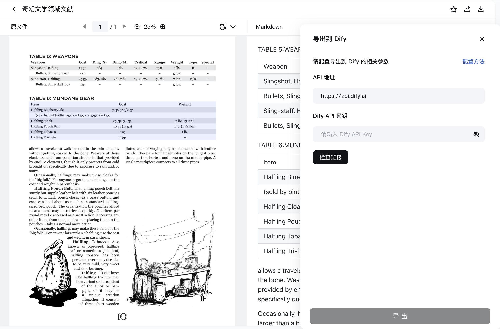

## 四、任务与管理

- 批量处理：系统支持并发任务与优先级调度，您可以在文件任务列表、侧边栏实时查看所有文件的解析进度，确保系统稳定高效。

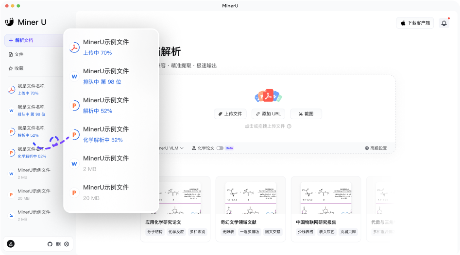

- 文件管理：在客户端或网页端的文件列表中，您可以查看所有历史解析文档，并对它们进行搜索、筛选、重新解析、删除等管理操作。

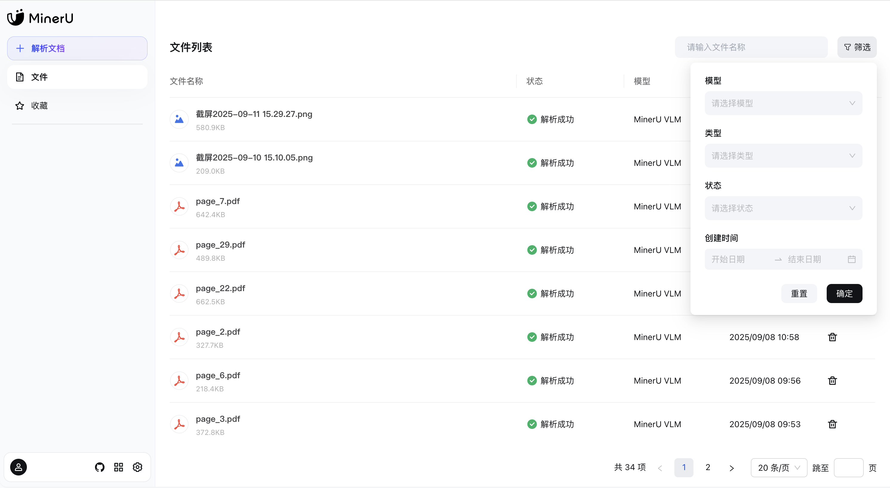

- 收藏列表：所有您收藏的内容都在`收藏`中结构化保存。您可以按类型（全部、文件、文本块、图片、公式、表格）快速筛选，实现秒速溯源定位

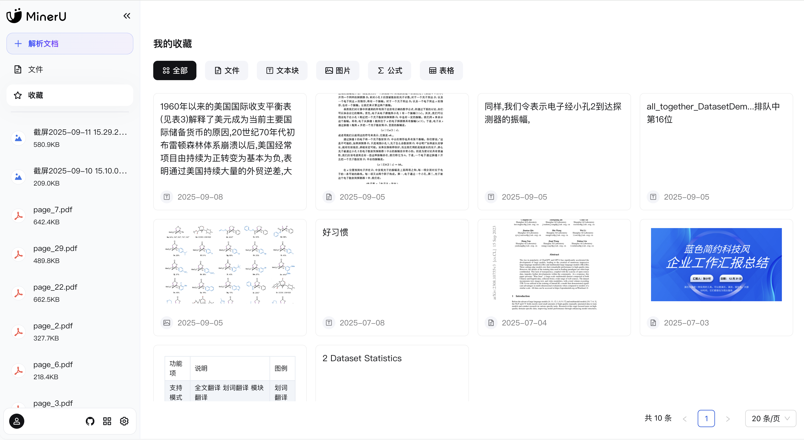

## 设置

在`设置`中，您可以全面管理您的账户和解析偏好。

### 系统设置
    额度查看：在系统设置清晰查看您每日剩余的优先解析额度（如 `1 / 2000页`）。
   
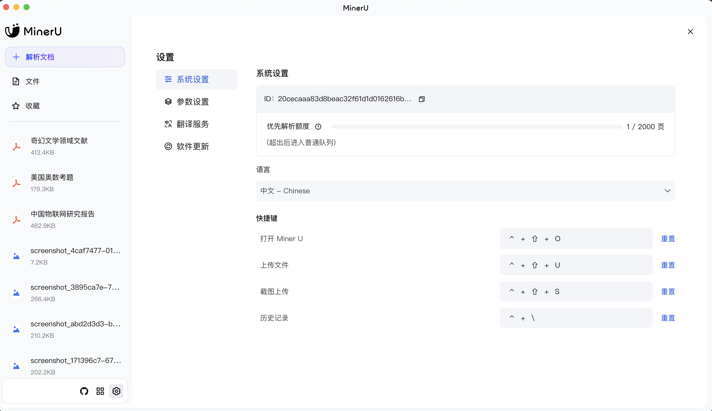

### 参数设置：根据您的需求定制解析过程：
   -  解析模型：选择默认使用的模型（`MinerU` 或 `MinerU VLM`）。
   -  功能开关：强制开启OCR、公式识别、表格识别等。
   -  OCR语言：选择文档的默认识别语言。

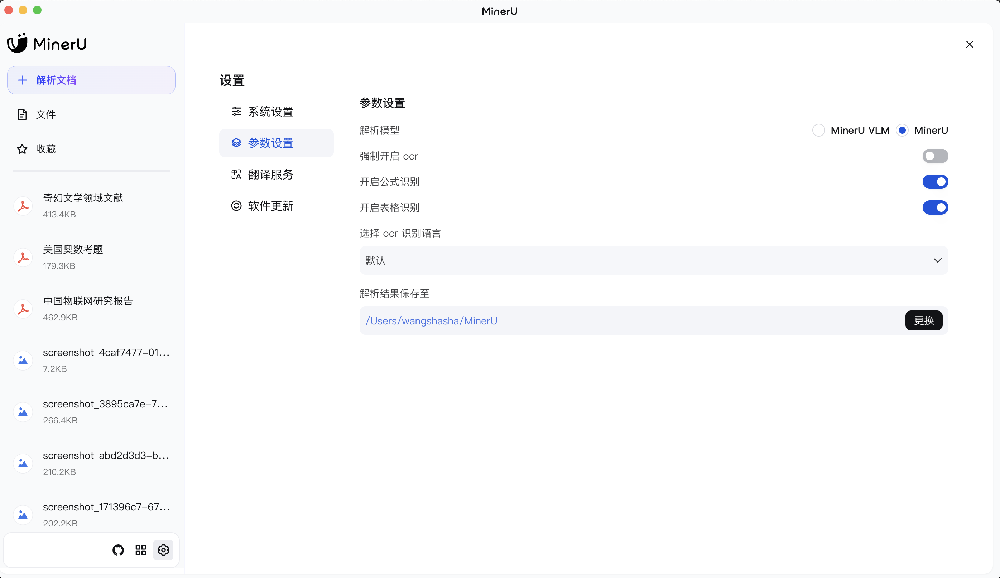

### 翻译服务
   -  配置 API：为获得更佳体验（如解除并发限制、使用全文翻译），您可以在此配置各大服务商（Google、Microsoft、DeepSeek、阿里云百炼等）的翻译API。
   -  并发说明：免费翻译服务存在~5秒的请求间隔限制，高频用户建议配置商用API。

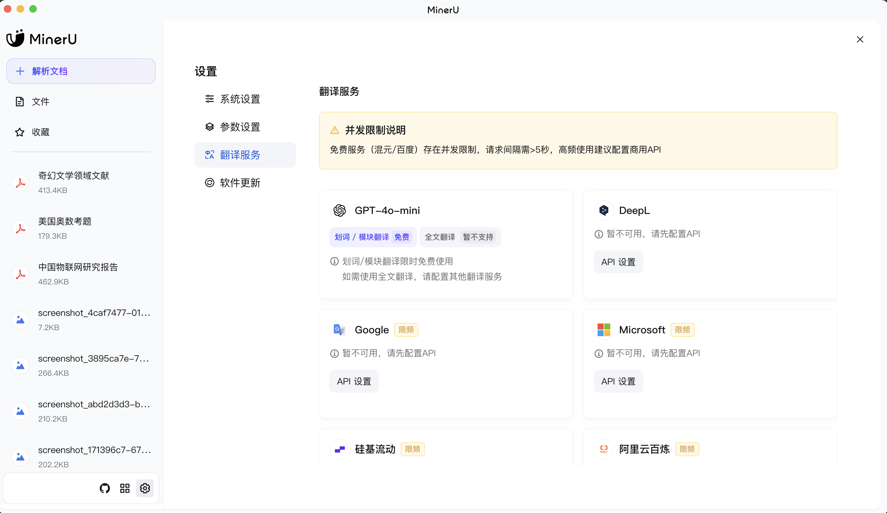

### 软件更新 (桌面客户端专属)
   -  桌面客户端会自动检查更新。您也可以在`设置`中查看是否为最新版本。
   -  在`软件更新`页面可以查看详细的更新日志（如V0.8.0, V0.7.5等），了解每个版本的新增功能和优化修复。

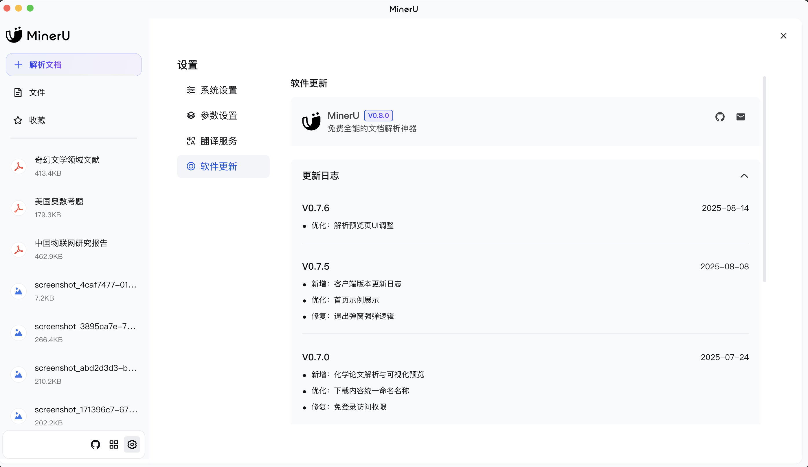