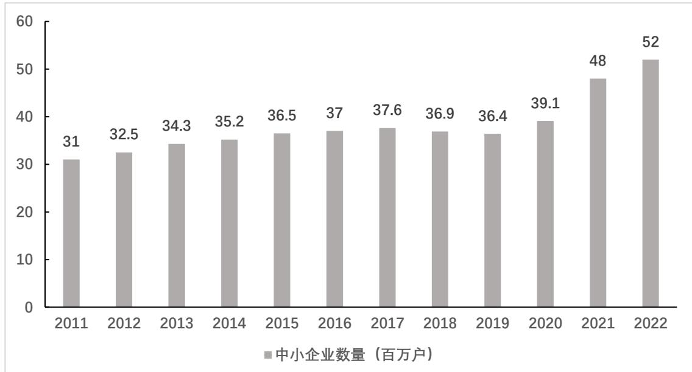
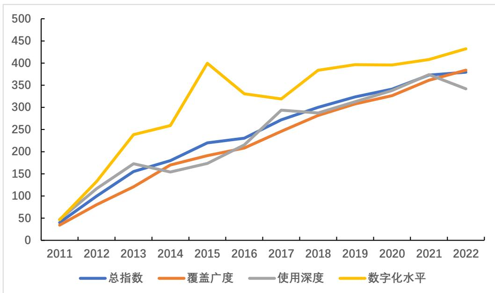

# 硕士研究生学位论文

题目： 数字普惠金融对中小企业信用风险影响研究

姓 名： 王宇晨

学 号： 2201210418

院 系： 软件与微电子学院

专 业： 计算机技术

研究方向： 金融科技

导师姓名： 刘宏志 教授

 学术学位 ☑ 专业学位

二〇二五年六 月

# 版权声明

任何收存和保管本论文各种版本的单位和个人，未经本论文作者同意，不得将本论文转借他人，亦不得随意复制、抄录、拍照或以任何方式传播。否则，引起有碍作者著作权之问题，将可能承担法律责任。

# 摘要

作为国民经济体系的关键构成要素，中小企业在推动技术创新、扩大就业规模和促进社会财富积累等方面发挥着不可替代的作用。然而，受制于资产规模有限、经营收入不稳定等固有特征，这类企业普遍面临较高信用风险，制约了其可持续发展能力。幸运的是，数字普惠金融的发展为降低中小企业的信用风险带来了突破性的解决路径。因此，深入研究数字普惠金融对中小企业信用风险的影响，能够为企业制定战略决策应对风险以及政府优化政策促进经济可持续发展提供帮助，具有重要的理论价值和现实意义。然而，现有文献集中于探讨数字普惠金融的数字化特征及其对经济体系的影响，针对其对中小企业的影响研究较为匮乏，未能充分体现数字普惠金融支持弱势市场主体的普惠性本质特征。

鉴于此，本文在对相关理论和国内外研究成果进行全面梳理与总结的基础上提出研究假设与实证方案。以2011-2022年原中小板上市公司为研究对象，分别将采用KMV模型测算的违约距离和北京大学数字普惠金融指数作为被解释变量和解释变量，并将融资约束作为重要中介变量，运用双向固定效应模型研究数字普惠金融对中小企业信用风险的影响。为进一步细化研究，本文不仅考察了数字普惠金融的整体效应，还将数字普惠金融指数的三个子维度：覆盖广度、使用深度和数字化程度纳入实证分析框架，深入探讨了数字普惠金融各维度对中小企业信用风险的不同影响。此外，为揭示数字普惠金融影响的异质性特征，本文从中小企业产权属性和地理位置两个维度进行了分组检验。

实证结果表明：数字普惠金融的发展对中小企业信用风险具有显著的抑制作用，这一作用主要通过覆盖广度和使用深度两个子维度实现；数字普惠金融的发展通过缓解融资约束降低中小企业信用风险；数字普惠金融的发展对国有中小企业以及中西部地区中小企业的信用风险降低作用更为显著。基于上述研究结论，本文提出了相应的政策建议，为优化数字普惠金融发展策略、完善中小企业信用风险管理体系提供了重要参考。

关键词：数字普惠金融，中小企业，信用风险，融资约束

# Research on the Impact of Digital Inclusive Finance on Credit Risk of SMEs

Yuchen Wang (Computer Technology) Directed by Professor Hongzhi Liu

# ABSTRACT

As an important part of the national economy, SMEs play a vital role in driving technological innovation, promoting employment and creating social welfare. However, the inherent characteristics of SMEs, such as limited assets and unstable operating income, often expose them to high credit risks and limit their ability to continue to grow. Fortunately, the development of inclusive digital finance offers an innovative solution to reduce the credit risk of SMEs. Therefore, it is important to conduct a comprehensive study on the impact of inclusive digital finance on SMEs credit risk. This will help enterprises to develop strategic solutions to overcome their risks and governments to optimise their policies to promote sustainable economic development. However, the existing literature focuses on the digital characteristics of inclusive digital finance and its impact on the economy, there is a lack of research on the impact on SMEs, which does not fully reflect the inclusiveness of inclusive digital finance in supporting disadvantaged market participants.

Therefore, this paper comprehensively reviews and synthesises relevant theories and research results at home and abroad, and proposes research hypotheses and empirical framework. Taking listed SMEs from 2011 to 2022 as the research sample, a two-way fixed effects model is adopted to study the influence of digital financial inclusion on the credit risk of SMEs, with standard distance measured by KMV model and Peking University digital financial inclusion index as the explanatory and explanatory variables, and financial constraints as an important intermediate variable. To make the study more specific, this paper examines not only the overall effect of digital financial inclusion, but also the three subdimensions of the digital financial inclusion index: coverage, depth, and digitisation rate, to further reveal the different effects of the digital financial inclusion dimensions on SME credit risk. In addition, to reveal the heterogeneous nature of the digital inclusion effect, SMEs are disaggregated into two dimensions: ownership characteristics and geographic location.

Empirical evidences show that, the advancement of inclusive digital finance has a notable impact on SME credit risk, which is manifested through two main components: the breadth of coverage and the depth of utilization ; the development of inclusive digital finance reduces the credit risk of SMEs by reducing financial constraints; the development of inclusive digital finance has a greater impact on reducing the credit risk of SMEs across the country and in the central and western regions. Based on the findings of the study, this paper provides relevant policy recommendations, which are an important guide to optimise the strategy of inclusive digital finance development and improve the SME credit risk management framework.

# 目录

# 第一章 引言

1.1 研究背景  
1.2 研究意义 3  
1.3 研究内容 4  
1.4 研究创新点 5  
1.5 论文结构 5

# 第二章 文献综述 7

# 2.1 理论基础 7

2.1.1 信息不对称理论..  
2.1.2 委托代理理论..  
2.1.3 交易成本理论..  
2.1.4 融资优序理论... 9

# 2.2 数字普惠金融相关研究 9

2.2.1 数字普惠金融的定义.. 9  
2.2.2 数字普惠金融的测度. 10  
2.2.3 数字普惠金融的影响. 12

# 2.3 融资约束相关研究 15

2.3.1 融资约束的影响因素... 15  
2.3.2 融资约束的经济后果. 16  
2.3.3 融资约束的缓解途径... 17

# 2.4 信用风险相关研究 18

2.4.1 信用风险的概念与特点... 18  
2.4.2 信用风险评估模型概述. 18  
2.4.3 信用风险的影响因素.. 21

2.5 文献评述与总结 22

# 第三章 研究设计 24

# 3.1 研究假设 24

3.1.1 数字普惠金融对中小企业信用风险的影响.. 24  
3.1.2 融资约束在数字普惠金融对中小企业信用风险影响中的中介作用..... 25  
3.1.3 产权性质在数字普惠金融与中小企业信用风险间的异质性.. 25  
3.1.4 地理位置在数字普惠金融与中小企业信用风险间的异质性...... 26

# 3.2 变量定义 27

3.2.1 被解释变量... 27  
3.2.2 核心解释变量. 28  
3.2.3 中介变量.. 29  
3.2.4 控制变量.. 29

# 3.3 模型设计 32

3.3.1 基准回归模型.. 32  
3.3.2 中介效应模型... 32

3.4 样本与数据 33

# 第四章 实证分析 34

4.1 描述性统计分析 34

4.2 回归结果分析 35

4.2.1 基准回归... 35  
4.2.2 中介机制... 37

# 4.3 异质性分析 39

4.3.1 产权异质性.. 39  
4.3.2 地区异质性... 41

# 4.4 稳健性检验 42

4.4.1 替换被解释变量.. 42  
4.4.2 替换解释变量. 44  
4.4.3 替换回归模型. 46  
4.4.4 内生性检验.. 47

# 第五章 结论与建议 50

5.1 总结 ... 50  
5.2 政策建议 51  
5.3 展望 ... 52

参考文献 . 54

致谢 . 61

北京大学学位论文原创性声明和使用授权说明 62

# 第一章 引言

# 1.1 研究背景

自1978年实施改革开放政策后，我国中小型经济实体在国民经济格局中的战略定位发生了质的飞跃。作为市场中最富生命力的经济单元，这些市场主体拥有就业创造能力、产业结构优化能力和技术进步推动能力，已然成为驱动宏观经济持续健康发展的重要力量源泉。从产业组织结构角度分析，中小型经营主体往往深耕于特定专业领域，在产业链配套服务中构建独特的比较优势，发挥着连接产业上下游的枢纽功能。这种高度专业化的市场定位不仅优化了产业链各环节的协作效率，更为整个产业生态的稳健运行奠定了坚实基础。在国家经济治理层面，数量庞大的中小企业群体构成了支撑国民经济健康运行的底层架构，既源源不断地输送着经济发展动能，又凭借其突出的就业容纳能力充当着宏观经济波动的缓冲器。值得关注的是，近年来国家决策层对中小企业发展的战略定位持续强化，配套政策体系日臻完善。在实施创新驱动发展战略的背景下，中小企业的战略价值获得前所未有的重视：党和国家领导人明确将“培育专精特新企业”纳入国家战略体系，深刻指出“微观经济主体是创新发展的核心载体”，相关部委负责人则系统阐释了“中小企业活力指数与国民经济韧性呈正相关”的重要论断，强调必须通过深化体制改革充分释放发展潜能。这一系列政策导向的调整，既彰显了对中小企业发展规律的精准把握，也标志着我国产业政策正朝着精准施策、分类指导的方向转型升级，有效激活了市场主体的创新动能，构建了制度创新与市场机制良性互动的新型发展模式。基于最新发布的国民经济运行数据，我国中小企业发展呈现出显著的量质齐升特征。截至 2022 年末，全国中小企业数量较 2018 年同期增长近四成，总量突破5200 万户（如图1.1显示），日均新增市场主体数量同步实现 $33 \%$ 的增幅，这一持续增长态势直观反映了微观经济主体的蓬勃生机。特别值得注意的是，在新冠疫情防控的特殊背景下，中小企业群体展现出卓越的危机应对能力和经营韧性，其适应性和抗风险能力远超预期。从宏观经济发展视角来看，中小企业正在实现从规模扩张到质量提升的跨越式发展，这种发展态势不仅彰显了中小企业群体整体竞争力的提升，更深层次地体现了我国经济发展方式转变和增长动力转换的内在要求。随着创新驱动发展战略的深入推进，中小企业在促进产业链现代化和经济转型升级中的关键地位正在得到社会各界的广泛认同。

  
数据来源：国泰安数据库  
图 1.1 2011-2022 年中国的中小企业数量（百万户）趋势图

然而，在全球经济环境日趋复杂且行业竞争态势不断升级的背景下，中小企业正遭遇前所未有的经营压力。作为市场经济结构中不可或缺的重要组成部分，这类企业通常呈现出运营历史有限、资金储备薄弱以及业绩稳定性较差等共性特点。郎香香等（2021）指出，此类经济实体普遍存在征信数据缺失、有效担保资产匮乏等固有缺陷，致使其信用违约概率明显超过大型企业集团，这一现象已成为制约中小企业长期健康发展的关键瓶颈。尽管我国相关职能部门已陆续推出包括减税降费、信贷扶持及技术研发补贴在内的多元化政策工具包，对优化中小企业生存环境产生了积极影响，但大量调研数据证实，该类企业在金融资源分配过程中仍遭受结构性歧视，突出表现为资金需求与信贷投放之间的非对称性矛盾。钟腾等（2017）的实证分析，金融交易双方的信息鸿沟持续存在，不仅降低了资本配置效能，更引发了金融市场功能失调等制度性难题。这种市场失灵现象导致众多成长型中小企业深陷融资窘境：既受制于资金来源单一的局限性，又不得不承担超额的资金使用成本。从金融机构视角观察，商业银行传统的风控模型与中小企业“额度小、周期短、时效强”的借款特征存在本质性矛盾，即便成功获取贷款资格，中小企业仍需面对繁琐的办理手续和漫长的审核流程（陶云清等，2022）。从资金需求方角度审视，在中小企业信用评级机制尚未成熟的现阶段，出于资产安全性、经营稳健性及投资回报率的综合考量，信贷机构往往采取审慎的风险溢价方案（方先明等，2015）。要突破这一发展桎梏，需从制度重构与模式创新双管齐下：首要任务是构建差异化、多层次的融资支持网络，精准对接各类中小企业的特殊融资诉求；同时应当健全征信数据交换平台，开发创新型风险对冲产品，增强金融资源配置的靶向性和包容性。通过深化金融供给侧结构性改革，打造“普惠性强、费率优惠、服务优质”的新型金融生态圈，为中小企业技术升级和市场扩张提供可持续的资金保障，进而推动金融资本与产业经济形成优势互补、互利共赢的发展格局。

郭峰等（2020）指出，以金融科技为代表的数字化浪潮正在深刻重构国际金融体系格局，促使银行业等传统金融部门加速与人工智能、区块链等前沿技术有机结合，进而孕育出具有革命性特质的金融新业态。这一变革进程主要得益于信息技术进步带来的信息采集与加工成本显著下降，以及依托海量数据建立的精细化信用风险评估框架（万佳彧等，2020）。相关实证分析表明，数字普惠金融凭借其“市场激活机制”深刻改变了金融市场竞争生态，在提升资本配置效能的同时，也迫使传统金融中介机构加速数字化改造，由此塑造了更具普惠属性和效率优势的现代融资体系（王敏等，2023）。从具体实施层面考察，此类创新实践有效突破了传统金融服务的时空壁垒，通过移动互联等技术手段实现了服务触角的全面延伸，更精准地适配了城乡差异、收入分层等多元化市场主体的差异化融资诉求（杨君等，2021），缓解了中小企业融资约束，降低了中小企业信用风险，最终促成金融体系创新与中小企业可持续发展形成良性循环、协同演进的新型互动关系。

基于上述背景，本文重点考察了数字普惠金融对中小企业信用风险的影响及其作用路径，并进一步探究了该效应在不同产权属性和地域分布的企业中存在的异质性特征。

# 1.2 研究意义

本文对数字普惠金融与中小企业信用风险的国内外学术成果进行了全面梳理与整合。选取原中小板上市公司作为研究样本，构建了数字普惠金融与中小企业信用风险的计量经济模型。为进一步深化研究，论文选取数字普惠金融总指数及其三个核心维度指标，深入探讨了数字普惠金融作用于中小企业信用风险的影响机制及其异质性特征。研究成果不仅丰富了数字普惠金融影响中小企业信用风险的理论内涵，也为政府部门制定精准化的金融支持政策提供了实证依据与决策参考。

在理论贡献方面，通过构建数字普惠金融与中小企业信用风险之间的作用机制分析体系，拓展了金融科技与风险管理交叉领域的研究边界。具体来看，研究不仅实证检验了数字普惠金融的普惠效应，还系统识别了其作用于中小企业信用风险的传导渠道。在方法论创新方面，本文突破了传统单维分析的局限性，将企业所有权性质、地理位置等异质性特征纳入研究框架，建立了更为全面的评估体系，从而解决了现有文献对中小企业差异化特征关注不足的问题。在实证设计上，通过变量控制、内生性处理等方法，严谨地验证了数字普惠金融与中小企业信用风险之间的因果关联。

本研究具有重要的实践价值，特别是在当前全球经济下行压力加大、地缘政治冲突频发、生产要素价格持续攀升以及国内产业结构深度调整的复杂背景下，中小企业的发展困境日益凸显。我国中小企业普遍呈现出“规模约束突出、信息透明度不足、融资渠道受限”的典型特征：其一，企业资产规模较小造成单次融资额度受限，削弱了金融机构的盈利空间和服务动力；其二，财务信息披露不规范且数据可信度存疑，大幅增加了金融机构的信用评估难度；其三，传统融资方式单一使得企业在经济波动时期更难获得稳定的资金供给。这种系统性金融排斥现象不仅恶化了中小企业的财务稳健性，更制约了其创新转型和可持续发展能力。数字普惠金融的崛起为解决这一难题带来了新的契机，显著降低了金融服务的边际成本、提升了产品创新速度、改善了信息传递效率。这种金融创新模式既优化了金融机构的风险定价能力，又强化了企业的财务韧性，从而实现了金融资源的精准匹配。本文的实证分析证实，数字普惠金融通过缓解融资约束，能够有效改善中小企业的信用状况，不仅践行了金融服务实体经济的根本宗旨，也为深化金融供给侧结构性改革提供了有益借鉴。因此，本文的实践贡献主要体现在：首先通过系统阐释数字普惠金融改善中小企业信用风险的内在机理，为监管部门制定精准施策方案提供了科学依据；其次研究发现补充和完善了中小企业风险管理理论体系，为企业优化治理结构、调整投融资策略等经营决策提供了实证支撑；最后基于企业所有制和区域分布特征的差异化研究结论，有助于形成分类指导、精准滴灌的政策实施框架，推动构建多层次、广覆盖的普惠金融服务体系。

# 1.3 研究内容

随着政府扶持政策持续深化与金融服务体系日益完善，数字普惠金融的创新发展为中小企业长期稳定发展奠定了坚实的金融支持基础。在此背景下，本研究重点探讨三个关键议题：数字普惠金融的发展能否有效降低中小企业信用风险，其内在作用机理如何体现，以及这种影响在不同企业产权属性和地理区位条件下是否存在显著差异。本文深入分析数字普惠金融对中小企业信用风险的影响，致力于为构建更加完善的信用风险管理体系提供理论突破与实践指导。基于理论分析整合，本文建立四个重要假设命题：假设一，数字普惠金融的发展能够降低中小企业信用风险。假设二，数字普惠金融的发展能够通过缓解融资约束来降低中小企业信用风险。假设三，数字普惠金融的发展在降低国有中小企业信用风险方面，相较于非国有中小企业，效果更显著。假设四，数字普惠金融的发展在降低中西部地区中小企业信用风险方面，相较于东部，效果更显著。依据这一理论架构，研究对关键概念进行了精确的学术定义，并建立了系统化的评价指标系统。通过采用前沿的计量分析技术，构建并验证了具有较强解释力的实证分析模型。研究结论不仅拓展了学术界对数字普惠金融与信用风险关系的认识边界，同时也为政府部门制定差异化的金融支持政策提供了有价值的实证依据。

# 1.4 研究创新点

本文在理论与实践层面的创新主要体现在以下方面：

第一，创新性地将数字普惠金融这一关键要素融入中小企业信用风险评估的理论架构，从宏观金融发展维度进一步补充完善了中小企业信用风险影响因素的框架，为后续学术探索开辟了新思路，促进了相关理论体系的系统化演进。

第二，在全面考察数字普惠金融总指数与中小企业信用风险关联性的基础上，创新性地引入覆盖广度、使用深度和数字化水平三大子维度，构建了实证分析模型，深入解析了数字普惠金融各维度对中小企业信用风险的差异化作用机理。这种多层次、精细化的研究方法不仅深化了对二者关系的理解，更为促进其良性互动提供了科学依据。

第三，研究通过构建“数字普惠金融—融资约束—中小企业信用风险”的传导链条，系统阐释了融资约束在其中的中介效应，完善了相关微观理论框架。同时，基于产权性质和区域特征的异质性分析，揭示了数字普惠金融的发展对不同特征中小企业信用风险的差异性影响。这些发现既丰富了理论认知，也为政府部门制定差异化支持政策提供了实证支撑。

# 1.5 论文结构

本文的结构安排如下：第一章全面阐释了选题的现实背景与研究意义。重点考察了中小企业在我国经济转型升级过程中的战略地位，客观评估了其发展面临的现实困境，同时系统回顾了数字普惠金融的演进轨迹与典型特征，深入论证了其对改善中小企业融资环境与降低其信用风险的积极效应。此外，本研究从理论创新、实践指导与政策参考三个维度阐明了研究意义与创新点，并系统说明论文的结构，使文章脉络更为清晰。

第二章对既有研究成果进行了全面梳理与整合分析。在中小企业信用风险研究领域，重点探讨了风险内涵界定、量化评价体系以及风险驱动因素等关键议题；针对数字普惠金融这一研究主题，系统归纳了概念界定、指标体系构建及其经济社会影响等方面的学术进展。此外就数字普惠金融发展与企业信用风险之间的作用机制进行了文献述评，并从融资约束视角展开深入讨论，具体包括融资约束形成因素、对企业经营的影响效应以及融资约束缓解策略等。

第三章理论分析与研究设计在相关理论的基础上，对数字普惠金融发展水平与中小企业信用风险之间的内在关联进行了系统探讨，进一步构建了具有针对性的实证研究假设，为后续计量分析奠定了理论基础。并且在研究设计上，系统阐述了模型的构建过程，明确了核心变量的定义与数据来源，为后续研究奠定了数据基础。

第四章实证分析验证上述假设。首先基于双向固定效应模型进行基准回归分析，接着为深入揭示数字普惠金融的发展影响中小企业信用风险的作用机制，本文构建中介效应模型验证。针对研究样本的异质性特征，本章采用分组回归分析方法，分别考察了区域差异（东中西部地区）和企业所有制类型（国有与非国有）的异质性。为确保实证结论的稳健性，本文使用了替换变量、替换模型和引入工具变量等多种方法进行稳健性检验。

第五章基于前文构建的理论框架与实证研究结果，系统性地提炼出本研究的核心发现，并据此提出针对性的政策建议，接着针对本文存在的几点不足之处作出研究展望。

# 第二章 文献综述

# 2.1 理论基础

# 2.1.1 信息不对称理论

在经济学研究体系中，信息不对称理论构成了分析市场机制缺陷的关键理论框架。这一开创性理论由三位著名学者——George A. Akerlof、A. Michael Spence 和 Joseph E.Stiglitz 于 1970 年共同构建，并因其突出贡献而荣膺 2001 年度诺贝尔经济学奖。该理论的核心观点在于，市场交易主体间存在的信息获取与认知能力的差异性，往往会引发资源配置效率的损失乃至整个市场体系的失效。从时间维度来看，信息不对称性主要表现为两种典型形态：首先是缔约前存在的逆向选择现象，即具有信息优势的交易方利用对方的知识盲区谋取私利，典型例证如旧车交易过程中卖方对车辆状况的刻意隐瞒造成优质商品逐渐退出市场；其次是履约后可能产生的道德危机，表现为合约签订后一方在监督缺位时采取机会主义行为，例如保险合约签订后投保人风险防范意识降低的现象。针对这一理论体系，三位奠基者分别提出了具有开创性的分析范式：Akerlof 构建的“柠檬市场”模型系统阐释了信息偏差如何引发市场功能紊乱；Spence发展的信号显示机制理论揭示了高信息方如何通过教育资历等可观测指标传递私有信息；Stiglitz 则开创性地提出了信息甄别模型，论证了低信息方可以通过合约设计来识别对方真实类型。这些理论创新在多个经济领域展现出强大的解释力：在信贷市场中表现为金融机构通过担保品设置来评估客户信用等级；在雇佣关系中体现为企业依据教育背景筛选求职者；在保险行业则反映为保险公司通过差异化保费设计来应对投保人的信息隐瞒。为有效克服信息非对称性引发的市场失灵问题，实践中发展出了信号显示、信息甄别机制以及政府强制信息披露制度等多种治理工具，这些措施显著提升了市场机制的运行效能。

# 2.1.2 委托代理理论

作为现代企业制度研究的重要理论基石，委托代理理论的渊源可追溯至 1932 年伯利与米恩斯合著的《现代公司与私有财产》所阐述的“伯利米恩斯命题”。该理论雏形揭示了企业所有权与经营权分离所导致的治理困境：在法人治理结构中，股东作为名义控制者难以实施有效管控，而职业经理人则实际掌握着企业运营决策权。随着研究的深入，Ross 于1973 年首次界定了委托代理关系的核心内涵，即契约主体之间通过显性或隐性协议建立的服务供给关系，其中授权方为委托人，执行方为代理人，后者通过提供专业服务获取相应报酬。在此基础上，Mirrless 于 1975 年构建了信息不对称视角下的委托代理基础模型，为后续研究提供了基本分析框架。Jensen 和 Meckling 在 1976年进一步提出了代理成本理论，指出委托人与代理人作为理性经济主体，在目标函数差异和信息不对称的双重作用下，必然产生利益冲突，从而导致代理成本。这一理论突破为理解企业治理中的委托代理问题提供了新的视角。经过多代学者的理论创新与实证检验，委托代理理论逐步发展成为制度经济学契约理论体系中的核心组成部分，对企业治理实践具有重要的指导意义。

# 2.1.3 交易成本理论

交易成本理论是新制度经济学的核心理论之一，由科斯在 1937 年的经典论文《企业的性质》中奠基，后经威廉姆森等学者系统发展而成。该理论从根本上挑战了新古典经济学中“市场交易无摩擦”的理想化假设，揭示了现实经济活动中存在的各种交易成本及其对经济组织形态的深刻影响。科斯的开创性贡献在于提出并回答了“企业为什么存在”这一根本性问题，他指出当市场交易成本过高时，企业作为一种替代性的资源配置方式就会出现，通过内部化的组织协调来降低这些成本。交易成本泛指市场机制运行过程中产生的所有非生产性耗费，包括搜寻交易对象的成本、谈判和缔约成本、监督合同履行的成本以及解决争议的成本等。这些成本的存在使得完全依赖市场交易变得低效，从而催生了企业这种能够通过行政命令和长期契约来减少频繁市场交易的组织形式。科斯进一步提出了“企业的边界”问题，认为企业的规模取决于市场交易成本与内部组织成本之间的权衡，当内部协调成本低于市场交易成本时，企业就会扩张，反之则会缩小规模。而后威廉姆森对交易成本理论的发展做出了系统性贡献，他指出交易成本主要源于人类的有限理性、机会主义行为以及资产专用性等特征，并且特别强调了资产专用性的关键作用，即某些投资一旦投入特定用途就难以转作他用，这种专用性投资会显著增加交易成本，因为交易双方都可能面临被“套牢”的风险。威廉姆森提出了一个系统的分析框架，将交易的关键维度归纳为资产专用性、不确定性和交易频率，并据此解释了不同的治理结构选择。对于资产专用性低、不确定性小的标准化交易，市场机制是最有效的治理方式；当资产专用性提高、不确定性增大时，混合治理模式（如长期契约、战略联盟）更为合适；而对于高度专用性的交易，垂直一体化即企业内部化则成为最优选择。这一分析框架为理解现实中的企业边界、纵向一体化、外包决策等提供了强有力的理论工具。

交易成本理论在解释经济组织形态方面展现出强大的解释力。在企业边界问题上，该理论很好地解释了为什么有些企业选择纵向一体化而另一些则依赖市场采购。例如，汽车制造商往往会将核心零部件生产内部化，以降低因高度专用性投资带来的交易风险，而在标准化零部件的采购上则更倾向于市场交易。在契约设计领域，交易成本理论指导人们如何通过巧妙的契约安排来防范机会主义行为，比如在长期供应合同中设置价格调整条款、违约金条款等。该理论还被广泛应用于比较制度分析，为理解不同经济体制的效率差异提供了新视角。近年来，随着数字经济的兴起，交易成本理论又获得了新的应用场景，电子商务平台、共享经济模式等都被视为降低交易成本的新型制度安排。

# 2.1.4 融资优序理论

融资优序理论由经济学家 Stewart Myers 于 1984 年提出，旨在解释企业在面临融资需求时的决策行为。该理论认为，由于信息不对称的存在，企业管理层（内部人）比外部投资者更了解企业的真实价值和投资风险，这会导致外部融资成本高于内部资金。因此，企业在进行资本结构决策时通常会遵循一定的偏好：首先倾向于利用内部积累的未分配利润作为资金来源；当自有资金无法满足需求时，则会转向外部债权融资渠道；最后企业才会将发行股票等权益融资方式纳入考量范围。这一融资顺序的核心逻辑在于不同融资方式带来的信息成本和财务压力差异。内部融资（如未分配利润）不会产生额外成本，也不会向市场传递负面信号；债务融资虽然需要支付利息，但由于债权人不参与公司治理，且债务利息可抵税，其成本相对可控；而股权融资则可能被市场解读为企业价值被高估或财务状况不佳的信号，从而导致股价下跌，融资成本上升。融资优序理论还指出，当企业不得不选择外部融资时，会倾向于发行信息敏感性较低的证券，如优先债而非可转债，普通股则作为最后的选择。该理论对传统资本结构理论（如权衡理论）提出了挑战，强调企业融资决策更多受信息不对称驱动，而非单纯追求最优负债比例。然而，该理论也存在局限性，例如无法解释某些行业长期偏好股权融资的现象，或企业在不同生命周期阶段的融资策略变化。尽管如此，融资优序理论仍是公司金融领域的重要分析框架，为理解企业融资行为提供了关键视角。

# 2.2 数字普惠金融相关研究

# 2.2.1 数字普惠金融的定义

普惠金融这一创新性的金融范式，其理论雏形最早形成于联合国 2005年推动的国际小额信贷计划。根据世界银行的权威定义，该金融体系致力于构建多层次、广覆盖的金融服务生态，其核心目标在于突破传统金融服务的双重壁垒：既要解决显性的服务成本问题，更要消除隐性的制度性歧视，确保不同社会经济地位的主体都能获得与其需求相匹配的可持续金融服务（李涛等，2016）。吴金旺等（2018）的实证研究显示，普惠金融的纵深推进不仅重塑了传统金融业态，更在培育新兴金融模式、开拓增量市场空间等方面取得显著突破，大幅提升了金融服务的普惠性与可及性。为推动这一创新模式规范发展，我国政府于 2015 年底颁布《推进普惠金融发展规划（2016—2020 年）》，明确将普惠金融界定为：在平衡公平效率与市场规律的前提下，通过创新服务为多元社会群体提供价格合理、渠道便捷且精准适配的现代金融产品与服务。

在深化金融体系改革的关键阶段，普惠金融的快速发展为我国金融生态带来了全新的增长动力。然而，在实际落地过程中，该模式仍面临一系列结构性障碍。当前的主要挑战体现在风险控制能力不足、信用数据平台建设不完善以及数据采集成本高昂等方面。这些问题共同导致普惠金融呈现出“理论先进性与实践脱节”的矛盾现象。尽管其核心理念具有前瞻性，但在实际操作中往往难以达到预期目标。传统服务模式的局限性使其难以兼顾覆盖范围的扩展与盈利能力的维持，从而制约了服务网络的延伸，使得普惠金融的包容性价值未能得到充分释放。

随着金融科技的迅猛发展，我国普惠金融体系建设与数字化转型形成了深度耦合的发展态势。2016 年G20杭州峰会首次对数字普惠金融进行了系统性定义，将其界定为依托信息技术手段推动普惠金融发展的综合性工程（任碧云等，2019）。技术创新驱动的服务模式变革显著扩大了服务覆盖面，增强了金融服务的包容性，同时大幅提升了运营效率，降低了服务成本。这种技术赋能的新型金融服务模式，使中小企业和低收入群体等传统金融体系难以触及的经济主体获得了更为有效的金融支持，从而更全面地实现了普惠金融的核心价值理念（谢绚丽等，2018；郭峰等，2020）。

# 2.2.2 数字普惠金融的测度

近年来，数字普惠金融的全球化发展浪潮促使学界对其评估方法展开深入探讨（郭峰等，2021）。研究显示，数字普惠金融测量指标的设计在很大程度上承袭了传统普惠金融评估体系的方法论基础。在该研究领域，Beck 等（2007）的奠基性工作构建了一个包含金融服务可及性和用户参与度两个关键维度的分析框架，并通过四个细分指标实现了对数字普惠金融发展水平的综合量化。Sarma等（2011）的研究则实现了方法论的创新突破，其借鉴联合国人类发展指数（HDI）的编制原理，建立了包含服务使用强度、市场渗透率和服务可获取性三个维度的国际比较体系。这项开创性工作不仅系统揭示了不同发展水平国家间的金融服务差距，更通过其构建的复合分析模型为后续研究开辟了新的理论视角和研究路径。

国内学者在数字普惠金融评估领域的研究虽较国际同行稍显滞后，但在评价体系的创新和实证分析方面已实现重要进展。基于Sarma等学者的理论基础，张国俊（2014）充分考虑中国金融体系的特殊性，对原有评价维度进行本土化改造，创新性地提出了涵盖服务覆盖范围、用户活跃程度、服务效能以及价格可负担性四个方面的评估模型。陈三毛等（2014）则通过系统分析各类评估工具的适用性，最终采用 Chakravarty-Pal 指数对地区金融包容程度进行精确测量。此外，焦瑾璞等（2015）引入层次分析法（AHP）确定各指标权重，开发出包含 19个细分指标的综合评价系统，为全面衡量数字普惠金融发展状况提供了新的分析工具。这些创新性研究不仅拓展了中国数字普惠金融理论研究的深度和广度，更为相关决策部门制定金融发展政策提供了坚实的理论支撑和数据支持。

但是总的来说，现有文献对数字普惠金融评估体系的系统考察表明，当前国际和国内相关研究在指标设计层面仍呈现出明显的不足。主流研究范式主要考察商业银行提供的传统金融业务，其评估视角多局限于金融机构层面，未能充分体现数字普惠金融的多维特性（郭峰等，2021）。此类研究方法过度倚重银行标准化业务数据，在时序连续性和区域覆盖度方面均表现出显著缺陷。金融科技迅猛发展和新型金融模式持续创新的背景下，数字技术对普惠金融的促进作用已形成普遍共识。然而，传统银行数据体系仅能反映特定金融领域的服务情况，无法完整呈现数字普惠金融的多重属性和丰富内涵，这一局限性严重影响了评估体系的科学价值和实践指导意义。

构建科学合理的评价体系对于准确衡量数字普惠金融发展状况具有重要意义。在这一背景下，《北京大学数字普惠金融指数》应运而生，其创新的研究框架和系统的指标设计为相关领域研究提供了全新视角。该评价体系基于三个关键层面：覆盖广度、使用深度和数字化水平，下设33个具体观测指标，形成了完整的分析架构。从覆盖广度看，该指数不仅涵盖全国所有省级区域，更延伸至地市级和县级行政单位，为系统考察我国数字普惠金融的空间分布特征奠定了数据基础。在使用深度方面，主要采用账户渗透率、信贷业务活跃度和支付交易频率等指标衡量金融服务的实际使用情况。在数字化水平层面，则着重评估移动化应用和智能服务等提升用户体验的技术特征（郭峰等，2020）。这一评价体系不仅填补了传统金融评估在数字化维度上的空白，更因其系统性和科学性而被学界广泛采用，为探索我国数字普惠金融的空间格局、发展轨迹及区域异质性提供了重要分析工具，同时也为政策设计和实践创新提供了坚实的实证依据。

  
数据来源：基于郭峰等（2020）的研究数据整理  
图2.1 2011-2022年北京大学数字普惠金融总指数及其三个子维度全国均值趋势图

# 2.2.3 数字普惠金融的影响

在科技革命特别是数字化浪潮的强力驱动下，金融业正经历着前所未有的结构性变革。数字普惠金融作为这一变革过程中的关键创新范式，通过其独特的运行机制，在推动经济高质量发展、优化金融服务效率以及增强金融体系包容性等方面展现出中重要价值。当前学术研究主要聚焦于数字普惠金融对宏观经济运行、微观主体金融决策以及企业经营管理等不同层面的影响效应。这些研究不仅深化了对数字普惠金融运行机理的理论认识，更拓展了对其经济社会功能的理解维度，为相关领域的学术探索提供了新的研究视角和理论框架。

# （一）数字普惠金融对宏观经济影响

在现代经济体系中，金融资本的空间分布形态对区域经济发展质量起着重要作用。传统金融运行模式因遵循机构集中化规律并存在服务偏好性，致使资金要素在地理空间上分布严重失衡：金融资源高度集聚的地区能够持续获得发展助力，而金融服务短缺区域则陷入经济增长乏力的困境，这种结构性失衡已成为阻碍国民经济均衡发展的关键因素（郭峰等，2021）。值得关注的是，数字化技术的重大突破为解决这些难题开辟了新路径。它打破了地理空间约束，重塑了资金要素的流动逻辑，为区域协调共进增添了创新驱动力。从空间演变规律来看，金融创新通常呈现从中心城市向周边区域逐步扩散的趋势。跨国比较研究也提供了有力佐证，Beck（2018）对肯尼亚移动支付系统的研究发现，数字金融服务有效激活了当地创业活力，进而推动了区域经济的可持续发展。张彤进等（2017）通过实证分析发现，数字普惠金融体系的完善能够有效缓解城乡收入分配不均问题，特别是金融服务覆盖面的扩大表现出最为突出的调节效果。后续研究进一步揭示，在构成数字普惠金融的多个要素中，支付便捷程度的改善以及融资途径的多元化对促进农村地区包容性发展具有显著的积极影响，相比之下，理财投资服务的调节效应则相对有限（李建军等，2019）。

数字普惠金融在提升金融包容性方面成效斐然，然而其发展进程中也伴生着一系列亟待处理的结构性难题。在中国独特的金融环境中，商业银行长期在金融体系中占据主导地位，其服务对象主要集中于大型国有企业和重点行业部门，这使得中小企业普遍面临融资难题。这类市场主体由于存在征信数据不完整、缺乏有效担保物等固有属性，往往难以满足传统金融机构的授信要求（Kapoor，2014）。据李牧辰等（2020）研究显示，数字技术应用发展的不均衡以及普及过程中存在的阻碍，有可能导致金融服务获取路径的新一轮分化，进而产生“数字鸿沟”现象。这一问题在弱势社会群体中表现得格外突出，因为这些群体既缺少必需的数字终端设备，又缺乏基本的金融知识储备，在获取金融服务时常常受到“技术性障碍”与“认知性障碍”的双重束缚。这种新型的排斥机制，不仅削减了弱势群体参与金融的机会，更需注意的是，正如程名望等（2019）与王修华等（2020）的研究所警示的，这种分化态势可能使社会阶层间的经济不平等加剧，引发“优势累积”与“劣势叠加”的负面循环效应。这些研究为政策制定者提供了关键启示，即在推动数字普惠金融创新发展时，要同步重视其潜藏的社会分化风险，并构建系统性的应对方案。

# （二）数字普惠金融对居民活动影响

数字技术与传统金融服务的创新融合，有力推动了数字普惠金融的迅猛发展，深刻改变了民众的支付方式、消费模式以及金融参与途径。这一金融领域的创新举措，不仅大幅降低了金融服务的使用门槛，还为家庭经济活动开辟了更为广阔的选择余地，为家庭投资者提供了更为丰富多样的金融产品选择，其作用路径主要体现在增强家庭风险承受意愿、提高投资操作的便捷程度以及拓宽金融信息获取渠道等多个方面（吴雨等，2021）。

数字普惠金融对居民经济活动的塑造呈现出多元化特征，其影响范围不仅涵盖资产配置领域，更深度渗透至日常消费行为。从传导路径分析，这种影响主要经由双重机制实现：首先，通过创新性的金融产品和服务供给，大幅提升了家庭资金的可获得性，进而直接刺激消费总量的增长；其次，通过促进消费方式的结构性变革，推动家庭消费模式向品质化、多样化方向发展。相关实证分析发现，依托数字技术对用户数据的智能化处理，金融机构能够开发更具针对性的金融解决方案，这为增强家庭消费潜力提供了有效保障。易行健等（2018）的研究阐明了数字普惠金融作用于消费的具体机理：通过建立数字化交易系统，不仅重构了传统商业生态，优化了交易流程，更重要的是缓解了消费者的资金流动性限制。这种限制的解除使得居民在保障基础消费需求的同时，能够将更多资源投入提升型消费，从而全面提高了消费层次和质量。这些研究成果系统阐释了数字普惠金融在推动消费规模扩张与消费结构优化的协同作用机制。

# （三）数字普惠金融对企业创新活动影响

作为驱动经济发展的核心动力，企业创新活动的重要性已在国际社会获得广泛认同。然而，创新过程从研发阶段到市场转化往往需要经历漫长周期且伴随较高风险，这种特性导致创新主体普遍面临严重的资金约束问题（Seker，2012）。在此情境下，郑金辉等（2024）认为数字普惠金融的兴起为突破金融排斥现象、纾解企业融资难题开辟了创新路径。研究表明，依托信息整合能力、场景化应用模式以及服务创新机制，数字普惠金融显著优化了金融资源的获取方式与使用效率。该模式通过构建多元化的融资路径，同时增强资金分配的精准性，从而为中小企业提供了稳定的资金支持。具体而言，其技术特性降低了信息不对称问题，使金融服务能够深度嵌入各类经济场景，进而提升资本流动的适配性，确保创新主体获得持续、高效的融资保障。这一机制不仅缓解了传统金融体系下的融资约束，还通过数字化手段强化了金融资源的供需匹配，最终推动创新型企业的可持续发展。（邹伟等，2018；喻平等，2020）。深入分析其作用机理可以发现：第一，数字普惠金融的推进促进了金融市场的健全发展，加剧了银行业竞争态势，这一方面提高了金融服务水准，另一方面通过优化资本流向，使创新型企业获得更精准的资金支持（戴静等，2020）；第二，依托数字技术的信息追溯功能和高效处理能力，显著改善了金融机构与企业间的信息不对称状况，同时通过压缩非生产性成本支出和延伸服务半径，大幅削减了企业的融资费用（田霖，2013；赵晓鸽等，2021）。第三，数字普惠金融的包容性特征为传统金融体系难以服务的企业群体创造了替代性融资途径。值得关注的是，数字普惠金融对企业创新活动的促进作用呈现出明显的差异化特征：在地域分布上，对金融服务基础薄弱的中西部地区影响更为突出，这主要归功于其跨越空间障碍的独特优势；在企业类型上，民营企业和规模较小企业获益更为显著（梁榜等，2019）。

数字普惠金融还成为推动创业的重要驱动力。传统金融体系因其严格的准入条件和繁琐的操作流程，常常无法充分适应创业主体的资金需求（Aghion 等，2007）。而数字金融的蓬勃发展为此提供了突破性的解决路径，其演进过程展现出由基础支付工具向集成化服务平台转变的鲜明特点。这一转变不仅拓展了创业者的融资渠道，更为创业生态的良性发展奠定了坚实基础。实证分析显示，网络技术的广泛应用大幅减少了信息获取和资源对接的障碍，而数字金融的进步则进一步激发了创业行为的积极性（谢绚丽等，2018）。从具体作用机制来看，数字金融服务覆盖面的持续扩大、使用程度的不断深化以及配套体系的日益完善，共同形成了推动创业活动的正向激励。李继尊（2015）的研究成果表明，以支付宝为典型的数字金融工具通过缩减交易费用、助推电商发展，为中小微企业和个人创业者创造了全新的商业机会和发展空间。这些研究成果系统阐释了数字普惠金融在改善创业条件、减轻创业障碍方面的关键性贡献，为理解数字普惠金融促进创业的内在逻辑贡献了崭新的理论视角。

# 2.3 融资约束相关研究

融资约束作为制约企业发展的关键因素，其普遍性和重要性已得到学术界的广泛关注。从影响因素来看，企业规模、信息透明度、资产抵押能力以及外部金融环境等都被证实与融资约束程度密切相关。就经济后果而言，融资约束不仅限制了企业的投资能力和运营效率，还可能影响其财务稳健性和信用风险水平。这些研究为我们深入理解融资约束的形成机制及其经济影响提供了重要的理论依据，同时也为缓解企业融资困境的政策制定提供了参考。

# 2.3.1 融资约束的影响因素

中小企业融资困境作为全球性经济议题，其复杂性和影响力正随着经济全球化进程而不断深化。从微观视角审视，企业资金获取能力与其财务稳健性、运营效率等内生变量存在显著关联；而宏观层面观察，该能力则与一国金融基础设施完备性、制度环境支持度等外生因素密不可分。这种兼具内部特质与外部环境交互影响的复合属性，决定了中小企业融资约束的形成机制具有多元复合特征——既植根于企业自身的经营特质，又受制于市场环境与政策体系的完善程度（胡援成，2004）。鉴于这一复杂特性，构建系统化的分析模型显得尤为重要，需要全面解析各类驱动因素的传导路径，从而针对不同发展阶段、不同成因类型的融资约束制定精准施策方案。这种整体性研究范式不仅能够揭示融资约束的深层机理，更能为实施分类指导的金融扶持政策奠定坚实的学理基础。

第一，中小企业面临的融资困境在很大程度上源于其融资架构的失衡，这种结构性缺陷是制约企业获取外部资金的关键因素。刘伟等（2006）的实证分析揭示，间接融资规模的无序扩张可能抑制经济增速，而直接融资则表现出更积极的促进作用。这种差异源于直接融资模式具有透明度高、市场化程度完善以及融资成本较低等优势特征。然而，我国金融发展呈现出明显的结构失衡现象，据辜胜阻等（2016）的发现，直接融资市场发育相对滞后，实体部门对银行信贷等间接融资方式形成过度依赖。这种结构性缺陷不仅抬高了中小企业的融资壁垒，更恶化了其面临的资金约束问题。具体表现为，融资方式的单一性限制了中小企业通过多样化渠道获取发展资金的可能性，进而抑制了其创新动能和成长空间。这一现实状况迫切要求深化资本市场改革，构建更加完善的多元化融资体系。

第二，中国金融市场的结构性特征对中小企业获取资金支持形成了系统性制约。从金融业态分布观察，商业银行在资金配置过程中具有决定性影响力，这种高度集中的金融权力结构与企业生态的规模梯度分布产生显著错配。统计资料显示，中小企业占市场主体的比例高达 $90 \%$ 以上（乔朋华等，2024），然而这类企业普遍存在财务信息透明度低、有效担保物匮乏等特点，与传统银行信贷审批要求存在本质性矛盾。此外，信贷业务具有明显的规模报酬递增特性（林毅夫等，2001），即单笔贷款的平均成本随着贷款金额的增加而下降，这一规律必然驱使金融机构将稀缺的信贷资源向规模较大的企业倾斜。由此形成的制度性偏差导致金融资源配置呈现“马太效应”，数量庞大的中小企业在融资市场上长期处于结构性弱势，最终陷入融资困难的制度性困境。这一现象不仅限制了中小企业的创新活力，也在宏观层面降低了整体经济的资本配置效能。

第三，基于企业资源基础理论，胡援成（2004）的研究揭示，中小规模企业在经营体量、资本储备以及资产状况等关键维度与大型企业集团存在明显差异，这种资源禀赋的异质性从根本上影响了企业的融资，降低企业创造稳定现金流的能力及其可持续发展的确定性，进而降低债务履约能力。鉴于中小企业通常存在利润空间受限、经营稳定性不足以及市场认可度较低等现实困境，其面临的融资渠道受限和融资费用偏高便成为市场机制作用下的必然结果。要化解这一发展制约，核心在于创新金融风险评价机制：信贷机构应当突破传统以有形资产抵押为主的评估范式，通过全面考察企业的成长性、技术创新能力和市场竞争力等软性指标，构建综合性的风险评价体系，进而为不同发展阶段的中小企业提供定制化的融资服务，实质性改善其融资环境。这种革新型的金融供给模式既有助于精准识别具有发展潜力的中小企业，又能优化金融要素的配置效率。

# 2.3.2 融资约束的经济后果

第一，提高企业违约风险。研究表明，融资约束程度与债务违约风险存在显著的正相关关系（王化成等，2019）。原因有二：一方面由于难以通过外部渠道获取充足资金，企业往往被迫放弃那些预期收益率较高的潜在投资项目，这不仅制约了其利润增长空间，还会对长期偿债能力造成损害（李咏梅等，2023）。另一方面，随着融资约束程度的加深，企业为获取必要资金需要支付更高的融资溢价，这种资金成本的上升会显著加重其债务偿还压力，进而提升整体财务风险水平（马秀斌等，2020）。这种双重作用机制使得融资约束较高的企业在面临债务危机时更加脆弱，难以有效应对财务困境，从而显著提高了违约概率。

第二，抑制企业国际化经营。基于跨国数据的实证研究显示，融资约束对企业国际化进程具有显著的抑制作用。Buch 等（2014）以德国企业为研究对象，揭示了融资限制对企业国际化经营的多重影响，研究发现融资约束不仅显著削弱了企业的出口能力，还限制了其对外投资的规模。此外，研究还指出，融资约束对高生产率企业的海外扩张计划产生了更为突出的阻碍效应。类似地，刘莉亚等（2015）基于中国企业的研究证实，由于对外投资活动具有初始投入大、回报周期长以及外部融资难度高等特点，融资约束对中国企业的国际化进程产生了显著的负面影响。这些研究结果共同揭示了融资约束与企业国际化经营之间的负向关系，为理解融资约束对企业的不利影响与企业跨国经营决策提供了新的视角。

第三，抑制企业创新。Ayyagari 等（2011）揭示了当企业面临融资约束时，往往难以持续获得充足的资金支持以维持研发项目的推进，从而导致创新活动被迫中断或终止。这不仅直接削弱了企业的技术创新能力，还对其长期竞争力和价值创造能力产生了深远的负面影响。这些研究结果不仅揭示了融资约束对企业创新行为的内在作用机制，也为深入理解企业创新决策的影响因素提供了重要的理论依据和实践启示。

第四，抑制企业生产效率。Chen 和 Guariglia（2013）的研究在金融因素与生产率关系的理论领域取得了重要突破，其研究表明，无论是内部资金短缺还是外部融资渠道受限，都会显著限制企业在提升生产效率方面的投资能力，从而对生产率产生负面影响。进一步的研究揭示了税收优惠政策在缓解融资约束方面的积极作用：即通过改善企业内部现金流状况，间接降低了融资约束对企业生产效率的负面影响。这一发现为理解融资约束的经济后果提供了新的理论视角。

以上这些研究共同揭示了融资约束影响企业活动的多重路径，不仅深化了对融资约束作用机制的认识，也为政策制定者优化企业融资环境提供了重要的理论依据和实践参考。

# 2.3.3 融资约束的缓解途径

第一，解决中小企业融资难题的关键在于创新金融服务模式，构建多元化的资金支持网络。研究表明，企业在不同发展阶段面临的信息透明度、规模特征以及资金需求存在显著差异，这些要素共同塑造了其融资决策的形成机制（Berger 等，1998）。在中国特定的经济背景下，融资壁垒主要不是由所有权性质差异造成，而是表现为金融机构对不同规模企业采取区别对待的普遍做法。为应对这一结构性挑战，应当采取综合性的改革措施：首先，公共部门可以通过财税优惠政策等工具来减轻企业的资金获取负担（吴莉昀，2019）；其次，必须优化金融市场的准入规则，发展多层次的资本市场，推动正规金融体系与民间金融活动的协同发展和功能互补。这种系统性改革将有助于建立更加包容和高效的融资环境。

第二，优化中小企业融资生态的关键在于重构银企合作机制，健全信用信息共享系统。研究表明，建立银行与企业间的战略联盟关系有助于金融机构获取更全面的经营动态等软性信息，从而有效缓解信息不对称问题，提升对中小企业的信贷支持水平（张晓玫等，2013）。但现实情况是，大量中小企业尚未与银行建立规范化的合作机制，基础信息交流渠道存在明显障碍。这一现状反映出金融机构在收集企业非量化信息方面投入有限，银企信息传递效率有待提升。面对这一挑战，金融机构应当创新服务模式，着力培育与中小企业的长期合作关系，通过建立标准化的沟通机制和动态信用评估体系，为解决中小企业融资困境创造有利条件。

第三，破解中小企业融资困境需要制度创新、金融变革与技术升级的协同推进。当代金融学研究证实，数字普惠金融等创新模式能够突破传统金融服务的边界，通过重构信息传导路径显著降低交易费用，进而增强金融机构的风险评估水平。金融科技的进步为中小企业的发展提供了新动能：服务流程的智能化转型提高了运营效能，金融产品的多样化创新改善了资源配置，快速审批机制则及时缓解了中小企业的资金周转压力（熊礼慧等，2023）。这种多层次的协同创新为解决中小企业融资问题构建了整体性方案。

# 2.4 信用风险相关研究

# 2.4.1 信用风险的概念与特点

信用风险，即违约风险。信用质量评估作为风险管理的基础环节，需要对借款主体的偿付能力进行系统化分析。从金融机构的客户构成来看，借贷主体主要涵盖政府部门、上市企业集团、中小规模企业以及初创型公司等不同类型。值得注意的是，不同产业领域和经营规模的企业呈现出明显的风险异质性特征：以零售业为例，其业务模式表现为高频次、低单价的交易特点；而高新技术企业则普遍存在固定资产比重低、营业收入波动性强、技术迭代迅速以及资金流不稳定等风险因素。基于这种显著的行业差异性，商业银行在建立风险评估体系时，必须根据企业所属行业类别和规模特征，开发具有针对性的信用评价模型，以实现风险识别的精准化和差异化。

企业信用风险表现出若干本质性特征，其风险分布形态呈现显著的非对称性。具体而言，违约事件的概率密度函数具有左偏特性，虽然违约发生的可能性相对较小，但潜在损失程度却十分严重，形成了“低频高损”的典型风险模式。从形成机制来看，信息不对称性构成了重要的风险源，它导致信贷资源配置效率降低。作为金融活动与生俱来的属性，信用风险的客观存在要求建立科学的量化评估体系和管控机制（郭吉涛等，2021）。

# 2.4.2 信用风险评估模型概述

当前信用风险评价体系主要涵盖三种具有显著差异性的方法论范式：专家判断导向的定性分析法、基于分布假设的统计建模方法以及数据驱动的机器学习预测技术。

在具体应用中，定性分析方法主要依托风险评估专家的专业知识和主观判断来识别潜在违约行为。统计建模方法则要求预先确定变量的概率分布形式，并在此约束条件下建立量化评估模型。机器学习技术能够自主捕捉数据内在的分布规律，无需施加先验的统计假设，从而更准确地反映真实世界的复杂特征。这种多元化的方法论框架为信用风险度量提供了灵活的技术路径，使研究者能够根据不同的评估需求和数据特征选择最适宜的分析工具。

信用风险的主观评估体系主要建立在专家经验判断的基础之上，其实施过程包含三个核心环节：首要环节是识别和筛选关键风险指标，继而由具备专业资质的评估人员对受评主体进行信用等级划分，最终根据评定结果采取差异化的风险应对措施。这种评估模式虽然能够有效整合评估专家的知识储备与实务经验，但在实践应用中却难以规避主观判断的固有缺陷，这些缺陷主要体现为评估者个人认知框架的差异与专业积累的不足，进而可能降低评估结论的客观性。为了系统考察各类评估方法的特性差异，本研究在表 2.1 中对基于预设变量的信用风险预测模型进行了横向比较，旨在为风险量化研究提供方法论层面的借鉴。

表 2.1 主观评估方法  

<table><tr><td>评估方法</td><td>评估要素</td></tr><tr><td>CAMEL评估体系</td><td>资本充足性、资产质量、管理能力、盈利能力、流动性</td></tr><tr><td>CAMPARI要素分析法</td><td>品德、偿债能力、利润、用途、金额、还款来源、抵押品</td></tr><tr><td>5C要素分析法</td><td>品德、经营能力、资本、抵押品、经营环境</td></tr><tr><td>4F 要素分析法</td><td>组织要素、经济要素、财务要素、管理要素</td></tr><tr><td>5P 要素分析法</td><td>个人因素、债权抵押、企业前景、资金用途、还款方式</td></tr><tr><td>5W要素分析法</td><td>担保物、还款方式、借款人、借款用途、还款期限</td></tr></table>

现代信用风险计量体系主要包含两种基于数理统计的建模方法：参数化模型与非参数化模型。参数化方法因其严谨的数学推导过程和良好的模型可解释性，在金融机构风险管理领域得到广泛采用。该方法的核心在于预先设定随机变量的概率分布形式，通常选用具有解析表达式的参数分布族，例如刻画连续变量的高斯分布、表征二元分类结果的伯努利分布以及模拟低频事件的泊松分布等。在实务操作层面，采用KMV结构化模型、Credit Metrics 组合管理框架以及极大似然估计的 Logistic 回归模型等典型参数化工具，通过整合多维历史数据构建了系统的风险评估体系，为违约概率的量化分析提供了有效的技术路径。这些模型的具体特征与应用范围详见本文表 2.2的对比分析。

表2.2 参数预测模型  

<table><tr><td>评估模型</td><td>模型原理</td></tr><tr><td>Credit Risk 模型</td><td>基于保险精算思想，将违约事件视为服从泊松分布的随机过 程，通过违约概率和违约损失率的乘积计算预期损失，并利用 概率生成函数推导组合损失分布</td></tr><tr><td>Credit Metrics 模型</td><td>通过量化信用资产组合在不同信用等级迁移情景下的价值波 动，基于历史违约概率与评级转移矩阵计算信用风险值</td></tr><tr><td>KMV模型</td><td>计算企业资产市场价值与违约点的相对距离来度量违约风险</td></tr><tr><td>Logistic 回归</td><td>利用逻辑函数将线性回归模型的输出映射，进而预测事件发生 的概率</td></tr><tr><td>线性判别分析</td><td>通过寻找能够最大化类间差异同时最小化类内差异的特征投影 方向，将高维数据降维至低维空间，实现数据的有效分类</td></tr></table>

随着新一代信息技术的突飞猛进，特别是人工智能和大数据分析领域的突破性进展，现代信用风险评估体系正经历着深刻的变革。在此背景下，以神经网络架构、决策树算法以及随机子空间方法等为代表的非参数化建模技术获得了广泛应用。相较于传统评估方法，这些新兴模型展现出两大显著优势：一方面，其卓越的数据处理效能显著提升了运算效率；另一方面，通过复杂的非线性关系建模能力，可以更为精准地捕捉实际信用风险中蕴含的复杂特征模式。这一技术演进不仅拓展了风险评估的理论边界，也为实践应用提供了更为可靠的分析工具。

在理论研究方面，学者们通过不断探索与创新，构建了多元化的风险评估体系。早期研究中，张玲（2000）基于中国上市公司财务数据开发的 Z 模型，为财务危机预警提供了重要工具。随后张蔚虹（2012）验证了该模型在高科技企业风险预测中的有效性。姚欣（2019）则通过 Z-Score 与 ZETA 模型的对比研究，证实了其在上市公司财务预警中的实用价值。随着研究方法的不断演进，郭吉涛等（2021）进一步拓展了 Z-score模型的应用范围。李成刚等（2023）通过整合 Logistic 模型、决策树模型、支持向量机和神经网络等多元方法，构建了更为精准的预警体系。朱宗元（2018）开发的 Lasso-logistic模型在指标筛选和评估性能方面展现出独特优势。李淑锦等（2021）提出的 AEN-Logistic组合方法为中小企业信用评价提供了新思路，杨秀云等（2016）针对KMV模型在中国的适用性提出了改进建议。值得注意的是，研究视角正从单一的财务指标向多维度拓展。李佳佳等（2018）将公司治理因素纳入评估体系，证实了非财务指标的重要性。此外，针对中小企业的特殊性，沈彦菁（2019）采用混合高斯模型深入揭示了其信用风险分布规律，刘若阳（2021）构建的集对－变权 Markov模型则为预测企业信用风险趋势提供了创新性解决方案。这些研究共同推动了信用风险评估理论的发展与实践应用的深化。

通过对现有信用风险评价方法的系统比较分析发现，专家判断法因其对主观经验的过度倚重，不可避免地引入评估者个人偏误，致使风险测度结果的稳定性和精确性受到质疑。相较而言，数据导向的非参数建模技术展现出优异的非线性关系刻画能力，通过挖掘大规模数据集中的潜在规律，能够生成更为精准的风险预警信号。但此类方法同时面临运算负荷大、模型透明度不足以及样本适应性过强等固有缺陷。与此形成鲜明对照的是，参数化方法以其清晰的数理逻辑和简便的实施流程，在实务操作中具有显著优势。虽然两类技术各有所长，但非参数方法在运算效率和泛化性能方面的不足，限制了其在现实场景中的应用价值。鉴于本研究选取的中小板上市公司样本量达5000 多家，综合考量模型适用性和计算效能等关键因素，采用参数化框架下的 KMV模型具有多重优势：该方法理论基础扎实、实施过程便捷，特别适合中等规模样本的分析需求。

# 2.4.3 信用风险的影响因素

信用风险作为金融市场中最基础且普遍存在的风险类型，其本质反映了金融交易中固有的不确定性。通过对现有文献的系统梳理可以发现，影响中小企业信用风险的因素呈现出显著的多元性特征，这些因素既包括企业内部的财务状况、经营能力等微观要素，也涉及行业环境、宏观经济政策等外部条件，形成了一个复杂的风险影响因素体系。

从会计信息视角研究企业信用风险的学术探索可追溯至 Altman（1968）的开创性工作，其通过对美国制造业破产与非破产企业的对比研究，证实了财务指标对企业破产风险的预测能力。基于多元判别分析方法，研究者从 22 个备选财务指标中筛选出最具解释力的变量，构建了具有里程碑意义的 Z_score 预测模型。这一研究范式在后续学者中得到延续和发展，Goncharov 等（2007）以俄罗斯 1999-2004 年的企业数据为样本，研究发现企业在信贷获取前后均存在显著的盈余管理行为，这种策略性会计操作既用于提升借款成功率，也用于应对贷后监管。在中国市场环境下，叶志锋等（2009）的研究进一步证实了盈余管理行为与企业违约风险之间的正向关联，其研究表明实施盈余操纵的企业往往具有更高的债务违约概率。这一发现揭示了我国银行业在识别企业会计信息质量方面存在的局限性，这种识别能力的不足直接导致了信贷资源配置效率的降低和不良贷款率的上升。这些研究共同印证了会计信息质量在信用风险评估中的重要性，同时也凸显了完善会计信息监管机制的必要性。

基于公司治理视角的信用风险研究表明，企业内部治理机制与违约概率之间存在显著关联。Chiang 等（2015）发现机构投资者持股比例和管理层持股均呈现风险缓释效应，而大股东集中持股则可能加剧违约风险。研究进一步表明，董事会成员薪酬水平的上升可能削弱其监督管理效能，从而导致企业信用风险上升。这一结论在跨国实证研究中获得了支持性证据。以中东地区为例，Zeitun 等（2007）针对约旦上市公司的实证分析显示，股权结构集中程度与企业债务违约可能性存在显著的正向关联。此外，尽管政府作为主要股东能够在一定程度上降低企业的违约概率，但这种风险缓释效应往往伴随着企业经营效率的下降，形成了风险与绩效之间的权衡关系。在资本市场层面，股票流动性与违约风险的关系呈现出理论上的复杂性。一方面，较高的流动性为股东提供了用脚投票的退出机制，这种潜在威胁能够强化对管理层的监督，提升公司治理效率，从而降低违约风险；另一方面，过度流动性可能引发噪声交易，导致股价异常波动，反而增加违约可能性。这些研究为理解公司治理机制与信用风险之间的复杂关系提供了重要的理论依据和实证支持。

从债权人的视角审视，信贷交易过程中普遍面临着因信息不对称引发的逆向选择与道德风险双重困境，这一现象促使抵押担保机制演变为关键性的风险缓释手段。关于抵押品与违约风险的关系，学术界存在两种对立的理论解释：逆向选择模型认为，抵押品可以作为高质量借款企业的信号显示，有助于降低信息不对称程度，降低违约风险。Besanko（1987）和 Bester（1994）的研究表明，抵押品的存在能够增加借款企业的违约成本，从而抑制其违约动机。Chan 等（1987）进一步指出，高质量企业更倾向于主动提供抵押品以获取更优惠的贷款条件。但是Manove等（2001）的研究表明了相反的机制：首先，充足的抵押品可能削弱银行的风险审查和监督动机，提高企业违约风险；其次，借款企业可能高估自身还款能力，通过提供更多抵押品来获取超额贷款，从而导致抵押品与违约风险呈现正相关关系。在中国市场上，尹志超等（2011）基于某国有银行省分行的实证研究表明，虽然抵押增加了违约概率，但同时也降低了最终损失率，说明抵押品在风险缓释方面仍具有积极作用。冷奥琳等（2015）从债券市场角度进一步拓展了这一研究，通过分析 2007-2011 年上市公司债券利差，深入探讨了担保业务对违约风险的影响机制。这些研究为理解抵押担保机制在信用风险管理中的作用提供了多维度的理论视角和实证证据。

# 2.5 文献评述与总结

关于数字普惠金融的研究在学术领域呈现出多维度的探索态势，主要聚焦在概念界定、测量方法构建以及影响效应评估等方面。在测量方法层面，《北京大学数字普惠金融指数》凭借其严谨的编制方法和广泛的认可度，已成为评估地区数字普惠金融发展水平的重要参照标准。此外，关于数字普惠金融的影响研究呈现出明显的层级化特征：宏观研究表明，数字普惠金融通过优化金融资源的空间配置，不仅提高了资本使用效率，还培育了新兴经济增长极，然而其在调节城乡收入差距方面的作用路径仍存在学术争议；从中观维度观察，这一创新金融形态改变了民众参与金融活动的方式，通过降低准入门槛显著提升了金融服务的包容度，继而促进了消费升级和投资多样化；对微观企业的分析则揭示，该模式主要通过拓宽融资来源、激发创新活力和创造创业条件三个渠道发挥对企业的促进作用，具体体现为融资方式多样化、研发强度提升以及创业环境优化。值得关注的是，现有研究存在一定的重心失衡，即过分强调数字普惠金融的技术属性及其对金融经济体系的影响，而对普惠价值这一核心特质的理论探讨较为薄弱，特别是针对中小企业的专门性研究明显不足，未能充分体现数字普惠金融支持普惠弱势群体的本质目标。

作为市场经济中最具活力的创新单元和经济发展的核心驱动力，中小企业的成长态势深刻影响着国民经济的稳健运行与技术创新进程。当前学术界关于中小企业信用风险的研究已形成较为系统的理论架构，学者们通过建立多层次的评价指标，结合资本市场数据和财务特征信息，全面分析了经济周期变化、制度环境演进、地域文化特性、公司治理结构以及管理层特质等多重因素对企业信用状况的复合影响。但是就数字普惠金融的影响作用而言，既有研究的分析对象主要集中于宏观经济体系，而对面临融资约束和信息不对称问题的中小企业群体缺乏足够关注。因此专门探讨数字普惠金融与中小企业信用风险的关联性研究具有双重意义：理论上，既可拓展中小企业信用风险影响因素的研究视野，又能验证数字普惠金融的普惠属性；实践上，研究结论既有助于中小企业完善信用管理实践，也能为监管机构制定数字普惠金融支持政策提供决策参考。

基于对现有文献研究的系统梳理与理论分析，本研究拟采用计量实证研究方法，以原中小板上市企业为研究对象，深入探究数字普惠金融对中小企业信用风险的影响。

# 第三章 研究设计

# 3.1 研究假设

# 3.1.1 数字普惠金融对中小企业信用风险的影响

基于委托代理理论和信息不对称视角的分析表明，在现代公司治理结构中，由于所有者与经营者职能的分离，客观上造成了企业实际控制者与出资人之间的利益分歧。掌握内部信息优势的管理层倾向于采取保守的经营策略，甚至可能将组织资源用于满足个人效用最大化而非提升企业价值，这种治理缺陷会直接削弱企业的债务履约能力（余明桂等，2013）。原因是企业的信用风险水平主要取决于预期现金流对债务本息的覆盖能力，当面临经营环境恶化或盈利能力下降时，企业的违约可能性将显著增加。在此情境下，为应对偿债压力，企业管理层通常会寻求外部融资渠道以补充流动性（董小红等，2020）。然而与成熟的大型企业相比，中小规模企业由于资产规模有限、信用记录不完善以及担保物欠缺等固有特征，导致其与传统金融机构之间存在着显著的资质鸿沟（刘锦怡等，2020），这种结构性差异使得中小企业在融资过程中面临更严格的审批条件，抬高了中小企业的融资成本，制约了其可持续发展的潜力，引发其信用状况的持续恶化。

在数字经济时代背景下，数字普惠金融作为一种创新性金融服务范式，有效整合了数字技术创新与普惠金融理念的双重优势，为中小企业突破传统金融壁垒提供了新的解决方案（吴庆田，2020）。这种创新性的金融范式通过构建更加公平的融资环境和完善的信贷支持体系，有效缓解了中小企业在传统金融体系中所遭遇的融资壁垒问题，显著降低了潜在的信用违约概率。从宏观经济视角考察，数字普惠金融凭借其包容性特征，实现了金融服务对长尾市场的全面覆盖，显著改善了中小企业的融资生态。这一创新模式通过整合大数据分析、物联网感知等新一代信息技术，打破了传统金融服务的地域壁垒，促进了区域间金融资源的均衡配置。具体而言，该模式在空间维度上实现了服务半径的延伸，在时间维度上提高了资金配置效率，在成本维度上降低了信息不对称程度。这种多维度的创新不仅增强了金融服务的可及性和便利性，还为中小企业构建了可持续的资金供给渠道，通过改善其流动性状况，有效缓解了融资约束压力，实现了信用风险水平的系统性下降。从企业微观治理结构的角度审视，数字普惠金融这一创新性制度安排，通过其独特的数字化治理功能，为完善公司治理机制提供了新的路径。具体而言，该模式利用区块链、人工智能等先进技术，构建了更为透明和高效的信息披露平台，增强了外部投资者对企业的监督能力，这种技术赋能的治理机制有效缓解了现代企业制度中所有权与经营权分离所带来的代理问题，降低了内部人控制风险。同时，通过提供多元化的融资渠道和精准的风险定价，减少了企业对单一现金流来源的依赖程度，从而提升了财务稳健性和经营可持续性。随着外部金融环境的持续优化，中小企业为适应环境变化，必将主动优化治理结构与组织架构，完善内部激励约束机制，提升整体治理效能，从而有效防控和化解信用风险（杜善重等，2022）。基于上述分析，本文提出以下假设：

H1：数字普惠金融的发展能够降低中小企业信用风险。

# 3.1.2 融资约束在数字普惠金融对中小企业信用风险影响中的中介作用

在传统金融机构主导的信贷市场中，规模较小的企业及个人等长尾客户往往遭遇显著的融资壁垒。大量文献表明，融资约束程度与信用风险之间存在显著的正相关关系：较高的融资限制会削弱中小企业获取外部资金的能力，提升违约概率，而较低的融资约束则有利于中小企业顺利获得所需资金，降低信用风险。（喻坤等，2014；王化成等，2019；丁志国等，2020）。数字普惠金融的发展有效缓解了中小企业的融资约束，从而降低了信用风险水平。具体而言，该模式依托数字技术突破了传统金融物理网点的地域限制，显著提升了金融服务的覆盖面和可获得性，同时改善了信贷资源配置效率（郎香香，2021）。通过构建“金融超市”、智能投顾等多元化服务平台，为长尾客户群体提供了更为便捷的融资渠道，增强了其风险防范能力。此外数字普惠金融拓宽了金融机构对中小企业的信息获取渠道，显著改善了借贷双方的信息不对称状况（张勋，2019），从而降低了融资成本。此外，大数据和云计算等技术的应用使信贷审批效率得到显著提升，研究显示其速度可提高近 $20 \%$ （FUSTER A，2019）。这种流程优化不仅加快了资金配置效率，还确保了企业能够及时获得充足的偿债资金，从而有效降低了信用风险。基于此，本文提出以下假设：

H2：数字普惠金融的发展能够通过缓解融资约束来降低中小企业信用风险。

# 3.1.3 产权性质在数字普惠金融与中小企业信用风险间的异质性

在我国特定的市场环境中，产权属性作为企业核心特征的一个重要维度，对数字普惠金融的实施效果产生了深刻影响。这一影响主要体现在三个层面：首先，国有企业凭借其独特的政治关联与所有权属性，在资源获取方面具有显著优势，这不仅体现在较低的融资成本上，还表现为超常规的信贷资源配给（刘小玄，2011）。尽管数字技术的广泛应用显著拓展了普惠金融的服务边界并优化了资金配置效能，然而受制于数据要素流通机制不完善、市场主体金融知识水平参差不齐等现实约束，普惠金融的数字化发展模式在资本分配维度尚未能有效超越传统金融体系的制度性障碍。此外，国有企业在金融资源获取方面仍然保持着相对优势地位，这一现象在数字化金融环境下仍未得到根本性改变。其次，国有企业的运营管理具有显著的制度特征，其治理结构受到多重目标的约束。作为国民经济的重要支柱，这类企业不仅需要实现经济效益，还必须履行维护社会稳定、创造就业机会等公共责任，这种双重使命使其经营策略难以完全遵循市场化企业的利润最大化准则。从决策机制来看，行政力量对国企的重大经营活动具有实质性影响，例如根据现行《公司法》相关规定，国有资本参与的重大资产重组事项必须获得国资监管机构的核准。这种特殊的审批制度使得国有企业在战略选择上往往表现出更为审慎保守的倾向，与民营企业的决策模式形成鲜明对比。数字普惠金融通过增强外部投资者的监督力度以及拓展融资渠道等途径，为国有企业带来了积极影响，从而有效改善其治理结构，进而有助于提升国有企业的信用风险管理水平。最后，自2016 年中国人民银行首次提出数字普惠金融概念以来，其在我国的发展呈现出明显的政策驱动特征。作为政府政策试点的重要载体，国有企业与政府之间保持着更为紧密的联系，因此在数字普惠金融的推广过程中往往能够获得更为显著的推动作用。这种特殊的制度环境使得产权性质成为影响数字普惠金融发展效果的关键因素之一。基于此，本文提出以下假设：

H3：数字普惠金融的发展在降低国有中小企业信用风险方面，相较于非国有中小企业，效果更显著。

# 3.1.4 地理位置在数字普惠金融与中小企业信用风险间的异质性

自改革开放政策实施以来，受外资引入规模、城镇化进程以及科技创新水平等因素的区域性差异影响，我国各区域的经济发展水平与金融资源配置呈现出显著的不均衡特征。这种区域发展差异直接导致了中小企业成长质量与市场竞争力的空间分布呈现东部领先、中部居中、西部滞后的梯度格局。

数字普惠金融这一创新性的金融业态不仅有效克服了传统金融机构的服务短板，更显著改善了金融资源分配不均的现状，使经济欠发达的中西部区域同样能够获得高质量的金融支持（钱海章等，2020）。受制于物理网点布局和资源配置效率等因素，传统金融机构难以实现服务范围的全面延伸，导致中西部等落后地区的金融供给在数量和质量层面均存在显著缺口。基于移动互联网、大数据等前沿技术的数字普惠金融实现了金融产品与服务的高效触达（谢绚丽等，2018），它通过优化交易流程、提高资本流动效率，为内陆地区市场主体开辟了更加畅通的资金获取途径，显著增强了企业的经营活力和创新动力。此外，数字化金融工具大幅提升了企业的风险管控水平。依托人工智能算法和区块链等创新技术，金融机构能够更全面地评估借款主体的资信状况，制定差异化的风险缓释措施，从而系统性降低企业的违约风险敞口。这种全方位的金融创新，正在持续弱化区域发展不均衡现象，为推动区域经济协调发展注入了新的动能。基于此，本文提出以下假设：

H4：数字普惠金融的发展在降低中西部地区中小企业信用风险方面，相较于东部，

效果更显著。

# 3.2 变量定义

# 3.2.1 被解释变量

基于前述2.4.2节的理论分析框架，本研究借鉴孙森等（2014）和王向荣等（2018）的学术成果，采用 KMV模型构建违约距离指标，以此作为评估中小企业信用风险的核心测度。该模型通过计算企业市场资产价值与违约触发点之间的差值（即违约距离）来量化企业面临的信用风险水平。具体而言，当计算所得的违约距离值减小时，表明企业资产价值与偿债能力之间的安全边际收窄，反映出违约概率的上升趋势。这一指标不仅能够有效捕捉企业信用风险的动态变化，还为评估不同企业的风险水平提供了统一的量化标准。通过构建这一模型，本研究旨在更准确地刻画中小企业的信用风险特征，为后续实证分析奠定基础。其具体算法如下：

基于会计恒等式的理论框架，采用简化假设将企业债务的市场价值等同于其账面价值。在此假设条件下，通过市场估值原理可以推导出：企业的整体市场价值由债务资本的市场价值与权益资本的市场价值两部分构成。即：

$$
V = E + F
$$

公司债务和资产价值的波动性分别估算为：

$$
\sigma _ { D } = 0 . 0 5 + 0 . 2 5 \sigma _ { E }
$$

$$
\sigma _ { V } = \frac { E } { V } \sigma _ { E } + \frac { F } { V } \sigma _ { D } = \frac { E } { E + F } \sigma _ { E } + \frac { E } { E + F } ( 0 . 0 5 + 0 . 2 5 \sigma _ { E } )
$$

其中，

$$
\sigma _ { E } = \sigma _ { n } \times { \sqrt { n } }
$$

$$
\sigma _ { n } = { \sqrt { { \frac { 1 } { n - 1 } } \times \sum _ { i = 1 } ^ { n } ( u _ { i } - { \bar { u } } ) ^ { 2 } } }
$$

$$
{ \bar { u } } = { \frac { 1 } { n } } \sum _ { i = 1 } ^ { n } u _ { i }
$$

$$
u _ { i } = l n ( \frac { s _ { i } } { s _ { i - 1 } } )
$$

$s _ { i }$ 和 $s _ { i - 1 }$ 均表示股票交易日的收盘价格。本文在选取无风险收益率（r）时，以中国人民银行发布的基准利率作为核心参考指标，具体采用一年期定期存款利率进行测算。当观测年度内出现基准利率调整时，需对无风险收益率进行动态调整，调整方法采用时间加权平均法，计算公式为：

$$
r = \sum \limits _ { 1 } ^ { n } r ^ { \ast } \times r ^ { \ast } \ f \ f \ x ^ { \ast } ( x ) + \cdots \ f \ f ^ { \ast } ( x ) - \frac { 1 } { 2 } \ f \ f \ x ^ { \ast } ( x ) - \sqrt [ 2 ] { 3 \pi } \cdot \sqrt [ 2 ] { 3 } \times \frac { 1 } { 3 } \times
$$

对于企业信用风险的度量，本研究采用基于 KMV 模型的违约距离（DD_KMV）这一重要指标，该指标通过量化企业市场价值与债务违约临界值之间的相对距离来评估违约概率，具体公式如下：

$$
D D \_ K M V = { \frac { E ( V ) - F } { \sigma _ { v } } }
$$

综上，本文选择运用 DD_KMV 模型作为衡量中小企业信用风险的工具，DD_KMV的数值越大，意味着中小企业的信用风险越低。

# 3.2.2 核心解释变量

本文采用的核心解释变量——数字普惠金融指数（DIF），是由北京大学数字金融研究中心与蚂蚁金服合作研发的复合型测度工具。该评价体系从覆盖广度、使用深度和数字化水平三个方面，综合反映了中国各地区数字普惠金融的发展状况及其空间分布特征。其基础数据覆盖全国所有省级行政区及地级市，依托大型互联网支付机构的海量交易记录，整合了包括理财、保险、移动支付及现金管理产品在内的多元化金融服务数据，能够精准反映我国数字普惠金融的演进趋势。值得注意的是，该指数体系特别纳入了针对中小企业的融资便利性指标和借贷利率数据，这一设计特征与本文关于中小企业信用风险的研究对象具有高度的适配性，为后续的计量经济分析奠定了坚实的数据基础。

本文基于唐松（2020）构建的指标体系，采用 2011-2022 年间省级行政区的数字普惠金融发展指数（DIF）作为核心解释变量，后续分析将补充市级尺度的数字普惠金融指数展开稳健性检验。鉴于原始指数与其他研究变量存在计量单位不一致的问题，本研究参考傅秋子等（2018）的处理方法，对省级 DIF 数据进行对数化转换，以确保其与企业微观数据的兼容性。为深入探究数字普惠金融的影响机制，本研究不仅分析了数字普惠金融总指数的影响，还重点考察了其三个子维度：覆盖广度（DIF_B）、使用深度（DIF_D）以及数字化水平（DIF_L）。通过构建多维度的计量模型，可以系统性地识别数字普惠金融的不同维度特征对中小企业信用风险的影响差异性，从而为完善数字普惠金融政策体系提供更具针对性的决策参考。

# 3.2.3 中介变量

为深入研究数字普惠金融影响中小企业信用风险的内在机制，本文选取融资约束指数（KZ）作为核心中介变量。鉴于融资约束难以直接观测，Kaplan 和 Zingales（1997）开创性地提出了一种基于企业财务数据的定性分析方法，用以系统评估企业的融资约束程度。该方法通过综合分析企业的多项财务指标，将融资约束划分为不同的等级，从而揭示其与企业关键变量之间的内在关联。在学术研究中，对企业融资约束程度的测度已形成较为成熟的计量体系，主要包括四种具有代表性的实证方法。第一种方法聚焦于企业内部的资金流动状况，通过构建现金流敏感性模型来量化融资受限程度，该方法的核心在于利用财务数据估算特定参数以反映约束水平。第二种测度途径采用多指标综合评价思路，研究者通常运用 KZ 指数、WW 指数或 SA 指数等综合指标体系，这些指数通过整合多个财务变量来全面评估企业的融资环境。第三种方法则立足于企业决策者的主观认知，采用问卷调查形式直接获取管理层对融资约束状况的评估结果。第四种通过计算利息支出在总成本中的比重来间接反映企业面临的融资压力。这些方法各具特色，在实证研究中均得到了广泛应用，为深入理解企业融资约束问题提供了多元化的分析工具。

本文采用 Kaplan 等（1997）与魏志华等（2014）构建的 KZ 指数作为企业融资约束程度的衡量指标。该综合指数通过整合企业现金流状况、股利支付水平、现金持有量等多项核心财务变量，能够有效反映企业获取外部资金的难易程度。实证研究表明，KZ指数值越高，意味着企业遭遇的融资限制越严重；反之，较低的指数值则显示企业具备相对便利的融资条件。通过引入这一经过广泛验证的测度指标，本文试图系统考察数字普惠金融发展对中小企业信用风险的影响机制，重点分析其通过改善融资可获得性这一关键渠道所产生的信用风险缓释效应。

该指数的具体计算步骤如下：第一阶段，对样本企业各年度的财务数据进行处理，提取五个核心财务变量，分别是经营净现金流量占总资产的比例、现金分红占资产总额的比例、货币资金持有量占总资产的比重、负债权益比率以及企业市场价值与重置成本的比值（托宾 Q）。第二阶段，将各企业的财务指标与当年同行业企业的中位数值进行对比分析，当某项财务指标低于行业平均水平时记为 1 分，高于中位数则记为 0分。第三阶段，通过对五项指标的得分进行汇总，最终生成反映企业融资约束程度的KZ指数综合评分。这一量化方法能够客观衡量企业的资金获取难度，为后续分析提供了可靠的计量基础。

# 3.2.4 控制变量

为确保估计结果的准确性并避免遗漏变量可能带来的偏差，本文参考已有研究成果，选择了一系列可能对中小企业信用风险产生影响的控制变量。

企业规模（Size）：吉祥熙等（2022）认为企业规模较大的经济实体在要素获取维度具有明显的比较优势，这种结构性优势为价值创造活动提供了更为优越的基础条件。从运营机理来看，此类经济组织能够充分实现规模报酬递增效应，借助生产要素的合理配置和制造工艺的系统优化，显著提升成本管控效能。更为重要的是，规模优势还深刻影响着技术迭代与治理创新，相较于中小型企业，大型经济组织更具备采用前沿生产技术并实施持续性管理改进的内在动力，进而显著改善产出效率与产品品质。这种系统性的效能提升不仅巩固了企业在行业竞争格局中的优势地位，同时也构建了抵御信用风险的有效屏障。在量化表征方面，既有文献多选取从业人员数量、资本存量和销售规模等参数作为衡量标准。基于姚俊等（2004）的方法论框架，本文选用将经对数转换后的资产总额作为评估企业规模的变量，这一方法能够更准确地反映企业的实际规模水平。

企业年龄（Age）：企业存续年限作为反映组织发展成熟度的重要维度，其与制度规范化水平之间存在显著的正向关联。根据组织生命周期理论（郝云宏等，2010），伴随着经营时间的累积，企业内部的科层结构逐渐显现出专业化分工特征，部门间的协同难度随之增加，这种组织形态的演变可能对企业信用风险水平产生系统性影响。在变量测度方面，本研究基于唐要家等（2022）提出的计量模型，通过计算样本观测年度与企业注册成立年度之间的时间跨度，并对其取自然对数转换，以此构建企业存续年限的量化指标。

固定资产比率（PPE）：固定资产配置比例作为企业资本结构的关键表征指标，其数值大小直接体现了企业的资产构成特征。杨远霞等（2012）发现合理的资产结构调整能够有效提升生产要素的使用效能，从而降低企业的信用风险。在生产制造和价值创造过程中，固定资产作为物质基础发挥着决定性作用，其不仅是维持企业持续运营的物质保障，更是影响长期价值创造能力的重要变量。在实证分析中，本研究选取固定资产净值占资产总额的百分比作为控制变量，这一指标能够客观反映企业的资本密集程度。

董事会规模（Board）：董事会结构作为现代企业治理体系的核心要素，其成员数量与组织决策机制密切相关。Boone等（2006）发现适当增加董事会成员数量能够产生显著的治理效应：其一，多元化的专业背景和行业经验有助于形成更全面的决策视角，提升战略制定的科学性。其二，扩大的组织规模能够强化对管理层的监督力度，避免权力过度集中于少数人手中。其三，成员数量的增加降低了个人影响力对集体决策的干预程度，从而保障了审议过程的独立性。在变量度量方面，本研究采用经自然对数处理的董事会实际人数作为衡量指标，这一方法既保留了原始数据的分布特征，又能有效控制极端值的影响。

股权集中度（TOP1）：股权结构特征作为公司治理机制的核心维度，其集中程度对控制性股东的行为决策产生决定性影响。徐莉萍等（2006）认为当股权集中度达到特定阈值时，控制性股东对企业经营决策的支配能力显著提升，这种治理格局既增强了其维护企业长期价值的正向激励，又通过规模效应促进了经营绩效与市场竞争优势的积累，进而形成信用风险的缓释机制。从委托代理视角来看，股权集中程度的提高同时提升了控制性股东实施利益侵占行为的制度成本，客观上形成了对中小投资者权益的保护屏障。这种治理效应表明，存在一个最优的股权集中区间，既能完善公司治理架构，又能平衡不同股东群体的利益诉求，从而为企业创造持续发展的制度环境。在计量方法上，本研究选取上市公司年报披露的第一大股东持股比例作为股权集中度的定义。

董事会独立性（Indep）：在探讨董事会治理机制与企业信用风险关联性的过程中，代理成本理论和资源依赖理论构成了两种互补性的理论范式。代理成本理论强调，适当增加独立董事的参与度有助于缓解委托代理问题，通过强化监督职能来提升企业的风险管控能力。而资源依赖理论则提出，过度强调独立董事比例可能削弱董事会的决策效率，反而会制约公司治理效能的发挥（王跃堂等，2006）。在实证研究设计上，本研究构建了独立董事占比这一关键变量，具体计算方法为独立董事人数在董事会全体成员中所占的比重，该指标能够有效刻画董事会的独立性特征。

表 3.1 变量定义与说明  

<table><tr><td>变量类型</td><td>变量名称</td><td>变量符号</td><td>变量定义</td></tr><tr><td>被解释变量</td><td>违约距离</td><td>DD_KMV</td><td>KMV 模型计算</td></tr><tr><td rowspan="4">解释变量</td><td>数字普惠金融指数</td><td>DIF</td><td rowspan="4">见郭峰等（2020）</td></tr><tr><td>覆盖广度（维度一）</td><td>DIF_B</td></tr><tr><td>使用深度（维度二）</td><td>DIF_D</td></tr><tr><td>数字化程度（维度三）</td><td>DIF_L</td></tr><tr><td>中介变量</td><td>融资约束</td><td>KZ</td><td>见Kaplan 和 Zingales（1997)</td></tr><tr><td rowspan="5">控制变量</td><td>企业规模</td><td>Size</td><td>ln（总资产）</td></tr><tr><td>企业年龄</td><td>Age</td><td>ln (样本年一企业成立年+1)</td></tr><tr><td>固定资产比率</td><td>PPE</td><td>固定资产/总资产</td></tr><tr><td>董事会规模</td><td>Board</td><td>ln（董事会人数）</td></tr><tr><td>股权集中度</td><td></td><td>第一大股东持股比例</td></tr><tr><td></td><td>独立董事比例</td><td>Top1 Indep</td><td>独立董事人数/董事会人数</td></tr></table>

# 3.3 模型设计

# 3.3.1 基准回归模型

为了检验数字普惠金融发展对中小企业信用风险的总体影响，本文构建了以下基准回归模型：

$$
D D _ { - } K M V _ { i , t } = \alpha _ { 0 } + \alpha _ { 1 } l n \left( { D I F _ { j , t } } \right) + \alpha _ { 2 } C o n t r o l s _ { i , t } + \mu _ { i } + \delta _ { t } + \varepsilon _ { i , t }
$$

其中下标i，j，t 分别表征企业、省份以及年份。模型的被解释变量采用基于 KMV模型测算的违约距离（DD_KMV）来表征中小企业信用风险，解释变量选取省级数字普惠金融发展指数（DIF）的对数形式，同时纳入前文界定的系列控制变量（Controls）。在模型设定方面，研究采用双向固定效应的面板数据回归方法，并参照何瑛等（2019）和唐松等（2020）的研究设计，引入“时间-行业”交互虚拟变量以控制潜在的固定效应影响，其中 $\mu _ { i }$ 表示依据 2012年《上市公司行业分类指引》划分的二级行业固定效应，$\delta _ { t }$ 代表年度固定效应， $\varepsilon _ { i , t }$ 为随机扰动项。为进一步考察数字普惠金融指数不同子维度的影响，本文在基准模型（3.11）架构下，分别将总指数替换为覆盖广度（DIF_B）、使用深度（DIF_D）和数字化程度（DIF_L）三个子维度的对数形式构建分项模型，其余变量设置与基准模型完全一致。此外参照唐松等（2020）的处理方式，采用企业层面的聚类标准误以解决异方差和序列相关问题（后续稳健性检验中将使用更高层级的聚类标准），从而保证参数估计的有效性和一致性。

# 3.3.2 中介效应模型

江艇（2022）的研究对当前实证分析中普遍存在的中介效应检验方法提出了重要反思，指出逐步回归法的滥用可能导致研究结论偏离经济理论本质。基于这一方法论反思，本文在分析数字普惠金融影响中小企业信用风险的中介机制时，借鉴江艇（2022）的方法策略：首先通过模型（3.12）实证考察核心解释变量（ln_DIF）对中介变量融资约束（KZ）的影响，接着结合现有理论与文献的研究成果系统阐释融资约束（KZ）对被解释变量中小企业信用风险（DD_KMV）的影响。这种“两步法”的中介效应检验设计（模型3.12）既符合江艇（2022）提出的方法论规范，又能有效避免机械套用逐步检验法可能带来的实证与理论逻辑倒置问题，从而确保研究假设 2 的验证过程兼具方法严谨性和理论说服力。

$$
K Z _ { i , t } = \beta _ { 0 } + \beta _ { 1 } l n \left( { D I F _ { j , t } } \right) + \beta _ { 2 } C o n t r o l s _ { i , t } + \mu _ { i } + \delta _ { t } + \varepsilon _ { i , t }
$$

在模型 3.12 中，KZ 为中小企业的融资约束，其余变量同基准模型 3.11。同样的，和基准模型保持一致，使用“时间—行业”双向固定效应模型以及聚类标准误，这里不再赘述。

# 3.4 样本与数据

本研究以北京大学数字金融研究中心编制的数字普惠金融指数为核心解释变量，基于数据连续性和完整性的考量，将样本期间设定为 2011至 2022年。针对2021 年深交所实施的主板与中小板合并这一重大制度变革，实证研究选取 2020 年中小板上市公司作为初始样本池。在样本筛选过程中，研究遵循以下标准：首先剔除金融类企业及被实施特殊处理的ST 公司，其次删除关键变量存在缺失值的样本。为控制极端值对回归结果的潜在影响，对所有连续变量进行了 $1 \%$ 分位数的双边缩尾调整。经过上述严格的数据清洗程序，最终构建了包含465家中小企业、时间跨度为12年的平衡面板数据集，共获得5580个有效观测值。除核心解释变量外，研究所涉及的其他财务指标均取自国泰安（CSMAR）金融数据库，所有计量分析工作均采用 Stata17.0 统计软件完成，确保研究方法的规范性和实证结果的可靠性。

# 第四章 实证分析

# 4.1 描述性统计分析

对本文所需数据进行收集和整理后，相关的描述性统计如下表所示（各变量均未进行对数处理）。

表 4.1 描述性统计  

<table><tr><td>VarName</td><td>Obs</td><td>Mean</td><td>SD</td><td>Min</td><td>Median</td><td>Max</td></tr><tr><td>DD_KMV</td><td>5580</td><td>1.327</td><td>1.321</td><td>-5.617</td><td>1.495</td><td>3.840</td></tr><tr><td>DIF</td><td>5580</td><td>267.674</td><td>111.463</td><td>32.680</td><td>268.105</td><td>452.830</td></tr><tr><td>DIF_B</td><td>5580</td><td>250.312</td><td>111.407</td><td>18.460</td><td>254.442</td><td>441.519</td></tr><tr><td>DIF_D</td><td>5580</td><td>273.286</td><td>112.531</td><td>47.160</td><td>270.624</td><td>474.298</td></tr><tr><td>DIF_L</td><td>5580</td><td>314.474</td><td>125.291</td><td>15.710</td><td>356.539</td><td>464.148</td></tr><tr><td>KZ</td><td>5580</td><td>0.633</td><td>2.258</td><td>-6.060</td><td>0.918</td><td>5.198</td></tr><tr><td>Size</td><td>5580</td><td>8.10e+9</td><td>1.92e+10</td><td>3.07e+8</td><td>3.90e+9</td><td>4.94e+11</td></tr><tr><td>Age</td><td>5580</td><td>18.644</td><td>6.325</td><td>4.000</td><td>18.000</td><td>67.000</td></tr><tr><td>Board</td><td>5580</td><td>8.470</td><td>1.463</td><td>4.000</td><td>9.000</td><td>15.000</td></tr><tr><td>PPE</td><td>5580</td><td>20.974</td><td>13.215</td><td>0.434</td><td>19.129</td><td>59.521</td></tr><tr><td>Indep</td><td>5580</td><td>37.356</td><td>5.236</td><td>33.333</td><td>33.333</td><td>57.143</td></tr><tr><td>Top1</td><td>5580</td><td>32.573</td><td>14.376</td><td>8.428</td><td>30.194</td><td>69.995</td></tr></table>

通过对表 4.1 描述性统计结果的分析，可以观察到研究样本在关键变量上呈现明显的分布差异。就信用风险测度指标而言，违约距离 DD_KMV的统计特征显示，样本企业平均值为 1.33，离散程度较大，且极端值区间跨度显著，其最小值为-5.62，最大值为3.84，这一分布形态揭示了不同中小企业信用风险状况存在实质性差异。与此同时，数字普惠金融发展指数 DIF 的描述性统计也呈现出类似特点：虽然均值 267.67 与中位数268.11较为接近，但较大的标准差 111.46 和的较大取值区间表明各地区在数字普惠金融发展进程上存在明显的空间非均衡性。这些基础统计特征不仅为理解样本数据的分布特性提供了重要参考，也为后续建立计量经济模型分析变量间的内在关系奠定了必要的实证基础。

# 4.2 回归结果分析

# 4.2.1 基准回归

本文基于双向固定效应模型（3.11）展开基准回归分析，此外为进一步全面研究数字普惠金融的发展对中小企业信用风险的影响，对数字普惠金融指数的三个子维度：覆盖广度、使用深度及数字化程度分别构建计量模型，考察各维度指标对中小企业信用风险的影响。表 4.2 中呈现了检验结果。

第一列展示了数字普惠金融总指数对中小企业信用风险的影响。在 $1 \%$ 的显著性水平上，ln（DIF）与 DD_KMV 之间存在显著的正相关关系，回归系数为 0.358，即数字普惠金融的发展能显著降低中小企业信用风险，假设 H1 成立。可能的原因是数字普惠金融对现代信息技术的深度整合与应用，通过将大数据分析、云计算平台以及人工智能算法等创新科技手段有机结合，该模式能够系统性地追踪并解析企业的资金周转轨迹、融资需求特征以及过往信贷表现等关键信息。这种技术赋能使金融机构得以突破传统信息壁垒，解除了中小企业的资金困境，还为其研发创新活动提供了必要的资本支持，促进了技术革新与产品迭代，提升企业核心竞争力，实现了信用风险水平的整体下降。

分维度看，研究发现数字普惠金融的不同维度对中小企业信用风险的影响呈现显著差异。具体而言，覆盖广度和使用深度两个维度均表现出对中小企业信用风险的显著抑制作用，而数字化水平的影响效应则未通过显著性检验。其中，覆盖广度的显著负向影响表明我国数字普惠金融显著改善了欠发达地区的金融可获得性，增强了金融服务对当地中小企业的渗透率和覆盖面。就使用深度而言，该指标从纵向层面反映了数字普惠金融的实际应用成效，具体表现为中小企业及居民在电子支付、信贷融资、保险服务及投资理财等细分领域的参与程度和使用频率。这一显著影响证实了我国数字普惠金融已实现从“规模扩张”向“质量提升”的战略转型，在庞大的长尾市场中实现了纵深发展，充分释放了金融市场的创新潜力。通过持续丰富金融产品供给，满足多元化市场主体需求，降低了其信用风险水平。然而，研究同时发现，数字化程度的回归系数在 $10 \%$ 的显著性水平上未能通过统计检验。这一结果表明，未来应着力深化数字化融合创新，通过技术赋能进一步提升金融服务效能，从而更有效地降低中小企业信用风险。

表 4.2 基准模型回归结果  

<table><tr><td></td><td>DD_KMV(1)</td><td>DD_KMV(2)</td><td>DD_KMV(3)</td><td>DD_KMV(4)</td></tr><tr><td>ln_DIF</td><td>0.358****</td><td></td><td></td><td></td></tr><tr><td></td><td>(0.125)</td><td></td><td></td><td></td></tr><tr><td>ln_DIF_B</td><td></td><td>0.199**</td><td></td><td></td></tr><tr><td></td><td></td><td>(0.0825)</td><td></td><td></td></tr><tr><td>ln_DIF_D</td><td></td><td></td><td>0.304***</td><td></td></tr><tr><td></td><td></td><td></td><td>(0.111)</td><td></td></tr><tr><td>In_DIF_L</td><td></td><td></td><td></td><td>0.158</td></tr><tr><td>In_Size</td><td>-0.475***</td><td>-0.476***</td><td>-0.475***</td><td>(0.101) -0.475***</td></tr><tr><td></td><td>(0.0219)</td><td>(0.0219)</td><td></td><td>(0.0219)</td></tr><tr><td>In_Age</td><td>-0.198***</td><td>-0.197***</td><td>(0.0219) -0.195***</td><td>-0.188****</td></tr><tr><td></td><td>(0.0689)</td><td></td><td></td><td></td></tr><tr><td>In_Board</td><td></td><td>(0.0689)</td><td>(0.0689)</td><td>(0.0689) 0.0586</td></tr><tr><td></td><td>0.100</td><td>0.0941</td><td>0.0961</td><td></td></tr><tr><td>PPE</td><td>(0.114) -0.00562***</td><td>(0.114) -0.00567****</td><td>(0.113)</td><td>(0.113) -0.00588****</td></tr><tr><td></td><td></td><td></td><td>-0.00566***</td><td></td></tr><tr><td>Indep</td><td>(0.00134)</td><td>(0.00134)</td><td>(0.00134)</td><td>(0.00134)</td></tr><tr><td></td><td>-0.000465</td><td>-0.000705</td><td>-0.000428</td><td>-0.00180</td></tr><tr><td>Topl</td><td>(0.00369)</td><td>(0.00369)</td><td>(0.00369)</td><td>(0.00368)</td></tr><tr><td></td><td>0.00222*</td><td>0.00223*</td><td>0.00224**</td><td>0.00235**</td></tr><tr><td>Constant</td><td>(0.00114) 10.32***</td><td>(0.00114) 11.23****</td><td>(0.00114) 10.60***</td><td>(0.00114) 11.51***</td></tr><tr><td></td><td></td><td></td><td></td><td></td></tr><tr><td>N</td><td>(0.931)</td><td>(0.770)</td><td>(0.877)</td><td>(0.806)</td></tr><tr><td></td><td>5580</td><td>5580</td><td>5580</td><td>5580</td></tr><tr><td>R-squared</td><td>0.388</td><td>0.388 YES</td><td>0.388</td><td>0.387</td></tr><tr><td>Industry-FE</td><td colspan="3"></td><td></td></tr><tr><td>Year-FE</td><td colspan="4"></td></tr></table>

注：\*、\*\*、\*\*\*分别表示在 $1 0 \%$ 、 $5 \%$ 、 $1 \%$ 上的显著性水平，圆括号内为聚类标准误（聚类至企业层面），在回归过程中均控制了行业和年份的固定效应，下表同。

# 4.2.2 中介机制

下表4.3报告了“两步法”中介机制检验的第一步回归结果，即数字普惠金融对融资约束的影响。表中所呈现的两组回归结果分别对应不同的模型设定：第一列仅包含核心解释变量，第二列则引入了完整的控制变量体系。由回归系数可知，数字普惠金融的发展在 $1 \%$ 的显著性水平下能显著降低中小企业的融资约束。可能的原因是数字普惠金融的发展对现代金融体系的结构性重塑与功能升级。具体来说，首先在市场机制层面，借助价格信号的引导作用优化了资本要素的配置效率；其次在产品创新维度，持续推出适应中小企业需求的差异化金融工具；最后在服务体系方面，构建了覆盖不同成长阶段企业的融资支持网络。此外数字技术的深度应用突破了传统金融服务在空间可达性、信息对称性和服务时效性等方面的限制——基于人工智能的精准客户画像显著提升了服务匹配度，依托区块链技术的智能合约降低了交易成本，运用机器学习算法的风险评估系统则大幅提高了信贷决策的准确性。这些技术创新共同作用，形成了降低融资成本、拓宽融资渠道、提升融资效率的协同效应，从而系统性改善了中小企业的融资环境，显著缓解了其长期面临的资金可获得性约束。

表 4.3 中介机制检回归结果  

<table><tr><td>KZ(1)</td><td>KZ(2)</td></tr><tr><td>ln_DIF -1.663***</td><td>-1.481***</td></tr><tr><td>(0.228)</td><td>(0.223)</td></tr><tr><td>ln_Size</td><td>0.147***</td></tr><tr><td></td><td>(0.0359)</td></tr><tr><td>ln_Age</td><td>-0.329***</td></tr><tr><td></td><td>(0.120)</td></tr><tr><td>ln_Board</td><td>-0.652***</td></tr><tr><td>PPE</td><td>(0.216)</td></tr><tr><td></td><td>0.0336***</td></tr><tr><td>Indep</td><td>(0.00246) 0.00203</td></tr><tr><td></td><td>(0.00739)</td></tr><tr><td>Top1</td><td>-0.0144***</td></tr><tr><td></td><td>(0.00213)</td></tr></table>

续表4.3 中介机制检回归结果  

<table><tr><td>KZ(1)</td><td>KZ(2)</td></tr><tr><td>Constant 9.712***</td><td>7.471***</td></tr><tr><td>(1.245)</td><td>(1.656)</td></tr><tr><td>N 5580</td><td>5580</td></tr><tr><td>R-squared</td><td>0.173 0.208</td></tr><tr><td>Industry-FE</td><td>YES</td></tr><tr><td>Year-FE</td><td>YES</td></tr></table>

随后本文借鉴江艇（2022）关于中介效应检验的方法，结合已有文献的研究结果和相关理论来阐述融资约束对中小企业信用风险的影响。

从已有文献的研究结果来看，目前已有文献讨论过融资约束对中小企业信用风险的影响。扈文秀（2021）的研究表明，融资约束程度是决定中小企业违约风险的关键因素，当企业面临较高的融资约束时，其外部融资能力受到严重限制，这将直接导致违约概率上升；反之，较低的融资约束则有利于企业获得外部资金支持，从而降低违约风险。陈彦斌（2018）指出，在中国企业部门杠杆率普遍偏高的背景下，许多中小企业依赖借新还旧维持经营，这种脆弱的融资结构使得中小企业在融资环境收紧时更容易出现信用风险集中暴露的情况。王化成等（2019）的研究支持了这一观点，他们发现较低的外部融资成本能够有效降低中小企业因资金链断裂而被迫中止项目的风险。此外，连玉君（2010）的研究证实，融资约束会显著增加中小企业陷入财务困境的可能性，从而提升中小企业的信用风险水平。以上这些研究共同表明了融资约束对中小企业信用风险的正向影响。

从理论逻辑层面分析，第一，从企业财务决策的理论视角来看，融资约束对中小企业信用风险的影响主要体现在流动性管理方面。研究表明，受制于外部融资环境的企业往往表现出较强的预防性储蓄倾向，其资本性支出对内部资金的依赖程度显著提升（刘端等，2015）。这一现象在融资约束程度较高的中小企业中表现得尤为明显，其投资决策与内部现金流之间存在显著的相关性（Fazzari 等，1998）。Han 和 Qiu（2007）进一步指出，当企业无法通过金融工具完全对冲未来现金流波动风险时，融资渠道受限的企业将倾向于维持较高的现金持有水平以应对不确定性。然而，高额现金储备虽然增强了企业的流动性，但也带来了双重效应：其一，超额现金持有会产生较高的机会成本，增加企业的财务负担；其二，当企业面临外部融资困境时，其投资行为往往呈现出独特的特征性反应。根据 Deshmukh 和 Vogt（2005）的研究发现，这类企业的投资活动对内部现金流的依赖程度明显减弱，表现出非典型的投资—现金流敏感性模式。在此约束条件下，管理层更倾向于规避高风险投资项目，转而选择收益稳定但回报率较低的业务扩张方案。这种保守型的投资策略虽然在短期内能够降低经营风险，但从长期来看却造成了资本配置的次优选择，最终导致整体资源配置效率的损失。即外部融资渠道的局限性不仅影响了企业的投资规模，更深刻地改变了其投资行为特征和风险偏好。因此，当融资约束达到一定程度时，单纯依靠增加现金持有量已无法满足中小企业的资金需求，也难以有效缓解其经营压力，反而可能加剧企业的财务困境，最终导致信用风险水平的上升。

第二，信贷资源配置的失衡这一国内存在的结构性问题进一步放大了融资约束对中小企业信用风险的负面影响。从金融结构来看，银行主导型的金融体系特征（Allen等，2007）导致信贷市场出现明显的资源错配现象，这种制度性扭曲主要表现在两个方面：首先是信贷审批过程缺乏必要的公开性和规范性，这主要源于监管体系的缺陷和市场自律机制的缺位；其次是金融机构的垄断地位与信贷供给不足形成恶性循环，为金融腐败创造了制度温床（谢平和陆磊，2003）。与此同时，中小企业融资活动还受到信息屏障和担保物匮乏的双重制约（Hall 和 Lerner，2010）。在金融市场发育不充分的情况下，商业银行普遍倾向于采用资产抵押的信贷模式，并将借款主体的“非市场议价能力”作为重要授信标准。因此对资金获取能力本就薄弱，融资约束较高的中小企业形成了更为严重的挤出效应，显著提升了其债务违约的可能性。

基于以上分析，数字普惠金融能够通过缓解融资约束来降低中小企业信用风险，从而验证了假设 2。

# 4.3 异质性分析

# 4.3.1 产权异质性

本文根据企业产权性质将样本划分为国有和非国有两个子样本，并采用基准模型（3.11）分别进行实证检验。分组回归结果表明，数字普惠金融的发展对两类中小企业信用风险的影响存在显著差异：在国有中小企业样本中，核心解释变量表现出显著的正向效应，其回归系数在 $1 \%$ 的显著性水平上通过检验。相比之下，非国有中小企业的估计结果则未通过显著性检验。这一实证结果支持了研究假设 3，即数字普惠金融的发展对国有中小企业的信用风险降低作用更为突出，而对非国有中小企业的降低效果相对有限。

针对这一差异现象的形成机理，本文从制度经济学视角提出以下解释框架：第一，基于产权结构的制度性优势，国有企业在获取政策性金融支持和稀缺资源方面享有天然特权，这种制度红利既体现在融资成本的实质性优惠，也表现为信贷配给的特殊待遇（刘小玄，2011）。虽然数字技术的引入在一定程度上改善了金融服务的可获得性，但由于数据要素市场化改革尚未完成、市场主体数字金融能力存在梯度差异等现实约束，数字普惠金融的资源分配机制仍未能完全突破体制性障碍。第二，特殊的治理架构使得国有企业面临多重目标冲突，在履行社会职能和政府指令的过程中，往往难以遵循市场化经营原则。相关法律法规（如《公司法》）对重大决策的行政审批要求，进一步强化了国有企业风险规避倾向（李文贵，2012）。因此，数字普惠金融的发展通过引入市场监督机制和多元化融资方式，有效优化了国有企业的治理效能。第三，作为政策驱动型创新，数字普惠金融的发展轨迹与政府战略高度契合。国有企业凭借其体制内身份优势，往往成为政策试点的主要受益者。实证结果也显示，当前数字普惠金融在服务实体经济方面仍存在结构性缺陷，民营企业在金融资源获取方面依然面临系统性障碍，数字普惠金融本应具有的普惠价值尚未得到充分释放，这一发现为完善数字普惠金融政策体系提供了重要启示。

表 4.4 产权异质性回归结果  

<table><tr><td></td><td>国企</td><td>非国企 DD_KMV</td></tr><tr><td>ln_DIF</td><td>DD_KMV 0.941***</td><td>0.132</td></tr><tr><td rowspan="2">ln_Size</td><td>(0.295)</td><td>(0.139)</td></tr><tr><td>-0.826***</td><td>-0.348***</td></tr><tr><td rowspan="2">ln_Age</td><td>(0.0589)</td><td>(0.0219)</td></tr><tr><td>-0.0734</td><td>-0.234***</td></tr><tr><td rowspan="2">ln_Board</td><td>(0.180)</td><td>(0.0758)</td></tr><tr><td>-0.955***</td><td>0.396***</td></tr><tr><td rowspan="2">PPE</td><td>(0.284)</td><td>(0.116)</td></tr><tr><td>-0.0115***</td><td>-0.00347***</td></tr><tr><td rowspan="2">Indep</td><td>(0.00424)</td><td>(0.00131)</td></tr><tr><td>-0.0427***</td><td>0.0113***</td></tr><tr><td rowspan="2">Top1</td><td>(0.0106)</td><td>(0.00335)</td></tr><tr><td>0.00817**</td><td>0.00216*</td></tr><tr><td rowspan="2">Constant</td><td>(0.00330)</td><td>(0.00119)</td></tr><tr><td>18.25***</td><td>7.797***</td></tr><tr><td rowspan="2">N</td><td>(2.248)</td><td>(1.004)</td></tr><tr><td>1212</td><td>4368</td></tr><tr><td>R-squared</td><td>0.514</td><td>0.385</td></tr></table>

续表4.4 产权异质性回归结果  

<table><tr><td></td><td>DD_KMV</td><td>非国企</td></tr><tr><td>Industry-FE</td><td colspan="2">YES</td></tr><tr><td>Year-FE</td><td colspan="2">YES</td></tr></table>

# 4.3.2 地区异质性

本研究参照国家统计局制定的地域分类准则，将中小企业样本按照地理位置划分为东部和中西部两大类别，并采用基准回归模型（3.11）进行分区域回归检验，旨在探究数字普惠金融发展水平对不同区域中小企业信用风险作用的差异性特征。实证结果表明，数字普惠金融的发展对中西部地区中小企业信用风险的降低作用更为显著，而东部地区样本的回归系数未通过显著性检验，这一发现支持了研究假设 4。

地区差异性特征的形成机制可从多重视角展开理论阐释。首先，从金融服务供给角度分析，数字普惠金融的技术创新有效打破了传统银行体系的物理空间约束，依托移动支付、区块链等新兴技术实现了金融资源向欠发达地区的有效延伸（钱海章等，2020），这一技术驱动的发展模式显著提升了中西部省份的金融包容性水平。其次，东部地区凭借其先发优势已形成较为成熟的市场体系，企业间竞争程度显著增强。微观经济主体提升竞争优势的关键路径已从单纯的资金获取转向技术创新能力培育和市场边界拓展等更具战略性的维度，因此尽管金融体系完善能够在一定程度上优化企业融资环境，但其对信用风险水平的边际改善效应相对弱化。实证研究也表明，数字普惠金融的发展对中小企业信用风险的影响呈现出明显的空间异质性特征，这一发现为制定区域差异化金融支持政策提供了理论依据，强调在政策实施过程中需要结合各地区的经济发展阶段与产业结构特点，采取分类指导的支持策略。

表 4.5 地区异质性回归结果  

<table><tr><td></td><td>东部</td><td>中西部</td></tr><tr><td>ln_DIF</td><td>DD_KMV -0.182</td><td>DD_KMV 0.504***</td></tr><tr><td></td><td>(0.390)</td><td>(0.171)</td></tr><tr><td>ln_Size</td><td>-0.387***</td><td>-0.571***</td></tr><tr><td></td><td>(0.0283)</td><td>(0.0340)</td></tr></table>

续表4.5 地区异质性回归结果  

<table><tr><td></td><td>东部</td><td>中西部</td></tr><tr><td>ln_Age</td><td>DD_KMV -0.273***</td><td>DD_KMV -0.00686</td></tr><tr><td rowspan="3">ln_Board</td><td></td><td></td></tr><tr><td>(0.0909)</td><td>(0.112)</td></tr><tr><td>0.199</td><td>0.310**</td></tr><tr><td rowspan="2">PPE</td><td>(0.161)</td><td>(0.158)</td></tr><tr><td>-0.00622***</td><td>-0.00339</td></tr><tr><td rowspan="2"> Indep</td><td>(0.00175)</td><td>(0.00214)</td></tr><tr><td>-0.000916</td><td>0.00247</td></tr><tr><td>Top1</td><td>(0.00504)</td><td>(0.00522)</td></tr><tr><td rowspan="3">Constant</td><td>0.00133</td><td>0.000633</td></tr><tr><td>(0.00152)</td><td>(0.00181)</td></tr><tr><td>11.43***</td><td>10.53***</td></tr><tr><td>N</td><td>(2.331)</td><td>(1.288)</td></tr><tr><td></td><td>3060</td><td>2520</td></tr><tr><td>R-squared</td><td>0.389</td><td>0.455</td></tr><tr><td>Industry-FE</td><td>YES</td><td></td></tr><tr><td>Year-FE</td><td>YES</td><td></td></tr></table>

# 4.4 稳健性检验

为了保证核心结论的可靠性，本文采用替换变量、替换回归模型、内生性检验等方式，对基准回归结果进一步验证。

# 4.4.1 替换被解释变量

首先本文通过替换被解释变量的方式进行稳健性检验。本文参照吕靖烨（2022）提出的计量方法，选取 Z_score作为评估中小企业信用风险的代理变量，该指标的数值大小与中小信用风险程度呈反向变动关系，即 Z 值越大，中小企业信用风险水平越低。将这一代理变量引入基准回归模型（3.11）后开展实证分析，若所得结果与前文研究结论保持一致，则表明本文的研究发现具有较好的稳健性。

$$
Z = 1 . 2 x _ { 1 } + 1 . 4 x _ { 2 } + 3 . 3 x _ { 3 } + 0 . 6 x _ { 4 } + 0 . 9 9 9 x _ { 5 }
$$

其中 $x _ { 1 }$ 代表营运资金与总资产的比率，这一指标主要用于衡量企业资产的流动性特征及其规模效应。 $x _ { 2 }$ 为留存收益与总资产的比值，能够有效反映企业的历史盈利积累情况。 $x _ { 3 }$ 采用息税前利润与总资产的比率，用以评估企业资产的整体盈利能力。 $x _ { 4 }$ 通过权益与负债价值的对比，揭示企业的债务偿付能力。 $x _ { 5 }$ 则以营业收入与总资产的比率作为衡量标准，用于评价企业资产的运营效率和周转能力。这些财务指标不仅能够全面刻画中小企业的财务健康状况，还为准确评估其信用风险水平提供了科学依据。

表4.6呈现了替换被解释变量后的基准模型回归分析结果。核心解释变量 $\ln ( \mathrm { D I F } )$ 的回归系数为 1.778，在 $1 \%$ 的显著性水平上通过检验，这一发现进一步证实了数字普惠金融的发展对中小企业信用风险的显著降低作用。从分维度检验结果来看，覆盖广度和使用深度两个维度对中小企业信用风险的负向影响分别在 $5 \%$ 和 $1 \%$ 的水平上保持统计显著性，数字化程度仍未通过显著性检验，这与基准回归结果保持一致。

表 4.6 替换被解释变量后的回归结果  

<table><tr><td></td><td>Z_score(1)</td><td>Z_score(2)</td><td>Z_score(3)</td><td>Z_score(4)</td></tr><tr><td>ln_DIF</td><td>1.778****</td><td></td><td></td><td></td></tr><tr><td>ln_DIF_B</td><td>(0.615)</td><td></td><td></td><td></td></tr><tr><td></td><td></td><td>1.024** (0.432)</td><td></td><td></td></tr><tr><td>In_DIF_D</td><td></td><td></td><td>1.537***</td><td></td></tr><tr><td></td><td></td><td></td><td>(0.553)</td><td></td></tr><tr><td>ln_DIF_L</td><td></td><td></td><td></td><td>0.212</td></tr><tr><td rowspan="2">ln_Size</td><td></td><td></td><td></td><td>(0.435)</td></tr><tr><td>-1.816***</td><td>-1.818***</td><td>-1.815***</td><td>-1.818***</td></tr><tr><td>ln_Age</td><td>(0.105)</td><td>(0.105)</td><td>(0.105)</td><td>(0.105)</td></tr><tr><td></td><td>0.242</td><td>0.244</td><td>0.257</td><td>0.293</td></tr><tr><td rowspan="2">In_Board</td><td>(0.335)</td><td>(0.335)</td><td>(0.336)</td><td>(0.338)</td></tr><tr><td>-1.757***</td><td>-1.783***</td><td>-1.775***</td><td>-1.950***</td></tr><tr><td></td><td>(0.587)</td><td>(0.588)</td><td>(0.592)</td><td>(0.597)</td></tr><tr><td rowspan="2">PPE</td><td>-0.0367***</td><td>-0.0369***</td><td>-0.0369***</td><td>-0.0379***</td></tr><tr><td>(0.00692)</td><td>(0.00693)</td><td>(0.00693)</td><td>(0.00694)</td></tr><tr><td rowspan="2">Indep</td><td>-0.0180</td><td>-0.0191</td><td>-0.0177</td><td>-0.0237</td></tr><tr><td>(0.0192)</td><td>(0.0192)</td><td>(0.0191)</td><td>(0.0195)</td></tr></table>

续表 4.6 替换被解释变量后的回归结果  

<table><tr><td></td><td>Z_score(1)</td><td>Z_score(2)</td><td>Z_score(3)</td><td>Z_score(4)</td></tr><tr><td>Top1</td><td>0.00592</td><td>0.00595</td><td>0.00603</td><td>0.00643</td></tr><tr><td rowspan="3">Constant</td><td>(0.00566)</td><td>(0.00566)</td><td>(0.00566)</td><td>(0.00562)</td></tr><tr><td>40.17***</td><td>44.50***</td><td>41.37***</td><td>49.23****</td></tr><tr><td>(4.449)</td><td>(3.737)</td><td>(4.259)</td><td>(3.988)</td></tr><tr><td>N</td><td>5580</td><td>5580</td><td>5580</td><td>5580</td></tr><tr><td>R-squared</td><td>0.279</td><td>0.279</td><td>0.279</td><td>0.277</td></tr><tr><td>Industry-FE</td><td></td><td>YES</td><td></td><td></td></tr><tr><td>Year-FE</td><td></td><td>YES</td><td></td><td></td></tr></table>

# 4.4.2 替换解释变量

本文通过两种方法对解释变量进行替换检验。第一在区域层面调整测度指标，借鉴唐松（2020）的研究方法，将省级数字普惠金融指数替换为市级层面数据。第二在变量处理方式上，对原始数据进行去对数处理，以验证回归结果的稳健性。注意这里采用已经通过稳健性检验的 Z 值作为被解释变量，旨在考查不同变量组合对实证结论的一致性（周京奎等，2019）。上述两种替换方法的回归结果分别呈现在表 4.7和表4.8 中。

表4.7展示了采用市级普惠金融指数替代省级指数的回归分析结果。核心解释变量市级数字普惠金融指数 ln_DIF_city 的系数估计值为 2.195，在 $1 \%$ 的显著性水平上通过检验。从分子维度检验结果来看，覆盖广度与使用深度两个维度均保持统计显著性，数字化程度仍未通过显著性检验，这些都与前文结论一致。

表 4.7 替换解释变量（替换为市级数字普惠金融指数）后的回归结果  

<table><tr><td></td><td>Z_score (1)</td><td>Z_score (2)</td><td>Z_score (3)</td><td>Z_score (4)</td></tr><tr><td>ln_DIF_city</td><td>2.195***</td><td></td><td></td><td></td></tr><tr><td rowspan="2">ln_DIF_B_city</td><td>(0.851)</td><td></td><td></td><td></td></tr><tr><td></td><td>1.104*</td><td></td><td></td></tr><tr><td>ln_DIF_D_city</td><td></td><td>(0.608)</td><td></td><td></td></tr><tr><td rowspan="2"></td><td></td><td></td><td>2.341***</td><td></td></tr><tr><td></td><td></td><td>(0.795)</td><td></td></tr><tr><td rowspan="2">ln_DIF_L_city</td><td></td><td></td><td></td><td>0.498</td></tr><tr><td></td><td></td><td></td><td>(0.633)</td></tr></table>

续表4.7 替换解释变量（替换为市级数字普惠金融指数）后的回归结果  

<table><tr><td></td><td>Z_score (1)</td><td>Z_score (2)</td><td>Z_score (3)</td><td>Z_score (4)</td></tr><tr><td>ln_Size</td><td>-1.806***</td><td>-1.808****</td><td>-1.796***</td><td>-1.801***</td></tr><tr><td rowspan="2">ln_Age</td><td>(0.116)</td><td>(0.117)</td><td>(0.116)</td><td>(0.117)</td></tr><tr><td>0.182</td><td>0.200</td><td>0.179</td><td>0.237</td></tr><tr><td rowspan="2">ln_Board</td><td>(0.356)</td><td>(0.356)</td><td>(0.356)</td><td>(0.357)</td></tr><tr><td>-1.963****</td><td>-2.012***</td><td>-1.939****</td><td>-2.110***</td></tr><tr><td rowspan="2">PPE</td><td>(0.629)</td><td>(0.630)</td><td>(0.634)</td><td>(0.642)</td></tr><tr><td>-0.0387***</td><td>-0.0398***</td><td>-0.0390***</td><td>-0.0422***</td></tr><tr><td rowspan="2">Indep</td><td>(0.00794)</td><td>(0.00796)</td><td>(0.00792)</td><td>(0.00790)</td></tr><tr><td>-0.0232</td><td>-0.0244</td><td>-0.0206</td><td>-0.0250</td></tr><tr><td>Top1</td><td>(0.0210)</td><td>(0.0211)</td><td>(0.0209)</td><td>(0.0212)</td></tr><tr><td rowspan="2"></td><td>0.000997</td><td>0.00148</td><td>0.00109</td><td>0.00216</td></tr><tr><td>(0.00591)</td><td>(0.00589)</td><td>(0.00591)</td><td>(0.00588)</td></tr><tr><td rowspan="2">Constant</td><td>39.04***</td><td>44.99***</td><td>37.98***</td><td>48.24***</td></tr><tr><td>(5.128)</td><td>(4.158)</td><td>(5.055)</td><td>(4.763)</td></tr><tr><td>N</td><td>4772</td><td>4772</td><td>4772</td><td>4772</td></tr><tr><td>R-squared</td><td>0.269</td><td>0.268</td><td>0.269</td><td>0.268</td></tr><tr><td>Industry-FE</td><td colspan="4">YES</td></tr><tr><td>Year-FE</td><td colspan="4">YES</td></tr></table>

表4.8呈现了解释变量未取对数的回归分析结果。结果显示，核心解释变量 DIF 的系数估计值为0.0152，在 $1 \%$ 的显著性水平上通过检验，这一结果证实了数字普惠金融对中小企业信用风险的显著降低作用。从子维度检验结果来看，覆盖广度与使用深度均保持统计显著性，而数字化程度未通过显著性检验，与前文结论一致。此外，与基准回归相比，各变量的系数估计值均呈现出约 100 倍的差异，这种数量级的变化恰好印证了变量去对数处理对回归结果的影响，充分证明了基准回归的稳健性。

表 4.8 替换解释变量（解释变量去对数）后的回归结果  

<table><tr><td>Z_score (1)</td><td>Z_score (2)</td><td>Z_score (3)</td><td>Z_score (4)</td></tr><tr><td>DIF 0.0152***</td><td></td><td></td><td></td></tr><tr><td></td><td>(0.00314)</td><td></td><td></td></tr></table>

续表 4.8 替换解释变量（解释变量去对数）后的回归结果  

<table><tr><td></td><td>Z_score (1)</td><td>Z_score (2)</td><td>Z_score (3)</td><td>Z_score (4)</td></tr><tr><td>DIF_B</td><td></td><td>0.0159***</td><td></td><td></td></tr><tr><td>DIF_D</td><td></td><td>(0.00311)</td><td>0.00838****</td><td></td></tr><tr><td></td><td></td><td></td><td>(0.00216)</td><td></td></tr><tr><td>DIF_L</td><td></td><td></td><td></td><td>0.00497</td></tr><tr><td rowspan="2">In_Size</td><td></td><td></td><td></td><td>(0.00486)</td></tr><tr><td>-1.820***</td><td>-1.823***</td><td>-1.817***</td><td>-1.818***</td></tr><tr><td></td><td>(0.105)</td><td>(0.105)</td><td>(0.105)</td><td>(0.105)</td></tr><tr><td>ln_Age</td><td>0.226</td><td>0.207</td><td>0.258</td><td>0.289</td></tr><tr><td></td><td>(0.334)</td><td>(0.334)</td><td>(0.336)</td><td>(0.337)</td></tr><tr><td> In_Board</td><td>-1.643***</td><td>-1.585***</td><td>-1.734****</td><td>-1.943***</td></tr><tr><td></td><td>(0.583)</td><td>(0.578)</td><td>(0.591)</td><td>(0.597)</td></tr><tr><td>PPE</td><td>-0.0352***</td><td>-0.0346****</td><td>-0.0362***</td><td>-0.0378***</td></tr><tr><td></td><td>(0.00690)</td><td>(0.00691)</td><td>(0.00692)</td><td>(0.00693)</td></tr><tr><td>Indep</td><td>-0.0141</td><td>-0.0131</td><td>-0.0161</td><td>-0.0234</td></tr><tr><td></td><td>(0.0190)</td><td>(0.0189)</td><td>(0.0191)</td><td>(0.0195)</td></tr><tr><td>Top1</td><td>0.00590</td><td>0.00577</td><td>0.00604</td><td>0.00642</td></tr><tr><td></td><td>(0.00565)</td><td>(0.00566)</td><td>(0.00564)</td><td>(0.00562)</td></tr><tr><td>Constant</td><td>45.49****</td><td>45.56***</td><td>47.43***</td><td>48.82****</td></tr><tr><td></td><td>(3.018)</td><td>(2.963)</td><td>(2.997)</td><td>(3.547)</td></tr><tr><td>N</td><td>5580</td><td>5580</td><td>5580</td><td>5580</td></tr><tr><td>R-squared</td><td>0.281</td><td>0.282</td><td>0.280</td><td>0.277</td></tr><tr><td>Industry-FE</td><td></td><td>YES</td><td></td><td></td></tr><tr><td>Year-FE</td><td></td><td>YES</td><td></td><td></td></tr><tr><td></td><td></td><td></td><td></td><td></td></tr></table>

# 4.4.3 替换回归模型

本文替换回归模型采用以下两种方式。第一，尽管在回归模型中引入时间与行业的双向固定效应是实证研究中的常见做法，但这种方法在控制内生性问题方面仍存在一定的局限性，其估计结果可能具有较高的“柔性”特征（唐松等，2020）。为此本文借鉴唐松等（2020）提出的方法创新，采用更为严格的“时间 $\times$ 行业”高阶联合固定效应模型。第二，提高标准误聚类层级。为提高系数显著性检验的可靠性，本文参考吴雨等（2021）的研究方法，对标准误的聚类层级进行了优化调整。具体而言，将标准误的聚类层级提升至省级层面，以更好地捕捉省级层面可能存在的差异，使研究结论更具说服力。从表4.9 的四列可以看出，本文基准回归的结果仍然保持稳健。

表 4.9 替换回归模型后的回归结果  

<table><tr><td rowspan="2"></td><td colspan="2">高阶联合固定效应</td><td colspan="2">聚类至省份的标准误</td></tr><tr><td>DD_KMV (1)</td><td>Z_score (2)</td><td>DD_KMV (3)</td><td>Z_score (4)</td></tr><tr><td>DIF</td><td>0.00329***</td><td>0.0153***</td><td>0.00326**</td><td>0.0152**</td></tr><tr><td rowspan="3">In_Size</td><td>(0.000631)</td><td>(0.00318)</td><td>(0.00143)</td><td>(0.00703)</td></tr><tr><td>-0.480***</td><td>-1.834***</td><td>-0.476***</td><td>-1.820***</td></tr><tr><td>(0.0217)</td><td>(0.109)</td><td>(0.0413)</td><td>(0.174)</td></tr><tr><td rowspan="2">ln_Age</td><td>-0.220***</td><td>0.185</td><td>-0.202</td><td>0.226</td></tr><tr><td>(0.0680)</td><td>(0.333)</td><td>(0.166)</td><td>(0.922)</td></tr><tr><td rowspan="2">In_Board</td><td>0.135</td><td>-1.869***</td><td>0.127</td><td>-1.643</td></tr><tr><td>(0.113)</td><td>(0.611)</td><td>(0.282)</td><td>(1.262)</td></tr><tr><td rowspan="2">PPE</td><td>-0.00532***</td><td>-0.0346***</td><td>-0.00530***</td><td>-0.0352**</td></tr><tr><td>(0.00138)</td><td>(0.00708)</td><td>(0.00155)</td><td>(0.0140)</td></tr><tr><td rowspan="2">Indep</td><td>0.000349</td><td>-0.0199</td><td>0.000447</td><td>-0.0141</td></tr><tr><td>(0.00371)</td><td>(0.0195)</td><td>(0.00800)</td><td>(0.0359)</td></tr><tr><td rowspan="2">Top1</td><td>0.00228**</td><td>0.00549</td><td>0.00221</td><td>0.00590</td></tr><tr><td>(0.00111)</td><td>(0.00572)</td><td>(0.00247)</td><td>(0.0191)</td></tr><tr><td rowspan="3">Constant</td><td>11.44****</td><td>46.59****</td><td>11.33***</td><td>45.49***</td></tr><tr><td>(0.642)</td><td>(3.165)</td><td>(0.939)</td><td>(6.121)</td></tr><tr><td>5412</td><td>5412</td><td>5580</td><td>5580</td></tr><tr><td>N R-squared</td><td></td><td></td><td></td><td></td></tr><tr><td></td><td>0.460</td><td>0.319</td><td>0.390</td><td>0.281</td></tr><tr><td>行业、时间固定</td><td>NO</td><td></td><td>YES</td><td></td></tr><tr><td>高阶联合固定</td><td>YES</td><td></td><td>NO</td><td></td></tr></table>

注：第（3）、（4）列圆括号内为聚类至省份的标准误

# 4.4.4 内生性检验

基准回归分析（模型 3.11）证实了数字普惠金融的发展对中小企业信用风险具有显著的抑制作用，然而考虑到计量模型可能存在的内生性偏误，研究结论的稳健性仍需进一步验证。从计量经济学角度分析，潜在的内生性主要来源于两个方面：其一，企业个体层面未被观测到的特质性因素可能影响实证结果；其二，数字普惠金融发展与信用风险水平之间可能存在相互影响的双向因果问题。为有效识别因果关系，本研究采用两阶段最小二乘法（2SLS）进行内生性检验，该方法通过选取有效的工具变量，能够克服内生性导致的估计偏误，从而获得更为可靠的参数估计结果。

关于工具变量的选择策略，现有文献提供了多种具有创新性的处理方案。易行健和周利（2018）的研究采用了一种独特的构造方法，将数字普惠金融发展指数的滞后项与其时间序列差分项进行交互，从而生成新的工具变量。与此同时，黄倩等（2019）提出的解决方案则着眼于省级通信基础设施发展水平，具体选用省级层面的移动电话普及率作为工具变量，这一选择具有坚实的理论基础：作为数字化服务的重要载体，通信终端的普及程度与普惠金融的数字化发展进程存在密切关联。本研究在工具变量选取过程中严格遵循相关性和外生性两大基本原则，最终决定借鉴黄倩等（2019）的研究设计，采用省级层面的移动电话普及率作为工具变量，通过两阶段最小二乘回归方法（2SLS）来获取更具说服力的因果效应估计结果，从而提升研究结论的可靠性。

表 4.10 展示了采用工具变量法进行内生性处理的估计结果。在工具变量有效性验证环节，实证数据显示 Kleibergen-Paap rk Wald F 统计量达到 3957.462，该数值远超Stock-Yogo 检验在 $10 \%$ 显著性水平下 16.38 的判定标准，有力证实了所选工具变量不存在弱工具变量问题。同时 Kleibergen-Paap rk LM 检验统计量 1627.425（p 值=0.0000）的结果表明工具变量通过了不可识别检验，进一步验证了工具变量的合理性。从回归过程来看，第一阶段估计结果显示移动电话普及率（Mobile）的回归系数在统计上显著为正，这与理论预期完全吻合，说明区域通信基础设施建设水平与数字普惠金融发展程度具有明显的正向关联。第二阶段的估计结果则再次确认，数字普惠金融的发展（ln_DIF）对中小企业信用风险的抑制作用依然显著，这一发现与基础回归分析的结论相互印证，进一步增强了研究结论的可信度。

表 4.10 工具变量模型回归结果  

<table><tr><td></td><td>第一阶段</td><td colspan="2">第二阶段</td></tr><tr><td></td><td>In_DIF (1)</td><td>DD_KMV (2)</td><td>Z_score (3)</td></tr><tr><td>Mobile</td><td>0.00404***</td><td></td><td></td></tr><tr><td></td><td>(0.0000642)</td><td></td><td></td></tr></table>

续表 4.10 工具变量模型回归结果  

<table><tr><td></td><td>第一阶段</td><td colspan="2">第二阶段</td></tr><tr><td></td><td>In_DIF (1)</td><td>DD_KMV (2)</td><td>Z_score (3)</td></tr><tr><td>ln_DIF</td><td></td><td>0.510***</td><td>3.838**</td></tr><tr><td rowspan="2">ln_Size</td><td></td><td>(0.153)</td><td>(0.869)</td></tr><tr><td>-0.00300*</td><td>-0.475***</td><td>-1.813***</td></tr><tr><td rowspan="2">ln_Age</td><td>(0.00164)</td><td>(0.0219)</td><td>(0.105)</td></tr><tr><td>0.0167***</td><td>-0.203****</td><td>0.180</td></tr><tr><td rowspan="2"> In_Board</td><td>(0.00646)</td><td>(0.0691)</td><td>(0.335)</td></tr><tr><td>-0.0339****</td><td>0.116</td><td>-1.541***</td></tr><tr><td rowspan="2">PPE</td><td>(0.0111) 0.000294**</td><td>(0.114) -0.00552****</td><td>(0.572) -0.0353***</td></tr><tr><td>(0.000131)</td><td></td><td></td></tr><tr><td rowspan="2">Indep</td><td>-0.00134***</td><td>(0.00134) -0.00000437</td><td>(0.00689)</td></tr><tr><td></td><td></td><td>-0.0118</td></tr><tr><td rowspan="2">Topl</td><td>(0.000355) 0.000103</td><td>(0.00370) 0.00218*</td><td>(0.0188)</td></tr><tr><td></td><td></td><td>0.00539</td></tr><tr><td>N</td><td>(0.000108) 5580</td><td>(0.00114) 5580</td><td>(0.00571) 5580</td></tr><tr><td>R-squared</td><td>0.465</td><td>0.118</td><td>0.0839</td></tr><tr><td>Kleibergen-Paap rk Wald F statistic</td><td></td><td>3957.462[16.38]</td><td></td></tr><tr><td colspan="2"></td><td colspan="2"></td></tr><tr><td colspan="2">Kleibergen-Paap rk LM statistic</td><td colspan="2">1627.425&lt;0.0000&gt;</td></tr><tr><td colspan="2">Industry-FE Year-FE</td><td colspan="2">YES YES</td></tr></table>

# 第五章 结论与建议

# 5.1 总结

本文选取 2011-2022 年间原中小板上市企业的面板数据作为研究样本，对数字普惠金融与中小企业信用风险的关系进行分析。研究不仅揭示了数字普惠金融与中小企业信用风险之间的内在关系，还从多维度考察了这种影响的异质性特征。主要研究结论可归纳如下：

第一，数字普惠金融的发展对中小企业信用风险具有显著的抑制作用，这一效应主要通过覆盖广度和使用深度两个维度得以实现。从覆盖广度来看，数字普惠金融的发展在服务范围拓展方面展现出显著成效，其通过延伸金融服务的空间辐射半径，有效改善了经济相对落后地区及地理位置偏远的中小企业所面临的融资困境。这一创新模式不仅突破了传统金融机构的地域限制，它使得原本被排斥在正规金融体系之外的长尾群体获得了更为便捷的金融服务渠道。就使用深度而言，该维度从纵向层面反映了数字普惠金融的实际应用成效，具体表现为中小企业和居民在电子支付、信贷融资、保险服务及投资理财等细分领域的参与程度和使用频率。这一发现证实了我国数字普惠金融从“规模扩张”向“质量提升”的战略转型，在庞大的长尾市场中实现了纵深发展，充分释放了金融市场的创新潜力。然而本文同时发现数字化程度未能显著降低中小企业信用风险，未来应着力深化数字化融合创新，通过技术赋能进一步提升金融服务效能，从而更有效地降低中小企业信用风险。

第二，数字普惠金融的发展通过缓解融资约束来降低中小企业信用风险。具体而言，依托金融科技与云计算等信息技术，金融机构能够优化信贷资源配置效率，显著改善了中小企业的融资环境。融资约束的缓解对中小企业信用风险的影响主要体现在两个方面：其一，企业现金流状况的改善降低了因资金链断裂而被迫中止项目的风险；其二，融资能力的提升增强了企业的偿债能力，减少了陷入财务困境的可能性。这种双重作用机制最终体现为企业信用风险水平的显著下降。

第三，数字普惠金融的发展对中小企业信用风险的影响呈现出显著的所有权异质性特征。研究发现，相较于民营企业，国有企业从数字普惠金融发展中获益更为明显，这种差异主要源于三个方面的因素：一是国有企业在资源获取和政策支持方面具有先天优势，二是国有企业普遍面临更为严重的代理问题，三是国有企业由于政治敏感性往往具有更高的信息不透明度。数字技术的赋能作用在国有企业中表现得尤为突出，通过提高信息透明度、优化决策机制和强化外部监督，数字普惠金融有效缓解了国有企业的委托代理问题，从而更显著地降低了其信用风险水平。这一发现揭示了数字普惠金融在不同产权性质企业中的差异化影响机制。

第四，数字普惠金融的发展对中小企业信用风险的影响呈现出显著的区域异质性特征，其对中西部地区中小企业的信用风险降低作用明显强于东部地区。这种差异主要源于以下原因：一是东部地区已建立起相对完善的金融服务体系，数字普惠金融的边际效应相对有限。而中西部地区由于传统金融服务的覆盖不足，数字普惠金融的补充作用更为突出。二是东部地区凭借其先发优势已形成较为成熟的市场体系，企业间竞争程度显著增强。微观经济主体提升竞争优势的关键路径已从单纯的资金获取转向技术创新能力培育和市场边界拓展等更具战略性的维度，因此尽管金融体系完善能够在一定程度上优化企业融资环境，但其对信用风险水平的边际改善效应相对弱化。这一现象也反映出，当区域经济发展达到较高阶段后，传统金融要素对企业信用质量的提升空间逐步收窄，取而代之的可能是创新要素和市场要素在风险管控中发挥的主导作用。三是东部地区成熟的金融市场构建了多层次多渠道的融资服务体系，虽然数字普惠金融具有诸多创新优势，但在短期内难以完全替代银行、证券等传统金融机构的主导地位。相比之下，中西部地区中小企业对数字普惠金融的依赖程度更高，因此其信用风险的改善效果也更为显著。

# 5.2 政策建议

在数字经济迅猛发展的浪潮中，数字普惠金融的快速崛起为解决中小企业信用风险问题开辟了创新路径。通过前文系统的理论探讨和实证分析发现，为推动数字普惠金融的可持续发展和企业创新能力的提升，同时实现信用风险的有效管控和经济增长新动能的培育，特提出如下具有针对性的政策优化方向：

第一，随着数字经济与实体经济的深度融合，数字普惠金融的高质量发展迫切需要技术创新的持续驱动。在现代金融体系中，数字普惠金融占据着关键地位，其发展水平在很大程度上受到信息技术突破与应用程度的显著影响。当前，应当重点从以下维度推进相关工作：首要任务是夯实数字化基础设施，通过构建完善的 5G通信网络和云计算服务平台，有效扩大金融服务的覆盖半径，切实提升金融服务的可获得性和包容性。其次要着力推进金融产品与服务模式的创新迭代，不断优化服务流程、降低交易成本、提高支付效率，从而更好地满足市场主体的差异化需求。同时需要重视专业人才队伍的培养建设，通过构建产学研协同育人机制，为行业发展提供持续的人才保障。

第二，数字普惠金融与中小企业的协同发展亟需构建更加完善的监管生态体系。当前数字普惠金融在快速扩张过程中面临着认知鸿沟、监管真空和制度缺位等系统性挑战，这些隐患不仅可能引发金融风险传导，更会侵蚀市场主体的正当权益。基于数字普惠金融兼具普惠属性与高金融风险的双重特征，构建科学有效的监管框架具有三重价值维度：规范市场秩序、赋能实体经济运行以及保障金融消费者权益。为此，监管创新应当着重从三个层面推进：首先，推动监管理念转型升级，通过普及金融科技知识和强化信息安全意识，运用智能监管技术提升监管效能。其次，健全法律规制体系，厘清监管权责边界，建立多部门联动的协同治理机制。最后，深度参与全球金融治理，强化跨境监管协调，共同应对数字金融国际化带来的新型风险。这种系统化的监管创新路径将为数字普惠金融支持中小企业发展构建更加稳健的制度保障。

第三，中小企业应当积极把握数字普惠金融带来的转型契机，通过创新资源配置机制和重构商业模式，将数字金融优势转化为持续发展的内生动力。具体实施路径包括：首先，企业需要加快推进数字化战略转型，重点加强在智能技术应用、数据资产管理和云平台建设等方面的投入，通过组织架构重塑和流程再造提升运营效能。其次，应当探索建立与数字金融服务相匹配的创新生态体系，构建多元融资渠道以增强风险抵御能力。在资源优化方面，考虑到中小企业普遍存在的融资困境，在获取数字金融支持后，亟需建立动态的资金配置机制，优先保障研发创新、智能制造等战略性领域的投入强度，通过精准投放提升资本回报率。这种系统化的资源整合策略能够最大化释放数字普惠金融的赋能效应，显著增强企业的市场竞争力和可持续发展能力。

第四，鉴于中小企业在产权结构、地理区位等维度呈现明显的异质性特征，亟需建立与之相匹配的差异化数字普惠金融服务机制。金融机构应当充分运用机器学习算法和智能风控模型等现代技术手段，构建多维度的企业评估体系，实现对企业信用状况和融资需求的精准刻画。通过建立动态的企业分类数据库，可以系统识别不同企业群体的金融服务痛点，并据此开发具有针对性的金融产品组合。这样不仅能够提高金融资源配置效率，还能有效降低银企之间的信息不对称程度。

第五，基于区域发展不平衡的现实约束，需要实施梯度化的发展策略以推动数字普惠金融的空间均衡布局。建议采取以下差异化推进路径：对于中西部欠发达地区，应当优先完善信息通信网络和数据存储处理能力等基础支撑体系，同时通过财政补贴和税收优惠等政策组合，引导金融科技企业和投资机构向该区域集聚。在服务创新方面，重点开发适合当地产业特征的移动支付、小额信贷等普惠性产品。与此同时，东部领先地区应充分发挥其技术溢出和资本辐射效应，通过建立跨区域金融科技联盟、开展对口技术帮扶等机制，带动中西部地区实现数字金融服务的跨越式发展。这种区域协同发展模式既能保持创新活力，又能促进金融资源的空间优化配置。

# 5.3 展望

同时本文存在以下几点不足：

第一，本文在数据获取方面存在一定局限性，这可能会影响研究结论的普适性。一是在样本选择上，受数据可获得性限制，仅以上市中小企业作为研究对象，未能涵盖非上市中小企业的实际情况。二是考虑到样本量的充分性，研究时间跨度限定在 2011 年至2022年，这可能无法完全反映数字普惠金融发展的长期趋势。

为了克服以上局限，未来研究可以采用多种数据收集方法，如问卷调查、实地访谈等，扩大样本覆盖范围，同时延长研究周期，以获得更具代表性的研究结论。此外，还可以考虑引入非上市企业的财务数据，或通过案例研究等方法，进一步丰富研究样本，提高研究结论的外部效度。

第二，尽管本文初步揭示了数字普惠金融影响中小企业信用风险的部分机制，但这一影响过程具有多维度和复杂性特征，本文研究结论仍存在局限性。具体而言，数字普惠金融可能通过改变企业治理结构、提升经营效率等多重路径影响中小企业信用风险，这些复杂的作用机制本文尚未充分探讨。此外，数字普惠金融对中小企业的影响效应可能因企业生命周期、行业特征等因素而呈现动态变化特征，这些方面也有待深入研究。

因此，未来研究应当构建更为全面的理论框架，采用多种实证方法，从多维度、多层次深入剖析数字普惠金融影响中小企业信用风险的内在机理。同时，应当加强纵向追踪研究，考察影响的动态变化规律。这些深入研究将为制定精准化的政策措施提供更为科学的理论依据，也有助于指导中小企业更好地利用数字普惠金融提升风险管理能力。

# 参考文献

陈三毛,钱晓萍.2014.中国各省金融包容性指数及其测算[J].金融论坛,19(09):3-8.

陈彦斌,刘哲希,陈伟泽.2018.经济增速放缓下的资产泡沫研究——基于含有高债务特征的动态一般程名望,张家平.2019.新时代背景下互联网发展与城乡居民消费差距[J].数量经济技术经济研究,36(07):22-41.

戴静,杨筝,刘贯春等.2020.银行业竞争､创新资源配置和企业创新产出——基于中国工业企业的经验

证据[J].金融研究,(02):51-70.丁志国,丁垣竹,金龙.2021.违约边界与效率缺口:企业债务违约风险识别[J].中国工业经济,(04):175-

192.  
董小红,周雅茹,戴德明.2020.或有事项信息披露影响企业违约风险吗?[J].现代财经,40(11):37-52.  
杜善重.2022.数字金融的公司治理效应——基于非家族股东治理视角[J].财贸经济,43(02):68-82.  
方先明,吴越洋.2015.中小企业在新三板市场融资效率研究[J].经济管理,37(10):42-51.  
傅秋子,黄益平.2018.数字金融对农村金融需求的异质性影响——来自中国家庭金融调查与北京

学数字普惠金融指数的证据[J].金融研究,(11):68-84.辜胜阻,庄芹芹,曹誉波.2016.构建服务实体经济多层次资本市场的路径选择[J].管理世界.郭峰,孔涛,王靖一.2017.互联网金融空间集聚效应分析——来自互联网金融发展指数的证据[J].国际郭峰,王靖一,王芳等.2020.测度中国数字普惠金融发展:指数编制与空间特征[J].经济学(季刊),19(04):1401-1418.

郭峰,熊云军.2021.中国数字普惠金融的测度及其影响研究:一个文献综述[J].金融评论,13(06):12-

23+117-118.郭吉涛,朱义欣.2021.数字经济影响企业信用风险的效应及路径[J].深圳大学学报,38(06):69-80.郝云宏,周翼翔.2010.董事会结构､公司治理与绩效——基于动态内生性视角的经验证据[J].中国工业

经济,(05):110-120.  
何瑛,于文蕾,杨棉之.2019.CEO 复合型职业经历､企业风险承担与企业价值[J].中国工业经济,(9):155-173.  
胡援成.2004.中小企业融资的调查与思考[J].管理世界,(04):149-150.  
扈文秀,朱冠平,李祥发.2021.金融资产持有与企业违约风险:融资约束的中介效应[J].预测,40(03):39-

黄倩,李政.2019.县域普惠金融发展与经济包容性增长——基于云南省 120 个县域数据的实证分析[J].

云南财经大学学报,35(01):52-66.黄益平,黄卓.2018.中国的数字金融发展:现在与未来[J].经济学(季刊),17(04):1489-1502.吉祥熙,黄明,李元旭.2022.高管战略专注度､资源协奏与企业绩效[J].财经问题研究,(03):122-129.江艇.2022.因果推断经验研究中的中介效应与调节效应[J].中国工业经济,(05):100-120.焦瑾璞,黄亭亭,汪天都等.2015.中国普惠金融发展进程及实证研究[J].上海金融,(04):12-22.

郎香香,张朦朦.2021.内部薪酬差距对企业创新投入的影响研究——基于产权性质和宏观环境异质性视角的检验[J].工业技术经济,40(03):136-142.

冷奥琳, 张俊瑞, 邢光远.2015.公司对外担保违约风险传递机理和影响效应研究——基于上市公司债券利差数据的实证分析.管理评论,27 (7) :3-14.

李成刚.2023.基于 Log-GMDH 和动态面板模型的城镇化投资效率影响因素研究[J].经济体制改

革,(04):141-150.  
李继尊.2015.关于互联网金融的思考[J].管理世界,(07):1-7+16.  
李佳佳,李田.2018.公司治理视角下企业信用风险评估研究——基于 BP-Adaboost 模型[J].财会通

讯,(05):100-104.李建军,彭俞超,马思超.2020.普惠金融与中国经济发展:多维度内涵与实证分析[J].经济研

究,55(04):37-52.李牧辰,封思贤.2020.数字普惠金融与城乡收入差距——基于文献的分析[J].当代经济管理,42(10):84-

91.

李淑锦,吴王滢.2021.基于AEN-logistic模型的中小企业信用风险评估[J].信息与管理研究.

李涛,徐翔,孙硕.2016.普惠金融与经济增长[J].金融研究,(04):1-16.

李文贵,余明桂.2012.所有权性质､市场化进程与企业风险承担[J].中国工业经济,2012,(12):115-127.

玉君,彭方平,苏治.2010.融资约束与流动性管理行为[J].金融研究,(10):158-171.

梁榜,张建华.2019.数字普惠金融发展能激励创新吗?——来自中国城市和中小企业的证据[J].当代经

济科学,41(05):74-86.林毅夫,李永军.2001.中小金融机构发展与中小企业融资[J].经济研究,(01):10-18+53-93.刘端,彭媛,罗勇,等.2015.现金持有在企业投资支出中的平滑作用——基于融资约束的视角[J].中国管

理科学,23(01):10-16.刘锦怡,刘纯阳.2020.数字普惠金融的农村减贫效应:效果与机制[J].财经论丛,(01):43-53.刘莉亚,何彦林,王照飞,等.2015.融资约束会影响中国企业对外直接投资吗?——基于微观视角的理

论和实证分析[J].金融研究,(08):124-140.

刘若阳,申威,唐长虹.2021.基于变权 Markov 链的中小物流企业信用风险集对预测[J].系统工

程,39(02):138-149.

刘伟,王汝芳.2006.中国资本市场效率实证分析——直接融资与间接融资效率比较[J].金融研

究,(01):64-73.刘小玄,周晓艳.2011.金融资源与实体经济之间配置关系的检验——兼论经济结构失衡的原因[J].金

融研究,(02):57-70.马秀斌,张庆君.2020.金融周期､融资约束与企业债务风险[J].金融与经济,(06):82-89.钱海章,陶云清,曹松威.2020.中国数字金融发展与经济增长的理论与实证[J].数量经济技术经济研究,(06):26-46.

乔朋华,薛睿,韩先锋.2024.数字营销何以激发中小企业创新——基于信息动态能力的中介作用.南开管理评论.

任碧云,李柳颍.2019.数字普惠金融是否促进农村包容性增长——基于京津冀 2114 位农村居民调查

数据的研究[J].现代财经,39(04):3-14.

沈彦菁,张榕薇,朱维聪.2019.基于机器学习方法的小微企业融资特征分析研究——关于嘉兴市33305家小微企业的 SVM 模型实证分析[J].金融经济,(10):105-108.

孙森,王玲.2014.基于 KMV-Logit 模型的上市公司违约风险实证研究[J].财会月刊,(18):64-68.唐松,伍旭川,祝佳.2020.数字金融与企业技术创新——结构特征､机制识别与金融监管下的效应差异

[J].管理世界,36(05):52-66+9.唐要家,王钰,唐春晖.2022.数字经济､市场结构与创新绩效[J].中国工业经济,(10):62-80.陶云清,张金林,邹凯等.2022.数字普惠金融与中小微企业经营绩效——来自新三板挂牌企业的证据

[J].投资研究,41(05):37-52.  
田霖.2013.金融普惠､金融包容与中小企业融资模式创新[J].金融理论与实践,(06):17-20.  
万佳彧,周勤,肖义.2020.数字金融､融资约束与企业创新[J].经济评论,(01):71-83.  
王碧珺,谭语嫣,余淼杰等.2015.融资约束是否抑制了中国民营企业对外直接投资[J].济,38(12):54-78.  
王化成,侯粲然,刘欢.2019.战略定位差异､业绩期望差距与企业违约风险[J].南开管理评论,22(04):4-19.  
王向荣,周静宜.2018.中国上市保险公司风险度量适用性研究——基于 Z 模型与 KMV 模型的应用比

较[J].会计之友,(23):84-88.王修华,赵亚雄.2020.数字金融发展是否存在马太效应?——贫困户与非贫困户的经验比较[J].金融研

究,(07):114-133.王跃堂,赵子夜,魏晓雁.2006.董事会的独立性是否影响公司绩效?[J].经济研究,(05):62-73.魏志华,曾爱民,李博.2014.金融生态环境与企业融资约束——基于中国上市公司的实证研究[J].会计

理世界,37(07):130-144+10.

吴金旺,郭福春,顾洲一.2018.数字普惠金融发展影响因素的实证分析——基于空间面板模型的检验

[J].浙江学刊,(03):136-146.

吴莉昀.2019.政府补助与中小企业融资约束——异质性作用结果与机制研究[J].商业研究,(08):14-24.  
吴庆田,王倩.2020.普惠金融发展质量与中小企业融资效率[J].金融与经济,(0 $9 ) : 3 7 - 4 3 + 6 7$ .  
吴雨,李晓,李洁,等.2021.数字金融发展与家庭金融资产组合有效性[J].管理世界,37(07):92-104+7.  
谢平,陆磊.2003.资源配置和产出效应:金融腐败的宏观经济成本[J].经济研究,(11):3-13.

谢绚丽,沈艳,张皓星,等.2018.数字金融能促进创业吗?——来自中国的证据[J].经济学(季

刊),17(04):1557-1580.

熊礼慧,雷娇娇.2023.金融科技､供应链金融与企业融资约束——基于中小板上市公司的经验证据[J].

金融经济,(08):55-65.  
徐莉萍,辛宇,陈工孟.2006.股权集中度和股权制衡及其对公司经营绩效的影响[J].经济研究,(01):90-100.  
杨君,肖明月,吕品.2021.数字普惠金融促进了小微企业技术创新吗? ——基于中国小微企业调查

(CMES)数据的实证研究[J].中南财经政法大学学报,(04):119-131+160.

杨秀云,蒋园园,段珍珍.2016.KMV 模型在我国商业银行信用风险管理中的适用性分析及实证检验[J].

财经理论与实践,37(01):34-40.

杨远霞,易冰娜.2012.资产结构､资本结构与盈利能力关系的实证研究——以湖南省上市公司为例[J].中南大学学报(社会科学版),18(02):111-116.

姚俊,吕源,蓝海林.2004.我国上市公司多元化与经济绩效关系的实证研究[J].管理世界,(11):119-

$1 2 5 { + } 1 3 5$ .姚欣.2019.Z 模型在我国上市公司财务风险预警中的适用性研究[J].会计师,(13):22-23.姚耀军,董钢锋.2015.中小企业融资约束缓解:金融发展水平重要抑或金融结构重要?——来自中小企

业板上市公司的经验证据[J].金融研究,(04):148-161.叶志锋,胡玉明.2009.盈余管理､债权保护与债务违约率——来自中国证券市场的证据.山西财经大学

学报,31 (11) :67-73.

易行健,周利.2018.数字普惠金融发展是否显著影响了居民消费——来自中国家庭的微观证据[J].金

融研究,(11):47-67.  
尹志超,甘犁.2011.信息不对称､企业异质性与信贷风险.经济研究, (9) :121-132.  
余明桂,钟慧洁,范蕊.2019.民营化､融资约束与企业创新——来自中国工业企业的证据[J].

究,(04):75-91.喻坤,李治国,张晓蓉,等.2014.企业投资效率之谜:融资约束假说与货币政策冲击[J].经济研

究,49(05):106-120.

喻平,豆俊霞.2020.数字普惠金融发展缓解了中小企业融资约束吗[J].财会月刊,(03):140-146.

张国俊,周春山,许学强.2014.中国金融排斥的省际差异及影响因素[J].地理研究,33(12):2299-2311.

张彤进,任碧云.2017.包容性金融发展与城乡居民收入差距——基于中国内地省级面板数据的实证

研究[J].经济理论与经济管理,(05):90-101.

张蔚虹,朱海霞.2012.Z-Score 模型对科技型上市公司财务风险预警的适用性检验[J].科技管理研究,32(14):228-231.

张晓玫,宋卓霖,何理.2013.银企关系缓解了中小企业融资约束吗——基于投资-现金流模型的检验[J].

当代经济科学,35(05):32-39+125.张勋,万广华,张佳佳等.2019.数字经济､普惠金融与包容性增长[J].经济研究,54(08):71-86.张勋,杨桐,汪晨等.2020.数字金融发展与居民消费增长:理论与中国实践[J].管理世界,36(11):48-63.张焰朝,孙光国,袁月.2022.会计信息可比性能抑制企业债务违约风险吗?[J].中央财经大学学

报,(07):48-60.  
赵晓鸽,钟世虎,郭晓欣.2012.数字普惠金融发展､金融错配缓解与企业创新[J].科研管理,42(04):158-169.  
郑金辉,陈海娜,徐维祥等.2024.数字金融､创新创业效应与区域经济增长——基于规模与质量视角的

分析[J].统计与决策,40(03):145-150.

郑晓倩.2015.董事会特征与企业风险承担实证研究[J].金融经济学研究,30(03):107-118.

钟腾,汪昌云.2017.金融发展与企业创新产出——基于不同融资模式对比视角[J].金融研究,(12):127-142.

周京奎,王贵东,黄征学.2019.生产率进步影响农村人力资本积累吗?——基于微观数据的研究[J].经

济研究,54(01):100-115.

周利,冯大威,易行健.2020.数字普惠金融与城乡收入差距:“数字红利”还是“数字鸿沟”[J].经济学家,(05):99-108.

坛,33(10):107-113.

祝嘉良,纪洋,陈少华等.2022.数字经济与共同富裕[J].中国经济问题,(02):1-13.

邹伟,凌江怀.2018.普惠金融与中小微企业融资约束——来自中国中小微企业的经验证据[J].财经论丛,(06):34-45.

Aghion P, Fally T, Scarpetta S.2007. Credit constraints as a barrier to the entry and post-entry growth of firms[J]. Economic policy,22(52): 732-779.

Allen F, Qian J, Qian M.2007.China's Financial System: Past, Present, and Future[J]. Ssrn Electronic Journal.

Altman,E.I.1968.Financial Ratios,Discriminant Analysis and the Prediction of Corporate Bankruptcy.Journal of Finance,23 (4) :589-609.

Amihud Y and Lev B. 1981.Risk reduction as a managerial motive for conglomerate mergers[j]. the bell journal of economics,12(2):605-617.

Anderson C and Galinsky A D.2006.Power, optimism, and risk-taking[J]. European Journal of Social Psychology,36(04):511-536.

Ayyagari M ,Demirgü?-Kunt, Asli, Maksimovic V .2011.Firm Innovation in Emerging Markets: The Role of Finance, Governance, and Competition[J].Journal of Financial & Quantitative Analysis,46(6):1545- 1580.

Barro R, Sala-i-Martin X.1992.Public finance in models of economic growth[J]. The Review of Economic Studies,59(04):645-661.

Bayram O, Talay I, Feridun M.2022.Can Fintech Promote Sustainable Finance? Policy Lessons from the Case of Turkey[J]. Sustainability,14(19):12414.

Beck T, Demirguc-Kunt A L, Laeven L and Maksimovic V.2004.The determinants of financing obstacles[J]. Journal of International Money and Finance,25(06):1-36.

Berger, A.N and Udell, G.F. 1998.The Economics of Small Business Finance: The Roles of Private Equity and Debt Markets in the Financial Growth Cycle[J].Journal of Banking and Finance22,613-673.

Besanko,D.,Thakor,A.V.1987.Competitive Equilibrium in the Credit Market under Asymmetric Information.Journal of Economic Theory,42 (1) :167-182.

Bester, H.1994.The Role of Collateral in a Model of Debt Renegotiation.Journal of Money, Credit and Banking,26 (1) :72-86.

Boone A L , Field L C , Karpoff J M ,et al.2006.The Determinants of Corporate Board Size and Composition: An Empirical Analysis[J].SSRN Electronic Journal.

Boubakri N, Cosset J C and Saffar W.2013.The role of state and foreign owners in corporate risk-taking: evidence from privatization[J]. Journal of Financial Economics,108(3):641-658.

Bromiley P.1991.Testing a causal model of corporate risk taking and performance[J]. Academy of Management Journal,34(01):37–59.

Buch C M , Kesternich I , Lipponer A ,et al.2014.Financial constraints and foreign direct investment: firmlevel evidence[J].Review of World Economics,150(2):393-420.   
Chan,Y.S.,Thakor,A.V.1987.Collateral and Competitive Equilibria with Moral Hazard and Private Information.Journal of Finance,42 (2) :345-363.   
Chen,Guariglia.2013.Internal financial constraints and firm productivity in China: Do liquidity and export behavior make a difference?[J].Journal of Comparative Economics,41(4):1123-1140.   
Chetty R,Hendren N,Kline P,et al.2014.Where is the land of Opportunity? The Geography of Intergenerational Mobility in the United States[J].The Quarterly Journal of Economics.   
Chiang, S.M., Chung, H., Huang, C.M.2015.A Note on Board Characteristics, Ownership Structure and Default Risk in Taiwan.Accounting&Finance,55 (1) :57-74.   
Deshmukh S, Vogt S C.2005.Investment, cash flow, and corporate hedging[J]. Journal of Corporate Finance,11(4):628-644.   
Fazzari S M, Hubbard R G, Petersen B C, et al. 2007.Financial Constraints and Corporate Investment[J]. 1(1):141-206.   
FungáováZ, Kochanova A, Weill L.2015.Does Money Buy Credit? Firm-level Evidence On Bribery and World Development[J]. Bank Debt,68:308-322.   
Fuster A, Plosser M, Schnabl P and Vickery J.2019.The role of technology in mortgage lending[J]. Review of Financial Studies,32(05):1854-1899.   
Gatchev V, Pulvino T and Tarhan V.2010.The interdependent and intertemporal nature of financial decisions: an application to cash flow sensitivities[J]. Journal of Finance,65(2):725-763.   
Goncharov, I., Zimmermann, J.2007.The Supply of and Demand for Accounting Information.Economics of Transition,15 (2) :257-283.   
Guo F, Kong S T and Wang J.2016.General patterns and regional disparity of internet finance development in China: Evidence from the Peking University Internet Finance Development Index[J]. China Economic Journal,9(3):253–271.   
Hall B H, Lerner J.2010.The Financing of R&D and Innovation[J].Handbook of the Economics of Innovation,1:609-639.   
Han S, Qiu J. 2007.Corporate precautionary cash holdings[J]. Journal of Corporate Finance,13(1):43-57.   
Hilary G and Hui K W.2009.Does religion matter in corporate decision making in America?[J]. Journal of Financial Economics, 93(3):455-473.   
Jagtiani J, Lemieux C.2018.Do fintech lenders penetrate areas that are underserved by traditional banks?[J]. Journal of Economics and Business,100:43-54.   
Jr. J A, Behrooz A, Hiroshi I.2023.Does FinTech penetration drive financial development? Evidence from panel analysis of emerging and developing economies[J]. Borsa Istanbul Review,23(5):1078-1097.   
Kaplan S N,Luigi Z.1997.Do Investment-Cash Flow Sensitivities Provide Useful Measures of Financing Constraints?[J].Quarterly Journal of Economics,(1):169-215.   
Kapoor A.2014. Financial inclusion and the future of the Indian economy[J]. Futures,56: 35-42.   
Liu W-P, Chu Y-C.2024.FinTech, economic growth, and COVID-19: International evidence[J]. Asia Pacific

Management Review

Malmendier U, Tate G and Yan J. 2011.Overconfidence and early-life experiences: the effect of managerial traits on corporate financial policies[J]. The Journal of Finance,66(05): 1687-1733.   
Manove,M.,Padilla, A.J., Pagano, M.2001.Collateral versus Project Screening:A Model of Lazy Banks.Rand Journal of Economics,32 (4) :726-744.   
Modigliani F,Miller M H.1958.The Cost of Capital,Corporation Finance and The Theory of Investment[J].American Economic Review,48(3):261-297.   
Nakano M and Nguyen P. 2012.Board size and corporate risk taking: further evidence from Japan. corporate governance[J]. An International Review,20(4):369-387.   
Patrick H T. 1972.Financial development and economic growth in underdeveloped countries[J]. Economic Development and Cultural Change, 20(2):326–329.   
Sarma M, Pais J. 2011.Financial inclusion and development[J]. Journal of international development,23(5): 613-628.   
Seker M.2012.Importing, exporting, and innovation in developing countries[J]. Review of International Economics,20(2): 299-314.   
Shijun Cheng. 2008.Board size and the variability of corporate performance[J]. Journal of Financial Economics, 87(01):157-176.   
Ugwuanyi U, Ugwuoke R, Onyeanu E, et al. 2022.Financial inclusion - economic growth nexus: traditional finance versus digital finance in Sub-Saharan Africa[J]. Cogent Economics & Finance,10(1):2133356.   
Uzoma A B, Omankhanlen A E, Obindah G, et al. 2020.Digital finance as a mechanism for extending the boundaries of financial inclusion in sub-Saharan Africa: A general methods of moments approach[J]. Cogent Arts & Humanities, 7(1):1788293.   
Zeitun,R.,Tian,G.G.2007.Does Ownership Affect a Firm\`s Performance and Default Risk in Jordan?Corporate Governance:The International Journal of Business in Society,7(1) :66-82.

# 致谢

在此，我首先要向伟大的祖国表达最诚挚的谢意。正是祖国为我们营造了和谐稳定的社会环境，使我们得以在安宁中潜心求学、茁壮成长。同时，我要特别感谢我的导师刘教授。在论文写作期间，刘教授为我的研究提供了专业的指导意见，每一次学术探讨都使我获益良多，这些宝贵的学术经验将使我终身受用。此外，我要向我的双亲致以最深切的感激之情。每当我面临困境时，他们总是给予我莫大的精神支持与情感慰藉，这份无私的亲情永远是我前进的动力源泉。特别的，我还要感谢我的女朋友余同学，感谢她在本文撰写过程中给予的陪伴。我将继续努力，不负大家的期望。

# 北京大学学位论文原创性声明和使用授权说明

# 原创性声明

本人郑重声明：所呈交的学位论文，是本人在导师的指导下，独立进行研究工作所取得的成果。除文中已经注明引用的内容外，本论文不含任何其他个人或集体已经发表或撰写过的作品或成果。对本文的研究做出重要贡献的个人和集体，均已在文中以明确方式标明。本声明的法律结果由本人承担。

论文作者签名：王宇晨 日期：2025年5月22日

# 学位论文使用授权说明

（必须装订在提交学校图书馆的印刷本）

本人完全了解北京大学关于收集、保存、使用学位论文的规定，即：

·按照学校要求提交学位论文的印刷本和电子版本；  
·学校有权保存学位论文的印刷本和电子版，并提供目录检索与阅览服务，在校园网上提供服务；  
. ·学校可以采用影印、缩印、数字化或其它复制手段保存论文；，因某种特殊原因需要延迟发布学位论文电子版，授权学校口一年/口两年/□三年以后，在校园网上全文发布。

# （保密论文在解密后遵守此规定）

论文作者签名：王宇晨 导师签名：到宏去日期：2025年5月22日

# 提交终版学位论文承诺书

本人郑重承诺，所呈交的学位论文为最终版学位论文。本人知晓，该版学位论文将用于校学位评定委员会审议学位、国家和北京市学位论文抽检。论文版本呈交错误带来的结果将由本人承担。

论文作者签名：王宇晨日期：2025年5月22日