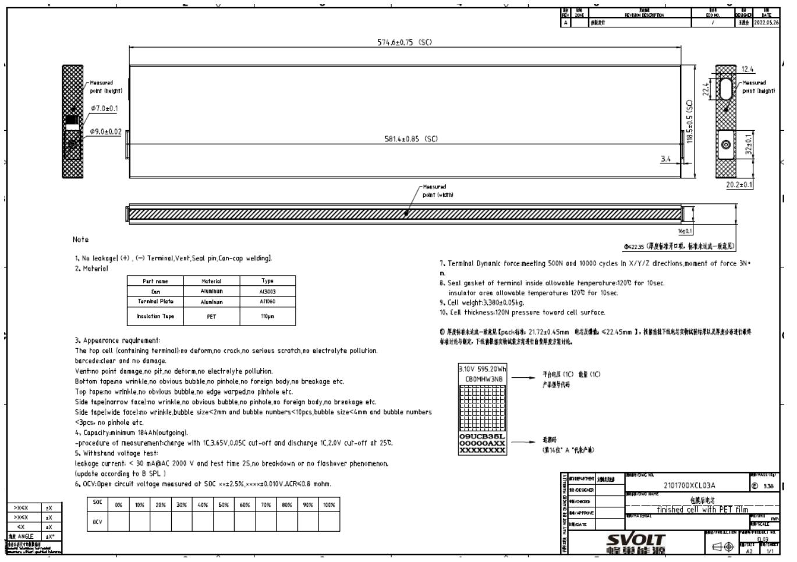

# 目 录 Contents

术语定义 Terms and Definitions .. ... 1  
1 样品电性能指标 Cell Performance .. ... 3  
1.1 主要性能 Main Performance.. ... 3  
1.2 标准充电条件(模式) Standard Charge Condition . ... 4  
1.2.1 标准充电电流电压 Current and voltage of standard charge . .... 4  
1.2.2 绝对充电温度 Absolute charge temperature.. .... 4  
1.2.3 绝对充电电压 Absolute charge voltage... ..... 4  
1.3 其他充电条件(模式) Other charge Conditions . ... 4  
1.3.1 阶梯充电 Step Charge.. .... 4  
1.4 放电模式/参数 Discharge Conditions.. ..... 8  
1.4.1 标准放电电流电压 Current and voltage of standard discharge ...... ....... 8  
1.4.2 最大持续放电电流 Maximum Continuous discharge current .... ....... 8  
1.4.3 最大脉冲放电电流(长脉冲) Maximum pulse discharge current（30s）.............. 8  
1.4.4 最大脉冲放电电流(短脉冲) Maximum pulse discharge current（10s）.............. 8  
1.4.5 绝对放电温度 Absolute charge temperature.... ....... 8  
1.5 脉冲放电模式 Pulse discharge specification... ....... 9  
1.5.1 最小脉冲放电截止电压 Minimum pulse discharge limit voltage ........ ....... 9  
1.5.2 允许的脉冲放电功率和持续时间(BOL) Pulse discharge power and continuous  
time (BOL).... ........ 9  
1.5.3 脉冲后保护模式 Protection mode after pulse discharge........... ....... 10  
1.6 再生脉冲充电模式 Regenerative pulse charge mode.... ....... 10  
1.6.1 最大再生脉冲充电电压 Maximum regenerative pulse charge voltage ................. 10  
1.6.2 允许的再生脉冲充电电流和持续时间 Regenerative pulse charge current and  
continuous time (BOL) .. ...... 10  
1.6.3 脉冲后保护模式 Protection mode after regenerative pulse charge ..... ....... 11  
1.7 高低温放电容量 Discharge Capacity at high and low temperature .... ...... 11  
1.7.1 $2 5 \textrm { ‰}$ 的容量 Capacity at $2 5 \mathrm { { ^ \circ C } }$ .. ...... 11  
1.7.2 55 ℃的容量 Capacity at ${ \bf 5 5 \% }$ .. ... 11  
1.7.3 $\mathbf { - 2 0 } \ \mathbf { \circ } \mathbf { C }$ 的容量 Capacity at $\mathbf { - } 2 \mathbf { 0 } ^ { \circ } \mathrm { C }$ .. ... 11

1.8 安全与可靠性 Safety an d reliability.... . 11

1.8.1 产品状态 Current status of product .. . 11   
1.8.2 国内和国际标准 Domestic and International Standard . . 11   
1.8.3 限制使用规定 Restrictions on use ... . 11   
1.9 电池自放电性能 Self-discharge performance. . 12   
2 电芯温升 Temperature rise.... . 12   
2.1 持续放电温升 Temperature rise of continuous discharge ... . 12   
2.2 脉冲放电温升 Temperature rise of pulse discharge...... . 12   
3 产品寿命终止管理 Cell end of life management . . 12   
4 应用条件 Application conditions ..... . 12   
4.1 电池应用相关条件 Application conditions of cell .. . 12   
4.2 避免电池到达过放状态 Avoid over-discharge of cell .. . 14   
4.3 低温充电保护 Low temperature charge protection .. . 15   
4.4 短期存放 Short-term storage .... .. 15   
4.5 长期存放 Long-term storage... . 15   
4.6 散热保护 Heat dissipation protection .. . 15   
4.7 防尘防水保护 Dustproof and waterproof protection...... . 16   
5 安全防范 Safety precautions ...... ... 16   
6 免责声明 Disclaimer ... . 18   
7 风险警告 Warning and risks... . 19   
7.1 警示声明 Warning statement . . 19   
7.2 危险类型 Types of Risks..... ... 19   
8 电芯图纸 Drawing.. .. 20

# 术语定义 Terms and Definitions

<table><tr><td>术语 Terms</td><td>定义 Definitions</td></tr><tr><td>产品 Product</td><td>本产品标准中的"产品"是指蜂巢能源公司生产的196Ah3.19V可充电铁锂动 力锂电池。 Product in this document is the 196Ah 3.19V rechargeable lithium ion battery to be supplied by SVOLT.</td></tr><tr><td>客户 Customer SVOLT</td><td>指《SVOLT产品销售合同》中的买方。 The buyer in the SVOLT product sales contract. 指《SVOLT产品销售合同》中的卖方。</td></tr><tr><td>周围环境温度 Ambient</td><td>The seller in the SVOLT product sales contract. 电池所处的周围环境温度。 The ambient temperature of cells.</td></tr><tr><td>temperature 电池管理系统 BMS</td><td>客户用于监测和记录产品在整个服务期限内的运行参数的一种有效的追踪 和控制系统。其追踪和记录的参数包括但不限于电压、电流、温度等，以控 制产品的运行并确保产品运行环境及运行条件符合本产品标准的规定。 Battery Management System. An effective tracking and control system is used by the customer to monitor and record the operational parameters of the product throughout the service life. These parameters, including but are not limited to voltage, current, temperature, etc., are used to control the operation of the product and ensure that the operating environment and conditions conform to the</td></tr><tr><td>电芯温度 Cell temperature</td><td>provisions of specification. 由接入电池的温度传感器测量的电芯的温度，温度传感器和测量线路的选 择由SVOLT和客户共同商定。 The cell temperature is measured by temperature sensor which is put in the cell. The selection of temperature sensor and measuring wire is agreed by SVOLT and</td></tr><tr><td>新鲜电池状态 State of Fresh cell</td><td>是指电池自产品下产线的日期算起7天以内的状态。 The state of cells within 7 days after manufacture of products complete and products are putted in the warehouse. 充电电流与电池管理系统多次测量的电池的容量值的比率。例如：电池容量</td></tr><tr><td>充电倍率 Rate of charge</td><td>为196Ah，充电电流为196A时，则充电倍率为1.0C；充电电流为65.3A，则 充电倍率为1/3C。当电池容量跌落为150Ah，充电电流为150A，则充电倍 率为1.0C；充电电流为50A，则充电倍率为1/3C。 The ratio of charge current to the capacity measured multiple times by BMS. For example, if the cell capacity is 196 Ah, the rates of charge at 196A and 65.3A are 1.0C and 1/3C separately; When the capacity is down to150Ah, the rates of charge at 150 A and 50A are 1.0C and 1/3C separately.</td></tr><tr><td>循环 Cycle</td><td>电池按规定的充放标准充放一次为一个循环。循环包括短时的正常充电或 者再生充电和放电过程的组合，在充电过程中有时只有正常充电而无再生 充电的情况。放电可以由多步放电过程组合在一起。</td></tr><tr><td colspan="1" rowspan="1"></td><td colspan="1" rowspan="1">Under the prescribed charge and discharge standards,one time of charge anddischarge is one cycle. The cycle is the combination of normal charge in shortperiod, regenerative charge and discharge. Sometimes during charging, there isonly normal charge and no regenerative charge. Discharge may have more thanone step.</td></tr><tr><td colspan="1" rowspan="1">生产日期Production date</td><td colspan="1" rowspan="1">电池的制造日期。每个相关的电池的顶端二维码上标示的明确的日期代码为制造日期。Cell assembly date. It is in the 2D code at the top of every cell</td></tr><tr><td colspan="1" rowspan="1">开路电压OCV</td><td colspan="1" rowspan="1">正常电芯没有接入任何负载和电路时测得的电池的电压。Open Circuit Voltage. The voltage of cellis measured without connecting to anyload or circuit.</td></tr><tr><td colspan="1" rowspan="1">可恢复容量Capacity recovery</td><td colspan="1" rowspan="1">电池储存后，按照本产品标准第1.2.1、1.4.1条所列的标准充放电条件所测得的容量，取值分别按照本产品标准第1.2.1、1.4.1条给出的充放电标准，分别选取3次测量的最大值。The maximum capacity of three cycles measured under the standard charge anddischarge conditions listed in specification 1.2.1 and 1.4.1 after storage.</td></tr><tr><td colspan="1" rowspan="1">产品供货协议Product    supplyagreement</td><td colspan="1" rowspan="1">SVOLT和客户共同签订的有关本产品标准产品的交易条款。The terms of trade for product that SVOLT and Customer signed together.</td></tr><tr><td colspan="1" rowspan="1">标准充电Standard charge</td><td colspan="1" rowspan="1">本产品标准第1.2.1条所述的充电模式。The charge mode described in section 1.2.1 of this specification.</td></tr><tr><td colspan="1" rowspan="1">标准放电Standard discharge</td><td colspan="1" rowspan="1">本产品标准第1.4.1条所述的放电模式。The discharge mode described in section 1.4.1 of this specification.</td></tr><tr><td colspan="1" rowspan="1">充电状态sOC</td><td colspan="1" rowspan="1">在无负载的情况下，以安培小时或者以瓦特小时为单位计量的电池充电容量状态的所有的线性关系。100%的充电状态表示电池满充到3.65V，0%的充电状态表示电池完全放电到2.0V。State of Charge. The percentage of charging capacity or energy that is measuredwithout load. 100%SOC is fully charge to 3.65V, 0%SOC is fully discharge to2.0V.</td></tr><tr><td colspan="1" rowspan="1">测量单位Unit of measure</td><td colspan="1" rowspan="1">V"(Volt）伏特(V)，电压单位A"(Ampere）安培(A)，电流单位“Ah"(Ampere-Hour）安培-小时(Ah)，负荷单位“Wh"(Watt-Hour）瓦特-小时(Wh)，能量单位“Ω"(Ohm）欧姆(Ω)，电阻单位“mΩ"(Milliohm）毫欧姆(mΩ)，电阻单位“C" (degree Celsius）摄氏度(C)，温度单位“mm"(millimeter） 毫米(mm)，长度单位“s"(second）秒(s)，时间单位“Hz"(Hertz）赫兹(Hz)，频率单位</td></tr></table>

# 1 样品电性能指标 Cell Performance

# 1.1 主要性能 Main Performance

<table><tr><td colspan="1" rowspan="1">No.</td><td colspan="1" rowspan="1">参数Item</td><td colspan="1" rowspan="1">产品规格 Specification</td><td colspan="1" rowspan="1">条件Condition</td></tr><tr><td colspan="1" rowspan="1">1.1.1</td><td colspan="1" rowspan="1">电芯容量Nominal Capacity</td><td colspan="1" rowspan="1">≥192 Ah≥196 Ah</td><td colspan="1" rowspan="1">25C,196A(1C)电流放电到2.0V25℃, 196 A(1C) DC to 2.0V25℃,65.3A(1/3C)电流放电到2.0V25C, 65.3 A(1/3C) DC to 2.0V</td></tr><tr><td colspan="1" rowspan="1">1.1.2</td><td colspan="1" rowspan="1">放电能量Energy</td><td colspan="1" rowspan="1">≥592.1 Wh≥625 Wh</td><td colspan="1" rowspan="1">25℃,196A(1C)电流放电到2.0V25℃, 196 A(1C) DC to 2.0V25℃,65.3A(1/3C)电流放电到2.0V25C, 65.3 A(1/3C) DC to 2.0V</td></tr><tr><td colspan="1" rowspan="1">1.1.3</td><td colspan="1" rowspan="1">能量密度Specific Energy</td><td colspan="1" rowspan="1">≥176 Wh/Kg≥185 Wh/Kg</td><td colspan="1" rowspan="1">25℃,196A(1C)电流放电到2.0V25℃,196 A(1C) DC to 2.0V25C,65.3A(1/3C)电流放电到2.0V25C,65.3 A(1/3C) DC to 2.0V</td></tr><tr><td colspan="1" rowspan="1">1.1.4</td><td colspan="1" rowspan="1">工作电压范围Operating voltage</td><td colspan="1" rowspan="1">2.0 ~3.65 V</td><td colspan="1" rowspan="1">5℃&lt;温度≤55℃5C&lt;T≤55℃-20℃&lt;温度≤5℃-20C&lt;T≤5℃-30℃&lt;温度≤-20℃-30C&lt;T≤-20℃</td></tr><tr><td colspan="1" rowspan="1">1.1.5</td><td colspan="1" rowspan="1">电池内阻(1KHz)ACR(1KHz)</td><td colspan="1" rowspan="1">≤0.45mΩ</td><td colspan="1" rowspan="1">25℃，新电池50%S0C 状态25℃, BOL, 50%SOC</td></tr><tr><td colspan="1" rowspan="1">1.1.6</td><td colspan="1" rowspan="1">电池出货电压Outgoing Voltage</td><td colspan="1" rowspan="1">3.305±0.004V</td><td colspan="1" rowspan="1">25℃，新电池50%SOC 状态25℃, BOL, 50%S0C</td></tr><tr><td colspan="1" rowspan="1">1.1.7</td><td colspan="1" rowspan="1">出货容量Outgoing capacity</td><td colspan="1" rowspan="1">≥196 Ah</td><td colspan="1" rowspan="1">25℃,65.3A(1/3C)电流放电至2.0V25C, 65.3A (1/3C) DC to 2.0V</td></tr><tr><td colspan="1" rowspan="1">1.1.8</td><td colspan="1" rowspan="1">工作温度(充电)Operating temperature-20~ 55℃(Charge)</td><td colspan="1" rowspan="1"></td><td colspan="1" rowspan="1">参考第1.2、1.3 节Refer to 1.2, 1.3</td></tr><tr><td colspan="1" rowspan="1">1.1.9</td><td colspan="1" rowspan="1">工作温度(放电)Operating temperature-30~ 55℃(discharge)</td><td colspan="1" rowspan="1"></td><td colspan="1" rowspan="1">参考第1.4、1.5节Refer to 1.4, 1.5</td></tr><tr><td colspan="1" rowspan="1">1.1.10</td><td colspan="1" rowspan="1">循环寿命Cycle life</td><td colspan="1" rowspan="1">≥2000</td><td colspan="1" rowspan="1">25℃, Step charge/1C, 3-100%SOC，80%SOH</td></tr><tr><td colspan="1" rowspan="1">1.1.11</td><td colspan="1" rowspan="1">室温放电功率dischargepower@25℃</td><td colspan="1" rowspan="1">≥2240W</td><td colspan="1" rowspan="1">25±3℃,50%SOC, 10 s</td></tr><tr><td colspan="1" rowspan="1">1.1.12</td><td colspan="1" rowspan="1">室温放电功率密度2dischargepower density@25℃</td><td colspan="1" rowspan="1">2662W/Kg</td><td colspan="1" rowspan="1">25±3℃,50%S0C,10 s</td></tr><tr><td colspan="1" rowspan="1">1.1.13</td><td colspan="1" rowspan="1">建议SOC使用范围RecommendedSOC range</td><td colspan="1" rowspan="1">3% - 100%</td><td colspan="1" rowspan="1"></td></tr><tr><td colspan="1" rowspan="1">1.1.14</td><td colspan="1" rowspan="1">电池重量Cell weight</td><td colspan="1" rowspan="1">3380±50 g</td><td colspan="1" rowspan="1">N.A.</td></tr><tr><td colspan="1" rowspan="1">1.1.15</td><td colspan="1" rowspan="1">电芯尺寸Cell dimension</td><td colspan="1" rowspan="1">请参考本产品标准第8条Refer to 8</td><td colspan="1" rowspan="1">N.A.</td></tr></table>

# 1.2 标准充电条件(模式) Standard Charge Condition

# 1.2.1 标准充电电流电压 Current and voltage of standard charge

正常工作的单体电池 $2 5 { \pm } 3 ^ { \circ } \mathrm { C }$ ，65.3A的恒流下进行充电，该单体电池最大充电电压 $3 . 6 5 \mathrm { V }$ 。

The operating temperature of cell is $2 5 { \pm } 3 ^ { \circ } \mathrm { C }$ , charge current is $6 5 . 3 \mathrm { ~ A ~ }$ , and the maximum charge voltage is 3.65V.

$2 5 ~ ^ { \circ } \mathrm { C }$ 下以65.3A恒流持续充电至单体电池最大 $3 . 6 5 \mathrm { V }$ ，然后在常压3.65 V下恒压持续充电直至电流达到 $9 . 2 \pm 0 . 3 \mathrm { ~ A ~ }$ 。

At $2 5 \mathrm { { ^ \circ C } }$ , charge to $3 . 6 5 \mathrm { V }$ at 65.3A, then continue to charge at $3 . 6 5 \mathrm { V }$ until the current is $9 . 8 { \pm } 0 . 3 \mathrm { A }$

# 1.2.2 绝对充电温度 Absolute charge temperature

无论电芯处在何种充电模式，一旦发现电芯温度超过绝对充电温度- ${ } _ { - 2 0 } \circ _ { \mathrm { C } \sim 5 5 ^ { \circ } \mathrm { C } }$ 范围即停止充电。

No matter what charging mode, charging will cut off immediately once the cell temperature exceeds the range of $- 2 0 ^ { \circ } \mathrm { C } { - } 5 5 ^ { \circ } \mathrm { C }$ .

# 1.2.3 绝对充电电压 Absolute charge voltage

无论电芯处在何种充电模式包括再生充电状态，一旦发现电芯电压超过绝对充电电压最大3.65 V范围即停止充电。

No matter what charging mode, including regenerative charge, charging will cut off immediately once the cell voltage exceeds 3.65V.

# 1.3 其他充电条件(模式) Other charge Conditions

# 1.3.1 阶梯充电 Step Charge

<table><tr><td>电芯温度 Cell Temperature</td><td>充电制度 Charge Profile</td></tr><tr><td>&lt; -20℃</td><td>不允许充电 No charging</td></tr></table>

<table><tr><td rowspan=8 colspan=1>-20℃≤T&lt;-15℃</td><td rowspan=8 colspan=1></td><td rowspan=8 colspan=3>电流，A                            SOCCurrent, A0.08C                               10%0.05C                              30%0.04C                              50%0.03C                              70%0.02C                             3.65V</td></tr><tr><td rowspan=1 colspan=1>电流，ACurrent, A</td><td rowspan=1 colspan=1>SOC</td></tr><tr><td rowspan=1 colspan=1>0.08C</td><td rowspan=1 colspan=1>10%</td></tr><tr><td rowspan=1 colspan=1>0.05C</td><td rowspan=1 colspan=1>30%</td></tr><tr><td rowspan=1 colspan=1>0.04C</td><td rowspan=1 colspan=1>50%</td></tr><tr><td rowspan=1 colspan=1>0.03C</td><td rowspan=1 colspan=1>70%</td></tr><tr><td rowspan=1 colspan=1>0.02C</td><td rowspan=1 colspan=1>3.65V</td></tr><tr></tr><tr><td rowspan=8 colspan=1>-15℃C≤T&lt;-10℃</td><td rowspan=8 colspan=1></td><td></td><td></td><td rowspan=8 colspan=1></td></tr><tr><td rowspan=1 colspan=1>电流，ACurrent, A</td><td rowspan=1 colspan=1>SOC</td></tr><tr><td rowspan=1 colspan=1>0.12C</td><td rowspan=1 colspan=1>20%</td></tr><tr><td rowspan=1 colspan=1>0.08C</td><td rowspan=1 colspan=1>50%</td></tr><tr><td rowspan=1 colspan=1>0.04C</td><td rowspan=1 colspan=1>70%</td></tr><tr><td rowspan=1 colspan=1>0.03C</td><td rowspan=1 colspan=1>80%</td></tr><tr><td rowspan=1 colspan=1>0.02C</td><td rowspan=1 colspan=1>3.65V</td></tr><tr><td></td><td></td></tr><tr><td rowspan=10 colspan=1>-10C≤T&lt;-5℃</td><td rowspan=10 colspan=1></td><td></td><td></td><td rowspan=10 colspan=1></td></tr><tr><td rowspan=1 colspan=1>电流，ACurrent, A</td><td rowspan=1 colspan=1>SOC</td></tr><tr><td rowspan=1 colspan=1>0.20C</td><td rowspan=1 colspan=1>10%</td></tr><tr><td rowspan=1 colspan=1>0.15C</td><td rowspan=1 colspan=1>20%</td></tr><tr><td rowspan=1 colspan=1>0.1C</td><td rowspan=1 colspan=1>50%</td></tr><tr><td rowspan=1 colspan=1>0.06C</td><td rowspan=1 colspan=1>70%</td></tr><tr><td rowspan=1 colspan=1>0.04C</td><td rowspan=1 colspan=1>80%</td></tr><tr><td rowspan=1 colspan=1>0.03C</td><td rowspan=1 colspan=1>90%</td></tr><tr><td rowspan=1 colspan=1>0.02C</td><td rowspan=1 colspan=1>3.65V</td></tr><tr><td rowspan=1 colspan=2></td></tr><tr><td rowspan=8 colspan=5>电流，A                            SOCCurrent, A0.30C                               10%0.2C                               20%0.15C                               50%0.1C                               70%-5°℃≤T&lt;0°℃0.06C                               80%0.04C                              60%0.03C                             3.65V</td></tr><tr><td rowspan=1 colspan=1>0.30C</td><td rowspan=1 colspan=1>10%</td></tr><tr><td rowspan=1 colspan=1>0.2C</td><td rowspan=1 colspan=1>20%</td></tr><tr><td rowspan=1 colspan=1>0.15C</td><td rowspan=1 colspan=1>50%</td></tr><tr><td rowspan=1 colspan=1>0.1C</td><td rowspan=1 colspan=1>70%</td></tr><tr><td rowspan=1 colspan=1>0.06C</td><td rowspan=1 colspan=1>80%</td></tr><tr><td rowspan=1 colspan=1>0.04C</td><td rowspan=1 colspan=1>60%</td></tr><tr><td rowspan=1 colspan=1>0.03C</td><td rowspan=1 colspan=1>3.65V</td></tr></table>

$0 \ ^ { \circ } \mathrm { C } { \le } \mathrm { T } { < } 5 \ ^ { \circ } \mathrm { C }$

<table><tr><td rowspan=1 colspan=1>电流，ACurrent, A</td><td rowspan=1 colspan=1>SOC</td></tr><tr><td rowspan=1 colspan=1>0.40C</td><td rowspan=1 colspan=1>10%</td></tr><tr><td rowspan=1 colspan=1>0.30C</td><td rowspan=1 colspan=1>20%</td></tr><tr><td rowspan=1 colspan=1>0.20C</td><td rowspan=1 colspan=1>50%</td></tr><tr><td rowspan=1 colspan=1>0.15C</td><td rowspan=1 colspan=1>70%</td></tr><tr><td rowspan=1 colspan=1>0.10C</td><td rowspan=1 colspan=1>80%</td></tr><tr><td rowspan=1 colspan=1>0.06C</td><td rowspan=1 colspan=1>90%</td></tr><tr><td rowspan=1 colspan=1>0.04C</td><td rowspan=1 colspan=1>3.65V</td></tr></table>

5 ℃≤T<10 ℃

<table><tr><td rowspan=1 colspan=1>电流，ACurrent, A</td><td rowspan=1 colspan=1>SOC</td></tr><tr><td rowspan=1 colspan=1>0.60C</td><td rowspan=1 colspan=1>20%</td></tr><tr><td rowspan=1 colspan=1>0.40C</td><td rowspan=1 colspan=1>50%</td></tr><tr><td rowspan=1 colspan=1>0.30C</td><td rowspan=1 colspan=1>70%</td></tr><tr><td rowspan=1 colspan=1>0.20C</td><td rowspan=1 colspan=1>80%</td></tr><tr><td rowspan=1 colspan=1>0.12C</td><td rowspan=1 colspan=1>90%</td></tr><tr><td rowspan=1 colspan=1>0.06C</td><td rowspan=1 colspan=1>3.65V</td></tr></table>

<table><tr><td rowspan=11 colspan=1>10°℃≤T&lt;15℃</td><td rowspan=1 colspan=1>电流，ACurrent, A</td><td rowspan=1 colspan=1>SOC</td></tr><tr><td rowspan=1 colspan=1>0.90C</td><td rowspan=1 colspan=1>20%</td></tr><tr><td rowspan=1 colspan=1>0.70C</td><td rowspan=1 colspan=1>40%</td></tr><tr><td rowspan=1 colspan=1>0.60C</td><td rowspan=1 colspan=1>50%</td></tr><tr><td rowspan=1 colspan=1>0.55C</td><td rowspan=1 colspan=1>60%</td></tr><tr><td rowspan=1 colspan=1>0.40C</td><td rowspan=1 colspan=1>70%</td></tr><tr><td rowspan=1 colspan=1>0.35C</td><td rowspan=1 colspan=1>80%</td></tr><tr><td rowspan=1 colspan=1>0.20C</td><td rowspan=1 colspan=1>85%</td></tr><tr><td rowspan=1 colspan=1>0.16C</td><td rowspan=1 colspan=1>90%</td></tr><tr><td rowspan=1 colspan=1>0.10C</td><td rowspan=1 colspan=1>95%</td></tr><tr><td rowspan=1 colspan=1>0.06C</td><td rowspan=1 colspan=1>3.65V</td></tr></table>

<table><tr><td colspan="1" rowspan="10">15°℃≤T&lt;20℃</td><td colspan="1" rowspan="10"></td><td colspan="1" rowspan="1">Current, A</td><td colspan="1" rowspan="1"></td><td colspan="1" rowspan="10"></td></tr><tr><td colspan="1" rowspan="1">1.20C</td><td colspan="1" rowspan="1">20%</td></tr><tr><td colspan="1" rowspan="1">1.00C</td><td colspan="1" rowspan="1">40%</td></tr><tr><td colspan="1" rowspan="1">0.70C</td><td colspan="1" rowspan="1">60%</td></tr><tr><td colspan="1" rowspan="1">0.46C</td><td colspan="1" rowspan="1">70%</td></tr><tr><td colspan="1" rowspan="1">0.40C</td><td colspan="1" rowspan="1">80%</td></tr><tr><td colspan="1" rowspan="1">0.26C</td><td colspan="1" rowspan="1">85%</td></tr><tr><td colspan="1" rowspan="1">0.22C</td><td colspan="1" rowspan="1">90%</td></tr><tr><td colspan="1" rowspan="1">0.14C</td><td colspan="1" rowspan="1">95%</td></tr><tr><td colspan="1" rowspan="1">0.07C</td><td colspan="1" rowspan="1">3.65V</td></tr><tr><td colspan="1" rowspan="9">20°C≤T&lt;25℃</td><td colspan="4" rowspan="9">电流，A                            SOCCurrent, A1.60C                              35%1.40C                              55%1.00C                              75%0.45C                              80%0.40C                              90%0.18C                              95%0.10C                             3.65V</td></tr><tr><td colspan="1" rowspan="1">电流，ACurrent, A</td><td colspan="1" rowspan="1">SOC</td></tr><tr><td colspan="1" rowspan="1">1.60C</td><td colspan="1" rowspan="1">35%</td></tr><tr><td colspan="1" rowspan="1">1.40C</td><td colspan="1" rowspan="1">55%</td></tr><tr><td colspan="1" rowspan="1">1.00C</td><td colspan="1" rowspan="1">75%</td></tr><tr><td colspan="1" rowspan="1">0.45C</td><td colspan="1" rowspan="1">80%</td></tr><tr><td colspan="1" rowspan="1">0.40C</td><td colspan="1" rowspan="1">90%</td></tr><tr><td colspan="1" rowspan="1">0.18C</td><td colspan="1" rowspan="1">95%</td></tr><tr><td colspan="1" rowspan="1">0.10C</td><td colspan="1" rowspan="1">3.65V</td></tr><tr><td colspan="1" rowspan="8">25℃≤T&lt;45℃</td><td colspan="1" rowspan="8"></td><td colspan="1" rowspan="1">电流，ACurrent, A</td><td colspan="1" rowspan="1">SOC</td><td colspan="1" rowspan="8"></td></tr><tr><td colspan="1" rowspan="1">2.1C</td><td colspan="1" rowspan="1">35%</td></tr><tr><td colspan="1" rowspan="1">1.80C</td><td colspan="1" rowspan="1">55%</td></tr><tr><td colspan="1" rowspan="1">1.30C</td><td colspan="1" rowspan="1">75%</td></tr><tr><td colspan="1" rowspan="1">0.90C</td><td colspan="1" rowspan="1">80%</td></tr><tr><td colspan="1" rowspan="1">0.65C</td><td colspan="1" rowspan="1">90%</td></tr><tr><td colspan="1" rowspan="1">0.30C</td><td colspan="1" rowspan="1">95%</td></tr><tr><td colspan="1" rowspan="1">0.20C</td><td colspan="1" rowspan="1">3.65V</td></tr><tr><td colspan="1" rowspan="9">45℃≤T≤50℃</td><td colspan="1" rowspan="9"></td><td colspan="1" rowspan="1">电流，ACurrent, A</td><td colspan="1" rowspan="1">SOC</td><td colspan="1" rowspan="9"></td></tr><tr><td colspan="1" rowspan="1">1.35C</td><td colspan="1" rowspan="1">20%</td></tr><tr><td colspan="1" rowspan="1">1.25C</td><td colspan="1" rowspan="1">40%</td></tr><tr><td colspan="1" rowspan="1">1.05C</td><td colspan="1" rowspan="1">60%</td></tr><tr><td colspan="1" rowspan="1">0.80C</td><td colspan="1" rowspan="1">75%</td></tr><tr><td colspan="1" rowspan="1">0.60C</td><td colspan="1" rowspan="1">80%</td></tr><tr><td colspan="1" rowspan="1">0.40C</td><td colspan="1" rowspan="1">90%</td></tr><tr><td colspan="1" rowspan="1">0.15C</td><td colspan="1" rowspan="1">95%</td></tr><tr><td colspan="1" rowspan="1">0.10C</td><td colspan="1" rowspan="1">3.65V</td></tr><tr><td colspan="1" rowspan="8">50℃≤T≤55℃</td><td colspan="1" rowspan="8"></td><td colspan="1" rowspan="1">电流，ACurrent, A</td><td colspan="1" rowspan="1">SOC</td><td colspan="3" rowspan="8"></td></tr><tr><td colspan="1" rowspan="1">1.00C</td><td colspan="3" rowspan="1">20%</td></tr><tr><td colspan="1" rowspan="1">0.90C</td><td colspan="3" rowspan="1">40%</td></tr><tr><td colspan="1" rowspan="1">0.80C</td><td colspan="3" rowspan="1">60%</td></tr><tr><td colspan="1" rowspan="1">0.60C</td><td colspan="3" rowspan="1">75%</td></tr><tr><td colspan="1" rowspan="1">0.33C</td><td colspan="3" rowspan="1">90%</td></tr><tr><td colspan="1" rowspan="1">0.12C</td><td colspan="3" rowspan="1">95%</td></tr><tr><td colspan="1" rowspan="1">0.1C</td><td colspan="3" rowspan="1">3.65V</td></tr><tr><td colspan="1" rowspan="1">55℃&lt;T</td><td colspan="6" rowspan="1">不允许充电No charging</td></tr></table>

# 1.4 放电模式/参数 Discharge Conditions

# 1.4.1 标准放电电流电压 Current and voltage of standard discharge

正常工作的单体电池 $2 5 { \pm } 3 ~ ^ { \circ } \mathrm { C }$ ，65.3A的恒流下进行放电，该单体电池最低放电电压$2 . 0 \mathrm { V }$ 。

The operating temperature of cell is $2 5 { \pm } 3 ^ { \circ } \mathrm { C }$ , discharge current is 65.3A, and the minimum discharge voltage is $2 . 0 \mathrm { V }$ .

# 1.4.2 最大持续放电电流 Maximum Continuous discharge current

正常工作的单体电池 $2 5 { \pm } 3 ~ ^ { \circ } \mathrm { C }$ ， $1 9 6 \mathrm { \ A }$ 的恒流下进行放电。

At $2 5 { \pm } 3 ^ { \circ } \mathrm { C }$ , the maximum continuous discharge current is 196A.

# 1.4.3 最大脉冲放电电流(长脉冲) Maximum pulse discharge current（30s）

正常工作的单体电池 $2 5 { \pm } 3 ~ ^ { \circ } \mathrm { C }$ ， $50 \%$ SOC状态下，最大脉冲放电电流852A，最长放电时间为 $3 0 \mathrm { s }$ 。

The maximum current of 30s pulse discharge is 852A at $5 0 \% \mathrm { S O C }$ at $2 5 { \pm } 3 ^ { \circ } \mathrm { C }$ .

# 1.4.4 最大脉冲放电电流(短脉冲) Maximum pulse discharge current（10s）

正常工作的单体电芯 $2 5 { \pm } 3 ~ ^ { \circ } \mathrm { C }$ ， $50 \%$ SOC状态下，最大脉冲放电电流1000A，电芯温度低于 $5 0 ~ ^ { \circ } \mathrm { C }$ ，且最长放电时间为 $1 0 ~ \mathrm { s }$ 。

The maximum current of 10s pulse discharge is 1000A at $5 0 \% \mathrm { S O C }$ at $2 5 { \pm } 3 ^ { \circ } \mathrm { C }$ , and the cell temperature shall not exceed $5 0 \mathrm { { } ^ { \circ } C }$ .

# 1.4.5 绝对放电温度 Absolute charge temperature

持续放电模式或脉冲放电模式，若电芯温度超过绝对放电温度 ${ } _ { - 3 0 - 5 5 } \mathrm { ~ } ^ { \circ } \mathrm { C }$ ，则停止放电。

No matter what discharging mode (continuous or pulse discharge), the discharge will cut off immediately once the cell temperature exceeds $- 3 0 ^ { \circ } \mathrm { C } { - } 5 5 ^ { \circ } \mathrm { C }$ .

# 1.5 脉冲放电模式 Pulse discharge specification

是指在产品使用过程中，电芯进行脉冲放电。脉冲放电必须严格符合本产品标准所述的充电状态和电芯温度条件。脉冲电流的大小和持续时间必须严格遵守下表所列的所有充电状态以及电芯温度等条件。违反脉冲放电条件可能会造成电芯永久性的损坏并进而免除SVOLT的产品质量责任。

During discharge, the current isn’t constant and changes in certain range with time. Pulse discharge must strictly comply with the charge state and temperature conditions of cells described in this specification. The value and continuous times of the pulse current must be also in strict accordance with the charge state and temperature conditions listed in table below. Violation of pulse discharge conditions may cause permanent damage to the cell and thereby exempt product quality responsibility of SVOLT.

1.5.1 最小脉冲放电截止电压 Minimum pulse discharge limit voltage  

<table><tr><td>-30°C≤T&lt;55C</td></tr><tr><td>2.0 V</td></tr></table>

1.5.2 允许的脉冲放电功率和持续时间(BOL) Pulse discharge power and continuous time (BOL)   

<table><tr><td rowspan=1 colspan=1>电芯温度，℃Cell Temperature, ℃</td><td rowspan=1 colspan=1>功率（20%S0C），WPower(20%SOC), W</td><td rowspan=1 colspan=1>放电时间，sDischarge time, s</td></tr><tr><td rowspan=1 colspan=1>&lt;-30</td><td rowspan=1 colspan=1>不允许No discharging</td><td rowspan=1 colspan=1>不允许No discharging</td></tr><tr><td rowspan=1 colspan=1>≥-30</td><td rowspan=1 colspan=1>117</td><td rowspan=1 colspan=1>30</td></tr><tr><td rowspan=1 colspan=1>≥-20</td><td rowspan=1 colspan=1>204</td><td rowspan=1 colspan=1>30</td></tr><tr><td rowspan=1 colspan=1>≥-10</td><td rowspan=1 colspan=1>330</td><td rowspan=1 colspan=1>30</td></tr><tr><td rowspan=1 colspan=1>≥0</td><td rowspan=1 colspan=1>566</td><td rowspan=1 colspan=1>30</td></tr><tr><td rowspan=1 colspan=1>≥10</td><td rowspan=1 colspan=1>721</td><td rowspan=1 colspan=1>30</td></tr><tr><td rowspan=1 colspan=1>≥25</td><td rowspan=1 colspan=1>1159</td><td rowspan=1 colspan=1>30</td></tr><tr><td rowspan=1 colspan=1>≥45</td><td rowspan=1 colspan=1>1190</td><td rowspan=1 colspan=1>30</td></tr><tr><td rowspan=1 colspan=1>≥55</td><td rowspan=1 colspan=1>不允许No discharging</td><td rowspan=1 colspan=1>不允许No discharging</td></tr></table>

# 1.5.3 脉冲后保护模式 Protection mode after pulse discharge

每次脉冲放电后,电池需要有段休眠时期，时间应等于或长于再生脉冲持续时间。休眠时期内，电池可以处于标准放电状态或充电状态，也可以处于零电流不工作状态，但在休眠时期内，不允许电池再次发生脉冲放电现象。

After each pulse discharge, Cells need to sleep for a period equal to or longer than the regeneration pulse time. During the dormancy period, cells can be in the standard discharge state or charge state, or in the non-working state, but cells are not allowed to occur pulse discharge again.

# 1.6 再生脉冲充电模式 Regenerative pulse charge mode

再生脉冲充电是指在产品使用过程中，脉冲电流对电芯的反充电。再生脉冲充电必须严格符合本规格所述的充电状态和电芯温度条件。脉冲电流的大小和持续时间必须严格遵守下表所列的所有充电状态以及电芯温度等条件。违反再生脉冲充电条件可能会造成电芯永久性的损坏并进而免除SVOLT的产品质量责任。

During used products, the regenerative pulse charge mode refers to the reverse charging of the cell by the pulse current. The regenerative pulse charge must strictly comply with the charge state and temperature conditions of cells described in this specification. The value and continuous times of the pulse current must be also in strict accordance with the charge state and temperature conditions listed in table below. Violation of regenerative pulse charge conditions may cause permanent damage to the cell and thereby exempt product quality responsibility of SVOLT.

# 1.6.1 最大再生脉冲充电电压 Maximum regenerative pulse charge voltage

最大再生脉冲充电截止电压为 $3 . 6 5 \mathrm { V }$ 。

The maximum regenerative pulse charge voltage is $3 . 6 5 \mathrm { V }$ .

1.6.2 允许的再生脉冲充电电流和持续时间 Regenerative pulse charge current and

continuous time (BOL)   

<table><tr><td colspan="1" rowspan="1">电芯温度，℃Cell Temperature, ℃</td><td colspan="1" rowspan="1">电流（80%S0C），ACurrent(80%SOC), A</td><td colspan="1" rowspan="1">充电时间，sCharge time, s</td></tr><tr><td colspan="1" rowspan="1">&lt;-20</td><td colspan="1" rowspan="1">不允许No Charging</td><td colspan="1" rowspan="1">不允许No Charging</td></tr><tr><td colspan="1" rowspan="1">≥-20</td><td colspan="1" rowspan="1">24</td><td colspan="1" rowspan="1">10</td></tr><tr><td colspan="1" rowspan="1">≥-10</td><td colspan="1" rowspan="1">51</td><td colspan="1" rowspan="1">10</td></tr><tr><td colspan="1" rowspan="1">≥0</td><td colspan="1" rowspan="1">127</td><td colspan="1" rowspan="1">10</td></tr><tr><td colspan="1" rowspan="1">≥10</td><td colspan="1" rowspan="1">272</td><td colspan="1" rowspan="1">10</td></tr><tr><td colspan="1" rowspan="1">≥25</td><td colspan="1" rowspan="1">636</td><td colspan="1" rowspan="1">10</td></tr><tr><td colspan="1" rowspan="1">≥45</td><td colspan="1" rowspan="1">630</td><td colspan="1" rowspan="1">10</td></tr><tr><td colspan="1" rowspan="1">≥55</td><td colspan="1" rowspan="1">不允许</td><td colspan="1" rowspan="1">不允许</td></tr><tr><td></td><td>No Charging</td><td>No Charging</td></tr></table>

# 1.6.3 脉冲后保护模式 Protection mode after regenerative pulse charge

每次再生脉冲充电后，电池需要有段休眠时期，时间应等于或长于再生脉冲持续时间。休眠时期内，电池可以处于放电状态，也可以处于零电流不工作状态，但在休眠时期内，不允许电池再次发生再生脉冲充电现象。

After each regenerative pulse charge, cells need to sleep for a period equal to or longer than the regeneration pulse time. During the dormancy period, cells can be in the standard discharge state or in the non-working state, but cells are not allowed to occur regenerative pulse charge again.

# 1.7 高低温放电容量 Discharge Capacity at high and low temperature

# 1.7.1 $2 5 \mathrm { { } ^ { \circ } C }$ 的容量 Capacity at ${ \bf 2 5 ^ { \circ } C }$

放电容量 $\geq 1 9 6 ~ \mathrm { A h }$ 。新电池状态， $2 5 ~ ^ { \circ } \mathrm { C }$ 标准充\放电。   
Discharge Capacity $\geq 1 9 6 \mathrm { A h }$ (BOL, $2 5 \mathrm { { ^ \circ C } }$ , standard charge/discharge).

# 1.7.2 $5 5 ~ { ^ \circ } \mathrm { C }$ 的容量 Capacity at $5 5 \mathrm { { ^ \circ C } }$

放电容量 $\geq 1 9 6 ~ \mathrm { A h }$ 。新电池状态， $2 5 ~ ^ { \circ } \mathrm { C }$ 标准充电， $5 5 ~ ^ { \circ } \mathrm { C }$ 标准放电。  
Discharge Capacity $\geq 1 9 6$ Ah (BOL, standard charge at $2 5 \mathrm { { ^ \circ C } }$ and standard discharge at $5 5 ^ { \circ } \mathrm { C }$ ).

# 1.7.3 $\mathbf { - 2 0 } ^ { \circ } \mathbf { C }$ 的容量 Capacity at $\mathbf { \nabla } _ { - 2 0 } \circ \mathbf { C }$

放电容量 $\geq 1 3 7 . 2 \mathrm { A h }$ 。新电池状态， $2 5 ~ ^ { \circ } \mathrm { C }$ 标准充电， ${ } _ { - 2 0 } \mathrm { { } ^ { \circ } C }$ 标准放电(无风环境)。

Discharge Capacity $\ge 1 3 7 . 2$ Ah .BOL, standard charge at $2 5 \mathrm { { ^ \circ C } }$ , standard discharge at $- 2 0 \mathrm { { } ^ { \circ } C }$ (no wind environment).

# 1.8 安全与可靠性 Safety an d reliability

# 1.8.1 产品状态 Current status of product

本产品处于 A样开发阶段，如上寿命数据规格等为预测值，仅供参考。量产阶段产品规格需重新定义，提供正式产品标准。

Products are in Phase A. Data including cycle in this document is predicted value, only for reference. The specification of product needs to redefine and is supplied in mass production.

# 1.8.2 国内和国际标准 Domestic and International Standard

本产品满足 GB 新国标要求。   
This products meet the requirements of GB standard.   
本产品满足 UN38.3 国际标准要求。   
This products meet the requirements of UN38.3 standard.

# 1.8.3 限制使用规定 Restrictions on use

本产品仅供公告、测试等使用，禁止出售到终端客户。

This products are only for announcement, testing and other use, prohibited to sell to end customers.

# 1.9 电池自放电性能 Self-discharge performance

标准充电到 $100 \%$ 的充电状态， $2 5 ~ ^ { \circ } \mathrm { C }$ 温度储存 30 天，容量损失 $leq 3 \%$ 。

The cell is stored at full charge for 30 days at room temperature. The capacity loss is less than $3 \%$ of the initial capacity.

# 2 电芯温升 Temperature rise

本产品标准中温升是指放电后的电池表面温度减去放电前的电池表面温度。电池温升的测量应在环境温度较为稳定且空间足够大的房间里进行。每个电池温度测量应选取经过校正的可以记录时间数据的温度感应器。

In this specification, temperature rise is difference of the temperature between after discharge and before discharge. The test should be done in a room with stable ambient temperature and large enough space. For getting temperature of each cell, temperature sensors should be calibrated and time data will be recorded during testing.

# 2.1 持续放电温升 Temperature rise of continuous discharge

$0 \ { } ^ { \circ } \mathrm { C }$ 以上，电池以 65.3A 电流放电 $3 0 \mathrm { { m i n } }$ ，放电温升 $\leq 1 0 ~ ^ { \circ } \mathrm { C }$ 。

The temperature rise of continuous discharge is equal to and less than $1 0 \mathrm { { } ^ { \circ } C }$ when discharging 30min at 65.3A current at $0 \%$ above.

# 2.2 脉冲放电温升 Temperature rise of pulse discharge

$0 \ { } ^ { \circ } \mathrm { C }$ 以上，在任何充电状态下，电池以 $6 5 . 3 \mathrm { ~ A ~ }$ 电流放电 $3 0 \mathrm { s }$ ，放电温升 $\leq 1 0 ~ ^ { \circ } \mathrm { C }$ 。

The temperature rise of pulse discharge is equal to and less than $1 0 \mathrm { { ^ \circ C } }$ when discharging 30s at 65.3A current at any SOC at $0 \%$ above.

# 3 产品寿命终止管理 Cell end of life management

为了确保电池的安全应用，客户需要建立有效的跟踪系统监测并记录每个电池的内阻和容量。内阻以及容量的测量方法和计算方法需要客户和 SVOLT 共同讨论和双方同意。当使用中的电池的内阻超过这个电池最初的内阻的 $100 \%$ 时，应停止使用电池。违反该项要求，将免除 SVOLT 依据产品销售协议以及本产品标准所应承担的产品质量保证责任。

For ensuring cell safety, an effective tracking system should be established to monitor and record the internal resistance and capacity of each cell during service life. Measurement and calculation of internal resistance and capacity shall be discussed and agreed by both customer and SVOLT. When the internal resistance of cell in use exceeds $100 \%$ of the initial, the cell should be stopped to use. Violation of this rules may exempt product quality responsibility of SVOLT in product supply agreement and this document.

# 4 应用条件 Application conditions

# 4.1 电池应用相关条件 Application conditions of cell

客户应当确保严格遵守以下与电池相关的应用条件：

Customers should ensure strict compliance with the following application conditions:

4.1.1 客户应配置电池管理系统，严密监控、管理与保护每个电池。

4.1.1 Customers should configure battery management system to closely monitor, manage and protect each cell.

4.1.2 客户应向SVOLT 提供电池管理系统详细的设计方案、系统特点、框架、系统数据、格式等相关信息，以供 SVOLT 对该系统进行设计评估，并建立电池管理档案。

4.1.2 Customers should provide SVOLT with detailed design scheme, system characteristics, framework, system data, format and other relevant information of the battery management system, ensuring SVOLT can be evaluated of the system and establish battery management files.

4.1.3 未经SVOLT 同意，客户不可擅自修改或者改变电池管理系统的设计和框架，以免影响电池的使用性能。

4.1.3 Without SVOLT's consent, customers should not modify or change the design and framework of the battery management system to avoid affecting the performance of cells.

4.1.4 客户应保存完整的电池运转的监测数据，用作产品质量责任划分的参考。不具备完整的电池系统使用期限内的检测数据的，SVOLT 不承担产品质量保证责任。

4.1.4 Customers should keep complete battery operation monitoring data for the reference of product quality responsibility division. SVOLT does not assume responsibility for the design of a complete battery system without monitoring data during lifetime.

4.1.5 电池管理系统需满足以下最基本的检测和控制要求：

4.1.5 The battery management system should meet the following basic measuring and control requirements:

<table><tr><td colspan="1" rowspan="1">No.</td><td colspan="1" rowspan="1">参数Parameters</td><td colspan="1" rowspan="1">产品规格Specification</td><td colspan="1" rowspan="1">保护动作Protective Action</td></tr><tr><td colspan="1" rowspan="1">4.1.5.1</td><td colspan="1" rowspan="1">充电终止Charge end</td><td colspan="1" rowspan="1">3.65V</td><td colspan="1" rowspan="1">当电池的电压达到3.65V时终止充电When cell voltage reaches to 3.65V,cut off charging.</td></tr><tr><td colspan="1" rowspan="1">4.1.5.2</td><td colspan="1" rowspan="1">第一级过充电保护Overchargeprotection Level 1</td><td colspan="1" rowspan="1">≥3.65 V</td><td colspan="1" rowspan="1">当电池电压达到3.65V终止充电When cell voltage reaches to 3.65V,cut off charging.</td></tr><tr><td colspan="1" rowspan="1">4.1.5.3</td><td colspan="1" rowspan="1">第二级过充电保护Overcharge protection Level 2</td><td colspan="1" rowspan="1">≥3.8 V</td><td colspan="1" rowspan="1">当电池电压达到3.8V终止充电，并锁定电池管理系统直到技术人员解决问题When cell voltage reaches to 3.8 V,cut off charging and the batterymanagement system is locked untilthe technician solves the problem.</td></tr><tr><td colspan="1" rowspan="1">4.1.5.4</td><td colspan="1" rowspan="1">放电终止Discharge end</td><td colspan="1" rowspan="1">2.0 V</td><td colspan="1" rowspan="1">终止放电当电池的电压到达2.0V,将电流降到最小When cell voltage reaches to 2.0 V,cut off discharging.</td></tr><tr><td colspan="1" rowspan="1">4.1.5.5</td><td colspan="1" rowspan="1">第一级过放保护</td><td colspan="1" rowspan="1">≤2.0 V</td><td colspan="1" rowspan="1">终止放电当电池的电压到达2.0V,将电流降到最小</td></tr><tr><td colspan="1" rowspan="1"></td><td colspan="1" rowspan="1">Overdischargeprotection Level 1</td><td colspan="1" rowspan="1"></td><td colspan="1" rowspan="1">When cell voltage reaches to 2.0 V,cut off discharging.</td></tr><tr><td colspan="1" rowspan="1">4.1.5.6</td><td colspan="1" rowspan="1">第二级过放保护Overdischargeprotection Level 2</td><td colspan="1" rowspan="1">≤1.8 V</td><td colspan="1" rowspan="1">当电池电压低于1.8V时锁定电池管理系统直到技术人员解决问题When cell voltage reaches to 1.8 V,cut off discharging and the batterymanagement system is locked untilthe technician solves the problem.</td></tr><tr><td colspan="1" rowspan="1">4.1.5.7</td><td colspan="1" rowspan="1">短路保护Short       circuit protection</td><td colspan="1" rowspan="1">不允许短路Notallowedtoshort</td><td colspan="1" rowspan="1">发生短路时，由过流器断开电池(电路Incase of short circuit, fusedisconnects the circuit.</td></tr><tr><td colspan="1" rowspan="1">4.1.5.8</td><td colspan="1" rowspan="1">过流保护Overcurrent protection</td><td colspan="1" rowspan="1">参考第1.4节放电要求Refer to 1.4</td><td colspan="1" rowspan="1">电池管理系统控制放电电流符合规格The battery management systemcontrols the discharge current inaccordance with this specification</td></tr><tr><td colspan="1" rowspan="1">4.1.5.9</td><td colspan="1" rowspan="1">过热保护Overheat protection</td><td colspan="1" rowspan="1">参考第1.2至1.6节Refer to 1.2~1.6</td><td colspan="1" rowspan="1">当温度超过本产品标准规定时终止充电/放电Stop charge/discharge when thetemperature exceeds the provisionsof this specification.</td></tr><tr><td colspan="1" rowspan="1">4.1.5.10</td><td colspan="1" rowspan="1">充电时间过长保护Charge       timeprotection</td><td colspan="1" rowspan="1">充电时间在8小时内≤8h</td><td colspan="1" rowspan="1">充电时间长于8小时，则终止充电Charge time longer than 8 hours, thencharge is stopped.</td></tr></table>

Note: the above are warning terms. Please note that when the cell reaches the index and parameter state described in any of the above terms, it means that the cell has exceeded the conditions of use specified in this specification. The customer should take protective measures according to protective action and other relevant provisions of this specification.

# 4.2 避免电池到达过放状态 Avoid over-discharge of cell

电池电压低于2.0 V时，电池内部可能会遭到永久性的损坏，此时产品质量保证责任失效。根据本产品标准第1.5.1条，当实际放电截止电压低于标准放电截止电压时，系统内部能耗降低到最小，并在重新充电之前延长休眠时间。客户需要培训使用者在最短的时间内重新充电，防止电池进入过放状态。

When the cell voltage is lower than 2.0V, the cell may be caused permanent damage. In this situation the product quality assurance liability becomes invalid. Based on section 1.5.1 in this document, when the actual discharge cut-off voltage is lower than the standard discharge cut-off voltage, the internal energy consumption of system is down to minimum and the sleep time is extended before recharging. Customers need to train the user to recharge the cell in the shortest time to prevent the cell from entering the over-discharge state.

# 4.3 低温充电保护 Low temperature charge protection

电池避免在本产品标准禁止的低温条件下充电(包括标准充电，快充，紧急情况充电和再生充电)，否则可能出现意外的容量降低现象。电池管理系统应依照最小的充电和再生充电温度进行控制。禁止在低于本产品标准规定的温度条件下充电，否则，SVOLT不承担质量保证责任。

Avoid charging under low temperature conditions in this specification (including standard charge, quick charge, emergency charge and regenerative charge), otherwise unexpected capacity reduction may occur. The battery management system should control charging according to the minimum charge and regenerative recharge temperature. It is forbidden to charge under this situation which the temperature is lower than the specified value in this specification. Otherwise, SVOLT will not be responsible for quality assurance.

# 4.4 短期存放 Short-term storage

若预计将电池存放30天以上的，应将SOC调整为 $40 \small \sim 6 0 \%$ 范围内。

If the cell is expected to be stored for more than 30days, the SOC should be adjusted to about $40 \% - 6 0 \%$ .

# 4.5 长期存放 Long-term storage

若电池两次充电时间间隔超过2个月，应先采用标准充电模式充电一次后，才能采用快充模式的倍率充电。

If the interval between two times cell charges is more than 2 months, the standard charging mode should be used first before the fast charging mode.

# 4.6 散热保护 Heat dissipation protection

电箱设计中应充分考虑电芯的散热问题，由于电箱散热设计问题导致的电芯或电池过热损坏，SVOLT不承担质量保证责任。

In the design of the battery box, the heat dissipation of cell should be fully considered. For the damage of cell or battery due to the heat dissipation design problem of the battery box, SVOLT will not be responsible for quality assurance.

# 4.7 防尘防水保护 Dustproof and waterproof protection

电箱设计中应充分考虑电芯的防水、防尘问题，电箱必须满足国家有关标准规定的防水、防尘等级。由于防水、防尘问题而导致的电芯或电池的损坏（如腐蚀、生锈等），SVOLT不承担质量保证责任。

The waterproof and dustproof protection should be fully considered in the design of the battery box. Battery box must meet the relevant national standards of waterproof and dustproof grade. For the damage of the cell or battery caused by the problems of waterproof and dustproof (such as corrosion, rust, etc.), SVOLT will not be responsible for quality assurance.

# 5 安全防范 Safety precautions

5.1 禁止将电池浸入水中。

5.1 Do not immerse the cell in water.

5.2 禁止将电池投入火中或长时间暴露在超过本产品标准第1.1.9条和第1.1.10条规定的温度条件的高温环境中，否则可能会导致火灾。在任何正常的使用情况下，电芯温度不能超过 $6 0 ~ ^ { \circ } \mathrm { C }$ ，如果电池中电芯温度超过 $6 0 ~ ^ { \circ } \mathrm { C }$ ，电池管理系统需关闭电池，停止电池运行。

5.2 It is prohibited to put the cell into fire or expose it for a long time to a high temperature environment beyond the temperature conditions specified in 1.1.9 and 1.1.10 of this specification, otherwise it may cause fire. In any normal use, the temperature of the cell in the battery should not exceed $6 0 \mathrm { { ^ \circ C } }$ . If the temperature of cell in pack exceeds $6 0 ^ { \circ } \mathrm { C }$ , the battery management system should shut down the battery and stop the operation of the battery.

5.3 禁止电池正负极短路，否则强电流和高温可能导致人身伤害或者火灾。由于电池的正负极暴露于塑料保护套中，在电池系统组装和连接时，应有足够的安全保护，以避免短路。

5.3 Do not short between the positive and negative terminal, otherwise the high current and high temperature may cause personal injury or fire. As the positive and negative of the cell are exposed to the plastic cover, safety protection should be provided when the battery system is assembled and connected to avoid short circuit.

5.4 严格按照标示和说明连接电池正负极，禁止反向充电。

5.4 Connect the positive and negative of the cell in strict accordance with the label and instructions. Reverse charging is prohibited.

5.5 禁止电池过充，否则，可能引起电池过热和火灾事故的发生。在电池安装和使用中，硬件和软件需实行多重过充失效安全保护。最低保护要求见本产品标准第4.1.5条和第5.11条。

5.5 Do not overcharge, otherwise, it may cause overheating and fire accident. During cell installation and use, the hardware and software should be protected from multiple overcharge failures. Basic protective requirements are in 4.1.5 and 5.11.

5.6 根据本产品标准第4.1.5.10条充电后，应结束正常充电。当持续充电时间超过合理的时间限制，电池会出现过热现象可能会引起热失控和火灾。应安装上一个定时器加以保护。一旦充电电流达到过充状态而不能终止，定时器将会起作用从而终止充电，见本产品标准第5.11 条。

5.6 Charging should be stopped under the situation on 4.1.5.10. When the continuous charge time exceeds the reasonable time limit, the cell will appear overheat, it may cause thermal runaway and fire accident. A timer should be installed to protect it. Once the charge reaches the overcharge state and cannot be cut off, the timer will take effect and cut off the charge. Other information is in 5.11.

5.7 客户应将电池安全地固定在固体平面上，并将电源线安全地束缚在合适的位置，以避免摩擦而引起电弧和火花。

5.7 Customers should secure the cell to a solid surface and secure the power cord to an appropriate position to avoid friction that may cause arc and spark.

5.8 严禁用塑料封装电池或用塑料进行电气连接。不正确的电气连接方式可能会造成电池使用过程中发生过热现象。

5.8 It is strictly forbidden to use plastic to encapsulate or electrical connection of cell. Incorrect electrical connection may cause overheating during battery use.

5.9 当电解液泄露时，应避免皮肤和眼睛接触电解液。如有接触，应使用大量的清水清洗接触到的区域并向医生寻求帮助。禁止任何人或动物吞食电池的任何部件或电池所含物质。

5.9 Skin and eye contact should be avoided when electrolyte leakage occurs. If contact, wash the area with water and seek medical help. No person or animal is allowed to swallow any part or substance of the cell.

5.10 尽力保护电池，使其免受机械震动、碰撞及压力冲击，否则电池内部可能短路，产生高温和火灾。

5.10 Try to protect the cell from mechanical vibration, collision and mechanical shock, otherwise the cell may short, causing high temperature and fire.

5.11 电池充电过程中可能发生不适当的终止充电现象。如:超出允许的充电时间充电，充电电压过高而终止充电或充电电流过强而终止充电。上述现象被定义为“不适当的终止充电”。当发生以上现象时，可能意味着电池系统出现漏电或某些部件出现故障。在没有找到根本原因并彻底解决之前继续对该电池充电可能会引起电池过热或发生火灾。当发生以上现象时，电池管理系统应该通过自动锁定功能，禁止后续的充电，并提醒使用者将装载有该电池的交通工具退回到经销商处进行系统维护。该电池只有经过有认证资格的技术人员全面检查，确定根本原因并彻底解决、改善后方可恢复充电。

5.11 Improper charge stopping may occur during cell charge process. Such as: beyond the allowed charge time, charge voltage is too high or charge current is too high. The phenomenon is defined as "Improper charge stopping". When the above phenomenon occurs, it may mean that there is leakage of electricity in the battery system or a failure of some components. Continuing to charge the battery before the root cause is found and completely resolved may cause the battery to overheat or fire. In the event of any of the above, the battery management system should disable subsequent charge through an automatic lock function and remind the user to return the vehicle loaded with the battery to the dealer for system maintenance. The battery can only be recharged after a thorough inspection by a qualified technician to determine the root cause and thoroughly solve and improve it.

# 6 免责声明 Disclaimer

6.1 如果样品需求单位不按本说明书中的规定进行使用，如果电芯出现任何问题，所有责任由样品需求单位承担，SVOLT将不承担任何责任。

6.1 Cells occur any problem if sample request units don’t comply with the instructions in this specification, all responsibility is borne by sample request units, SOVLT will not bear any responsibility.

6.2 如果因为市面上充电桩电流精度良莠不齐的问题，导致电池在低温充电发生析锂，进而导致电芯容量发生快速衰减，SVOLT将不承担任何责任。

6.2 If the current accuracy of charging piles on the market is uneven, the battery will occur lithium plating during low temperature charging, which will cause rapid decline in battery capacity. SVOLT will not bear any responsibility.

6.3 如果由于样品需求单位不按本说明书中的规定进行使用，造成社会性影响，并对SVOLT的声誉造成影响的，SVOLT将会追究样品需求单位的责任。根据对SVOLT造成的影响程度，样品需求单位需向SVOLT提供赔偿。

6.3 If sample request units don’t comply with the instructions in this specification, causing social impact and affecting the reputation of SVOLT, SVOLT will hold sample requesting units responsible. According to the degree of impact on SVOLT, sample requesting units must provide compensation to SVOLT.

# 7 风险警告 Warning and risks

7.1 警示声明 Warning statement

# 警告

电池存在潜在的危险，在操作和维护时必须采取适当的防护措施！不正确地操作本产品标准所描述的充放电测试实验，可能导致严重的人身伤害和财产损失！必须使用正确的工具和防护装备操作电池。电池的维护必须由具有电池专业知识并经过安全培训的人士执行。不遵守上述警告可能造成多种灾难。

Warning

When the cell have potentially dangerous, proper protection must be taken during operation and maintenance. Improper operation of the charge and discharge test described in this product standard may result in serious personal injury and property loss! Proper tools and protective equipment must be used to operate the cell. Cell maintenance must be performed by a person with battery expertise and safety training. Failure to comply with the above warnings can lead to multiple disasters.

# 7.2 危险类型 Types of Risks

客户知悉在电池使用和操作过程中存在以下潜在的危险:

Customers are aware of the following potential risks during battery use and operation:

7.2.1 操作者在操作时可能会受到化学品、电击或者电弧的伤害。尽管人体对遭受直流电与交流电的反应不同，但是高于50 V的直流电压与交流电对人体的伤害是同样严重的，因此客户必须在操作中采取保守的姿势以避免电流的伤害。

7.2.1 The operator may be injured by chemicals, electric shocks or electric arcs during operation. Although the human body reacts differently to exposure to direct current and alternating current,

damage to the human body from DC voltage higher than $5 0 \mathrm { V }$ is as serious as alternating current, so customers must adopt a conservative posture during operation to avoid current damage.

7.2.2 存在来自电池中的电解液的化学风险。

7.2.2 There is a chemical risk from the electrolyte in the cell.

7.2.3 在操作电池和选择个人防护装备时，客户及其雇员必须考虑到以上潜在的风险，防止发生意外短路，造成电弧、爆炸或热失控。

7.2.3 When operating cell and selecting personal protective equipment, customers and their employees must take into account the above potential risks in order to prevent accidental short circuit that could cause electric arc, explosion or thermal runaway.

# 8 电芯图纸 Drawing

