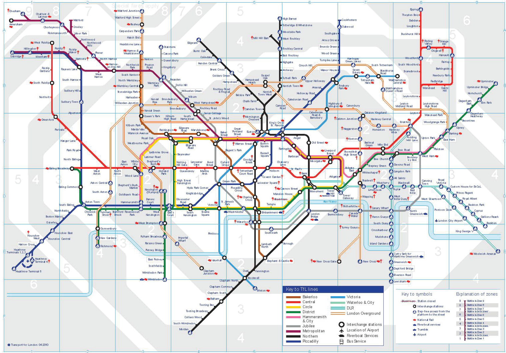
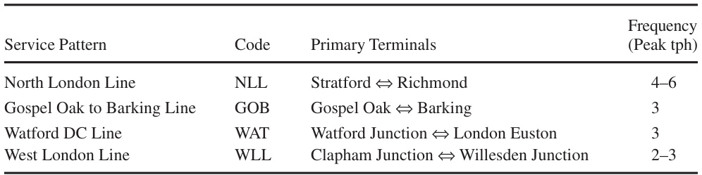
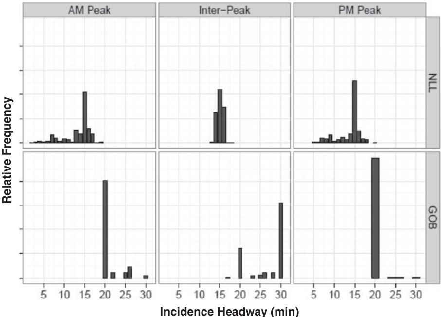
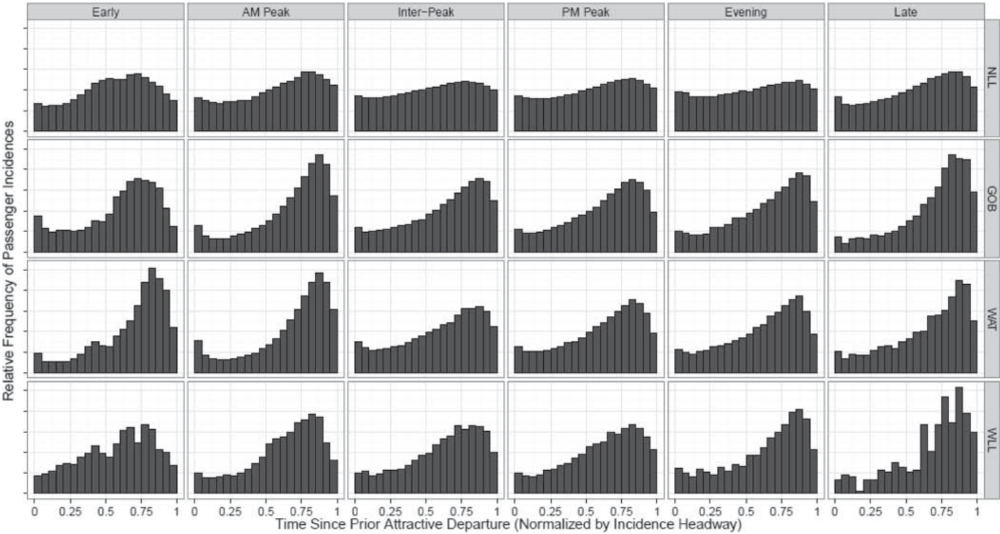
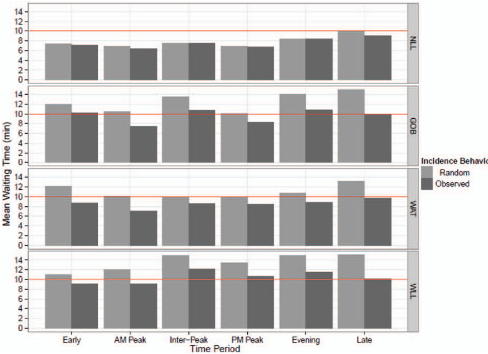

# Analyzing Passenger Incidence Behavior in Heterogeneous Transit Services Using Smartcard Data and Schedule-Based Assignment  

Michael Frumin and Jinhua Zhao Passenger incidence (station arrival) behavior has been studied primar- ily to understand how changes to a transit service willaffect passenger waiting times. The impact of one intervention (e.g., increasing frequency) could be overestimated when compared with another (e.g., improving reliability), depending on the assumption of incidence behavior. Under- standing passenger incidence allows management decisions to be based on realistic behavioral assumptions. Earlier studies on passenger incidence chose their data samples from stations with a single service pattern such that the linking of passengers to services was straightforward. This choice of data samples simplifies the analysis but heavily limits the stations that can be studied. In any moderately complex network, many stations may have more than one service pattern. This limitation prevents the method from being systematically applied to the whole network and constrains its use in practice. This paper considers incidence behavior in stations with heterogeneous services and proposes a method for estimating incidence headway and waiting time by integrating disaggregate smartcard data with published timetables using schedule-based assignment. This method is applied to stations in the entire London Overground to demonstrate its practicality; incidence behavior varies across the network and across times of day and refects headways and reliability. Incidence is much less timetable-dependent on the North London Line than on the other lines because of shorter headways and poorer reliability. Where incidence is timetable-dependent, passengers reduce their mean scheduled waiting time by more than 3 min compared with random incidence.  

This paper is concerned with passenger incidence behavior, which is defined as the act or event of a person's being incident to a public transport service with intent to use that service. A lexical convention is established here to avoid ambiguity between passenger incidence to public transport services and arrival at certain destinations after using public transport services.  

Passenger incidence behavior has been studied primarily for the sake of understanding how changes to a public transport service will affect passenger waiting times. It is also of interest because it affects the relationship between the departure times of public transport vehicles and the passenger loads on those vehicles. Understanding  passenger incidence behaviors allows management interventions to be based on realistic behavioral assumptions. As pointed out in one of the seminal investigations on the topic by Bowman and Turnquist, the effects on passenger waiting time of one particular intervention (e.g., increasing frequency) could be overestimated compared with a different type of intervention (e.g., improving reliability), depending on which assumptions are made about incidence behavior $(l)$  

Earlier studies on passenger incidence behavior chose their data samples from stations or stops with a single service pattern such that the linking of passengers to scheduled or actual services was straightforward. This choice of data samples simplifies the analysis and may suffice for an academic study. But such simplification also heavily limits the stations or stops that can be studied in the transit network. In any moderately complex network, many stations may have more than one service pattern. This limitation prevents the method from being systematically applied to the entire network and therefore limits its use in transit management practice. In environ- ments in which passengers at a given station have a choice of ser- vices, a more sophisticated approach is needed to study passenger incidence behavior.  

This paper is concerned with the relationship between the times  of passenger incidence and published timetables in a rail network with heterogeneous service patterns. It proposes a method to study this relationship by integrating disaggregate passenger journey data from automatic fare collection (AFC) smartcard systems with pub- lished timetables using schedule-based assignment. The purpose of this paper is twofold: first, to develop a method that contributes to the study of passenger incidence behavior across a railway network with heterogeneous service patterns and frequencies using pub-  lished timetables and AFC data; and second, to apply this method to the London Overground to demonstrate its practicality and shed light on the incidence behavior of its passengers.  

# LITERATURE  

Previous research has identified a rich set of passenger incidence behav- iors and related them to certain aspects of public transport services. Using manually and automatically collected data sources, research has investigated the diversity of the behavior cross-sectionally and the consistency of such behaviors longitudinally over time. It has been found that the randomness of passenger incidence behavior is highly dependent on the service headway and the reliability of the departure  time of the service to which passengers are incident.  

After briefy introducing the random incidence model, which is often assumed to hold at short headways, the balance of this section reviews six studies of passenger incidence behavior that are moti- vated by understanding the relationships between service headway, service reliability, passenger incidence behavior, and passenger waiting time in a more nuanced fashion than is embedded in the random incidence assumption (2). Three of these studies depend on manually collected data, two studies use data from AFC systems, and one study analyzes the issue purely theoretically. These studies reveal much about passenger incidence behavior, but all are found to be limited in their general applicability by the methods with which they collect information about passengers and the services those passengers intend to use.  

# Random Passenger Incidence Behavior  

One characterization of passenger incidence behavior is that of ran- dom incidence (3). The key assumption underlying the random inci- dence model is that the process of passenger arrivals to the public transport service is independent from the vehicle departure process of the service. This implies that passengers become incident to the service at a random time, and thus the instantaneous rate of passen- ger arrivals to the service is uniform over a given period of time. Let W and$H$be random variables representing passenger waiting times and service headways, respectively. Under the random incidence assumption and the assumption that vehicle capacity is not a binding constraint, a classic result of transportation science is that  

$$
E\!\left(W\right)\!=\!\frac{E\!\left[H^{2}\right]}{2E\!\left[H\right]}\!=\!\frac{E\!\left[H\right]}{2}\!\!\left(1\!+\!\operatorname{CV}\!\left(H\right)^{2}\right)
$$  

where$E[X]$is the probabilistic expectation of some random variable $X$and$\operatorname{CV}(H)$is the coefficient of variation of $H_{z}$. a unitless measure of the variability of $H$defined as  

$$
\mathbf{CV}\big(H\big)\!=\!\frac{\boldsymbol{\upsigma}_{H}}{E\big[H\big]}
$$  

where$\upsigma_{H}$is the standard deviation of $H\left(4\right)$. The second expression in Equation 1 is particularly useful because it expresses the mean passenger waiting time as the sum of two components: the waiting time caused by the mean headway (i.e., the reciprocal of service fre- quency) and the waiting time caused by the variability of the head- ways (which is one measure of service reliability). When the service is perfectly reliable with constant headways, the mean waiting time will be simply half the headway.  

# More Behaviorally Realistic Incidence Models  

Jolliffe and Hutchinson studied bus passenger incidence in South London suburbs (5). They observed 10 bus stops for $^{1\mathrm{~h~}}$per dayover 8 days, recording the times of passenger incidence and actual and scheduled bus departures. They limited their stop selection to those served by only a single bus route with a single service pat- tern so as to avoid ambiguity about which service a passenger was waiting for. The authors found that the actual average passenger waiting time was $30\%$less than predicted by the random incidence model. They also found that the empirical distributions of passenger incidence times (by time of day) had peaks just before the respec- tive average bus departure times. They hypothesized the existence of three classes of passengers: with proportion $q$ passengers whosetime of incidence is causally coincident with that of a bus departure (e.g., because they saw the approaching bus from their home or a shop window); with proportion $p(1-q)$, passengers who time their arrivals to minimize expected waiting time; and with proportion $(1-p)(1-q)$, passengers who are randomly incident. The authors found that$p$was positively correlated with the potential reduction in waiting time (compared with arriving randomly) that resulted from knowledge of the timetable and of service reliability. They also found$p$to be higher in the peak commuting periods rather than in the off-peak periods, indicating more awareness of the timetable or historical reliability, or both, by commuters.  

Bowman and Turnquist built on the concept of aware and unaware passengers of proportions$p$and$(1-p)$, respectively. They proposed a utility-based model to estimate $p$and the distribution of incidence times, and thus the mean waiting time, of aware passengers over a given headway as a function of the headway and reliability of bus departure times$(l)$. They observed seven bus stops in Chicago, Illinois, each served by a single (different) bus route, between 6:00 and$8{\cdot}00\;\mathrm{a.m}$. for 5 to 10 days each. The bus routes had headways of 5 to$20~\mathrm{min}$and a range of reliabilities. The authors found that actual average waiting time was substantially less than predicted by the random incidence model. They estimated that $p$was notstatistically significantly different from 1.0, which they explain by the fact that all observations were taken during peak commuting times. Their model predicts that the longer the headway and the more reliable the departures, the more peaked the distribution of incidence times will be and the closer that peak will be to the next scheduled departure time. This prediction demonstrates what they refer to as a safety margin that passengers add to reduce the chance of missing their bus when the service is known to be somewhat unreliable. Such a safety margin can also result from unreliability in passengers' journeys to the public transport stop or station. Bowman and Turnquist conclude from their model that the random incidence model underestimates the waiting time benefits of improving reli-  ability and overestimates the waiting time benefits of increasing ser- vice frequency. This is because as reliability increases passengers can better predict departure times and so can time their incidence to decrease their waiting time.  

Furth and Muller study the issue in a theoretical context and gener- ally agree with the above findings (2). They are primarily concerned with the use of data from automatic vehicle-tracking systems to assess the impacts of reliability on passenger incidence behavior and wait- ing times. They propose that passengers will react to unreliability by departing earlier than they would with reliable services. Randomly incident unaware passengers will experience unreliability as a more dispersed distribution of headways and simply allocate additional time to their trip plan to improve the chance of arriving at their des- tination on time. Aware passengers, whose incidence is not entirely random, will react by timing their incidence somewhat earlier than the scheduled departure time to increase their chance of catching the  desired service. The authors characterize these reactions as the costs of unreliability.  

Luethi et al. continued with the analysis of manually collected  data on actual passenger behavior (6). They use the language of probability to describe two classes of passengers. The first is timetable-dependent passengers (i.e., the aware passengers), whose incidence behavior is affected by awareness (possibly gained through their own experience with the service) of the timetable or service reliability, or both. The second class is timetable-independent  passengers, whose incidence behavior is random and so does not reffect any such awareness (whether or not they have it). The lan-  guage of timetable dependency is adopted for the balance of this  paper to describe the randomness of passenger incidence behavior, regardless of what exactly is driving the behavior on the part of the passengers. This language is preferred because it expresses the probabilistic association between two observed variables (incidence times and scheduled departure times) rather than some unobserved passenger state of mind. Luethi et al. observed passenger incidence during morning and evening peak hours and midday off-peak hours at 28 bus, tram, and commuter rail stations in and around Zurich,  Switzerland, with headways of 2.33 to $30\;\mathrm{{min}}$ To avoid ambiguity,  they limited their station selection to nonterminal, noninterchange stations served by a single route with constant headways over the  period of observation. The authors observed that a substantial share  of passengers appear to be timetable dependent for headways as low as$5\;\mathrm{min}$. They proposed distributions of passenger incidence times over a given headway to be the weighted superposition of two dis-  tributions: one for timetable-independent passengers, with weight $1-p,$. distributed uniformly over the headway, and the other for timetable-dependent passengers, with weight $p_{!}$. distributed accord- ing to a Johnson SB distribution. The authors found the fit of their distribution to the observed data to be statistically significant. This distribution is parameterized in terms of the headway, but not in terms of the reliability of the service. Estimations of their model yield values of $p$for the different time periods of the day, which they find to be highest in the morning peak and lowest in the off-peak period, supporting the conclusion that the incidence of commuters is more timetable dependent than the incidence of noncommuters.  

Csikos and Currie studied this phenomenon, first cross-sectionally and then longitudinally, using data from the AFC system of the heavy rail network in Melbourne, Australia (7, 8). In their first study they used 4 weeks' worth of data from 07:30 to 15:00, but limited them- selves to analyzing seven particular stations out of 209, for a total of 38,000 observations over approximately $^{1,470{\mathrm{~h~}}}$. The stationswere, as in the other studies, selected to avoid ambiguity regard- ing which scheduled service each passenger intended to use. They also obtained high-level data about the aggregate reliability (6-min terminal on-time performance) of the train lines serving the selected stations. Their findings generally confirm those of the other studies. In their second study, they used the same 4-week data set, but tracked individual ticket holders over time to study the consistency of behav- ior. They focused on the 15,000 trips made between 06:00 and 10:00 by 1,043 individual passengers who, as morning commuters, are expected to exhibit the most consistent behavior patterns. They characterized the passengers by the times of incidence and the offset times until the next scheduled departure. They classified passengers into four distinct archetypes exhibiting various levels of consistency in these two variables, finding roughly equal numbers of passengers in each category. On one end of the spectrum are clockwork-like passengers who exhibit consistent behavior that often minimizes their waiting time with respect to the schedule. On the other end, largely random passengers have very little consistency with respect to waiting time, exhibiting largely timetable-independent behavior. The authors’ overall conclusion in this work is one of heterogeneity in passenger behavior, even under homogeneous conditions (i.e., at the same station at the same time of day served by the same line).  

As a brief summary of the six studies, passenger incidence behavior has been characterized primarily in terms of how random it appears to be with respect to the timetable and to actual vehicle departure times. The appearance of randomness (or its lack) has been used to indicate the degree to which passengers have and use knowledge of the published timetable and of actual departure times. At longer headways, passengers have more to gain by gaining and using knowledge of the timetable; their behavior tends to be less random, peaking somewhat before the scheduled departure time. Passengers also appear to gain and use knowledge of the actual, rather than scheduled, departure times. When departure times are reliable, even if they are reliably late (or early) by a particular  amount, incidence behavior tends to be less random, with more pas- sengers being incident shortly before the reliable departure time. When departure times are inconsistent (i.e., unreliable), passengers have less to gain from choosing any particular time of incidence, so  their behavior tends to be more random.  

# METHODOLOGY  

This section proposes a method for studying passenger incidence with respect to scheduled departure times by using AFC smartcard  data and schedule-based assignment. For a given passenger jour- ney, the method depends on the concepts of attractive departure, scheduled waiting time (SWT), and incidence headway.  

An attractive departure is a departure scheduled from the passen- ger's station of incidence that the passenger is or would have been willing to board, regardless of how willing is defined. The use of "attractive” is in the tradition of Spiess and Florian and Nguyen and Pallottino in their work on hyperpaths and optimal strategies (9, 10). They defined the atractive set of lines as the set that a passenger is willing to board at a given location. This concept makes explicit the possibility that some scheduled departures may not be viable alternatives for a given passenger as a function of that passenger's destination and of the subsequent itinerary of those departures. For example, on a line with a trunk and branches, passengers bound for one of the branches may experience longer headways than those  traveling only on the trunk.  

SWT is the time the passenger should have to wait according to the schedule, given his or her time of incidence and attractive  departures. SWT is defined as the length of time between passenger  incidence and the next attractive departure.  

Incidence headway is the (scheduled) headway applicable to the passenger given his or her time of incidence and set of attrac- tive departures. Incidence headway is defined as the length of time between the last attractive departure before the time of incidence and the next such departure after the time of incidence.  

The above six studies of passenger incidence all selected places  and times of observation so as to avoid ambiguity with respect to each passenger's attractive departures. They minimized the mea- surement of SwT and incidence headways by selecting stations served by only a single service pattern and, in some cases, with a constant headway. While this may be sufficient for modeling the behavior of certain group of passengers, it is clearly inadequate for understanding behavior across an entire network. In many real-  world public transport networks, the largest numbers of passengers are incident at large stations or terminals that provide access to heterogeneous services.  

In the case of the London Overground, this incidence is most problematic on the North London Line (NLL). Consider, for exam-  ple, passengers incident to the NLL at Stratford, one of the Over-  ground's busiest stations. In 2008 peak-period timetables, the NLL was running a mostly (but not perfectly) regular 15-min (i.e., four trains per hour) service all day from Stratford to the end of the NLL at Richmond. This service was augmented with occasional irregular services, including a shuttle that ran only as far as Camden Road, and one special that ran on the NLL to Willesden Junction but then on the West London Line to Clapham Junction. It is not immediately  obvious which of these services would be attractive to a given pas- senger at Stratford, and thus not clear what incidence headway each  passenger would experience. Earlier literature avoided this issue by avoiding stations such as Stratford altogether.  

The method proposed here is designed as a tool to support the study of passenger incidence behavior in general (i.e., by including locations with heterogeneous services) and to facilitate its applica- tion in practical transit management. The method does so by estimat- ing SWT and incidence headway automatically from the integration of published timetables with disaggregate AFC passenger journey data via schedule-based assignment.  

Schedule-based assignment depends on a run-based model of public transport supply, which is very similar to the line-based model of supply, but unfolded in the temporal dimension $(l l)$. Insuch a model, each individual scheduled or actual run (or trip) of the public transport service is represented individually by its own subgraph. In the subgraph for a given run, the nodes represent the arrival, departure, or transit of that run at a specific location at a specific time. The links represent travel (or dwelling) on that run between specific points in time and space. The combination of the subgraphs of all runs is referred to as the service subgraph. Demand is also modeled with temporal as well as spatial dimensions in the demand subgraph. Nodes in this subgraph represent centroids of demand in time (according to user departure and arrival times) and space (according to the physical network). The access-egress subgraph joins the service and demand subgraphs with boarding and alighting links. The union of these three subgraphs is referred to as the diachronic graph representation. One benefit of such a representation is that shortest travel time paths can be found via standard shortest-path network algorithms such as Bellman-Ford or Dijkstra's (12).  

In this paper it is assumed that for a given origin, destination, and time of incidence, all passengers plan to use the single schedule- based path (i.e., set of scheduled services) through the network that minimizes total travel time. Additionally, it is assumed that passen- gers plan itineraries to minimize the number of total boardings up to the point at which total travel time is not increased (e.g., in the trunk-and-branch example, branch-bound passengers won't board a train bound for the wrong branch just to get to the end of the trunk and transfer to the correct branch). These assumptions are necessarily a simplification of the true behaviors and perceptions of passengers. The degree to which the assumptions hold is a function of the attributes of the particular network to which they are applied and of the behavioral preferences of the passengers in question. These assumptions are sufficient to determine, for each passenger journey, the attractive departures before and subsequent to the time of incidence. SWT and incidence headway can be determined once the times of these two departures are known.  

# ALGORITHMANDIMPLEMENTATION  

For a given passenger journey on a given public transport network, let  

SWT$=$scheduled waiting time for given journey, $H_{I}=$incidence headway for given journey,  

of passenger incidence for given  journey,$L_{O}=$location of incidence of journey in ques- tion (i.e., the origin), $L_{D}=$destination of that journey, $D_{\mathrm{prior}}=$time of last attractive departure before I, $D_{\mathrm{{next}}}=$time of first attractive departure after I, $H_{\mathrm{max}}=$maximum normal headway (i.e., time between any two successive departures in same direction from same location) on network,$H_{\mathrm{min}}=$minimum normal headway on network, Path(from, to, time) $=$function that finds shortest weighted travel time path from location from to location to with departure time strictly greater than time, with all travel time weights equal to 1 except for transfer or boarding penalty  

$=$  

encapsulates the complexity of conducting a schedule-based assign- ment for a single passenger trip. The Path( ) function will either find the earlier attractive departure time $D_{\mathrm{prior}}$or determine that there is no prior attractive departure in at most $H_{\operatorname*{max}}/H_{\operatorname*{min}}$steps. If the Path( ) function does find $D_{\mathrm{prior}}.$ the function uses that result to determine $H_{I}$. Embedded in this function is the algorithm for finding the short- est weighted travel time paths in a schedule-based network. The travel time weightings are such as to enforce the assumption that  passengers minimize the number of boardings (without affecting total travel time). A robust implementation of Path( ) function using a modified Dijkstra's algorithm is available in the free open-source software library Graphserver (13). Graphserver reads timetables in the widely used general transit feed specification (14). This speci- fication was defined by Google to facilitate the transfer of public transport schedules from operators to Google to power its own web- based journey planning software. The specification has become a de facto standard for public distribution of public transport timetables.  Unfortunately, London Overground timetables do not come in gen- eral transit feed specification format, so another 302-line Perl script was written to do the transformation (15). This algorithm improves  on the previous approaches to finding SWT and $H_{I}$by considering thetimetable in the context of each individual journey. The origin, des- tination, and incidence time of each individual journey determine which departures will be attractive.  

# APPLICATION TOLONDON OVERGROUND NETWORK  

This section applies the proposed methodology to examine pas-  senger incidence behavior on the London Overground network by using a large sample of passenger journey data from the Oyster smartcard ticketing system.  

Figure 1 shows a schematic map of the rail services for Trans- port for London (TfL) as of spring 2010, including London Under- ground, Dockland Light Rail, and Overground. The Overground network is for the most part circumferential, primarily orbiting London to the north and west, with the majority of stations in Zones 2 and 3. The Overground is very much part of the integrated net- work of TfL services, with 19 of its stations offering interchanges to London Underground or Dockland Light Rail services. In 2010, the Overground ran 407 scheduled weekday train trips with 27 units  of rolling stock (A. Brimbacombe, personal communication, 2010).  

Services on the Overground are divided into four service patterns (Table 1). The core of this network is the NLL, which runs $28~\mathrm{km}$between Stratford in the northeast of London and Richmond in the southwest, connecting to every other Overground service and to numerous other TfL and National Rail services along the way. The NLL is by far the busiest Overground line, with the most frequent ser- vice and an estimated $58\%$ of all Overground boardings (C. Smales,  

  

$=$  

personal communication, 2010). The NLL runs four (end-to-end) trains per hour over most of the day, with some segments receiving six trains per hour during peak periods. The other Overground lines run at lower frequencies (three trains per hour during the peak periods and two to three trains per hour during other periods).  

# Data  

On November 11, 2007, overall management and revenue respon- sibility for this set of services was transferred to TfL from the Silverlink, which held the prior National Rail franchise. At that time, the network was rebranded as the Overground and became fully Oyster enabled. Oyster is TfL's AFC smartcard system. London's fare policy and technologies require most Oyster users to validate their cards on all entries and exits to the system. The centralized computer system archives these Oyster entry and exit transactions, including their location, time stamp, and Oyster ID, in an easily accessible database. As a result, disaggregate Oyster journey data are cheap to gather in large volumes and provide a prime source of  data on individual passenger journeys.  

The data analyzed here are a $100\%$sample of all Oyster journeys between all pairs of London Overground stations for the 52 business days from March 31, 2008, through June 10, 2008, inclusive. Pub- lic timetables were obtained for the Overground network. The data set was filtered to include only those journeys for which it can be assumed with relative certainty that the passenger in question used only Overground services; that is, this data set does not include jour- neys that interchanged to the Overground but with initial Oyster val- idations elsewhere in the railway system. The data set also excludes journeys initially incident to the Overground but interchanging to other railway services. Journeys with interchanges to or from buses will be included here, since the Oyster system effectively separates the recording of bus and rail journeys. Passengers transferring from buses to London Overground may exhibit a different incidence behavior because they do not have control over the time when the bus arrives at the transfer stops. Their incidences at London Over-  ground stations are only a function of the timetable coordination between bus and Overground services, if there is any such coordina- tion. In general these journeys may demonstrate random incidence behavior. The resulting data set contains nearly 1,670,000 journeys from 54 stations on 1,442 origin-destination pairs made by more  than 290,000 passengers. The data set constitutes approximately 53,000 station-hours of observation of passenger incidence to  Overground services.  

The methodology described in the previous section was applied to each Oyster journey in the data set: the transaction time of the Oyster entry was taken as the time of incidence, and the origin and destination of the journey were used along with the timetable to estimate which services the journey was incident to. This processing took some number of hours for the entire data set, but it was fully automated. A large set of observations was obtained for which the following data were measured or estimated:  

· Date and time of incidence, · Incidence headway, · SWT,· Location (i.e., station) of incidence (i.e., the journey's origin), · Journey's destination, and ● Overground line to which the passenger was incident.  

For journeys that required an interchange within the Overground system (of which there are relatively few), the above data were measured or estimated for only the first incidence event.  

As a point of validation, Figure 2 plots distributions of incidence headway for passengers on the Gospel Oak to Barking (GOB) and  North London Lines. The findings are consistent with expectations. On the NLL, the mode of all the distributions is $15~\mathrm{min}$,reflect-ing the core service. The distribution is more concentrated during the interpeak period, when there are no scheduled shuttles or spe- cials. The opposite is true on the GOB, which runs a regular 20-min service in the peak periods but transitions to and from a $30{\mathrm{-min}}$service in the interpeak period. The morning peak distribution is somewhat more dispersed than that of the evening peak because the  morning peak includes a transition from 30-min headways in the early morning.  

# Results  

Consistent with the reviewed studies of passenger incidence behav- ior, the first results of interest are distributions of passenger inci- dence time over a given headway. Figure 3 plots these distributions for the London Overground network by line and by time period.  In this plot, incidence times are normalized by the incidence head- way because different passengers experience different incidence headways.  

It is clear from Figure 3 that passenger incidence behavior, with  respect to published timetables, varies spatially and temporally across the Overground network. Passenger incidence on the GOB and Watford DC lines is much more peaked (i.e., timetable-dependent), each with 20-min headways, than on the NLL, with 7- to 15-min headways, during any time period. Also, the NLL is acknowledged by Overground management to have the most serious reliability problems (O. Bratton, personal communication, 2010). These variations are con- sistent with the literature that passenger incidence is more timetable- dependent with a more peaked distribution for longer headways and for more reliable services.  

  

Also consistent with the literature is that, for all lines, the distri- bution is more peaked in the morning peak period than in the eve- ning peak or midday interpeak periods. It appears that Overground commuters in the morning peak period, more likely to have knowl- edge of the timetable and the service and more sensitive to time saving, exhibit less random incidence behavior than do passengers in other time periods, despite the shorter headways and less reliable service found in the morning peak. The distribution in the late-night period is also very peaked because of longer headways and possibly higher sensitivity to time.  

The peaks of all of the distributions are somewhat before the very end of the headway, indicating some type of safety margin or wait- ing time-minimization behavior on the part of passengers. Many of the distributions have small spikes at the beginning of the headway,  indicating possible late running awareness among some passengers. While such awareness may in fact be found on the Overground, it is also possible that it is the passengers themselves who are running late. They may be planning to take a train scheduled to depart at a certain time but, because of uncontrollable circumstances or their own poor  planning, arrive at the station shortly after that departure time.  

  

$10\;\mathsf{m i n}]$  

Figure 4 shows the mean waiting time, for each line and time period, under two models of passenger behavior and train operations: random incidence versus timetable-dependent incidence. In the first case, it is assumed that all passengers are randomly incident to constant head- way services, so the mean waiting time is calculated as half the mean incidence headway. In the second case, no behavioral assumption is made and all trains are assumed to run as per the timetable, so the observed mean waiting time is calculated as the mean SWT. Figure 4 thus indicates the effects of the observed incidence behaviors (compared with random incidence) on passenger waiting times.  

On the NLL, the relatively slight skew in the incidence distribu- tions translates into relatively small impacts on waiting time. In the morning peak, timetable dependence decreases waiting time by $7.2\%$from 6.82 to$6.33\,\mathrm{min}$(about 30 s). In the interpeak and evening peak periods, the reductions are only $0.2\%$and$2.2\%$, respectively. On the GOB, however, the implications of timetable dependence are substan- tial. In the morning peak, the waiting time decreases by $29\%$$3.1\,\mathrm{min})$from 10.5 to$7.4\,\mathrm{{min}}$. In the interpeak and evening peak periods, the reductions are $20.4\%$and$17.5\%$, respectively.  

Transit assignment models often make an assumption that no ser- vice would be assigned a mean passenger waiting time over a certain threshold, say, $10\;\mathrm{{min}}$in the London Overground case. The results of this section lend support to this assumption. Regular weekday headways on the Overground network go as high as $30\,\mathrm{{min}}$,but theobserved mean SWT is above $11\,\mathrm{{min}}$in only two cases (on the West London Line during the interpeak and evening time periods) and is never above$12.1\,\mathrm{min}$  

# DISCUSSION AND CONCLUSIONS  

This paper developed a methodology to relate disaggregate AFC journey data to published timetables for the purpose of studying passenger incidence behavior and applied this methodology to the London Overground (16).  

The following conclusions are drawn about the methodology developed here. First, it can be used to study passenger incidence behavior using large samples of disaggregate journey data from AFC systems such as the Oyster smartcard system. Second, the methodology can for each passenger journey estimate SWT and incidence headway under heterogeneous conditions. Finally, this methodology is able to efficiently process millions of data records and can be implemented using open standard timetable formats and free software tools.  

As a limitation the proposed method hinges on the schedule- based assignment, for which there are unsolved methodological issues such as station congestion or train crowding. The London Overground is a relatively simple network (i.e., compared with the London Underground), so that the methodology would not be sub- ject to those issues. As the inner workings of schedule-based assign- ment improve, the method of this paper will continue to become more broadly applicable.  

With respect to the London Overground, the following conclu- sions can be drawn. Generally, passenger incidence behavior varies across the network and across times of day, and the differences reflect different headways, reliability of service, and time of day (indicating different knowledge of the network and sensitivity to time); these findings reflect the findings in the literature to date. Specifically, inci- dence appears to be much less timetable dependent on the NLL than  on the other Overground lines because of shorter headways and less reliable service on this line as compared with others. The method and results of the paper also provide one service quality measure,  SWT, for the entire Overground network. On the GOB, Watford DC, and West London lines, where incidence behavior is more timetable-  dependent, passengers reduce their mean SWT by more than $3\;\mathrm{{min}}$or up to $30\%$, during daytime hours compared with random inci- dence behavior. On the NLL, such reductions are much smaller, in some cases nearly zero, in both relative and absolute terms.  

The method developed in this paper can support further study of passenger incidence behavior in a more systematic way; that is, researchers no longer need to select a special subset of stations with only one service pattern. The work of Bowman and Turnquist has been infuential in shaping the understanding of the relationships between headway, reliability, passenger behavior, and waiting time (1). Their work should be updated by using the method of this paper so that large samples of passenger data across heterogeneous networks can be easily analyzed. The London Overground network represents an ideal opportunity to conduct such a study because its passengers can clearly be studied via Oyster data, and its trains are tracked by a computerized signaling system. After the East London Line opened, the network has headways ranging from 5 to $30~\mathrm{min}$during mosthours of the day, thus providing a good range of variation.  

Another application is to study the impact of real-time informa- tion. Many strides have been made toward informing passengers in real time about the status of public transport services. Such infor- mation is now often distributed via in-station signs and announce- ments, as well as over the Internet to passengers’ computers and, more importantly, mobile devices. It is crucial to advance the understanding of passenger incidence to include the effects of real- time information. Such an advance in understanding will require careful thinking and research designs, but it should be able to take advantage of the methodology developed here. For example, actual recorded train arrival and departure times (rather than published  timetables) could be used in the schedule-based assignment.  

# ACKNOWLEDGMENTS  

The authors thank Nigel Wilson for cosupervising the research proj- ect and providing critical input to the master's thesis on which this paper is based. The authors also thank Transport for London for pro- viding the financial and institutional support for this research, the  opportunity to work in the agency, and access to the data used in this paper and specifically thank Oliver Bratton of London Overground Rail Operations Ltd for insight into the issues and the dynamics of the London Overground network.  

# REFERENCES  

1. Bowman, L.A., and M.A. Turnquist. Service Frequency, Schedule Reliability, and Passenger Wait Times at Transit Stops. Transportation Research Part A, Vol. 15, No. 6, 1981, pp. 465-471.  2. Furth, P.G., and T. H. J. Muller. Service Reliability and Hidden Wait- ing Time. In Transportation Research Record 1955, TRB, National Research Council, Washington, D.C., 2006, pp. 79-87. 3. Larson, R.C., and A.R. Odoni. Urban Operations Research, 2nd ed. Dynamic Ideas, Belmont, Mass., 2007. 4. Osuna, E. E., and G.F. Newell. Control Strategies for an Idealized Pub- lic Transportation System. Transportation Science, Vol. 6, No. 1, 1972, pp. 52-71.5. Jolliffe, J. K., and T.P. Hutchinson. A Behavioral Explanation of the Association Between Bus and Passenger Arrivals at a Bus Stop. Trans- portation Science, No. 9, 1975, pp. 248-282.  6. Luethi, M., U.A. Weidmann, and A. Nash. Passenger Arrival Rates at Public Transport Stations. Presented at 86th Annual Meeting of the Transportation Research Board, Washington, D.C., 2007. 7. Csikos, D. R., and G. Currie. Investigating Consistency in Transit Pas- senger Arrivals: Insights from Longitudinal Automated Fare Collection Data.In Transportation Research Record: Journal of the Transporta- tion Research Board, No. 2042, Transportation Research Board of the National Academies, Washington, D.C., 2008, pp. 12-19.  8. Csikos, D. R., and G. Currie. The Impacts of Transit Reliability on Wait Time: Insights from Automated Fare Collection System Data. Pre- sented at 86th Annual Meeting of the Transportation Research Board, Washington, D.C., 2007. 9. Spiess, H., and M. Florian. Optimal Strategies: A New Assignment Model for Transit Networks. Transportation Research Part B, Vol. 23, No. 2, 1989, pp. 83-102.10. Nguyen, S., and S. Pallottino. Equilibrium Traffic Assignment for Large-Scale Transit Networks.EuropeanJournal of Operations Research, Vol. 37, 1988, pp. 176-186.11. Nuzzolo, A., and U. Crisalli. The Schedule-Based Approach in Dynamic Transit Modeling: A General Overview. In Schedule-Based Dynamic Transit Modeling: Theory and Applications (N.H. M. Wilson and A. Nuzzolo, eds.). Operations Research/Computer Science Interface Series, Kluwer Academic Publishers, 2004, pp. 1-24. 12.1Bertsimas, D., and J. N. Tsitsiklis. Introduction to Linear Optimization. Dynamic Ideas, Belmont, Mass., 1997. Graphserver. Graphserver: The Open-Source Multi-Modal Trip Planner. http://bmander.github.com/graphserver/. Accessed 2009.14. Google. General Transit Feed Specification Reference. http://code. google.com/transit/spec/transit feed specification.html. Accessed Nov. 13, 2009.15. Perl.org. The Perl Programming Language. http://www.perl.org/. Accessed 2010.16. Frumin, M.Automatic Data for Applied Railway Management: Passen- ger Demand,Service Quality Measurement,and Tactical Planning on the London Overground Network. MS thesis. Massachusetts Institute of Technology, Cambridge, Mass., 2010.  