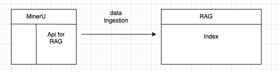

<details open="open">
  <summary><h2 style="display: inline-block">目录</h2></summary>
    <li><a href="#介绍">介绍</a></li>
    <li><a href="#安装">安装</a></li>
    <li><a href="#示例">示例</a></li>
    <li><a href="#开发">开发</a></li>
  </ol>
</details>

## 介绍

`MinerU` 提供数据 `API接口` 以支持用户导入数据到 `RAG` 系统。本项目将基于`通义千问`展示如何构建一个轻量级的 `RAG` 系统。

<p align="center">
  
</p>

## 安装

环境要求

```text
NVIDIA A100 80GB,
Centos 7 3.10.0-957.el7.x86_64

Client: Docker Engine - Community
 Version:           24.0.5
 API version:       1.43
 Go version:        go1.20.6
 Git commit:        ced0996
 Built:             Fri Jul 21 20:39:02 2023
 OS/Arch:           linux/amd64
 Context:           default

Server: Docker Engine - Community
 Engine:
  Version:          24.0.5
  API version:      1.43 (minimum version 1.12)
  Go version:       go1.20.6
  Git commit:       a61e2b4
  Built:            Fri Jul 21 20:38:05 2023
  OS/Arch:          linux/amd64
  Experimental:     false
 containerd:
  Version:          1.6.25
  GitCommit:        d8f198a4ed8892c764191ef7b3b06d8a2eeb5c7f
 runc:
  Version:          1.1.10
  GitCommit:        v1.1.10-0-g18a0cb0
 docker-init:
  Version:          0.19.0
  GitCommit:        de40ad0
```

请参考[文档](../../README_zh-CN.md) 安装 MinerU

第三方软件

```bash
# install
pip install modelscope==1.14.0
pip install llama-index-vector-stores-elasticsearch==0.2.0
pip install llama-index-embeddings-dashscope==0.2.0
pip install llama-index-core==0.10.68
pip install einops==0.7.0
pip install transformers-stream-generator==0.0.5
pip install accelerate==0.33.0

# uninstall
pip uninstall transformer-engine
```


## 示例

````bash
cd  projects/llama_index_rag

docker compose up -d

or

docker-compose up -d


# 配置环境变量

export ES_USER=elastic
export ES_PASSWORD=llama_index
export ES_URL=http://127.0.0.1:9200
export DASHSCOPE_API_KEY={some_key}


DASHSCOPE_API_KEY 开通参考[文档](https://help.aliyun.com/zh/dashscope/opening-service)

# 未导入数据，查询问题。返回通义千问默认答案
python query.py -q 'how about the rights of men'

## outputs
question: how about the rights of men
answer: The topic of men's rights often refers to discussions around legal, social, and political issues that affect men specifically or differently from women. Movements related to men's rights advocate for addressing areas where men face discrimination or unique challenges, such as:

    Child Custody: Ensuring that men have equal opportunities for custody of their children following divorce or separation.
    Domestic Violence: Recognizing that men can also be victims of domestic abuse and ensuring they have access to support services.
    Mental Health and Suicide Rates: Addressing the higher rates of suicide among men and providing mental health resources.
    Military Conscription: In some countries, only men are required to register for military service, which is seen as a gender-based obligation.
    Workplace Safety: Historically, more men than women have been employed in high-risk occupations, leading to higher workplace injury and death rates.
    Parental Leave: Advocating for paternity leave policies that allow men to take time off work for family care.
    Men's rights activism often intersects with broader discussions on gender equality and aims to promote fairness and equity across genders. It's important to note that while advocating for these issues, it should be done in a way that does not detract from or oppose the goals of gender equality and the rights of other groups. The focus should be on creating a fair society where everyone has equal opportunities and protections under the law.


# 导入数据
python data_ingestion.py -p example/data/

or

python data_ingestion.py -p example/data/declaration_of_the_rights_of_man_1789.pdf


# 导入数据后，查询问题。通义千问模型会根据 RAG 系统的检索结果，结合上下文，给出答案。

python query.py -q 'how about the rights of men'

## outputs
请基于```内的内容回答问题。"
            ```
            I. Men are born, and always continue, free and equal in respect of their rights. Civil distinctions, therefore, can be founded only on public utility.
            ```
            我的问题是：how about the rights of men。

question: how about the rights of men
answer: The statement implies that men are born free and equal in terms of their rights. Civil distinctions should only be based on public utility. However, it does not specify what those rights are. It is up to society and individual countries to determine and protect the specific rights of their citizens.

````

## 开发

`MinerU` 提供了 `RAG` 集成接口，用户可以通过指定输入单个 `pdf` 文件或者某个目录。`MinerU` 会自动解析输入文件并返回可以迭代的接口用于获取数据

### API 接口

```python
from magic_pdf.integrations.rag.type import Node

class RagPageReader:
    def get_rel_map(self) -> list[ElementRelation]:
        # 获取节点间的关系
        pass
    ...

class RagDocumentReader:
    ...

class DataReader:
    def __init__(self, path_or_directory: str, method: str, output_dir: str):
        pass

    def get_documents_count(self) -> int:
        """获取 pdf 文档数量"""
        pass

    def get_document_result(self, idx: int) -> RagDocumentReader | None:
        """获取某个 pdf 的解析内容"""
        pass


    def get_document_filename(self, idx: int) -> Path:
        """获取某个 pdf 的具体路径"""
        pass


```

类型定义

```python

class Node(BaseModel):
    category_type: CategoryType = Field(description='类别') # 类别
    text: str | None = Field(description='文本内容',
                             default=None)
    image_path: str | None = Field(description='图或者表格（表可能用图片形式存储）的存储路径',
                                   default=None)
    anno_id: int = Field(description='unique id', default=-1)
    latex: str | None = Field(description='公式或表格 latex 解析结果', default=None)
    html: str | None = Field(description='表格的 html 解析结果', default=None)

```

表格存储形式可能会是 图片、latex、html 三种形式之一。
anno_id 是该 Node 的在全局唯一ID。后续可以用于匹配该 Node 和其他 Node 的关系。节点的关系可以通过方法 `get_rel_map` 获取。用户可以用 `anno_id` 匹配节点之间的关系，并用于构建具备节点的关系的 rag index。

### 节点类型关系矩阵

|                | image_body | table_body |
| -------------- | ---------- | ---------- |
| image_caption  | sibling    |            |
| table_caption  |            | sibling    |
| table_footnote |            | sibling    |
