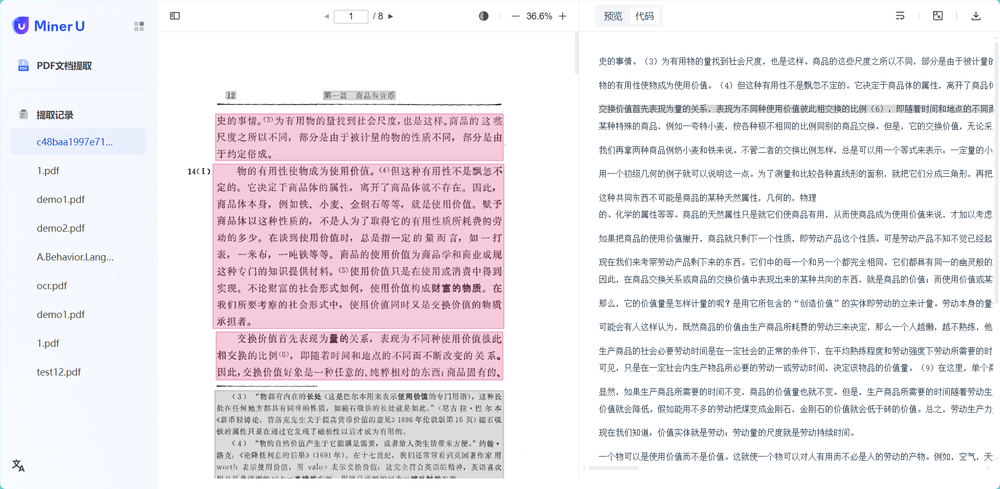

# MinerU Local web_demo
## Feature Overview
<p align="center">
  
</p>

- Supports uploading PDFs and calling MinerU for processing

- Supports online editing of the Markdown results parsed by MinerU

- Supports viewing of historical tasks

## Installation and Deployment

0. MinerU Installation and Deployment


```
# The service depends on mineru, please ensure mineru is installed first
```

1. Package the front-end interface

```bash
# First, navigate to the front-end directory
cd projects/web

# Modify the configuration
# Change the IP in the target field of the file vite.config.ts to your own computer's IP

# Build the front-end project
npm install -g yarn
yarn install
yarn build
```

2. Install service dependencies

```bash
# First, navigate to the back-end directory
cd projects/web_demo
# Install dependencies
pip3 install -r requirements.txt  -i https://mirrors.aliyun.com/pypi/simple
```

3. Start the service

```bash
# Navigate to the program directory
cd projects/web_demo/web_demo
# Start the service
python3 app.py or python app.py
# Access the interface by visiting the started address in the browser
```

ps：API documentation

```
https://apifox.com/apidoc/shared-b8eda098-ab9c-4cb3-9432-62be9be9c6f7
```
